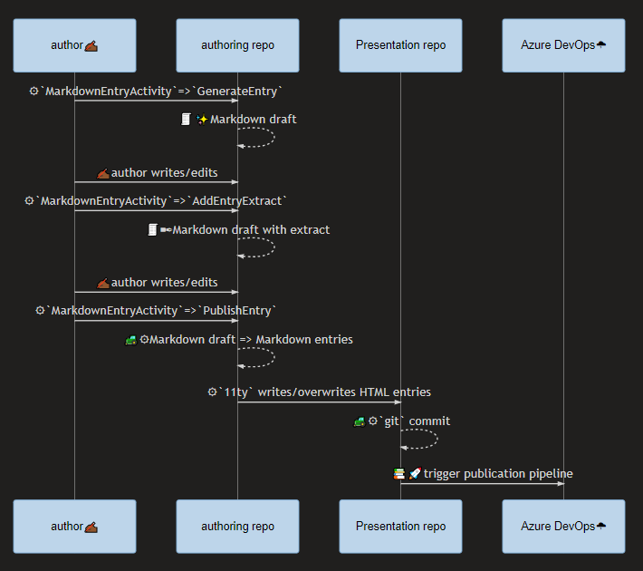
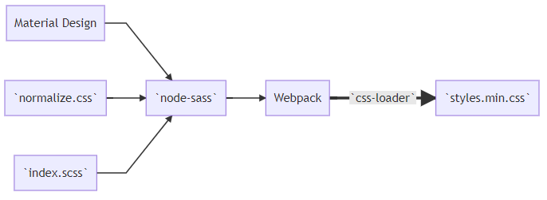

---json
{
  "documentId": 0,
  "title": "my blogging workflow for 2020 is all about `11ty` (eleventy)",
  "documentShortName": "2020-06-11-my-blogging-workflow-for-2020-is-all-about-11ty-eleventy",
  "fileName": "index.html",
  "path": "./entry/2020-06-11-my-blogging-workflow-for-2020-is-all-about-11ty-eleventy",
  "date": "2020-06-11T20:39:15.420Z",
  "modificationDate": "2020-06-11T20:39:15.420Z",
  "templateId": 0,
  "segmentId": 0,
  "isRoot": false,
  "isActive": true,
  "sortOrdinal": 0,
  "clientId": "2020-06-11-my-blogging-workflow-for-2020-is-all-about-11ty-eleventy",
  "tag": "{\n  \"extract\": \"\"\n}"
}
---

# my blogging workflow for 2020 is all about `11ty` (eleventy)

As of this writing, my Blogging workflow looks like this:

Above we see _the author_ (me ✍🏾) generating Markdown in one repository and using [11ty.dev](https://www.11ty.dev/) (eleventy) to write files in another. These are the authoring repo and the Presentation repo, respectively. For this Blog post being read (by you) right now:

- <https://github.com/BryanWilhite/Blog> is the authoring repo
- <https://github.com/BryanWilhite/day-path> is the Presentation repo

These are my known reasons why I am using _two_ repositories when you are likely to use one or none:

- the authoring repo depends on a couple of eleventy `npm` packages, vastly reducing hidden storage costs
- `git` pushes are cheap and plentiful in the authoring repo while a push in the app Presentation repo kicks off automated deployment by design

Effectively, the authoring repo is a portable collection of word processing documents that can be cloned and pulled all over the place while the Presentation repo depends on over 100MB of `npm` packages and is concerned with the look and feel of a user interface. This separation mirrors what happens to most WordPress users who _perceptually_ experience two separate web sites to write and view content.

What is not so effective is the separation of eleventy templates from the Presentation repo. I often feel they are _trapped_ in the authoring repo when they should live with the Presentation. However, I can look at these things as data (user interface as data) and metadata which works well when we see authoring as managing data.

## the `Songhay.Publications` 📦 package

Blog publication is a practice of my Studio which is part of a larger Publications enterprise, standing on top of my `Songhay.Publications` [📦 package](https://www.nuget.org/packages/Songhay.Publications/). The sequence diagram shown above shows the `MarkdownEntryActivity` managing Markdown files. `MarkdownEntryActivity` is part of the `Songhay.Publications` NuGet package.

The [GitHub project for the `1.0.3` release](https://github.com/BryanWilhite/Songhay.Publications/projects/1) of this package goes into _way_ too much detail about the role `Songhay.Publications` plays in this Studio. And, I do look forward to writing more about the automation of Markdown workflows in future.

## eleventy flows

## Presentation repo flows

### Typescript flow

### Sass flow

## why build all of this?

**My Markdown front matter is _mine_.** Many of the alternatives to what I’ve built here _must_ have opinionated front matter. [`eleventy-plugin-blog`](https://github.com/sielay/eleventy-plugin-blog) is an example of this.

**Building on Typescript and C# is a priority.** What I assume is the leader in this [Jamstack](https://jamstack.org/) space, Jekyll, is built on Ruby.

@[BryanWilhite](https://twitter.com/BryanWilhite)
