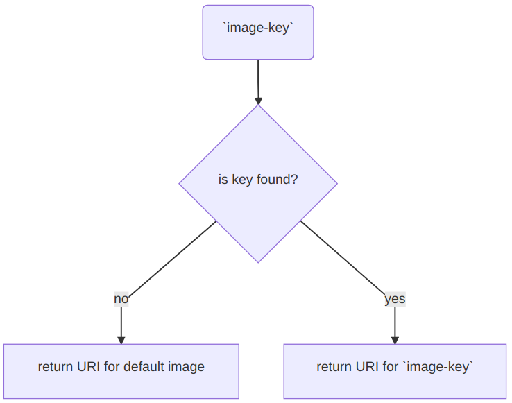

---json
{
  "documentId": 0,
  "title": "studio status report: 2020-08",
  "documentShortName": "2020-08-22-studio-status-report-2020-08",
  "fileName": "index.html",
  "path": "./entry/2020-08-22-studio-status-report-2020-08",
  "date": "2020-08-23T00:46:35.822Z",
  "modificationDate": "2020-08-23T00:46:35.822Z",
  "templateId": 0,
  "segmentId": 0,
  "isRoot": false,
  "isActive": true,
  "sortOrdinal": 0,
  "clientId": "2020-08-22-studio-status-report-2020-08",
  "tag": "{\n  \"extract\": \"\"\n}"
}
---

# studio status report: 2020-08

## month 8 of 2020 has been about defining types for the b-roll player stills API, _slowly_

At the beginning of month 8, I published “[Flippant Remarks about Responsive Images](http://songhayblog.azurewebsites.net/entry/2020-08-04-flippant-remarks-about-responsive-images/)” where I ask myself, What about all of those DTOs? The `Songhay.Player.Models` work that followed yields these:


The `ResponsiveImage` DTOs as JSON would look like this:

```json
[
  {
    "Description": "responsive image",
    "Key": "my-responsive-image",
    "Source": "my-responsive-image.png",
    "Candidates": [
      {
        "ImageUri": "my-responsive-image-big",
        "Width": "1920w"
      },
      {
        "ImageUri": "my-responsive-image-medium",
        "Width": "1280w"
      },
      {
        "ImageUri": "my-responsive-image-small",
        "Width": "640w"
      }
    ],
    "Sizes": [
      {
        "MediaCondition": "min-width: 600px",
        "LayoutWidth": "160px"
      },
      {
        "LayoutWidth": "320px"
      }
    ]
  },
  {
    "Description": "another responsive image",
    "Key": "my-other-responsive-image",
    "Source": "my-other-responsive-image.png",
    "Candidates": [
      {
        "ImageUri": "my-other-responsive-image-big",
        "Width": "1920w"
      },
      {
        "ImageUri": "my-other-responsive-image-medium",
        "Width": "1280w"
      },
      {
        "ImageUri": "my-other-responsive-image-small",
        "Width": "640w"
      }
    ],
    "Sizes": [
      {
        "MediaCondition": "min-width: 600px",
        "LayoutWidth": "160px"
      },
      {
        "LayoutWidth": "320px"
      }
    ]
  }
]
```

What is next for the stills API is a solution for the [Open Graph](https://ogp.me/) Image (`og:image`). This API should not require custom types. I am currently seeing a dictionary (`Dictionary<string,string>`), governed by a simple rule:



@[BryanWilhite](https://twitter.com/BryanWilhite)
