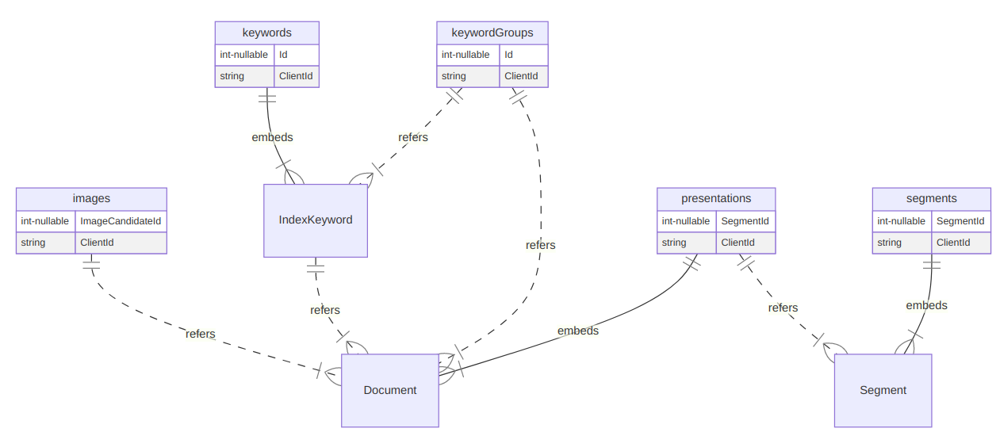

---json
{
  "documentId": 0,
  "title": "studio status report: 2021-03",
  "documentShortName": "2021-03-28-studio-status-report-2021-03",
  "fileName": "index.html",
  "path": "./entry/2021-03-28-studio-status-report-2021-03",
  "date": "2021-03-28T22:48:37.448Z",
  "modificationDate": "2021-03-28T22:48:37.448Z",
  "templateId": 0,
  "segmentId": 0,
  "isRoot": false,
  "isActive": true,
  "sortOrdinal": 0,
  "clientId": "2021-03-28-studio-status-report-2021-03",
  "tag": "{\n  \"extract\": \"month 03 of 2021 was about regrouping around Publications The phrase ‘regrouping around Publications’ is a fluffy cloud of words 🌩 hovering over hard changes: - retiring the private Songhay.GenericWeb repo 🚜🔥 and building out the private Songhay.Public…\"\n}"
}
---

# studio status report: 2021-03

## month 03 of 2021 was about regrouping around Publications

The phrase ‘regrouping around Publications’ is a fluffy cloud of words 🌩 hovering over hard changes:

- retiring the private `Songhay.GenericWeb` repo 🚜🔥 and building out the private `Songhay.Publications.KinteSpace` repo 🚜✨
- enforcing a CQRS-ish principle in the b-roll repo 🔨 🚜🔥
- addressing b-roll repo TODOs by releasing a new package for `Songhay.Publications` 📦🚀
- enforcing the design choice that `Activities` must encapsulate as much logic as possible, starting with the b-roll repo 🚜🔥

### retiring the private `Songhay.GenericWeb` repo 🚜🔥 and building out the private `Songhay.Publications.KinteSpace` repo 🚜✨

After over 20 years the terms `gen-web` and `GenericWeb` are no more! This change represents the move away from relational data support and repository-patterning as an ongoing study. Ironically, I am using an ER diagram to sketch out the document-database, no-SQL schema that should be the future of this Studio:

Some subtle points:

- The `Segment` type is used in *two* collections: `presentations` and `segments`
- The `segments` collection contains segments with child segments
- The `presentations` collection contains `Segment` records, embedding an array of `Document`; the `Segment.ParentSegment` refers to the lowest `Segment` in the `segments` collection
- The `images` collection contains `ImageCandidate` records, referencing one or more documents
- The `keywords` collection contains `IndexKeywordGroup` records, embedding an array of `IndexKeyword`, referencing one or more documents

Challenges in view:

- The `segments` collection is a bunch of [tree structures](https://docs.mongodb.com/manual/applications/data-models-tree-structures/)—how does one ensure an index for a tree structure?

My plan is to use [LiteDB](https://www.litedb.org/)—a lightweight, embedded .NET document database—which should meet my apparently limited needs. The development schedule below has been revised to reflect this massive change.

### enforcing a CQRS-ish principle in the b-roll repo 🔨 🚜🔥

My latest changes and re-factorings of the b-roll player is enforcing a deceptively simple rule that resembles compliance with [CQRS](https://www.martinfowler.com/bliki/CQRS.html#:~:text=CQRS%20stands%20for%20Command%20Query%20Responsibility%20Segregation.%20It%27s,than%20the%20model%20you%20use%20to%20read%20information.) but is more about making the code testable, maintainable and simple:

All _get_ operations must be segregated from all _update_ “commands.” I find it easier and safer to write many, many tests for _get_ methods which whittle down the testing of command/update methods.

YouTube personality Hussein Nasser has a novel take on CQRS in “[CQRS is probably the cause of the Microservices madness](https://www.youtube.com/watch?v=DQ3D_mplIgY).”

### addressing b-roll repo TODOs by releasing a new package for `Songhay.Publications` 📦🚀

The pressure washing of the b-roll repo and the LiteDB-centric push into `Songhay.Publications.KinteSpace`, has inspired significant improvements to the Publications core, `Songhay.Publications` [📦 [NuGet](https://www.nuget.org/packages/Songhay.Publications/)].

Details on this work are filed under the [5.2.0 release](https://github.com/BryanWilhite/Songhay.Publications/projects/8) GitHub project.

### enforcing the design choice that `Activities` must encapsulate as much logic as possible, starting with the b-roll repo 🚜🔥

The controllers for the b-roll player were built to support a repository pattern I concocted for static JSON in Azure Storage containers. The interfaces representing these repositories were eagerly injected into the interfaces of the controllers as I was wrapt in the novelty of ASP.NET Core.

This eagerness and novelty for ASP.NET Core led me away from the `Activities`-centric Studio convention that would make ASP.NET controllers merely hosts for instances of `IActivity` [[GitHub](https://github.com/BryanWilhite/SonghayCore/blob/master/SonghayCore/Models/IActivity.cs)] and `IActivityWithTasks` [[GitHub](https://github.com/BryanWilhite/SonghayCore/blob/master/SonghayCore/Models/IActivityWithTask.cs)] interfaces.

## the `Songhay.Publications.KinteSpace` repo ‘absorbed’ the Stills API

I am both quite relieved and embarrassed to admit that my months-long drama with the stills API under the b-roll player umbrella was misguided. The ‘subtle points’ I made above casually observe that `ResponsiveImage` is now under the the `Songhay.Publications.KinteSpace` umbrella.

The API has moved. 🚜

## sketching out a development schedule (revision 15)

The schedule of the month:

- ~~add Stills API to `Songhay.Player` (b-roll player) 🕸🌩~~
- incorporate LiteDB [🐙🐈 [GitHub](https://github.com/mbdavid/litedb)] into `Songhay.Publications.KinteSpace`
- build Web components required for new version of SonghaySystem.com 🖼
- upgrade [`songhay-ng-workspace`](https://github.com/BryanWilhite/songhay-ng-workspace) to Angular latest 📦↑
- complete [project](https://github.com/BryanWilhite/songhay-dashboard/projects/1) associated with new version of SonghaySystem.com ✅
- use `@songhay/index` as a side-car app for “Day Path” and “the rasx() context” 🚛📦
- add proposed [content Web component](https://github.com/BryanWilhite/songhay-web-components/issues/10)
- use the learnings from existing npm packages to build `@songhay/player-audio-???` 📦✨
- modernize the kinté hits page into a progressive web app 💄✨
- convert Day Path Blog and SonghaySystem.com to HTTPs by default 🔐
- use the learnings of previous work to upgrade and re-release the kinté space 🚀

@[BryanWilhite](https://twitter.com/BryanWilhite)
