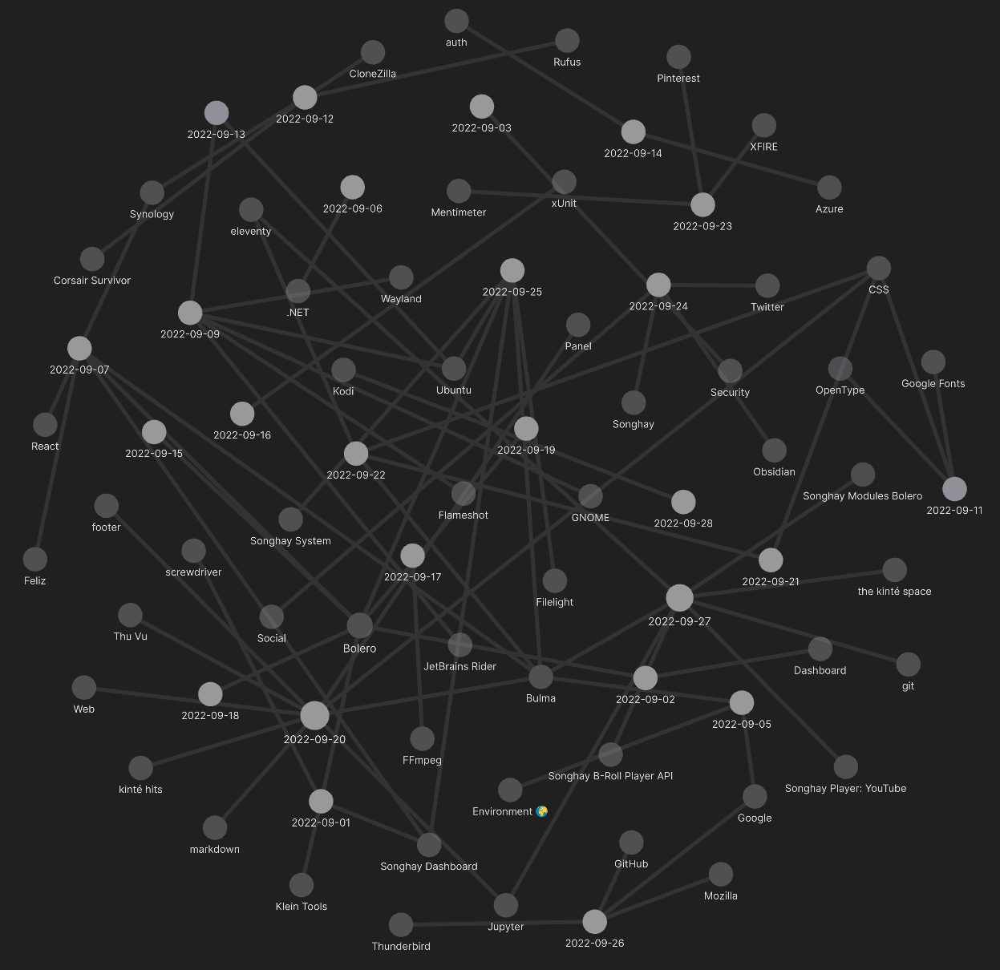

---json
{
  "documentId": 0,
  "title": "studio status report: 2022-09",
  "documentShortName": "2022-09-28-studio-status-report-2022-09",
  "fileName": "index.html",
  "path": "./entry/2022-09-28-studio-status-report-2022-09",
  "date": "2022-09-28T19:08:44.811Z",
  "modificationDate": "2022-09-28T19:08:44.811Z",
  "templateId": 0,
  "segmentId": 0,
  "isRoot": false,
  "isActive": true,
  "sortOrdinal": 0,
  "clientId": "2022-09-28-studio-status-report-2022-09",
  "tag": "{\n  \"extract\": \"month 09 of 2022 was about releasing Songhay.Modules.Bolero and Songhay.Player.YouTube My switch to Obsidian last month has led to my use of Excalidraw this month which allows me to draw out the entire Songhay System (in three ragged columns): Excalidraw…\"\n}"
}
---

# studio status report: 2022-09

## month 09 of 2022 was about releasing `Songhay.Modules.Bolero` and `Songhay.Player.YouTube`

My switch to Obsidian last month has led to my use of [Excalidraw](https://excalidraw.com/) this month which allows me to draw out the entire Songhay System (in three ragged columns):


- the first column represents cores, mirrors and shells
- the second column represents APIs, cloud jobs and shell automation
- the final column represents publication to the outside world

We see, at the top of the first column, the newest packages of the Studio:

- `Songhay.Modules.Bolero` [[GitHub](https://github.com/BryanWilhite/Songhay.Modules.Bolero)]
- `Songhay.Player.YouTube` [[GitHub](https://github.com/BryanWilhite/Songhay.Player.YouTube)]

The release of these packages represent the end of ‘Presentation work’ being completely blocked by back-end work. The super-optimistic assumption here is that even a small child will be able to _see_ what I am working on in this Studio going forward. I will no longer have to explain loquaciously what on Earth am I doing! (Of course, one may refuse to look but I cannot be concerned with that and be ultimately mentally healthy.)

## what month 09 looks like

Here is the Obsidian view of the month:



Here are some selected notes from the graph above:

### a new, more accurate drawing of the Songhay System Studio

[The Excalidraw drawing above] is a study of three ragged columns…

- the first column represents cores, mirrors and shells
- the second column represents APIs, cloud jobs and shell automation
- the final column represents publication to the outside world

This drawing clearly shows that:

- the kinté space is _not_ using the Songhay B-Roll Player API ⚠
- one Azure Web Job is in use 👴🎩
- eleventy is in use in two repos 👏
- Jupyter is in use in one repo 👏

There are five places where you see the construction worker stick man that looks like this:


### F♯: while writing a <acronym title="Domain-Specific Language">DSL</acronym> for Bulma I see an alternative to `option`…

Instead of passing a type modified by `option` to a function, I made something like this:

```fsharp
type CssClassesOrEmpty =  
    | NoCssClasses  
    | Has of CssClasses
```

Instead of seeing `None` and `Some`, we see something like this:


Inside `bulmaTile`, we can see the `match` expression handling this `*OrEmpty` type:


The only snag immediately jumping out at me is the `Has` union type which could namespace-collide with other `Has` types in other discriminated unions.

### F♯ Bolero: `Songhay.Modules.Bolero` has exploded in size in one month!

This is hard work in the middle of the worst heat wave of my adult life and I am little concerned… However, `Songhay.Modules.Bolero` feels like a masterful (yet obscure) summary of my knowledge of HTML-based UI.

Apart from the `*Utility` modules, `Songhay.Modules.Bolero` uses types and modules to express my understanding of HTML and CSS, filtered by what is actually needed from HTML and CSS based on my experience and bias toward minimalism:


### Thu Vu introduces me to Panel

A [video](https://www.youtube.com/watch?v=uhxiXOTKzfs) from Thu Vu introduces me to [Panel](https://panel.holoviz.org/):


This looks like the way forward toward a new kinté hits page!

## sketching out a development schedule (revision 24)

The schedule of the month:

- ~~release NuGet package for `Songhay.Modules.Bolero`~~ 📦🚀
- ~~release NuGet package for `Songhay.Player.YouTube`~~ 📦🚀
- generate a new repo with proposed name, `Songhay.Player.ProgressiveAudio` ✨🚧
- generate Publication indices from LiteDB for `Songhay.Publications.KinteSpace`
- generate a new repo with proposed name, `Songhay.Modules.Bolero.Index` ✨🚧
- switch Studio from Material Design to Bulma 💄 ➡️ 💄✨

@[BryanWilhite](https://twitter.com/BryanWilhite)
