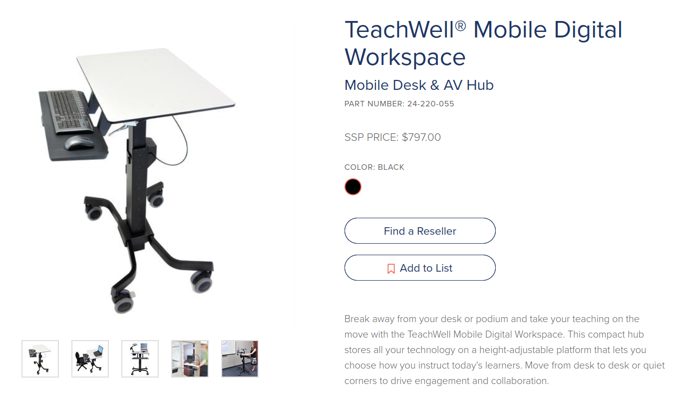
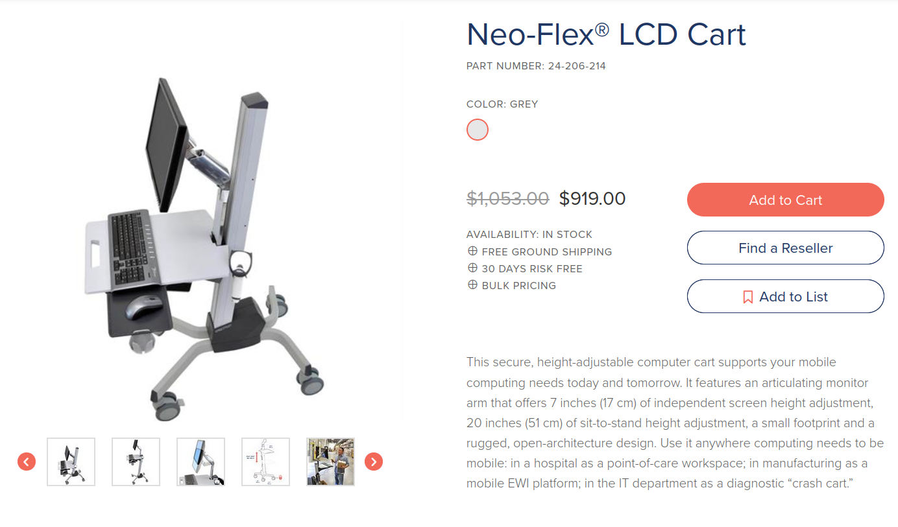
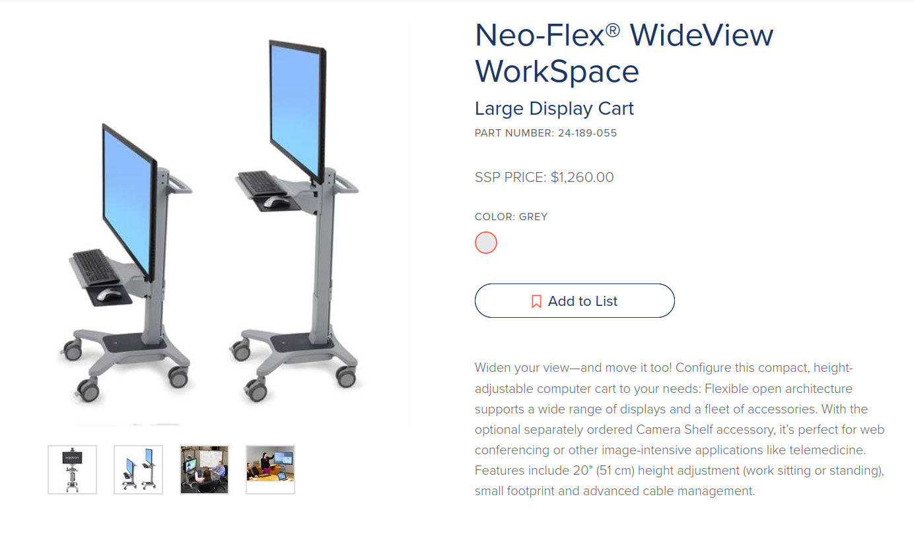
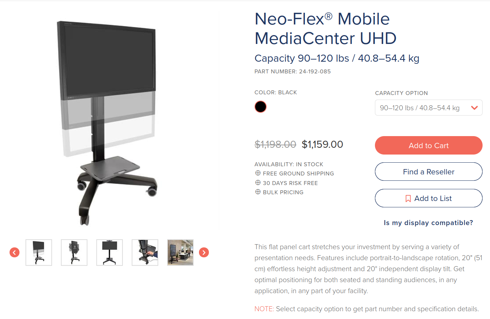

---json
{
  "documentId": 0,
  "title": "my state of Ergotron: 2022",
  "documentShortName": "2022-12-26-my-state-of-ergotron-2022",
  "fileName": "index.html",
  "path": "./entry/2022-12-26-my-state-of-ergotron-2022",
  "date": "2022-12-26T20:33:11.823Z",
  "modificationDate": "2022-12-26T20:33:11.823Z",
  "templateId": 0,
  "segmentId": 0,
  "isRoot": false,
  "isActive": true,
  "sortOrdinal": 0,
  "clientId": "2022-12-26-my-state-of-ergotron-2022",
  "tag": "{\n  \"extract\": \"Ergotron offers Mobile Workstations mostly for hospital or medical laboratory applications which means safety is key. The safer the product the more expensive it is. This means that mounting an Ergotron arm on a “worksurface” is considered an unsatisfacto…\"\n}"
}
---

# my state of Ergotron: 2022

Ergotron offers [Mobile Workstations](https://www.ergotron.com/en-us/products/workstations/mobile-workstations) mostly for hospital or medical laboratory applications which means safety is key. The safer the product the more expensive it is. This means that mounting an [Ergotron arm](https://www.ergotron.com/en-us/products/mounts/desk-mounts) on a “worksurface” is considered an unsatisfactory risk. For example mounting an arm on the TeachWell might topple it over:

\[ 🔗 [Ergotron](https://www.ergotron.com/en-us/products/product-details/24-220#?color=black) \]

Moreover, the clamping force of the Ergotron arm might crack the “phenolic worksurface” of the TeachWell®. Paying $800 for these risks is *not* attractive.

What Ergotron offers instead, is the Neo-Flex® LCD Cart:

\[🔗 [Ergotron](https://www.ergotron.com/en-us/products/product-details/24-206#?color=grey) \]

This cart is designed to support a monitor on an arm—*but* it is limited to 27"—and the arm itself is rather short (to reduce the risk of toppling):

<figure>
    
    
<small>Neo-Flex LCD Cart from Ergotron: Top Features & Benefits</small>

</figure>

For a couple-hundred dollars more, we can safely cart around monitors up to 42" with the Neo-Flex® WideView WorkSpace:

\[🔗 [Ergotron](https://www.ergotron.com/en-us/products/product-details/24-189#?color=grey) \]

I assume that all of the carts aforementioned can support [LiFeKinnex Technology](https://www.ergotron.com/en-us/company/patented-technology/lifekinnex-technology), supplying the carts with Lithium Iron Phosphate (LiFePO4) battery power so they can roll around freely! However, the price for this convenience is rather steep: looks like it’s about *two grand* to get started.

Finally, the Neo-Flex® Mobile MediaCenter UHD can hold up to 80-inch monitors:

\[🔗 [Ergotron](https://www.ergotron.com/en-us/products/product-details/24-192#?color=black&capacity%20option=90%E2%80%93120%20lbs%20%2F%2040.8%E2%80%9354.4%20kg) \]

This model is actually less expensive than the Neo-Flex® WideView WorkSpace in part because (I assume) it does not support LiFeKinnex Technology and the tray does not have retractable surfaces for a mouse.  

@[BryanWilhite](https://twitter.com/BryanWilhite)
