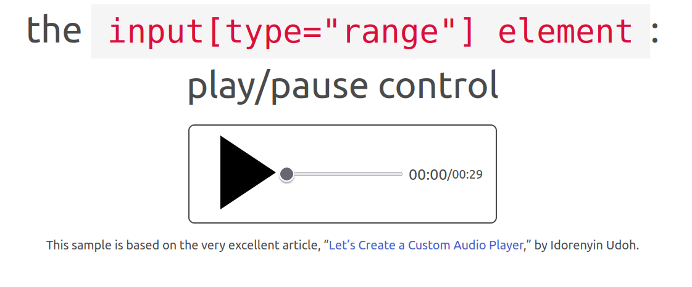
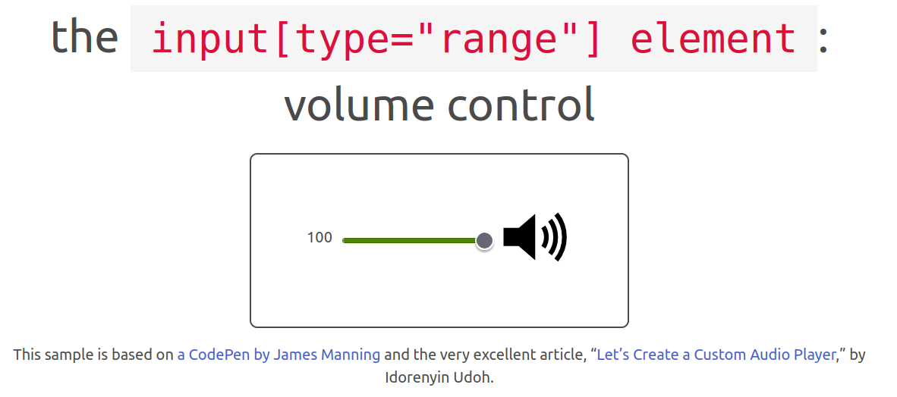
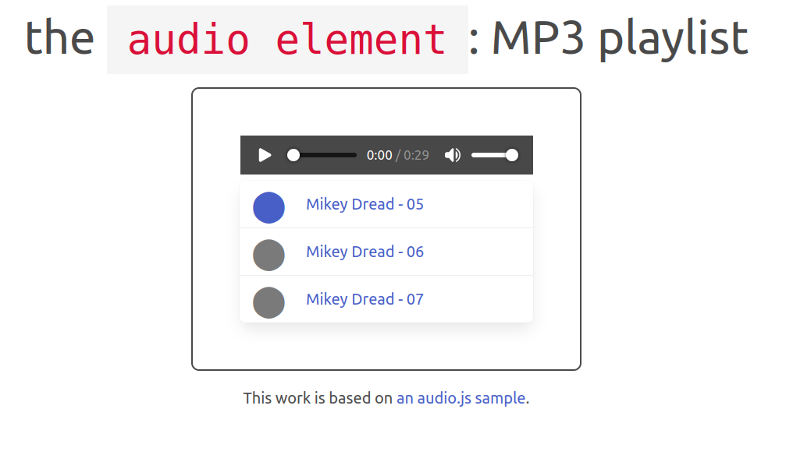
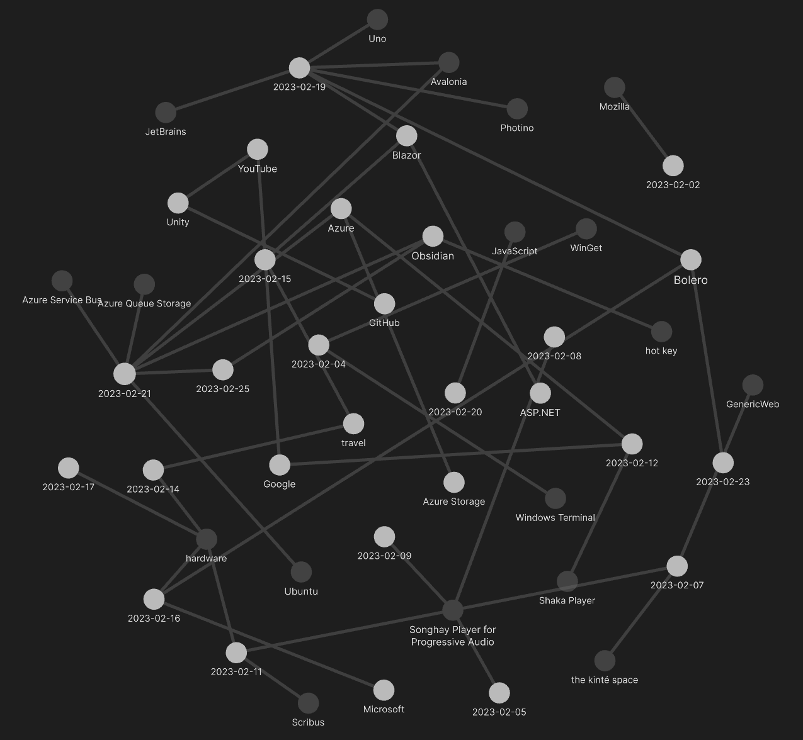
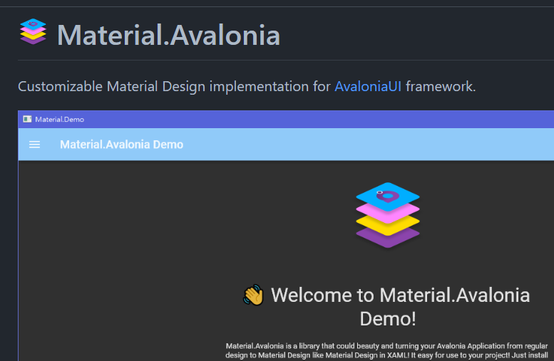

---json
{
  "documentId": 0,
  "title": "studio status report: 2023-02",
  "documentShortName": "2023-02-25-studio-status-report-2023-02",
  "fileName": "index.html",
  "path": "./entry/2023-02-25-studio-status-report-2023-02",
  "date": "2023-02-25T21:51:03.906Z",
  "modificationDate": "2023-02-25T21:51:03.906Z",
  "templateId": 0,
  "segmentId": 0,
  "isRoot": false,
  "isActive": true,
  "sortOrdinal": 0,
  "clientId": "2023-02-25-studio-status-report-2023-02",
  "tag": "{\n  \"extract\": \"month 02 of 2023 was still about slow progress on Songhay.Player.ProgressiveAudio and loads of research The “Songhay.Player.ProgressiveAudio release 6.0.0” project is still underway in large part because I spent at least 15 hours this month watching three…\"\n}"
}
---

# studio status report: 2023-02

## month 02 of 2023 was _still_ about slow progress on `Songhay.Player.ProgressiveAudio` and loads of research

The “`Songhay.Player.ProgressiveAudio` release 6.0.0” [project](https://github.com/users/BryanWilhite/projects/9) is _still_ underway in large part because I spent _at least_ 15 hours this month watching _three_ different play-throughs of [the _Dead Space_ remake](https://www.ign.com/articles/dead-space-remake-review). The [Gab Smolders play-through](https://www.youtube.com/playlist?list=PLGxV8JnoT5QilD_bhSJ4Za4beD-Z7pw1_) gets my award as the other dudes I watched were seasoned veterans of gaming but not as seasoned as Gab when it came to the _Dead Space_ universe.

Anyway, there were a few more non-day-job hours left in the month which allowed me to complete all three of the Player samples (in HTML):

1. <https://rasx-node-js.netlify.app/html5/input-range-play-control/index.html>
2. <https://rasx-node-js.netlify.app/html5/input-range-volume-control/index.html>
3. <https://rasx-node-js.netlify.app/html5/audio-playlist/>

Visually, we have these three bits:

<div style="text-align:center">





</div>

It was important to do this work in ‘pure’ HTML (and plain-vanilla JavaScript) get rapid feedback during development and to see just how little (or how much) JavaScript is needed for the world Web Assembly (Bolero).

## “sorting Blazor, Photino, Uno and Avalonia”

This juggling of UI technologies leads to the ‘loads of research’ mentioned above—and there should be separate blog post entitled “sorting Blazor, Photino, Uno and Avalonia” coming out soon to delve into what I regard as the state of the art. A sharp eye should be able to find _Blazor_, _Photino_, _Uno_ and _Avalonia_ in the Obsidian graph of the month:



Selected notes from the month follow:

## [[Bolero]]: my bug fix was released two weeks ago!

Loïc Denuzière merged a fix for [my bug](https://github.com/fsbolero/Bolero/issues/261) in month 11, last year—but there was no [release](https://github.com/fsbolero/Bolero/releases) picking up these changes until two weeks ago. This means I have update my [[Bolero]] packages #to-do

## yes, [[Avalonia]] has a Material Design package

<https://github.com/AvaloniaCommunity/Material.Avalonia>



## [[Songhay Publications]]: comics nerd verifies that Amazon has effectively destroyed Comixology, specifically its guided view player

<div style="text-align:center">

<figure>
    <a href="https://www.youtube.com/watch?v=DdBX9vu8BUM">
        
    </a>
    <p><small>WTF AMAZON!!! || How To Read Digital Comics Without Comixology</small></p>
</figure>

</div>

A [video from Pipeline Comics](https://www.youtube.com/watch?v=4V1ysQ-DKT4) introduces me to <https://www.izneo.com/fr/>which is the French version of rolling one’s own comic publication platform—and their YouTube channel is packed with trailers for comics:

<div style="text-align:center">

<figure>
    <a href="https://www.youtube.com/watch?v=ZqLqn1ZoO04">
        
    </a>
    <p><small>Betty Boob - Trailer</small></p>
</figure>

</div>

## [[Songhay Player for Progressive Audio]]: the `Presentation` type looks smaller today

```fsharp
type Presentation =  
    {  
        id: Id  
        title: Title  
        cssVariables: CssVariable list  
        parts: PresentationParts  
    }
```

`PresentationParts` has absorbed some properties:

```fsharp
type PresentationParts =  
    | CopyRights of Copyright list  
    | Credits of RoleCredit list  
    | Description of Description  
    | Pages of string list  
    | Playlist of (Title * Uri) list
```

This move was done after studying how “[Grouping with Discriminated Unions](https://github.com/BryanWilhite/jupyter-central/blob/master/funkykb/fsharp/discriminated-unions/grouping-with-discriminated-unions.ipynb)” works.

## can the `PresentationParts` type describe streaming media?

Today, the `PresentationParts` type has `Pages` and `Playlist`—for streaming media I would flippantly assert the `Chapter`.

Does the `Chapter` have enough expressive power to describe, say:

- <acronym title="Moving Picture Experts Group">MPEG</acronym>-<acronym title="Dynamic Adaptive Streaming over HTTP">DASH</acronym> segments \[📖 [docs](https://en.wikipedia.org/wiki/Dynamic_Adaptive_Streaming_over_HTTP) \]
- ‘chunks’ of <acronym title="Timed Text Markup Language">TTML</acronym> \[📖 [docs](https://en.wikipedia.org/wiki/Timed_Text_Markup_Language) \]

❓

>[!warning]
>What might be a problem is the horizontal aspect of a Presentation _Part_ while there might be a need to express the vertical aspect of a Presentation _Layer_.

Today, I assume that Presentation layers can be derived from Presentation parts. This implies that _all_ layers of a Presentation can be broken down into parts—and the strategy for breaking a layer down will always involve _time_ (<acronym title="Society of Motion Picture and Television Engineers">SMPTE</acronym> timecode \[📖 [docs](https://en.wikipedia.org/wiki/SMPTE_timecode) \] ?), _temporal coordination_.

## “GraphQL is a hot smoking pile of garbage”

<https://aista.com/blog/graphql-is-hot-smoking-pile-of-garbage/>

“JSON based SQL insertion attacks”…?

>Because securing a GraphQL endpoint, is probably equally difficult as it is to implement a _real_ software development solution, with business logic on the server, and validation and security on the server – _Where it belongs_. Exposing GraphQL endpoints to anybody but yourself, and/or the sys-admin of your app, is probably only slightly more secure than providing a text area in the public parts of your website, with a placeholder saying; _“Provide SQL here …”_.

@[BryanWilhite](https://twitter.com/BryanWilhite)
