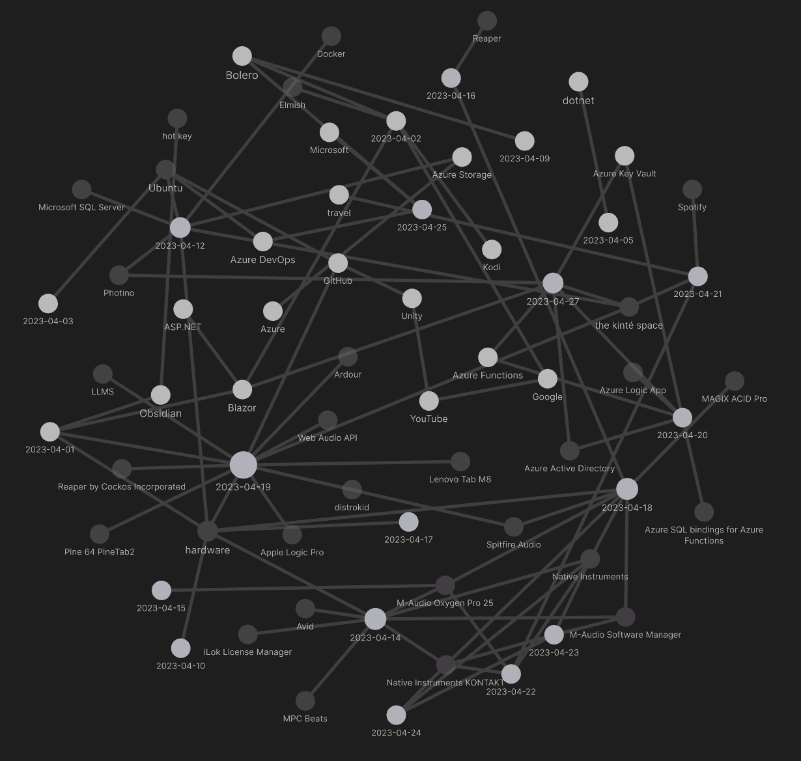
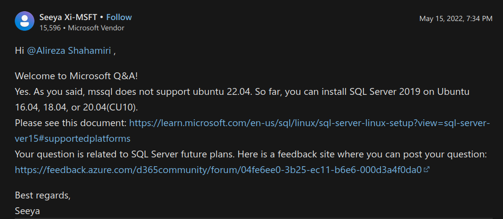
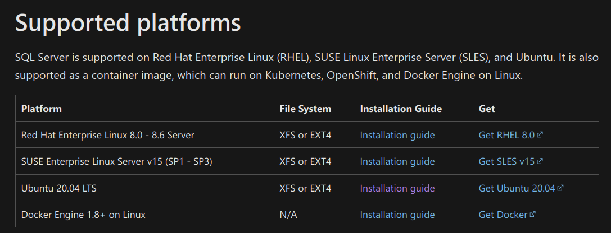
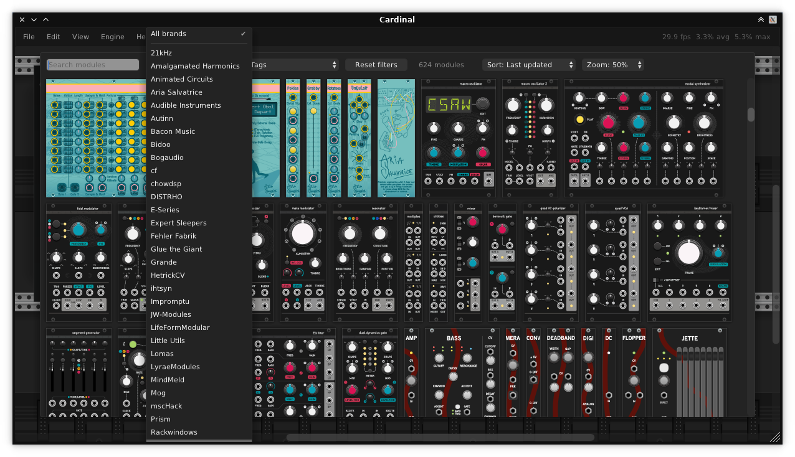

---json
{
  "documentId": 0,
  "title": "studio status report: 2023-04",
  "documentShortName": "2023-04-29-studio-status-report-2023-04",
  "fileName": "index.html",
  "path": "./entry/2023-04-29-studio-status-report-2023-04",
  "date": "2023-04-30T02:22:34.016Z",
  "modificationDate": "2023-04-30T02:22:34.016Z",
  "templateId": 0,
  "segmentId": 0,
  "isRoot": false,
  "isActive": true,
  "sortOrdinal": 0,
  "clientId": "2023-04-29-studio-status-report-2023-04",
  "tag": "{\n  \"extract\": \"month 04 of 2023 was about slower progress on Songhay.Player.ProgressiveAudio and some Studio upgrades The “Songhay.Player.ProgressiveAudio release 6.0.0” project is finally looking like it is winding down. The JSON data is now at the surface of the UI an…\"\n}"
}
---

# studio status report: 2023-04

## month 04 of 2023 was about slower progress on `Songhay.Player.ProgressiveAudio` and some Studio upgrades

The “`Songhay.Player.ProgressiveAudio` release 6.0.0” [project](https://github.com/users/BryanWilhite/projects/9) is finally looking like it is winding down. The JSON data is now at the surface of the UI and what remains is just layout that will be guided by previous work. My selected notes below will mention more details on this.

The big distracting upgrade in the Studio includes the acquisition of an M-Audio Oxygen Pro 25 MIDI controller. A move like this was held back for years and I finally made that move! My selected notes below will, again, mention more details on this.

The Obsidian graph for this month lights up with musical technology references:



There should be some life left for me after the re-release of kintespace.com—and such a life will require more personal music projects of mine and motion-picture soundtracks.

Selected Studio notes:

## [[hardware]]: I went with an M-Audio 25-key <acronym title="Musical Instrument Digital Interface">MIDI</acronym> controller because it is one of the few with weighted after-touch keys

[According to sweetwater.com](https://www.sweetwater.com/c513--25-key_MIDI_Controllers?sb=popular&params=eyJmYWNldCI6eyJUeXBlIG9mIEtleXMiOlsiU2VtaS13ZWlnaHRlZCJdfX0), there are four 25-key controllers:


M-Audio stands out because:

- it has the most beat pads (16 of them)
- it has after-touch as well as weighted keys
M-Audio 25-key drawbacks:
- buttons are “clicky” plastic
- might be too heavy for travel (because the weighted keys)
- cannot select, arm, mute or solo tracks
- only has one fader

According John Mike, the M-Audio 25-key controller comes standard for students of music production:

<div style="text-align:center">

<figure>
    <a href="https://www.youtube.com/watch?v=yVfsKDQhTSc">
        
    </a>
    <p><small>This Was My First Midi Controller! |M Audio Oxygen 25 MK2 #ThrowbackThursdays|</small></p>
</figure>

</div>

Nice video describing setup:

<div style="text-align:center">

<figure>
    <a href="https://www.youtube.com/watch?v=aSCxfgDxVB4">
        
    </a>
    <p><small>M-Audio Oxygen Pro - USB Connection, Getting Started, and DAW Setup Tutorial</small></p>
</figure>

</div>

## [[F♯]]: an object that implements `.map` is a functor…

…and, according to this guy:

<div style="text-align:center">

<figure>
    <a href="https://www.youtube.com/watch?v=9QveBbn7t_c">
        
    </a>
    <p><small>Monad - FunFunFunction #21</small></p>
</figure>

</div>
…an object that implements `.flatMap` is a _monad_.

In the world of [[dotnet|.NET]], this means that the extension methods `.Select` and `.SelectMany` make implementations of `IEnumerable<T>` functors and monads simultaneously and respectively.

## [[F♯]]: the Brian Beckman definition of a monoid

<div style="text-align:center">

<figure>
    <a href="https://www.youtube.com/watch?v=ZhuHCtR3xq8">
        
    </a>
    <p><small>Brian Beckman: Don't fear the Monad</small></p>
</figure>

</div>

Microsoft’s Brian Beckman uses a 12-hour clock to explain what a monoid is: 

>A _monoid_ is a collection of things plus a rule for combining the things—and that rule obeys some rules.
>
>—Brian Beckman \[📹 [watch](https://youtu.be/ZhuHCtR3xq8?t=1240) \]
>

The rule obeys _associativity_ and the existence of a “special member” (`unit`? …“zero”?—I think he is referring to `id` …`fun x -> x`).

…In view of this Brian Beckman quote we must remember that `x: int` is the same as $x \in \\Z$ 

Beckman reminds us that the _functor_ is from category theory:

>In [mathematics](https://en.wikipedia.org/wiki/Mathematics "Mathematics"), specifically [category theory](https://en.wikipedia.org/wiki/Category_theory "Category theory"), a **functor** is a [mapping](https://en.wikipedia.org/wiki/Map_(mathematics) "Map (mathematics)") between [categories](https://en.wikipedia.org/wiki/Category_(mathematics) "Category (mathematics)"). Functors were first considered in [algebraic topology](https://en.wikipedia.org/wiki/Algebraic_topology "Algebraic topology")…
>
>—<https://en.wikipedia.org/wiki/Functor>
>

## [[hardware]]: the `mssql-tools` package cannot be installed on Ubuntu >20.04

The prerequisites clearly state:

>You must have an Ubuntu 20.04 machine with at least 2 GB of memory.
>

This direct statement implies that that the `mssql-server` cannot be installed on later versions of Ubuntu. The characteristic error message follows:

```shell
$ sudo apt-get install -y mssql-server

The following packages have unmet dependencies:
 mssql-server : Depends: libldap-2.4-2 but it is not installable
E: Unable to correct problems, you have held broken packages.
```

An [obscure forum post](https://learn.microsoft.com/en-us/answers/questions/849599/unable-to-install-microsoft-sql-on-ubuntu-22-04) suggests this situation is real:

<div style="text-align:center">



</div>

Additionally, a [table published by Microsoft](https://learn.microsoft.com/en-us/sql/linux/sql-server-linux-setup?view=sql-server-linux-ver16#supportedplatforms) suggests that support is only for the LTS version of [[Ubuntu]]:

<div style="text-align:center">



</div>

## <acronym title="Common Table Expression">CTE</acronym> hierarchy recursion example

```sql
DECLARE @Employees
    TABLE (
        [ID] INT
    ,   [NAME] VARCHAR(32)
    ,   [ROLE] VARCHAR(32)
    ,   [MANAGER_ID] INT
    )

INSERT INTO @Employees
VALUES
    ( 7369, 'SMITH', 'CLERK', 7902 )
,   ( 7499, 'ALLEN', 'SALESMAN', 7698 )
,   ( 7521, 'WARD', 'SALESMAN', 7698 )
,   ( 7566, 'JONES', 'MANAGER', 7839 )
,   ( 7654, 'MARTIN', 'SALESMAN', 7698 )
,   ( 7698, 'BLAKE', 'MANAGER', 7839 )
,   ( 7782, 'CLARK', 'MANAGER', 7839 )
,   ( 7788, 'SCOTT', 'ANALYST', 7566 )
,   ( 7839, 'KING', 'PRESIDENT', NULL )
,   ( 7844, 'TURNER', 'SALESMAN', 7698 )
,   ( 7876, 'ADAMS', 'CLERK', 7788 )
,   ( 7900, 'JAMES', 'CLERK', 7698 )
,   ( 7902, 'FORD', 'ANALYST', 7566 )
,   ( 7934, 'MILLER', 'CLERK', 7782 )


;WITH EMPLOYEE_CTE AS (
    -- seed record:
    SELECT
        [ID]
    ,   [NAME]
    ,   [ROLE]
    ,   [MANAGER_ID]
    ,   [MANAGER_NAME] = CAST('N/A' AS VARCHAR(32))
    FROM @Employees
    WHERE [MANAGER_ID] IS NULL

    UNION ALL

    -- recursive statement:
    SELECT
        emps.[ID]
    ,   emps.[NAME]
    ,   emps.[ROLE]
    ,   emps.[MANAGER_ID]
    ,   [MANAGER_NAME] = cte.[NAME]
    FROM
        @Employees emps
        --constrain and recur:
        INNER JOIN EMPLOYEE_CTE cte
            ON cte.[ID] = emps.[MANAGER_ID]
)
SELECT * FROM EMPLOYEE_CTE
```

There are two important things to remember:

1. `EMPLOYEE_CTE` is filling with every iteration.
2. The `INNER JOIN` constrains recursion _and_ drives recursion.

Also, to report on the hierarchy of a _specific_ manager change the `WHERE [MANAGER_ID] IS NULL` constraint to  `WHERE [ID] = <ID of employee>`.

## [[hardware]]: external <acronym title="Solid State Drive">SSD</acronym>s 💾

The Studio needs to use external <acronym title="Solid State Drive">SSD</acronym>s to support large musical instrument libraries, compensating for the lack of dedicated internal storage on… Previously I assumed this need would come from working on video projects. The following is an introduction:

<div style="text-align:center">

<figure>
    <a href="https://www.youtube.com/watch?v=wxtPMlA5Zwo">
        
    </a>
    <p><small>How to Build Your Own High-Performance Portable SSD</small></p>
</figure>

</div>

## finally, VCV packaged as an open source <acronym title="Virtual Studio Technology">VST</acronym> plugin 🎊 #to-do

<div style="text-align:center">



</div>

>Cardinal is a free and open-source virtual modular synthesizer plugin, available as CLAP, LV2, VST2 and VST3 audio plugin for FreeBSD, Linux, macOS and Windows.
>
>Plus AU and JACK or Native audio standalone for some systems.
>
>It is based on the popular [VCV Rack](https://vcvrack.com/) but with a focus on being a fully self-contained plugin version.
>
><https://github.com/DISTRHO/Cardinal#readme>
>

<div style="text-align:center">

<figure>
    <a href="https://www.youtube.com/watch?v=HapldC7rROc">
        
    </a>
    <p><small>Cardinal is a brand new open-source modular plug-in built on top of VCV Rack</small></p>
</figure>

</div>

## sketching out development projects

The current, unfinished public projects on GitHub:

- finish the “`Songhay.Player.ProgressiveAudio` release 6.0.0” [project](https://github.com/users/BryanWilhite/projects/9)
- start the “`SonghayCore` 📦✨ release 6.0.5” [project](https://github.com/users/BryanWilhite/projects/7)

The proposed project items:

- add kinté space presentations support to `Songhay.Player.YouTube` 🔨 🚜✨
- replace the Angular app in `http://kintespace.com/player.html` with a Bolero app 🚜🔥
- generate Publication indices from LiteDB for `Songhay.Publications.KinteSpace`
- generate a new repo with proposed name, `Songhay.Modules.Bolero.Index` ✨🚧 and add a GitHub Project
- switch Studio from Material Design to Bulma 💄 ➡️ 💄✨

@[BryanWilhite](https://twitter.com/BryanWilhite)
