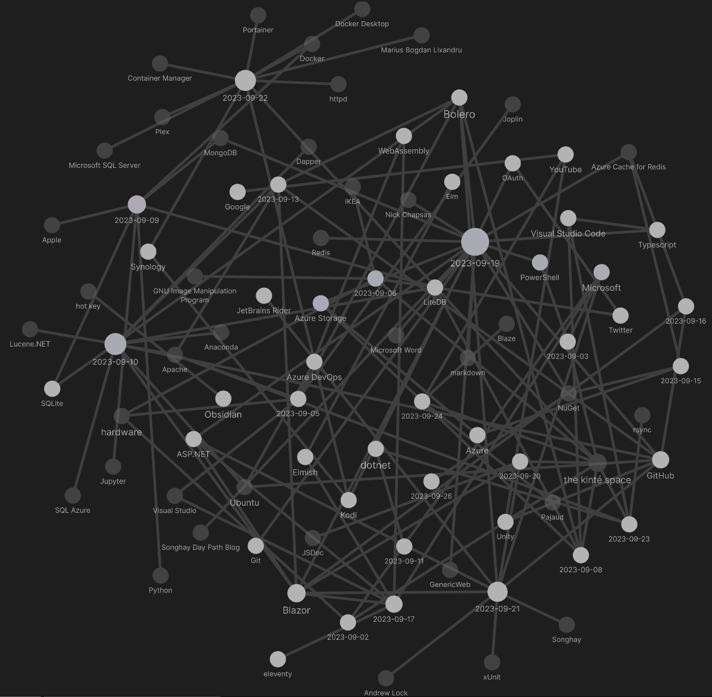

---json
{
  "documentId": 0,
  "title": "studio status report: 2023-09",
  "documentShortName": "2023-09-27-studio-status-report-2023-09",
  "fileName": "index.html",
  "path": "./entry/2023-09-27-studio-status-report-2023-09",
  "date": "2023-09-27T16:57:54.830Z",
  "modificationDate": "2023-09-27T16:57:54.830Z",
  "templateId": 0,
  "segmentId": 0,
  "isRoot": false,
  "isActive": true,
  "sortOrdinal": 0,
  "clientId": "2023-09-27-studio-status-report-2023-09",
  "tag": "{\n  \"extract\": \"\"\n}"
}
---

# studio status report: 2023-09

## month 09 of 2023 was about _actually_ finishing the `Songhay.Player.ProgressiveAudio` project (and dropping LiteDB)

In the [summer of 2022](http://songhayblog.azurewebsites.net/entry/2022-06-26-studio-status-report-2022-06/), I started tracking the `Songhay.Player.ProgressiveAudio` release 6.0.0” [project](https://github.com/users/BryanWilhite/projects/9). After over a year, I can _finally_ report that this watershed project is _actually_ complete. This completion implies that new presentation technology will start appearing in the kinté space (kintespace.com). At last!

Obsidian Graph View for month 09 suggests how much effort went into the `Songhay.Player.ProgressiveAudio` release:

The ‘big day’ of the month (shown above) is the 19th when the first draft of “[Songhay Publications and the Concept of the Index (2021)](http://songhayblog.azurewebsites.net/entry/2023-09-20-songhay-publications-and-the-concept-of-the-index-2021/)” was written. The publication of this Blog post is also a huge achievement that was held up in draft mode for over _two_ years! The completion of “[Songhay Publications and the Concept of the Index (2021)](http://songhayblog.azurewebsites.net/entry/2023-09-20-songhay-publications-and-the-concept-of-the-index-2021/)” leads to two major movements in the Studio:

1. the “`Songhay.Publications.Models` 6.0.0” 📦🚀 [project](https://github.com/users/BryanWilhite/projects/23/views/1)
2. introducing [SQLite](https://www.sqlite.org) to this Studio (which means dropping LiteDB)

Selected Obsidian notes below should address these moves:

## okay, not only is [[LiteDB]] fading into the background but why look at NoSQL systems at all? 👀

There is no debate around why [[SQL Azure]] should never return to this Studio. What is novel today is the realization that [[LiteDB]] is _not_ the replacement of [[SQL Azure]].

>[!important]
>An extremely conservative incremental change in this Studio would be a move away from generating <acronym title="HyperText Markup Language">HTML</acronym> with a relational database server toward generating <acronym title="JavaScript Object Notation">JSON</acronym> with a relational database file.
>

This relational database _file_ ([[SQLite]]) would represent the _Index_ of [[Songhay Publications]]. The traditional Segment and Document data of this Studio would be relational data in the [[SQLite]] file, referencing external (Fragment) data, largely in the form of `*.md` documents. This primitive tech stack makes sense for a one-man show. A NoSQL approach would keep queryable ‘copies’ of these external documents along with the Index data all in one place. From my document-centered point of view, this NoSQL approach feels redundant and devalues the importance of standalone documents as data.

>[!important]
>This Studio is biased toward _rarely_ aggregating documents for queries and find-change operations but _frequently_ making hand-made individual edits.

It _feels_ like a NoSQL approach is directly opposed to this bias:

>Motivations for this approach include simplicity of [design](https://en.wikipedia.org/wiki/Design "Design"), simpler ["horizontal" scaling](https://en.wikipedia.org/wiki/Horizontal_scaling#Horizontal_(scale_out)_and_vertical_scaling_(scale_up) "Horizontal scaling") to [clusters of machines](https://en.wikipedia.org/wiki/Cluster_computing "Cluster computing") (which is a problem for relational databases), finer control over [availability](https://en.wikipedia.org/wiki/Availability "Availability"), and limiting the [object-relational impedance mismatch](https://en.wikipedia.org/wiki/Object-relational_impedance_mismatch "Object-relational impedance mismatch").
>
>—<https://en.wikipedia.org/wiki/NoSQL>
>

I must remind myself that NoSQL is a “Web 2.0” godsend meant to _capture_ data from billions of users across the globe. This Studio is about publishing a largely _read-only_ experience to billions of people across the globe.

>[!important]
>This Studio needs a database that ‘extends’ the file system rather than a NoSQL solution that can abstract the file system away.
>

To recognize the file system _by design_ can be considered an admission of just how old fashioned a developer over 50 can be 👴 One of the eldest design goals in this Studio is using a database _offline_ (to generate static <acronym title="HyperText Markup Language">HTML</acronym> 👴), this means there is no world-dominating need to distribute this database across the solar system. The decision to build/publish this way continues to be the right thing to do (for a one-man show).

So, instead of replacing all of this work, something like [[Lucene.NET]] builds _on top_ of this work. See “[Implementing Search in Blazor WebAssembly With Lucene.NET](https://www.aaron-powell.com/posts/2019-11-29-implementing-search-in-blazor-webassembly-with-lucenenet/)” #to-do

## [[Songhay Publications (C♯)]] and [[Songhay Modules Publications (F♯)]] on intimate terms?

The idea is that new F♯ types, like `IndexEntry`, can inherit from the “classic” types in [[Songhay Publications (C♯)]]. It follows that there should be a stripped-down [[NuGet]] package, say `Songhay.Publications.Models`, that can be consumed by [[Songhay Modules Publications (F♯)]] #to-do 

To make `Songhay.Publications.Models` possible, one big blocker has to be eliminated: getting rid of the dependency on [[Songhay Core - Newtonsoft]] which includes replacing `JObject` with `JsonElement` (mostly). The most primitive way to do this is to remember this extreme case: the `JsonElement.GetRawText` method can be fed to the `JObject.Parse`  method.

With this ‘extreme case’ in my back pocket, I can quickly get `Songhay.Publications.Models` published (but may have to work longer to get the full `Songhay.Publications` published later).

>[!important]
>The “`Songhay.Publications.Models` 6.0.0 📦🚀” [project](https://github.com/users/BryanWilhite/projects/23) has started to explore this.
>
>

### “Distributed caching in ASP.NET Core” 📖 #day-job

“[Distributed caching in ASP.NET Core](https://learn.microsoft.com/en-us/aspnet/core/performance/caching/distributed?view=aspnetcore-3.1)” refers to `Microsoft.Extensions.Caching.StackExchangeRedis` \[🔗 [NuGet](https://www.nuget.org/packages/Microsoft.Extensions.Caching.StackExchangeRedis/8.0.0-rc.1.23421.29) \] which [depends on](https://github.com/dotnet/aspnetcore/blob/57d703606439dccabec92c2a0d5e4fa618985cd8/src/Caching/StackExchangeRedis/src/Microsoft.Extensions.Caching.StackExchangeRedis.csproj#L17) `StackExchange.Redis` which features the `IDistributedCache` interface \[📖 [docs](https://learn.microsoft.com/en-us/dotnet/api/microsoft.extensions.caching.distributed.idistributedcache?view=dotnet-plat-ext-7.0) \] (which should replace `ICacheService` above) and adds [[ASP.NET]] conventions like `IOptions<RedisCacheOptions>` or `ILogger`.

See “[Distributed caching](https://learn.microsoft.com/en-us/dotnet/core/extensions/caching#distributed-caching)” 📖

## sketching out development projects

The current, unfinished public projects on GitHub:

- ~~finish the “`Songhay.Modules.Publications` release 6.3.0 📦🚀” [project](https://github.com/users/BryanWilhite/projects/21)~~
- ~~finish the “`Songhay.Player.ProgressiveAudio` release 6.0.0” [project](https://github.com/users/BryanWilhite/projects/9)~~
- replace the Angular app in `http://kintespace.com/player.html` with a Bolero app 🚜🔥
- finish the “`SonghayCore` 📦✨ release 6.0.5” [project](https://github.com/users/BryanWilhite/projects/7)
- start the “`Songhay.Publications.Models` 6.0.0” 📦🚀 [project](https://github.com/users/BryanWilhite/projects/23/views/1)

The proposed project items:

- add kinté space presentations support to `Songhay.Player.YouTube` 🔨 🚜✨
- generate Publication indices from SQLite for `Songhay.Publications.KinteSpace`
- generate a new repo with proposed name, `Songhay.Modules.Bolero.Index` ✨🚧 and add a GitHub Project
- switch Studio from Material Design to Bulma 💄 ➡️ 💄✨

<https://github.com/BryanWilhite/>
