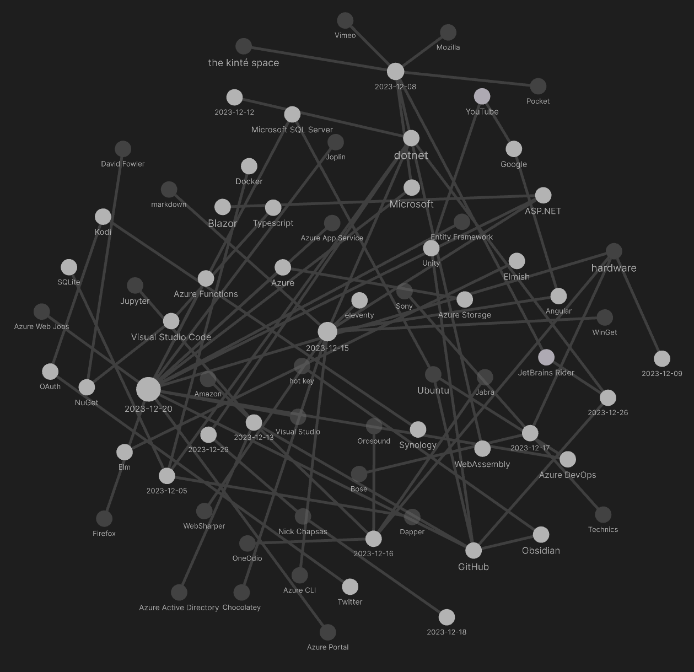

---json
{
  "documentId": 0,
  "title": "studio status report: 2023-12",
  "documentShortName": "2023-12-30-studio-status-report-2023-12",
  "fileName": "index.html",
  "path": "./entry/2023-12-30-studio-status-report-2023-12",
  "date": "2023-12-30T19:27:11.060Z",
  "modificationDate": "2023-12-30T19:27:11.060Z",
  "templateId": 0,
  "segmentId": 0,
  "isRoot": false,
  "isActive": true,
  "sortOrdinal": 0,
  "clientId": "2023-12-30-studio-status-report-2023-12",
  "tag": "{\n  \"extract\": \"\"\n}"
}
---

# studio status report: 2023-12

## month 12 of 2023 was about releasing `Songhay.Modules` 6.40 and refreshing knowledge of Azure WebJobs

As mentioned [last month](http://songhayblog.azurewebsites.net/entry/2023-11-29-studio-status-report-2023-11), the other ‘half’ needed to completely replace `http://kintespace.com/player.html` includes:

- `Songhay.Modules.Bolero` release 6.4.0 📦🚀 [[GitHub](https://github.com/users/BryanWilhite/projects/27)]
- `Songhay.Player.YouTube` release 6.3.0 📦🚀 [[GitHub](https://github.com/users/BryanWilhite/projects/25)]

And `Songhay.Modules` release 6.4.0 📦🚀 [[GitHub](https://github.com/users/BryanWilhite/projects/26)] was on the list above. `Songhay.Modules` 6.4.0 is published/released [[NuGet](https://www.nuget.org/packages/Songhay.Modules)]✅ The feature of this release is my new models, `AppStateSet` [[GitHub](https://github.com/BryanWilhite/Songhay.Modules/blob/main/Songhay.Modules/Models/AppStateSet.fs)] and `AppStateHashSet` [[GitHub](https://github.com/BryanWilhite/Songhay.Modules/blob/main/Songhay.Modules/Models/AppStateHashSet.fs)]. We can see `AppStateSet` in action [on the Studio Floor](https://github.com/BryanWilhite/Songhay.Modules.Bolero/blob/main/Songhay.StudioFloor.Client/Models/StudioFloorModel.fs#L12) of the `Songhay.Modules.Bolero` repo. These changes to the Studio Floor are part of `Songhay.Modules.Bolero` release 6.4.0.

The Obsidian graph of this month is much smaller than previous months:



The smaller size should be due to me dialing down major day-job discoveries. This month only has one major discovery: a renewal of interest in Azure WebJobs (which I defiantly write as _Azure Web Jobs_). I have dedicated an entire Blog post, “[Azure WebJobs in 2023](http://songhayblog.azurewebsites.net/entry/2023-12-22-azure-webjobs-in-2023),” to this renewal.

Here are the usual Obsidian notes highlights for the month:

## “Dapper vs Entity Framework (EF6 or EF Core)”

>- **Dapper**: Give you full control over the SQL generated / uses stored procedures for everything.
>- **Entity Framework**: Allow you to code with `LINQ` and forget everything about SQL.
>
>—<https://www.learndapper.com/dapper-vs-entity-framework>
>

## [[Docker]]: running the ‘interactive terminal’❓ of the image

Here is a command from [[dotnet]] conf 2023:

```terminal
$ docker run -it -rm --entrypoint /bin/bash hello-dotnet:latest

```

<div style="text-align:center">

<figure>
    <a href="https://www.youtube.com/watch?v=scIAwLrruMY">
        
    </a>
    <p><small>.NET Containers advancements in .NET 8 | .NET Conf 2023</small></p>
</figure>

</div>

## [[Microsoft]] starts talking about [[WebAssembly]] on the server in the cloud 🌩

>The promise on the horizon is being able to take an existing .NET app or library and compile it to a Wasm target. Our design instinct is to implement WIT interfaces relatively high into the .NET stack (like create an ADO.NET Data Provider for [`wasi-sql`](https://github.com/WebAssembly/wasi-sql)), which would enable existing code (including many existing NuGet packages) to just work, particularly for code without native dependencies.
>
>—“[Extending WebAssembly to the Cloud with .NET](https://devblogs.microsoft.com/dotnet/extending-web-assembly-to-the-cloud/)”
>

## [[Songhay System]]: “Why Nigerian filmmakers are skipping Netflix to go straight to YouTube”

>He and Yekini are among a growing crop of filmmakers in Nigeria — home to Nollywood, Africa’s largest film industry with around [2,500 films produced annually](https://www.theguardian.com/global-development/2021/oct/05/nollywood-booming-while-african-film-industries-could-create-20m-jobs-report) — who are using YouTube as a movie streaming platform. They told _Rest of World_ they consider it a more democratic alternative to Netflix, Prime Video, and Showmax. Uploading their content on YouTube allows them to control the distribution of their work, ==without fear of piracy.==
>
>—[Damilare Dosunmu](https://restofworld.org/2023/nigera-filmmakers-youtube/)
>

## [[Azure Active Directory]]: “New name for Azure Active Directory”

>Microsoft has renamed Azure Active Directory (Azure AD) to Microsoft Entra ID for the following reasons: (1) to communicate the multicloud, multiplatform functionality of the products, (2) to alleviate confusion with Windows Server Active Directory, and (3) to unify the [Microsoft Entra](https://learn.microsoft.com/en-us/entra) product family.
>
>—“[New name for Azure Active Directory](https://learn.microsoft.com/en-us/entra/fundamentals/new-name)”
>

## F♯: `String.collect` is not that useful?

According to  my latest [[GitHub]] comment:

>today, it looks like `String.collect` is useful as a replacement for `input.ToCharArray() |> Array.map (fun c -> c ) |> String`
>
>—<https://github.com/BryanWilhite/Songhay.Modules/issues/9#issuecomment-1854403692>
>

I should make a [[Jupyter]] note on `String.collect` \[📖 [docs](https://github.com/MicrosoftDocs/visualfsharpdocs/blob/main/docs-fsharp-conceptual/string.collect-function-%5Bfsharp%5D.md) \] to verify #to-do

## does “Build a Simple Markdown Blog with F# / Giraffe” mean that [[eleventy]] can be replaced?

<div style="text-align:center">

<figure>
    <a href="https://www.youtube.com/watch?v=XdPiDfVZ6dk">
        
    </a>
    <p><small>Build a Simple Markdown blog with F# / Giraffe</small></p>
</figure>

</div>

The short answer is _no_. “[Build a Simple Markdown Blog with F# / Giraffe](https://hamy.xyz/labs/2023-12-fsharp-giraffe-markdown-blog)” implicitly takes a dependency out on [[ASP.NET]] while [[eleventy]] has no server dependency. I would have to resort to generating static <acronym title="HyperText Markup Language">HTML</acronym> files from [[markdown]], like [[eleventy]], building 🐇🕳 a system that might end up looking like:

- Fornax \[🔗 [GitHub](https://github.com/ionide/Fornax) \] (not really because this project does not appear to be dependent on something like Giraffe or Scriban and features the use of `*.fsx` F♯ script files)
- SiteFi \[🔗 [GitHub](https://github.com/granicz/SiteFi/) \] (yes, depends on [[WebSharper]] (`WebSharper.UI.Html`) which leads to React)
- FsBlog \[🔗 [GitHub](https://github.com/fsprojects/FsBlog) \] (yes, but this project is quite old: it has not been touched in over seven years)
- Firm \[🔗 [GitHub](https://github.com/andagr/Firm) \] (this one is even older than `FsBlog`!)

### related links

- “[HTML Rendering Benchmarks - Raw strings vs Scriban Templates in F#](https://hamy.xyz/labs/2023-12-html-rendering-benchmarks-scriban-templates-raw-fsharp)”
- “[Build a simple F# web API with Giraffe](https://hamy.xyz/labs/2022-12-simple-fsharp-web-api-giraffe?utm_campaign=iamhamy_top-posts&utm_source=iamhamy)”
- “ [can Fornax *replace* eleventy? `#41`](https://github.com/BryanWilhite/dotnet-core/issues/41) ”
- “[Fluid is an open-source .NET template engine based on the Liquid template language.](https://github.com/sebastienros/fluid/)”
- “[Scriban is a fast, powerful, safe and lightweight scripting language and engine for .NET, which was primarily developed for text templating with a compatibility mode for parsing liquid templates.](https://github.com/scriban/scriban)”
- [[2023-02-21#picks from the “awesome” F♯ list]]

## [[WinGet]] <acronym title="User Interface">UI</acronym> disappoints #day-job

I recall the [[WinGet]] command-line [[2023-02-04#WinGet disappoints…|disappointing]]—and [[WinGet]] <acronym title="User Interface">UI</acronym> (<https://www.marticliment.com/wingetui/>) merely continues the disappointment on the #day-job:

- the <acronym title="User Interface">UI</acronym> does not visualize what would be happening on the command line as effectively as [[Chocolatey]] <acronym title="User Interface">UI</acronym>
- by default, most installations are interactive, forcing the installer <acronym title="Graphical User Interface">GUI</acronym> on the user
- many installations failed
- key successful installations break things (e.g. the [[Azure CLI]] installation was broken by [[WinGet]])
- desktop notifications for package updates (even for updates that fail) annoyingly repeat

## [[Nick Chapsas]] introduces the `SearchValues<T>` class

<div style="text-align:center">

<figure>
    <a href="https://www.youtube.com/watch?v=IzDMg916t98">
        
    </a>
    <p><small>The New Best Way To Search for Values in .NET 8</small></p>
</figure>

</div>

>[`SearchValues<T>`](https://learn.microsoft.com/en-us/dotnet/api/system.buffers.searchvalues-1?view=net-8.0) instances are optimized for situations where the same set of values is frequently used for searching at run time.
>
>—[learn.microsoft.com](https://learn.microsoft.com/en-us/dotnet/api/system.buffers.searchvalues-1?view=net-8.0)
>

## [[Firefox]] 121 promises to support `:has()`

As early as 2022, I was aware of the weird-ass fact that that `:has()` was not supported by [[Firefox]]—and then I was aware of it again a few months ago. According to “[Mozilla Firefox 121 Is Now Available for Download, Here’s What’s New](https://9to5linux.com/mozilla-firefox-121-is-now-available-for-download-heres-whats-new)”:

>For web developers, Mozilla Firefox 121 brings support for the `:has()` selector by default to allow you to match elements that have at least one element matching its relative selector…

## i thought critiques of <acronym title="Representational State Transfer">REST</acronym> were passé

In “[It's time to put REST to rest](https://sollecitom.github.io/software-product-development-blog/posts/2023/2023-09-22-put-rest-to-rest/),” the argument is calm and clear:

>The fundamental issue with REST is that it defines operations that manipulate data structures. It’s about structure and structural changes, not behaviour. It’s imperative, rather than declarative.
>
>— Michele Sollecito
>

## “merchants of complexity” 😶‍🌫

>DHH likened clouds to “merchants of complexity” where they are incentivized to make things as complex as possible to keep customers hooked. He compared that to the original Internet, which was not built on complex cloud services geared for multi-tenancy, but rather on simpler tools such as Linux and PHP, which anyone could use without cost.
>
>—“[‘Merchants of Complexity’: Why 37Signals Abandoned the Cloud](https://thenewstack.io/merchants-of-complexity-why-37signals-abandoned-the-cloud/)”
>

## sketching out development projects

The current, unfinished public projects on GitHub:

- replacing the Angular app in `http://kintespace.com/player.html` with a Bolero app 🚜🔥 depends on:
  - completing the `Songhay.Modules.Bolero` release 6.4.0 📦🚀 [project](https://github.com/users/BryanWilhite/projects/27)
  - starting the `Songhay.Player.YouTube` release 6.3.0 📦🚀 [project](https://github.com/users/BryanWilhite/projects/25)
- finish the “`SonghayCore` 📦✨ release 6.0.5” [project](https://github.com/users/BryanWilhite/projects/7)
- start the “`Songhay.Publications.Models` 6.0.0” 📦🚀 [project](https://github.com/users/BryanWilhite/projects/23/views/1)

The proposed project items:

- add Entity Framework (over SQLite) features to `Songhay.Publications`
- generate Publication indices from SQLite for `Songhay.Publications.KinteSpace`
- generate a new repo with proposed name, `Songhay.Modules.Bolero.Index` ✨🚧 and add a GitHub Project
- switch Studio from Material Design to Bulma 💄 ➡️ 💄✨

<https://github.com/BryanWilhite/>
