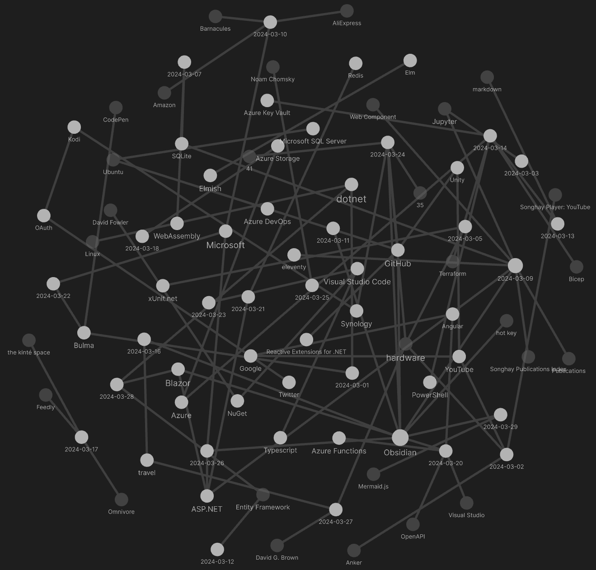

---json
{
  "documentId": 0,
  "title": "studio status report: 2024-03",
  "documentShortName": "2024-03-30-studio-status-report-2024-03",
  "fileName": "index.html",
  "path": "./entry/2024-03-30-studio-status-report-2024-03",
  "date": "2024-03-30T23:28:12.773Z",
  "modificationDate": "2024-03-30T23:28:12.773Z",
  "templateId": 0,
  "segmentId": 0,
  "isRoot": false,
  "isActive": true,
  "sortOrdinal": 0,
  "clientId": "2024-03-30-studio-status-report-2024-03",
  "tag": "{\n  \"extract\": \"month 03 of 2024 was about Songhay.Player.YouTube release 6.3.1 📦🚀 As of this writing, there is only one task left on the Songhay.Player.YouTube project for release 6.3.1. This places the Studio very, very close to replacing the Angular app in…\"\n}"
}
---

# studio status report: 2024-03

## month 03 of 2024 was about `Songhay.Player.YouTube` release 6.3.1 📦🚀

As of this writing, there is only one task left on the `Songhay.Player.YouTube` [project](https://github.com/users/BryanWilhite/projects/29/views/1) for release 6.3.1. This places the Studio very, very close to replacing the Angular app in `http://kintespace.com/player.html` with a Bolero app—this ridiculously difficult struggle to move beyond the SEO-nightmare world of Angular.

My Obsidian “second brain” is really helping this Studio to function and move forward:



Selected notes from month 03:

## [[xUnit.net]]: `TheoryData<T>` has been there…

From “[Typesafety in xUnit with `TheoryData<T>`](https://steven-giesel.com/blogPost/a8aa3385-8829-444a-b269-7ecb38aeaf2f)”:

>`TheoryData<T>` is a class that allows to wrap the data in a strongly typed way. Here is how I used it:

```csharp
public static TheoryData<Action<IServiceCollection>>Data =>new() 
{
    services =>services.UseSqliteAsStorageProvider(),
    services =>services.UseSqlAsStorageProvider(),
    services =>services.UseInMemoryAsStorageProvider(),
    services =>services.UseRavenDbAsStorageProvider(),
    services =>services.UseMySqlAsStorageProvider()
};

[Theory]
[MemberData(nameof(Data))]
public void GivenAlreadyRegisteredRepository_WhenTryingToAddAnotherStorage_ThenException(Action<IServiceCollection>act)

```

>[!important]
>What the article does not mention 🕶❔ is that `TheoryData<T>` works best when _one_ strongly type argument is being passed into the test method (as shown in the code sample above)—not _multiple_ args.

## “The ‘missing’ graph datatype already exists. It was invented in the ’70s”

>I claim the reason why it is so difficult to support graphs in languages nowadays is **because the imperative/structured programming model of modern programming languages is ill-suited for graph algorithms.** As Wayne correctly points out, the core problem is that when you write a graph algorithm in an imperative language like Python or Rust, you have to choose some explicit representation for the graph. Then, your traversal algorithm is dependent on the representation you chose. If you find out later that your representation is no longer efficient, it is a lot of work to adapt your algorithms for a new representation.
>
>—<https://tylerhou.com/posts/datalog-go-brrr/>
>

## [[SQLite]]: yes, the interactive docs are using [[WebAssembly]]

>Under the hood, we leverage WebAssembly (WASM) technology to execute SQLite statements directly in the browser, providing a seamless and responsive experience. Additionally, we have preloaded a sample database, ensuring users have a rich dataset to work with from the moment they access the console.
>
>—“[Interactive SQLite Documentation: Experiment with Queries in Real-Time!](https://blog.sqlitecloud.io/interactive-sqlite-documentation-experiment-with-queries-in-real-time)”
>

## [[eleventy]]: the most important help document

“[I Finally Understand Eleventy’s Data Cascade](https://benmyers.dev/blog/eleventy-data-cascade/)” by Ben Myers is today regarded as the most important [[eleventy]] document:

>When Eleventy generates the pages of your site, it aggregates data supplied from several places and then injects that data into your contents. The process of aggregating this data from each of these different places and deciding which data should have precedence in the case of a conflict is what Eleventy calls the [data cascade](https://www.11ty.dev/docs/data-cascade/).
>

According to Ben Myers (in 2021), here is the [[eleventy]] data cascade \[📖 [docs](https://www.11ty.dev/docs/data-cascade/) \]:

1. global data \[📖 [docs](https://www.11ty.dev/docs/data-global/) \]
2. config global data \[📖 [docs](https://www.11ty.dev/docs/data-global-custom/) \]
3. layout frontmatter \[📖 [docs](https://www.11ty.dev/docs/layouts/#front-matter-data-in-layouts) \]
4. directory data files and template data files \[📖 [docs](https://www.11ty.dev/docs/data-template-dir/) \]
5. template frontmatter \[📖 [docs](https://www.11ty.dev/docs/data-frontmatter/) \]
7. computed data \[📖 [docs](https://www.11ty.dev/docs/data-computed/) \]

## [[eleventy]]: “Introduction to WebC” #to-do 

>[WebC](https://github.com/11ty/webc) is a new tool by [Zach Leatherman](https://www.zachleat.com/) (creator of Eleventy) for serializing custom elements at build time. It aggregates component-level CSS and JavaScript, allowing developers to keep their styles and scripts together with the markup as single file components, the way you may be used to if you work with JavaScript frameworks such as [Svelte](https://svelte.dev/) or [Vue](https://vuejs.org/).
>
>All without having to ship a single line of JavaScript to the client — unless you want it to.
>
>—<https://11ty.rocks/posts/introduction-webc/>
>

## [[ASP.NET]]: `FSharp.AspNetCore.WebAppBuilder`

>The `webApp` computation expression lets you define ASP.NET Core web applications in a succinct and declarative way, minimizing code, maximizing readability, and providing a simple but thorough set of escape hatches, so you can always drop down to the raw ASP.NET Core APIs when you need to.
>
>—<https://github.com/brianrourkeboll/FSharp.AspNetCore.WebAppBuilder/>
>

## [[Obsidian]]: “JSON Canvas was originally created for Obsidian.”

![[Pasted image 20240311115241.png]]

>Infinite canvas tools are a way to view and organize information spatially, like a digital whiteboard. Infinite canvases encourage freedom and exploration, and have become a popular interface pattern across many apps.
>
>The JSON Canvas format was created to provide longevity, readability, interoperability, and extensibility to data created with infinite canvas apps. The format is designed to be easy to parse and give users [ownership over their data](https://stephango.com/file-over-app). JSON Canvas files use the `.canvas` extension.
>
>JSON Canvas was originally created for [Obsidian](https://obsidian.md/blog/json-canvas/). JSON Canvas can be implemented freely as an import, export, and storage format for any app or tool. This site, and all the resources associated with JSON Canvas are [open source](https://github.com/obsidianmd/jsoncanvas) under the MIT license.
>
>—<https://jsoncanvas.org/>
>

## “Should AVIF be the dominant image format on the web?”

Looks like highest fidelity but not so great file size:

>Let’s find out how similar AVIF, JPEG, and WebP are to their original. When we compare them using full-reference image quality assessment algorithms like mean squared error, peak signal-to-noise ratio, and the structural similarity index, we see that AVIF outperforms both JPEG and WebP starting at a quality setting between 30-40%. Also, note that WebP performs slightly better than JPEG.
>
>—[Tim Severien](https://tsev.dev/posts/2023-11-10-should-avif-be-the-dominant-image-format/)
>

## “We’re Bringing Responsive Video Back!”

>So along with that article, I outlined some of the points above in an [explainer document](https://github.com/filamentgroup/html-video-responsive), which included some markup examples that should feel familiar to folks who have used the `picture` element, like this:
>

```html
<video>
    <source media="(min-width: 2000px)" src="large.webm" type="video/webm">
    <source media="(min-width: 2000px)" src="large.mp4" type="video/mp4">
    <source media="(min-width: 1000px)" src="medium.webm" type="video/webm">
    <source media="(min-width: 1000px)" src="medium.mp4" type="video/mp4">
    <source src="small.webm" type="video/webm">
    <source src="small.mp4" type="video/mp4">
</video>
```

>But then, this spring the WhatWG issue thread lit up with some good news: representatives from [Firefox](https://github.com/whatwg/html/issues/6363#issuecomment-1561454274) and [Chrome](https://github.com/whatwg/html/pull/9341#issuecomment-1564631397) chimed in to say that they agreed and intend to reinstate their support! Following that, implementation bugs were filed in the [Chromium](https://bugs.chromium.org/p/chromium/issues/detail?id=1450316) and [Firefox](https://bugzilla.mozilla.org/show_bug.cgi?id=1836128) trackers.
>
>—<https://scottjehl.com/posts/responsive-video/>
>

## Python-Markdown looks the _the_ reference implementation for [[markdown]]

>This is a Python implementation of John Gruber's [Markdown](https://daringfireball.net/projects/markdown/). It is almost completely compliant with the reference implementation, though there are a few known issues. See [Features](https://Python-Markdown.github.io#Features) for information on what exactly is supported and what is not. Additional features are supported by the [Available Extensions](https://Python-Markdown.github.io/extensions).
>
>—<https://github.com/Python-Markdown/markdown>
>

## [[Azure]]: `dotnet user-secrets`, [[PowerShell]], `Microsoft.Extensions.Configuration` and [[Bicep]] all mixed together by Frank Boucher

In “[Generate Local .NET Secrets from Azure Deployments](https://devblogs.microsoft.com/dotnet/generate-dotnet-secrets-automatically-from-azure-deployment/)” Frank Boucher basically dumps a bunch of stuff on the reader—in part because there is video that might explain further:

<div style="text-align:center">

<figure>
    <a href="https://www.youtube.com/watch?v=NpE7edalTlQ">
        
    </a>
    <p><small>How to Generate Local .NET Secrets From Azure Deployment</small></p>
</figure>

</div>

What I do notice so far are the following:

- the `dotnet user-secrets` command is installed by default but [not documented](https://learn.microsoft.com/en-us/dotnet/core/tools/dotnet)
- today, I assume that the `dotnet user-secrets` system does not scale beyond the development environment (not seamlessly related to [[Azure Key Vault]])
- Bicep is locked into [[Azure]] while [[Terraform]] knowledge is portable

## [[Obsidian]]: “🧠 Peek Inside my Personal Obsidian Vault: Dann Berg's Complete 2024 Tour”

<figure>
    <a href="https://www.youtube.com/watch?v=VdJoWe0Wwkg">
        
    </a>
    <p><small>🧠 Peek Inside my Personal Obsidian Vault: Dann Berg's Complete 2024 Tour</small></p>
</figure>

Notable plugins shown in the video \[📹 [watch](https://youtu.be/VdJoWe0Wwkg?t=882) \]:

- [Obsidian Better Command Palette](https://github.com/AlexBieg/obsidian-better-command-palette)
- [Imgur](https://github.com/gavvvr/obsidian-imgur-plugin)
- [JS Engine](https://github.com/mProjectsCode/obsidian-js-engine-plugin)
- [Longform](https://github.com/kevboh/longform)
- [Obsidian Meta Bind Plugin](https://github.com/mProjectsCode/obsidian-meta-bind-plugin) (the recommendation over the [Buttons](https://github.com/shabegom/buttons) plugin)
- [Obsidian Query Language](https://github.com/jplattel/obsidian-query-language)
- [Note Refactor](https://github.com/lynchjames/note-refactor-obsidian)
- [Tag Wrangler](https://github.com/pjeby/tag-wrangler)
- [Templater](https://github.com/SilentVoid13/Templater)

## Gérald Barré let’s me know about a serious limitation of `Swashbuckle.AspNetCore`…

>Most .NET developers generate the specification from the code. The `Swashbuckle.AspNetCore` library is a popular choice to generate the OpenAPI specification from ASP.NET Core Web API projects. You can easily add a page to access the specification. However, it's hard to validate the content of the specification to ensure the specification is usable by the consumers. One way to improve that is to make the specification part of your code, so you can review the specification during code reviews.
>
>Microsoft provides the NuGet package `Microsoft.Extensions.ApiDescription.Server` that allows you to generate the OpenAPI specification from the code while building the project.
>
>—“[Generate OpenAPI specification at build time from the code in ASP.NET Core](https://www.meziantou.net/generate-openapi-specification-at-build-time-from-the-code-in-asp-net-core.htm)”
>

Background from the docs:

>The Swagger project was donated to the OpenAPI Initiative in 2015 and has since been referred to as OpenAPI. Both names are used interchangeably. However, "OpenAPI" refers to the specification. "Swagger" refers to the family of open-source and commercial products from SmartBear that work with the OpenAPI Specification. Subsequent open-source products, such as [OpenAPIGenerator](https://github.com/OpenAPITools/openapi-generator), also fall under the Swagger family name, despite not being released by SmartBear.
>
>In short:
>
>- OpenAPI is a specification.
>- Swagger is tooling that uses the OpenAPI specification. For example, OpenAPIGenerator and SwaggerUI.
>
>—“[OpenAPI vs. Swagger](https://learn.microsoft.com/en-us/aspnet/core/tutorials/web-api-help-pages-using-swagger?view=aspnetcore-8.0#openapi-vs-swagger)”
>

I think I need to take action based on “[.NET OpenAPI tool command reference and installation.](https://learn.microsoft.com/en-us/aspnet/core/web-api/microsoft.dotnet-openapi?view=aspnetcore-8.0)”

## yes, modern [[Blazor]] needs the `::deep` pseudo selector just like those used in [[Angular]]

>The `::deep` pseudo-selector will allow you to target child HTML elements nested within a parent component.
>
>—“[Blazor’s CSS isolation `::deep` issue and solution](https://khalidabuhakmeh.com/blazors-css-isolation-deep-issue-and-solution)”
>

## [[ASP.NET]]: the Problem Details standard #to-do

The following video introduces the Problem Details standard ([RFC7807](https://datatracker.ietf.org/doc/html/rfc7807)) to me:

<div style="text-align:center">

<figure>
    <a href="https://www.youtube.com/watch?v=4NfflZilTvk">
        
    </a>
    <p><small>Stop returning custom error responses from your API. Do this instead.</small></p>
</figure>

</div>

The `ProblemDetails` class \[📖 [docs](https://learn.microsoft.com/en-us/dotnet/api/microsoft.aspnetcore.mvc.problemdetails?view=aspnetcore-8.0) \] is the ancestor of the `ValidationProblemDetails` class \[📖 [docs](https://learn.microsoft.com/en-us/dotnet/api/microsoft.aspnetcore.mvc.validationproblemdetails?view=aspnetcore-8.0) \].

Will I find the [developer exception page](https://learn.microsoft.com/en-us/aspnet/core/fundamentals/error-handling?view=aspnetcore-8.0#developer-exception-page) useful?

### related reading

- “[Handle errors in ASP.NET Core](https://learn.microsoft.com/en-us/aspnet/core/fundamentals/error-handling?view=aspnetcore-8.0)”
- “[Handle errors in ASP.NET Core web APIs](https://learn.microsoft.com/en-us/aspnet/core/web-api/handle-errors?view=aspnetcore-8.0)”
- “[Handling Web API Exceptions with ProblemDetails middleware](https://andrewlock.net/handling-web-api-exceptions-with-problemdetails-middleware/)” (2020)
- “[Best way to implement the ProblemDetails in Asp.Net Core API in clean way
](https://stackoverflow.com/questions/70110306/best-way-to-implement-the-problemdetails-in-asp-net-core-api-in-clean-way)”

## [[Redis]] is walking slowly away from Open Source license

>Beginning today, all future versions of Redis will be released with source-available licenses. Starting with Redis 7.4, Redis will be dual-licensed under the [Redis Source Available License (RSALv2)](https://redis.com/legal/rsalv2-agreement/) and [Server Side Public License (SSPLv1)](https://redis.com/legal/server-side-public-license-sspl/). Consequently, Redis will no longer be distributed under the three-clause Berkeley Software Distribution (BSD).
>
>—[Rowan Trollope, Chief Executive Officer, Redis](https://redis.com/blog/redis-adopts-dual-source-available-licensing/)
>

## [[Bulma]] is version 1.0

>Bulma v1 is a **full rewrite** of the framework using [**Dart Sass**](https://sass-lang.com/dart-sass/), which is the the primary implementation of Sass. While this affects a few development details, everything has been done to make the transition **as easy as possible**.
>
>## What remains the same
>
>**All HTML snippets are the same**. This means you don't need to update your markup. **This is important** because it means, if you're using Bulma straight "out of the box", you don't need to change anything.
>
>You can just swap `bulma@0.9.4/css/bulma.min.css` with `bulma@1.0.0/css/bulma.min.css` and everything will work. Things will look slightly different, but they will still work.
>
>—<https://github.com/jgthms/bulma/releases/tag/1.0.0>
>

## [[Obsidian]]: more community plugins #to-do

The following leaves me with two community-plugin picks:

<div style="text-align:center">

<figure>
    <a href="https://www.youtube.com/watch?v=4BkIxRF631w">
        
    </a>
    <p><small>5 NEW Obsidian Plugins You NEED to Know About in 2 Minutes!</small></p>
</figure>

</div>

1. [Surfing](https://github.com/PKM-er/Obsidian-Surfing) \[📹 [watch](https://youtu.be/4BkIxRF631w?t=19) \]
2. [Summary](https://github.com/RavenWits/obsidian-ai-summarize) \[📹 [watch](https://youtu.be/4BkIxRF631w?t=99) \]

## [[ASP.NET]]: [[Microsoft]] Defender for APIs?

>Defender for APIs offers full lifecycle protection, detection, and response coverage for APIs. Defender for APIs helps you to gain visibility into business-critical APIs. You can investigate and improve your API security posture, prioritize vulnerability fixes, and quickly detect active real-time threats.
>
>—“[Protect Against OWASP API Top 10 Security Risks Using Defender for APIs](https://techcommunity.microsoft.com/t5/microsoft-defender-for-cloud/protect-against-owasp-api-top-10-security-risks-using-defender/ba-p/4093913)”
>

## [[ASP.NET]]: my introduction to `WebAuthn`

>WebAuthn is a relatively new standard for authenticating users and is an incredibly secure way to authenticate users by being phishing resistant, and not requiring passwords at all. It accomplishes this via public-key cryptography. To read more about it, check out [Wikipedia](https://en.wikipedia.org/wiki/WebAuthn).
>…
>We will be utilizing [Bitwarden's Passwordless](https://bitwarden.com/products/passwordless/) service as our passkey platform.
>
>—[Kai Ito](https://hashset.dev/article/24_protect_your_asp_net_site_using_web_authn_passkeys)
>

### related reading

- “[Bicep vs. Terraform: Which Should You Choose?](https://www.altaro.com/hyper-v/bicep-vs-terraform/)”
- “[What is Bicep?](https://learn.microsoft.com/en-us/azure/azure-resource-manager/bicep/overview?tabs=bicep)”
- “[Securing Sensitive Information with .NET User Secrets](https://blog.jetbrains.com/dotnet/2023/01/17/securing-sensitive-information-with-net-user-secrets/)”
- “[Safe storage of app secrets in development in ASP.NET Core](https://learn.microsoft.com/en-us/aspnet/core/security/app-secrets?view=aspnetcore-8.0&tabs=linux)”

## [[dotnet|.NET]]: sorting `IReadOnlyCollection<T>`, `IReadOnlyList<T>` and `IEnumerable<T>`

In the context of [[Entity Framework]], output of `IEnumerable<T>` implies that `.ToArray()` or `.ToList()` has not been called in some <acronym title="Language Integrated Query">LINQ</acronym>-to-<acronym title="Structured Query Language">SQL</acronym>context which means all members of the collection have not been loaded into memory:

>`IEnumerable<T>` is a good fit for many scenarios, but do consider that `IReadOnlyCollection<T>` might be a better fit in circumstances where the collection is always going to be fully available in memory. Avoid passing round mutable collection types as this can cause confusion about who owns the collection.
>
>—“[What types should I use to pass collections in C#?](https://markheath.net/post/passing-collections-csharp)” (2019)
>

The term _lazy evaluation_ in our [[Entity Framework]] scenario makes sense here:

>…an `IReadOnlyCollection<T>` signals to the caller that there will be no lazy evaluation. (The `Count` property, as opposed to the [`Count` _extension method_](https://msdn.microsoft.com/en-us/library/bb338038%28v=vs.110%29.aspx?f=255&MSPPError=-2147217396) of `IEnumerable<T>` (which is inherited by `IReadOnlyCollection<T>` so it has the method as well), signals non-lazyness. And so does the fact that there seem to be no lazy implementations of `IReadOnlyCollection`.)
>
>—<https://stackoverflow.com/a/32650559/22944>
>

When the following refers to “indexer support” it pointing out that the `IReadOnlyList<T>.Item[Int32]` property \[📖 [docs](https://learn.microsoft.com/en-us/dotnet/api/system.collections.generic.ireadonlylist-1.item?view=net-6.0#system-collections-generic-ireadonlylist-1-item(system-int32)) \] has _no equivalent_ in `IReadOnlyCollection<T>` \[📖 [docs](https://learn.microsoft.com/en-us/dotnet/api/System.Collections.Generic.IReadOnlyCollection-1?view=net-6.0) \]:

>I would say, if you return an object that is a `List<T>` or `T[]`, you may want to expose it as at least `IReadOnlyCollection<T>` or better [`IReadOnlyList<T>`](https://msdn.microsoft.com/en-us/library/hh192385(v=vs.110).aspx) which has indexer support. The advantages of doing this is:
>
>- A call to `ToList` is not required to do multiple enumerations of the same output.
>- The boundaries are clearly defined
>- Using an `IReadOnlyList<T>`, you could enumerate with a `for` loop as opposed to `foreach`, which might be advantageous in some corner cases.
>
>The main disadvantage I see of this, which could be a big one depending on the implementation:
>
>- Your API will no longer be able to return an `IEnumerable<T>` in a streaming fashion (e.g. reading from a `Stream` or `IDbDataReader`, etc). This would mean introducing a breaking change in your code.
>
>—<https://stackoverflow.com/a/49281921/22944>
>

## [[Blazor]]: “What Is a Blazor Layout?”

When a [[Blazor]] page inherits from `LayoutComponentBase` it becomes a _layout_ page:

>It uses the `@inherits` directive to specify that it inherits from the `LayoutComponentBase` type. It is what makes a regular Blazor component a layout component.
>
>—“[Blazor Basics: Working with Blazor Layout](https://www.telerik.com/blogs/blazor-basics-working-blazor-layouts)”
>

## C♯ 12 Collection Expressions cannot use `var`

```csharp
// Pre C# 12
var array = new[] { 1, 2 };
var spread = array.Concat(new[] { 3, 4 });

// Post C# 12
int[] array = [1, 2];
int[] spread = [..array, 3, 4];
```

>Since collection literals are [target-typed](https://github.com/dotnet/csharplang/blob/main/proposals/csharp-7.1/target-typed-default.md#motivation), we cannot use `var` but must declare the type name for our variable.
>
>—“[Collection Expressions – Using C# 12 in Rider and ReSharper](https://blog.jetbrains.com/dotnet/2024/03/26/collection-expressions-using-csharp-12-in-rider-and-resharper/)”
>

## sketching out development projects

The current, unfinished public projects on GitHub:

- replacing the Angular app in `http://kintespace.com/player.html` with a Bolero app 🚜🔥 depends on:

  - finishing the `Songhay.Player.YouTube` release 6.3.1 📦🚀 [project](https://github.com/users/BryanWilhite/projects/29)
- start the “`Songhay.Publications.Models` 6.0.0” 📦🚀 [project](https://github.com/users/BryanWilhite/projects/23/views/1)
- completing the `Songhay.Publications` 6.1.0 📦🚀 [project](https://github.com/users/BryanWilhite/projects/24)

The proposed project items:

- add Entity Framework (over SQLite) features to `Songhay.Publications`
- generate Publication indices from SQLite for `Songhay.Publications.KinteSpace`
- generate a new repo with proposed name, `Songhay.Modules.Bolero.Index` ✨🚧 and add a GitHub Project
- switch Studio from Material Design to Bulma 💄 ➡️ 💄✨

<https://github.com/BryanWilhite/>
