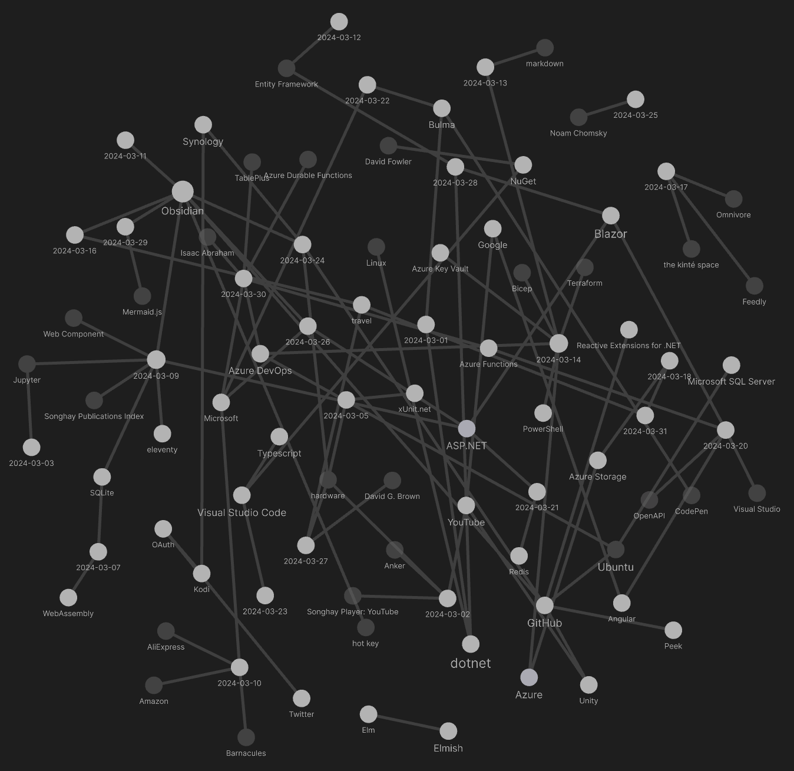
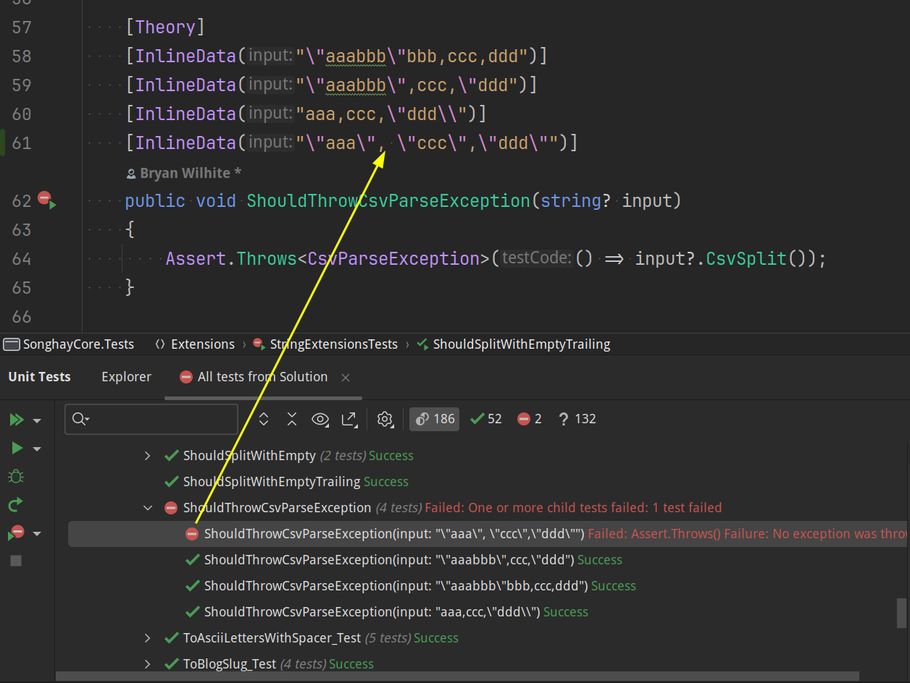
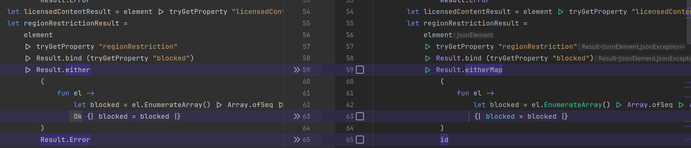
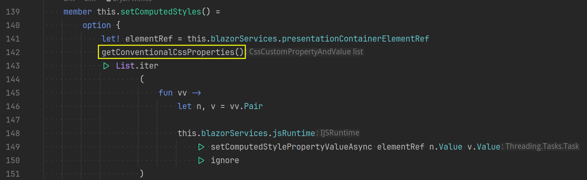
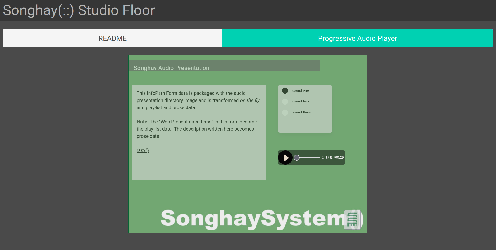
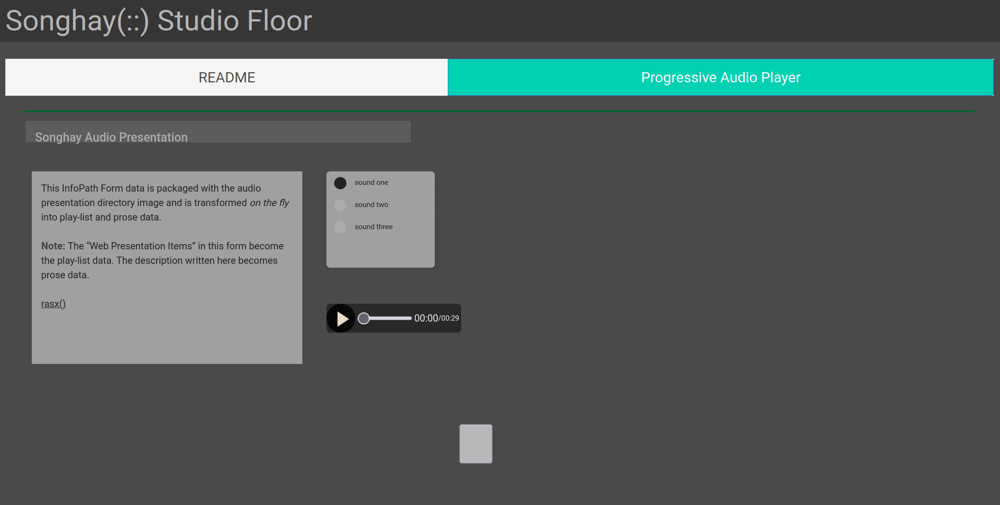

---json
{
  "documentId": 0,
  "title": "studio status report: 2024-04",
  "documentShortName": "2024-04-28-studio-status-report-2024-04",
  "fileName": "index.html",
  "path": "./entry/2024-04-28-studio-status-report-2024-04",
  "date": "2024-04-28T19:48:38.265Z",
  "modificationDate": "2024-04-28T19:48:38.265Z",
  "templateId": 0,
  "segmentId": 0,
  "isRoot": false,
  "isActive": true,
  "sortOrdinal": 0,
  "clientId": "2024-04-28-studio-status-report-2024-04",
  "tag": "{\n  \"extract\": \"month 03 of 2024 was about finally completing Songhay.Player.YouTube release 6.3.1 📦🚀 Songhay.Player.YouTube 6.3.1 was released but it was immediately followed by release 6.3.2 because of a bug 🐛 related to the tabbing experience revealed in the Studio…\"\n}"
}
---

# studio status report: 2024-04

## month 03 of 2024 was about finally _completing_ `Songhay.Player.YouTube` release 6.3.1 📦🚀

`Songhay.Player.YouTube` 6.3.1 was [released](https://nuget.info/packages/Songhay.Player.YouTube/6.3.1) _but_ it was immediately followed by release 6.3.2 because of a bug 🐛 related to the tabbing experience revealed in the Studio Floor. This bug also affected `Songhay.Player.ProgressiveAudio` (see issue [#17](https://github.com/BryanWilhite/Songhay.Player.ProgressiveAudio/issues/17)) which resulted in a [version 6.1.5 release](https://nuget.info/packages/Songhay.Player.ProgressiveAudio/6.1.5). The selection below of Obsidian notes go into detail on this bug.

But first, here is what month 04 looked like:

<div style="text-align:center">



</div>

The usual Microsoft suspects are floating around in there 🐠

## Songhay Player - YouTube (F♯): my `Option.ofResult` anti-pattern #to-do

This situation was made out of haste:

<div style="text-align:center">


</div>

All of the `.fromInput` calls might dutifully return a `JsonException` but these would be swallowed by the abyss with `Option.ofResult` 😐

I would like to convert to option—but before I do that I would like to report on any exception. For the above, this would mean:

- replacing line 16 with `Option.either` from `FsToolkit.ErrorHandling` \[📖 [docs](https://demystifyfp.gitbook.io/fstoolkit-errorhandling/fstoolkit.errorhandling/result/eitherfunctions#result.either) \], returning `Some MyDomainData` or `None` (after ‘reporting the error’), respectively
- replacing lines 21 and 26 with `Option.eitherMap`, returning `Some TransformedDomainData` or `None` (after ‘reporting the error’), respectively

## Azure Functions: “.NET 6 reaches end of support on November 12, 2024” #to-do 

>Per the [.NET Official Support Policy](https://dotnet.microsoft.com/platform/support/policy), .NET 7 reaches end of support on May 14, 2024, and .NET 6 reaches end of support on November 12, 2024. You’ll want to update any applications targeting those versions to .NET 8 before the end of support. If you’re using .NET 7 on Azure Functions, you’re already using the isolated worker model, and you should [update your apps on the isolated worker model to .NET 8](https://aka.ms/azure-functions/dotnet/version-upgrade). The same instructions apply for .NET 6 on the isolated worker model.
>
>—“[.NET on Azure Functions – March 2024 roadmap update](https://techcommunity.microsoft.com/t5/apps-on-azure-blog/net-on-azure-functions-march-2024-roadmap-update/ba-p/4097744)”
>

## Songhay Core (C♯): <acronym title="Comma-Separated Values">CSV</acronym>and whitespace

The #day-job has shown me that the following <acronym title="Comma-Separated Values">CSV</acronym>line can be problematic:

```plaintext
"\"aaa\", \"ccc\",\"ddd\""
```

…while this one is fine:

```plaintext
"\"aaa\",\"ccc\",\"ddd\""
```

The `ShouldThrowCsvParseException` test does _not_ throw an exception (but it should) #to-do:

<div style="text-align:center">



</div>

This whitespace issue has been quite pervasive. In “[Dealing with extra white spaces while reading CSV in Pandas](https://towardsdatascience.com/dealing-with-extra-white-spaces-while-reading-csv-in-pandas-67b0c2b71e6a),” Vaclav Dekanovsky invokes historical documents:

>My colleague says that .csv is not an essay so we don’t expect any blank spaces behind the commas (or any other separators). The same opinion had the creators of [rfc4180](https://tools.ietf.org/html/rfc4180) which is commonly understood as a guideline for CSV files. Still, the are inventive developers that feed the .csv exports with unnecessary white spaces. These extra characters are not only increasing the size of our data, but they can cause much bigger trouble.

## “Database anti-patterns”

>In the past few years I have been noticing an unsettling trend - software engineers are eager to use exotic “planet-scale” databases for pretty rudimentary problems, while at the same time not having a good grasp of the very powerful relational database engine they are likely already using, let alone understanding the technology’s more advanced and useful capabilities. The SQL layer is buried so deep beneath libraries and too clever by a half ORMs that it all just becomes high-level code.
>
>—[Andrei Taranchenko](https://renegadeotter.com/2023/11/12/your-database-skills-are-not-good-to-have.html) 
>

## FFmpeg 7.0 “Dijkstra” released

>A new major release, [FFmpeg 7.0 "Dijkstra"](https://ffmpeg.org//download.html#release_7.0), is now available for download. The most noteworthy changes for most users are a [native VVC decoder](https://ffmpeg.org//index.html#vvcdec) (currently experimental, until more fuzzing is done), [IAMF support](https://ffmpeg.org//index.html#iamf), or a [multi-threaded `ffmpeg` CLI tool](https://ffmpeg.org//index.html#cli_threading).
>
>This release is _not_ backwards compatible, removing APIs deprecated before 6.0. The biggest change for most library callers will be the removal of the old bitmask-based channel layout API, replaced by the `AVChannelLayout` API allowing such features as custom channel ordering, or Ambisonics. Certain deprecated `ffmpeg` CLI options were also removed, and a C11-compliant compiler is now required to build the code.
>
>As usual, there is also a number of new supported formats and codecs, new filters, APIs, and countless smaller features and bugfixes. Compared to 6.1, the `git` repository contains almost ∼2000 new commits by ∼100 authors, touching >100000 lines in ∼2000 files — thanks to everyone who contributed. See the [Changelog](https://git.videolan.org/?p=ffmpeg.git;a=blob_plain;f=Changelog;hb=n7.0), [APIchanges](https://git.videolan.org/?p=ffmpeg.git;a=blob_plain;f=doc/APIchanges;hb=n7.0), and the git log for more comprehensive lists of changes.
>
>—<https://ffmpeg.org//index.html#pr7.0>
>

## hardware: did Apple start their car project because of Xiaomi❓

<div style="text-align:center">

<figure>
    <a href="https://www.youtube.com/watch?v=DsiyB5Es32s">
        
    </a>
    <p><small>Xiaomi EV Launch March 2024</small></p>
</figure>

</div>

## Songhay Player - YouTube (F♯): I have discovered a use case for `Result.eitherMap`

<div style="text-align:center">



</div>

The use of `Result.eitherMap` from `FsToolkit.ErrorHandling` \[📖 [docs](https://demystifyfp.gitbook.io/fstoolkit-errorhandling/fstoolkit.errorhandling/result/eitherfunctions#result.eithermap) \] does the following:

- eliminates the need to use `Result.Ok`
- eliminates the need to use `Result.Error` (use `id` shorthand instead)

## Azure Batch is filed under “High-performance computing (HPC)” on Azure

>High-performance computing (HPC), also called "big compute", uses a large number of CPU or GPU-based computers to solve complex mathematical tasks.
>
>Many industries use HPC to solve some of their most difficult problems. These include workloads such as:
>
>- Genomics
>- Oil and gas simulations
>- Finance
>- Semiconductor design
>- Engineering
>- Weather modeling
>
>—“[Introduction to HPC](https://learn.microsoft.com/en-us/azure/architecture/topics/high-performance-computing)”
>

<div style="text-align:center">

<figure>
    <a href="https://www.youtube.com/watch?v=rKURT32faJk">
        
    </a>
    <p><small>Azure Essentials: High Performance Computing (HPC) options</small></p>
</figure>

</div>

## dotnet|.NET: the `Array.AsReadOnly<T>(T[])` method explains the difference between `Array<T>` and `ReadOnlyCollection<T>` #make-blog-post 

The `Array.AsReadOnly<T>(T[])` method \[📖 [docs](https://learn.microsoft.com/en-us/dotnet/api/system.array.asreadonly?view=net-8.0) \] explains _by its definition_ the difference between `Array<T>` and `ReadOnlyCollection<T>` because this method takes an array as input and returns `ReadOnlyCollection<T>`:

>To prevent any modifications to the array, expose the array only through this wrapper.
>
>A collection that is read-only is simply a collection with a wrapper that prevents modifying the collection; therefore, if changes are made to the underlying collection, the read-only collection reflects those changes.

It should be mentioned, that there is a `List<T>.AsReadOnly` method \[📖 [docs](https://learn.microsoft.com/en-us/dotnet/api/system.collections.generic.list-1.asreadonly?view=net-8.0) \] as well that _also_ returns `ReadOnlyCollection<T>`. There is an `AsReadOnly<TKey,TValue>(IDictionary<TKey,TValue>)` extension method \[📖 [docs](https://learn.microsoft.com/en-us/dotnet/api/system.collections.generic.collectionextensions.asreadonly?view=net-8.0) \] for `IDictionary<TKey,TValue>` but it returns `ReadOnlyDictionary<TKey,TValue>`.

## Blazor/Bolero the `setComputedStylePropertyValueAsync` bug 🐛

Calling `setComputedStylePropertyValueAsync` for custom <acronym title="Cascading Style Sheets">CSS</acronym>properties that do not exist are _not_ ignored. I strongly suspect that this causes the entire Blazor app to freeze 🧊 without throwing any error in the browser console.

In Songhay Player - YouTube (F♯), I have lost about two weeks with this alleged bug in my `setComputedStyles` member:

<div style="text-align:center">



</div>

Instead of calling `getConventionalCssProperties()` as shown (which works), I had this:

```fsharp
let cssProperties =
    if model.hasSomeState then
        getConventionalCssProperties() @ model.moreProperties
    else
        getConventionalCssProperties()
```

I thought it would be harmless to tack on `moreProperties` which were passed to `setComputedStylePropertyValueAsync` 😐 Wrong.

## tools mentioned in “How I'm Writing CSS in 2024”

“[How I'm Writing CSS in 2024](https://leerob.io/blog/css)” mentions:

- <https://stylexjs.com/>
- <https://lightningcss.dev/>

>CSS in 2024 is amazing.
>
>- Cross-browser support for [nesting](https://caniuse.com/css-nesting), [:has()](https://caniuse.com/css-has), [container queries](https://caniuse.com/css-container-queries), and more¹
>- [Powerful](https://stylexjs.com/) and [fast](https://lightningcss.dev/) new CSS tools
>- Many frameworks and compilers to help optimize CSS loading performance
>

Also, <https://codesandbox.io/>goes unmentioned.

## dotnet|.NET: “Glutinum, a new era for Fable bindings”

First, Fable should not get lost inside of the world of React. In the context of this Studio, Fable could allow me to write Typescript and even Python via F♯. So, when Mangel Maxime writes in “[Glutinum, a new era for Fable bindings](https://fable.io/blog/2024/2024-01-01-Glutinum_a_new_era.html)”:

>Thanks to new innovations in Fable, and after working on 20+ bindings, I am now ready to say it is possible to provide near native F# experience while staying close to the original JavaScript API.
>
>The former allows F# developers to consume bindings with minimal friction. While the later makes it easier to re-use knowledge and documentation coming from the original JavaScript community.
>
>With this confirmation, I started prototyping a new tool to convert TypeScript definitions to F#.
>

Mangel Maxime is saying (effectively) that you can write new stuff you would write in Typescript in F♯—and convert all the stuff you wrote in Typescript to F♯. For more, see “[What is Fable?](https://adabeat.com/fp/what-is-fable/)”

## Bolero: the tab <acronym title="User Experience">UX</acronym>built by this Studio breaks patterns based on `HtmlRef` 😐

The tab experience in this Studio is _the foundation_ of the Songhay Studio Floor. We can see this in the Floor built for Songhay Player - Progressive Audio (F♯):

<div style="text-align:center">



</div>

However, _for months_ I have failed to notice that tabbing over to **README** and then back to the **Progressive Audio Player** tab leaves us with this hot garbage 🔥🪰💩:

<div style="text-align:center">



</div>

The problem here is due to what is happening during tabbing:

>[!error]
>The current tabbing <acronym title="User Experience">UX</acronym>of this Studio breaks patterns based on `HtmlRef` because, like the <acronym title="Document Object Model">DOM</acronym>elements, `HtmlRef` instances are destroyed and replaced with _new_ instances.

My code is explicitly working against this reality with a pattern like this:

```fsharp
override this.View model dispatch =
    if model.blazorServices.myElementRef.IsNone then
        dispatch <| GotMyElementRef myElementRef
    else
        ()

```

The `override` above assumes that `myElementRef` needs to be captured _only once_ because the parent `ElmishComponent<_,_>` _should_ be loaded once—but this is _not_ the case when tabbing is added to the experience.

## Songhay Publications: “Adventures with the JavaScript Event Loop • Erin Zimmer • YOW! 2018”

<div style="text-align:center">

<figure>
    <a href="https://www.youtube.com/watch?v=pQH321TEnVw">
        
    </a>
    <p><small>Adventures with the JavaScript Event Loop • Erin Zimmer • YOW! 2018</small></p>
</figure>

</div>

- the browser is multi-threaded while the JavaScript Engine is single threaded

## ASP.NET: “Asp.Net Core Web API Security Checklist. TOP 3 Vulnerabilities And How To Fix Them” #day-job

<div style="text-align:center">

<figure>
    <a href="https://www.youtube.com/watch?v=bV8v8DzgAtg">
        
    </a>
    <p><small>Asp.Net Core Web API Security Checklist. TOP 3 Vulnerabilities And How To Fix Them</small></p>
</figure>

</div>

- Introducing OWASP: [00:29](https://www.youtube.com/watch?v=bV8v8DzgAtg&t=29s)
- How to fix “Broken object level authorization”: [02:59](https://www.youtube.com/watch?v=bV8v8DzgAtg&t=179s)
- How to fix “Broken function level authorization”: [09:08](https://www.youtube.com/watch?v=bV8v8DzgAtg&t=548s)
- How to fix “SQL injection”: [13:19](https://www.youtube.com/watch?v=bV8v8DzgAtg&t=799s)

Building around the `IAuthorizationRequirement` interface \[📖 [docs](https://learn.microsoft.com/en-us/dotnet/api/microsoft.aspnetcore.authorization.iauthorizationrequirement?view=aspnetcore-8.0) \] is key 🔑 for the “Broken object level authorization” fix #to-do

## Songhay Publications: the Gifski experiment was a resounding success 🌻

Here is the current screen-capture #publishing-pipeline:

1. capture to `*.webm` on the Ubuntu desktop (making sure **Show Pointer** is enabled)
2. convert the `*.webm` to a `*.gif` animation with Gifski
3. move the `*.gif` file into the conventional `.github/bitmaps` directory and `git commit`

The [command](https://snapcraft.io/install/gifski/ubuntu) to install Gifski:

```bash
sudo snap install gifski
```

Here is the final Gifski command for a `*.webm` file (1283×768) on my desktop:

```bash
gifski \
    --fps 5 \
    --width 960 \
    --motion-quality 27 \
    --quality 67 \
    --extra \
    --output anim.gif \
    Screencast\ from\ 04-17-2024\ 11:06:43\ PM.webm
```

This outcome follows up my 2024-01-20#Songhay Publications will Gifski help Peek ❓|month 1 note 📓✅ and leads to the following questions:

>[!question]
>Can READMEs on nuget.org support the `video` element and the `*.mp4` format?
>

This is asked because the `*.mp4` screen-capture videos for Visual Studio Code are crisp and clean! I assume they were captured on a Macintosh or a Windows desktop.

The answer to this question should be found under “[Write a high-quality README for NuGet packages](https://devblogs.microsoft.com/nuget/write-a-high-quality-readme-for-nuget-packages/)” which links to “[Package readme on NuGet.org](https://learn.microsoft.com/en-us/nuget/nuget-org/package-readme-on-nuget-org#supported-markdown-features)” but, as of today, this is not actually the case 😐

>[!question]
>Can `*.gif` animations be converted to the WebP format from Google?

There is an answer to this question “[Animated WebP – how to convert animated GIF to WebP and save up to 90% bandwidth](https://cloudinary.com/blog/animated_webp_how_to_convert_animated_gif_to_webp_and_save_up_to_90_bandwidth)” that involves the entirety of Cloudinary 😐

## Bolero: I am satisfied with the new `ElmishComponentHtmlRefPolicy` ✅

My suggested fix for [issue #17](https://github.com/BryanWilhite/Songhay.Player.ProgressiveAudio/issues/17) of Songhay Player - Progressive Audio (F♯) has been updated to a pattern that replaces the Boolean approach with a full blown <acronym title="Discriminated Union">DU</acronym>:

```fsharp
namespace Songhay.Modules.Bolero.Models

type ElmishComponentHtmlRefPolicy =
    | DispatchForEveryView
    | DoNotDispatch

    member this.Evaluate (dispatch: Elmish.Dispatch<'message>) (message: 'message) condition =
        match this with
        | DispatchConditionally ->if condition then dispatch message
        | DispatchForEveryView ->dispatch message
        | DoNotDispatch ->()
```

This `ElmishComponentHtmlRefPolicy` type make this clarity possible:

<div style="text-align:center">


</div>

Instead of passing just `true` or `false` to our conventional `.EComp` member, we have more expressive power with more explicit intent:

```fsharp
PlayerElmishComponent.EComp DispatchForEveryView model.paModel (ProgressiveAudioMessage >>dispatch)
```

## sketching out development projects

The current, unfinished public projects on GitHub:

- replacing the Angular app in `http://kintespace.com/player.html` with a Bolero app 🚜🔥 depends on:

  - ~~finishing the `Songhay.Player.YouTube` release 6.3.1~~ 📦🚀 [project](https://github.com/users/BryanWilhite/projects/29)
- completing the `Songhay.Publications` 6.1.0 📦🚀 [project](https://github.com/users/BryanWilhite/projects/24)
- start the “`Songhay.Publications.Models` 6.0.0” 📦🚀 [project](https://github.com/users/BryanWilhite/projects/23/views/1)

The proposed project items:

- add Entity Framework (over SQLite) features to `Songhay.Publications`
- generate Publication indices from SQLite for `Songhay.Publications.KinteSpace`
- generate a new repo with proposed name, `Songhay.Modules.Bolero.Index` ✨🚧 and add a GitHub Project
- switch Studio from Material Design to Bulma 💄 ➡️ 💄✨

<https://github.com/BryanWilhite/>
