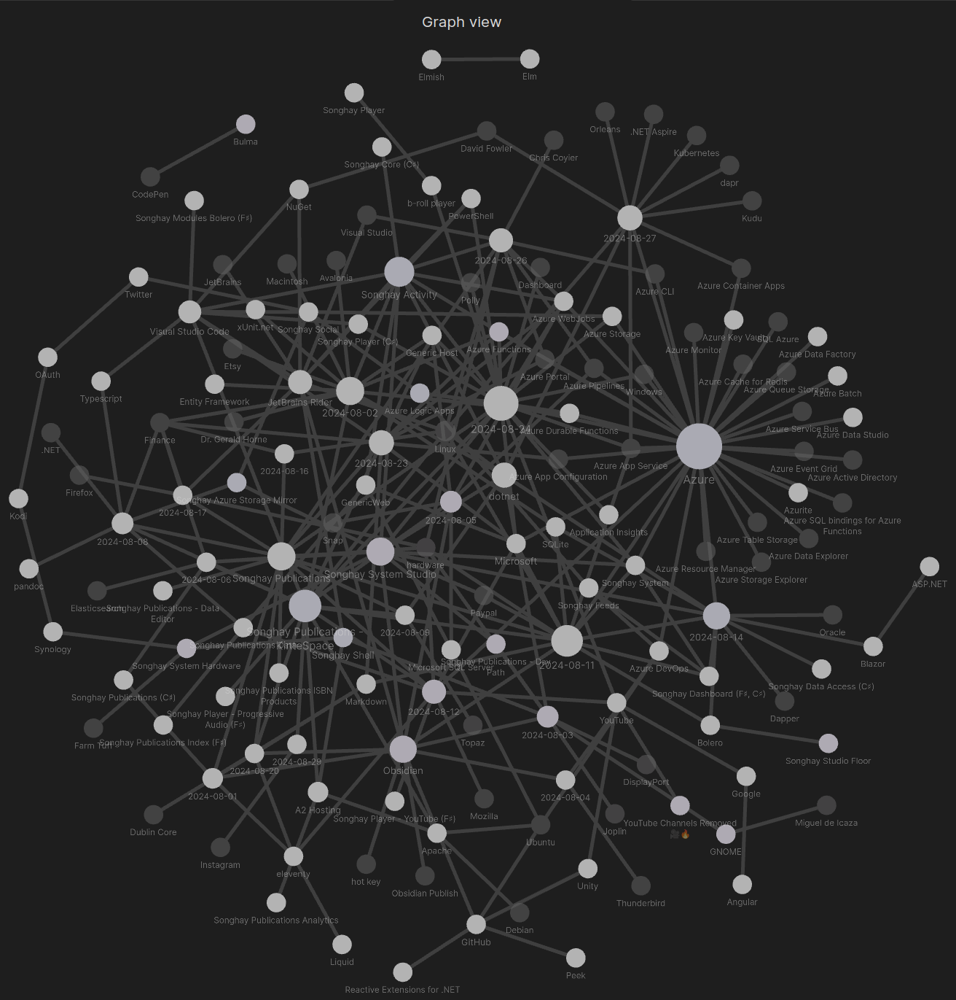
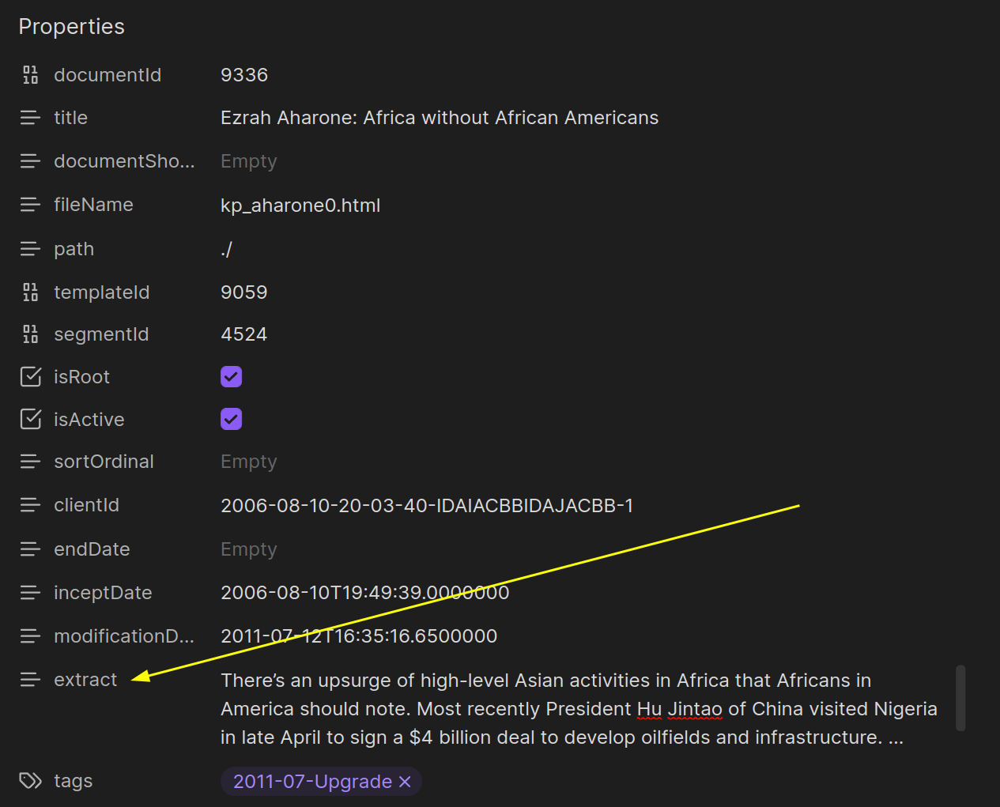

---json
{
  "documentId": 0,
  "title": "studio status report: 2024-08",
  "documentShortName": "2024-08-29-studio-status-report-2024-08",
  "fileName": "index.html",
  "path": "./entry/2024-08-29-studio-status-report-2024-08",
  "date": "2024-08-29T19:00:11.949Z",
  "modificationDate": "2024-08-29T19:00:11.949Z",
  "templateId": 0,
  "segmentId": 0,
  "isRoot": false,
  "isActive": true,
  "sortOrdinal": 0,
  "clientId": "2024-08-29-studio-status-report-2024-08",
  "tag": "{\n  \u0022extract\u0022: \u0022month 08 of 2024 was about prepping an Obsidian-based kintespace.com and #day-job Azure success Last month was about deciding and planning to live with the SQLite flavor of Entity Framework with Obsidian-based word processing and Markdown data management.\\u2026\u0022\n}"
}
---

# studio status report: 2024-08

## month 08 of 2024 was about prepping an Obsidian-based kintespace.com and #day-job Azure success

Last month was about deciding and planning to live with the SQLite flavor of Entity Framework with Obsidian-based word processing and Markdown data management. This month about actually _living_ that life. And, apart from a serious, personal, family issue, this new life is far the more better.

The Obsidian graph of my Studio notes shows the biggest light-colored circles of study that match what this month is about:

<div style="text-align:center">



</div>

- Azure
- Songhay Publications: KinteSpace
- Songhay Activity

These ‘big three’ should appear in the selected notes below:

### using `div` to apply <acronym title="Cascading Style Sheets">CSS</acronym> classes

As of this writing, [[Obsidian]] will stop rendering text as [[Markdown]] once an opening <acronym title="HyperText Markup Language">HTML</acronym> tag is encountered:

<div>

🍱 This paragraph is treated as raw <acronym title="HyperText Markup Language">HTML</acronym>. This means [[Markdown]] markup is treated as _literal_.

</div>

### <acronym title="Cascading Style Sheets">CSS</acronym> grid layout

<acronym title="Cascading Style Sheets">CSS</acronym> grid layout has the same limitations as those addressed in “[[#using `div` to apply <acronym title="Cascading Style Sheets">CSS</acronym> classes|using div to apply CSS classes]].”

### [[Obsidian]] notice blocks and `blockquote` translation

The `div` problem exposed in “[[#using `div` to apply <acronym title="Cascading Style Sheets">CSS</acronym> classes|using div to apply CSS classes]]” leads to one solution: <mark>use notice blocks</mark> 😐 By default, the following [[Markdown]]:

>[!important]
>Hello world!

…will be translated into <acronym title="HyperText Markup Language">HTML</acronym> as:

```html
<blockquote>
    <p>[!important] Hello world!</p>
</blockquote>
```

The bang prefix, `[!important]`, is a declaration that the `blockquote` element \[📖 [docs](https://developer.mozilla.org/en-US/docs/Web/HTML/Element/blockquote) \] is no longer a `blockquote` element. In this Studio, it should render as:

```html
<div class="important">
    <p> Hello world!</p>
</div>
```

Can [[eleventy]] handle this and/or should this go into [[Songhay Publications (C♯)]]? #to-do

## [[Songhay System Studio]]: #day-job disagreements

There are two, ‘official’ technical disagreements between my Studio and the management of the current #day-job:

1. do not use ordered tests to develop [[Azure WebJobs]] executables
2. prefer the use of [[Microsoft SQL Server]] `LocalDB` files over <acronym title="JavaScript Object Notation">JSON</acronym> snapshots

### do not use ordered tests to develop [[Azure WebJobs]] executables

The legitimate concern for advising against this use of ordered tests is because what can happen when an [[Azure Pipelines]] <acronym title="YAML Ain’t Markup Language">YAML</acronym> script does a wildcard selection of _all_ tests in a solution. These ordered tests can run and potentially cause havoc <mark>when we assume the tests themselves have no defenses against being called</mark> based on environment.

One way to address this concern is to have some kind of “scratchpad” location on the desktop, that is separate from the enterprise repo, where a bunch of console apps are hanging out. I dislike this approach because this “scratchpad” location is likely not under source control, making the communication of any bright ideas to even a small team not easy. Additionally, the desktop were all these console apps can be lost which could be a tragedy for those of us with bad luck 🚫🍀

My preference for this use of ordered tests is the closest I have come to “test-driven development” which strongly suggests that these ordered tests should be temporary and wired up to a development environment. These ordered tests are effectively a factory assembly line, helping to build “logic” that will ultimately end up in production code, specifically [[Generic Host|.NET Generic Host]] executables.

### prefer the use of [[Microsoft SQL Server]] `LocalDB` files over <acronym title="JavaScript Object Notation">JSON</acronym> snapshots

The preference for “mocking” with `LocalDB` indicates a Windows-centric heritage is at play. My preference for <acronym title="JavaScript Object Notation">JSON</acronym> snapshots is _not_ scalable by default and is simply culturally strange with respect to ‘the state of the art.’

## [[Songhay Publications (C♯)]]: more chaos—we’re going to need a `PublicationLinesUtility`🚜✨😐

I was going to call it `MarkdownUtility` but that would really confuse it with the already existing `MarkdownEntryUtility` \[🔗 [GitHub](https://github.com/BryanWilhite/Songhay.Publications/blob/a80ad94e24d2ccc42962f646647457816714df84/Songhay.Publications/MarkdownEntryUtility.cs) \]. This concept of _Publication Lines_ is _now_ the smallest unit of the `Fragment`. Instead of:

- Segment
- Document
- Fragment

We have (for text-based Publications):

- Segment
- Document
- Lines (`Array<string>`)
  - Front Matter lines (which can refer back to Document)
  - Markdown Content lines

>[!important]
>The first responsibility of `PublicationLinesUtility` is to capture and centralize the logic used to produce a Document extract.

<div style="text-align:center">



</div>

## [[Songhay Publications - KinteSpace|the kinté space]]: `FileName` `kp_aharone21.html` is assigned to two different documents 😐👴

When we view <http://kintespace.com/kp_aharone21.html> we see document `13013`, “Ezrah Aharone: The Legend of Lincoln Unchained”:

<div style="text-align:center">


</div>

>[!error]
>The publisher of [[Songhay Publications - KinteSpace|kintespace.com]] (me) effectively used “Ezrah Aharone: The Legend of Lincoln Unchained” to overwrite document `9992`, “Ezrah Aharone: The Freedom and Curse to Bear Arms.” According to the [[Songhay Publications Data]], this accident took place on 2015-04-01 11:38:51.533—<mark>almost a decade ago</mark>👴

The original `Fragment` for `9992` is preserved in the [[Songhay Azure Storage Mirror]]:

<div style="text-align:center">


</div>

The `Fragment` for “Ezrah Aharone: The Freedom and Curse to Bear Arms” needs to be ‘appended’ to the end of `kp_aharone*.html` documents with [[pandoc]] #to-do

## [[dotnet|.NET]]: the brutal, expensive, #day-job  alternative to logging…

…is throwing an exception with detailed information—the same information that you would log. Sometimes installing logging is not readily available because:

- in a <acronym title="Dependency Injection">DI</acronym> situation, injecting `ILogger` in the constructor of some parent class that was not in the container in the first place might break things when ‘this class is used all over the place’
- passing `ILogger` in some parent method to multiple child levels of a harrowing call stack can be tedious—and can be even more frustrating when changing a method signature breaks an interface implementation

So the quick and dirty alternative is something like:

```csharp
try
{
//...
}
catch
{
    throw new DataException($"Hey! {x} casued this!");
}
```

…where `x` provides the detail that null-reference or sequence-contains-no-elements (<acronym title="Language Integrated Query">LINQ</acronym>) exceptions fail to provide. The `try`-`catch` block should be very small—preferably one-line.

The desire to wrap a line of code like this also comes from not wanting to build out permutations for handling `null`. Again, in the world of <acronym title="Language Integrated Query">LINQ</acronym>, sometimes returning with `.Single()` instead of `.SingleOrDefault()` is ‘easier’ to maintain because the violent throwing of an exception with tons of information is faster to detect than the silent killing that can occur from handling `null` (without logging).

Ideally, this quick and dirty programming should be a last resort to deal with code that should be progressively replaced.

## [[Songhay Publications|Publications]]: <acronym title="Cascading Style Sheets">CSS</acronym> relative colors

<acronym title="Cascading Style Sheets">CSS</acronym> relative colors \[📖 [docs](https://developer.mozilla.org/en-US/docs/Web/CSS/CSS_colors/Relative_colors) \] are explained relatively well by [[Mozilla]]:

>The [CSS colors module](https://developer.mozilla.org/en-US/docs/Web/CSS/CSS_colors) defines **relative color syntax**, which allows a CSS [`<color>`](https://developer.mozilla.org/en-US/docs/Web/CSS/color_value) value to be defined relative to another color. This is a powerful feature that enables easy creation of complements to existing colors — such as lighter, darker, saturated, semi-transparent, or inverted variants — enabling more effective color palette creation.

This video demos what is going on:

<div style="text-align:center">

<figure>
    <a href="https://www.youtube.com/watch?v=gPacarD9NuA">
        
    </a>
    <p><small>Relative colors make so many things easier!</small></p>
</figure>

</div>

## [[eleventy]]: the permalink and “cool <acronym title="Universal Resource Identifier">URI</acronym>”

Once we understand what [templates](https://www.11ty.dev/docs/templates/) are—and how many template ‘languages’ [[eleventy]] supports—then the next important concept to understand is the _permalink_ \[📖 [docs](https://www.11ty.dev/docs/permalinks/) \].

By default, when the input is a template, `thing.njk`, the output is `_site/thing/index.html` which means a “cool <acronym title="Universal Resource Identifier">URI</acronym>” \[📖 [docs](https://www.11ty.dev/docs/permalinks/#cool-uris-dont-change) \] can be used: `./thing/`. One reason why this is “cool”🧊🔗 is because a file extension is missing.

In this Studio, [[Songhay Publications - KinteSpace|the kinté space]] uses the `.html` file extension. This means that the [[eleventy]]-based pipeline for [[Songhay Publications - KinteSpace|kintespace.com]] has to work _against_ a fundamental concept in [[eleventy]] 😐 Others on the planet 🌏 have had this same problem. The following links provide hints:

- <https://github.com/11ty/eleventy/issues/1072#issuecomment-744076816>
- <https://stackoverflow.com/a/67678809/22944>
- <https://github.com/11ty/eleventy/issues/1199#issuecomment-633230282>

These hints make the following points:

1. use the `permalink` property in an input-folder <acronym title="JavaScript Object Notation">JSON</acronym> file \[📖 [docs](https://www.11ty.dev/docs/data-template-dir/) \]
2. optionally or consecutively, use the `permalink` property in <acronym title="YAML Ain’t Markup Language">YAML</acronym> front matter on the document level
3. be aware of the `page` variable supplied by [[eleventy]] \[📖 [docs](https://www.11ty.dev/docs/data-eleventy-supplied/) \], specifically the `page.filePathStem` property
4. filter functions \[📖 [docs](https://www.11ty.dev/docs/filters/) \] are used to transform the `page.filePathStem` property
5. the `_data/eleventyComputed.js` global data file \[📖 [docs](https://www.11ty.dev/docs/data-computed/) \] can be used at the end of the data cascade to calculate the `permalink` property

All of these points provide great background information but all we need for the [[Songhay Publications - KinteSpace|kintespace.com]] `permalink` issue are points _3_ and _5_ which lead to an `11ty/_data/eleventyComputed.js` with the following content:

```javascript
module.exports = {
    permalink: (data) => {
        return `${data.page.fileSlug}.html`;
    }
};
```

BTW: the `.eleventy.js` file for [[Songhay Publications - KinteSpace|kintespace.com]] looks like this:

```javascript
module.exports = function (config) {
    return {
        dir: {
            input: '.',
            output: '../app-staging',
        },
        htmlTemplateEngine: 'liquid',
        markdownTemplateEngine: 'liquid',
        templateFormats: ['html', 'md', 'css', 'liquid']
    };
};
```

Modern [[eleventy]] expects most developers to _not_ use an `.eleventy.js` file at all!

>Configuration files are optional.
>
>—<https://www.11ty.dev/docs/config/>
>

## [[Azure WebJobs]] at the #day-job 🚋✨

Today marks the deployment of a console app as a [[Azure WebJobs|WebJob]] at the #day-job This console app is designed under the [[Generic Host|.NET Generic Host]] conventions from [[Microsoft]]. This is a new product from my Studio!

The [[Generic Host|.NET Generic Host]] console app as a [[Azure WebJobs|WebJob]] serves as a cloud-based replacement for on-premise console apps running on a beefy-but-single server, maintained by on-premise IT staff. This replacement was needed for the #day-job and it has been supplied!

This #day-job situation shows how [[Azure WebJobs]] and [[Azure Functions]] are _actually_ being used:

- [[Azure Functions]] is being used as a serverless Web <acronym title="Application Programming Interface">API</acronym>.<sup>1</sup>
- [[Azure WebJobs]] is being used as a back-office workload platform.

- - -
<sup>1</sup> <small>This is one step above using virtual applications ‘underneath’ a beefy Azure App Service.</small>

The development beyond the current situation includes:

- centralizing app settings with [[Azure App Configuration]]
- coordinating/synchronizing on-premise workloads with [[Azure WebJobs|WebJobs]]

## open pull requests on GitHub 🐙🐈

- <https://github.com/BryanWilhite/Songhay.HelloWorlds.Activities/pull/14>
- <https://github.com/BryanWilhite/Songhay.DataAccess/pull/13>
- <https://github.com/BryanWilhite/dotnet-core/pull/67>

## sketching out development projects

The current, unfinished public projects on GitHub:

- replacing the Angular app in `http://kintespace.com/player.html` with a Bolero app 🚜🔥 depends on:

  - completing [issue #54](https://github.com/BryanWilhite/Songhay.Publications/issues/54): move `Songhay.Publications.DataAccess` out of the kinté space repo 🚜
  - generating Publication indices from SQLite for `Songhay.Publications.KinteSpace`
  - generating a new repo with proposed name, `Songhay.Modules.Bolero.Index` ✨🚧 and add a GitHub Project

The proposed project items:

- switch Studio from Material Design to Bulma 💄 ➡️ 💄✨

🐙🐈<https://github.com/BryanWilhite/>
