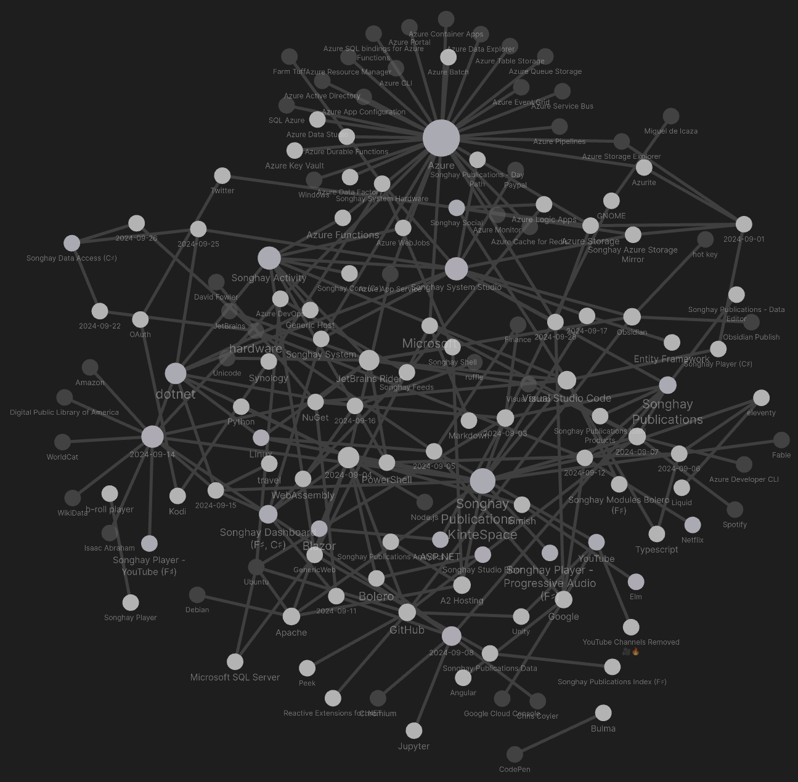

---json
{
  "documentId": 0,
  "title": "studio status report: 2024-09",
  "documentShortName": "2024-09-28-studio-status-report-2024-09",
  "fileName": "index.html",
  "path": "./entry/2024-09-28-studio-status-report-2024-09",
  "date": "2024-09-28T14:49:37.749Z",
  "modificationDate": "2024-09-28T14:49:37.749Z",
  "templateId": 0,
  "segmentId": 0,
  "isRoot": false,
  "isActive": true,
  "sortOrdinal": 0,
  "clientId": "2024-09-28-studio-status-report-2024-09",
  "tag": "{\n  \u0022extract\u0022: \u0022month 09 of 2024 was about the first Songhay.DataAccess release in over three years and completing the migration to markdown for Songhay.Publications.KinteSpace NuGet package Songhay.DataAccess was updated to the .NET 6.0 time-frame this Studio is living \\u2026\u0022\n}"
}
---

# studio status report: 2024-09

## month 09 of 2024 was about the first `Songhay.DataAccess` release in over three years and completing the migration to markdown for `Songhay.Publications.KinteSpace`

NuGet [package](https://www.nuget.org/packages/Songhay.DataAccess) `Songhay.DataAccess` was updated to the .NET 6.0 time-frame this Studio is living in at the moment. This is a major achievement, a strategic side effect of the day-job situation I have had the privilege to experience for about three years. From the .NET-centered enterprise point of view, this late release of `Songhay.DataAccess` can be considered strange. I remind myself of at least two factors for this strangeness:

1. previous day jobs did not position me to work on Entity Framework and ADO.NET so directly
2. I personally failed to keep track of the SQLite world (after being disappointed by it years ago)

[PR #13](https://github.com/BryanWilhite/Songhay.DataAccess/pull/13) absorbs most of the activity around `Songhay.DataAccess` so my Obsidian graph of my Studio notes does not reflect the true size of the effort:

<div style="text-align:center">



</div>

This `Songhay.DataAccess` release further emphasizes the new Songhay Publications ‘lifestyle’ of this Studio. Acclamation is underway… The second major accomplishment of the month is a serious investment in this Songhay Publications ‘lifestyle’: the migration to markdown for `Songhay.Publications.KinteSpace` is complete 🎊 This accomplishment means that this Studio no longer uses Microsoft Word for daily-driving word processing. The establishment of markdown as the word-processing file format of the Studio means Obsidian (and a host of other tools) more-than-effectively replaces my 20<sup>th</sup>-century thinking about publishing. More on this later. Meanwhile, selected notes show what else was going on for the month:

## [[ASP.NET]] health checks #day-job #to-do

This video does a great job explaining how to use custom classes that implement the `IHealthCheck` interface and/or installing a bunch of [[NuGet]] packages to get pretty much the same thing:

<div style="text-align:center">

<figure>
    <a href="https://www.youtube.com/watch?v=4abSfjdzqms">
        
    </a>
    <p><small>How to Add Health Checks in ASP.NET Core</small></p>
</figure>

</div>

## [[Songhay Publications - KinteSpace|Songhay Publications: kinté space]] has another [[eleventy]] milestone 👣🪨

<div style="text-align:center">


</div>

<https://stackoverflow.com/a/10181488/22944>

>I needed a way to call a Powershell script from Node. Node provides `child_process` module, which provides tools to execute and communicate with external processes.
>
>—<https://abdus.dev/posts/running-powershell-script-in-node/>
>

>[!question]
>Can [[eleventy]] use node to call out to [[PowerShell]] from a [filter](https://www.11ty.dev/docs/filters/) without severe sacrifices to performance? #to-do
>

A _yes_ answer means yet another [[eleventy]] milestone 👣🪨 has been reached. A _no_ (or _not preferred_) answer suggests something like [[Fable]]-generated JavaScript can be called from [[eleventy]]. The assumed last resort is resorting to [[Typescript]].

## [[Songhay Publications - KinteSpace|Songhay Publications: kinté space]]

### the ‘presentation restoration operations’ are complete ✅

Looks like [[2024-08-12#Songhay Publications - KinteSpace kintespace.com `p_aja_monet.html` reminds me of what I used “presentation pages” for…|this]] took about 30 days?

<div style="text-align:center">


</div>

>[!important]
>In this Studio, a repository of markdown replaces the [[Microsoft]] monopoly of the word processing document.

## the [[Azure Developer CLI]] is mostly for [[GitHub]]? #to-do

>The Azure Developer CLI (azd) is an open-source tool that accelerates your path from a local development environment to Azure. `azd` provides best practice, developer-friendly commands that map to key stages in your workflow, whether you're working in the terminal, your editor or integrated development environment (IDE), or CI/CD (continuous integration/continuous deployment).
>
> You can use `azd` with [extensible blueprint templates](https://learn.microsoft.com/en-us/azure/developer/azure-developer-cli/azd-templates) that include everything you need to get an application up and running on Azure. These templates include reusable infrastructure as code assets and proof-of-concept application code that can be replaced with your own app code. You can also [create your own template](https://learn.microsoft.com/en-us/azure/developer/azure-developer-cli/make-azd-compatible?pivots=azd-create) or find one to [build upon](https://learn.microsoft.com/en-us/azure/developer/azure-developer-cli/make-azd-compatible?pivots=azd-convert).
>
>—“[What is the Azure Developer CLI?](https://learn.microsoft.com/en-us/azure/developer/azure-developer-cli/overview)”
>

<div style="text-align:center">

<figure>
    <a href="https://www.youtube.com/watch?v=9z3PiHSCcYs">
        
    </a>
    <p><small>Azure Developer CLI: GitHub to cloud in minutes - Universe 2022</small></p>
</figure>

</div>

## [[Songhay Publications|Publications]]: <acronym title="Graphics Interchange Format">GIF</acronym> playback is _still_ not a standard feature of browsers ⏰😐

This 2019 article recommends [Freezeframe.js](https://github.com/ctrl-freaks/freezeframe.js):

>As far as I can tell, there’s no programmatic way to pause a GIF and have it still be the same GIF file in an ‘img’ tag in the browser.  You can hide it and replace it with a static image.  Or you can replace it with some other kind of animating element (such as a canvas, or CSS animation).  But there are libraries or code snippets available for doing these things.
>…
>HTML5 has a [‘video’](https://developer.mozilla.org/en-US/docs/Web/HTML/Element/video) tag that allows playback and pausing. However, GIFs (which would be a media type of “image/gif” in the ‘source’ tag)  aren’t supported.  A [tutorial on HTML5 video](https://developers.google.com/web/fundamentals/performance/optimizing-content-efficiency/replace-animated-gifs-with-video/) says to convert them from GIF to a video format using ffmpeg, which can be run from the command line.
>
>—“[Options for Pausing the Animation of GIFs](https://dking.org/blog/2019/04/options-for-pausing-the-animation-of-gifs/)” (2019)
>

A SuperUser [answer](https://superuser.com/a/1435047) from over seven years ago refers to two [[Chromium]] extensions:

1. [**GIF Scrubber**](https://chrome.google.com/webstore/detail/gif-scrubber/gbdacbnhlfdlllckelpdkgeklfjfgcmp?hl=en)
2. [**Play the GIF**](https://chrome.google.com/webstore/detail/play-the-gif/mchecalpedamcfhiadokofgomojakmki)

A 2020 [[Chris Coyier]] article, “[Pausing a GIF with details/summary](https://css-tricks.com/pause-gif-details-summary/)” reveals that the <acronym title="Cascading Style Sheets">CSS</acronym>-based approach “pauses” <acronym title="Graphics Interchange Format">GIF</acronym> animation by covering it with a still:

>Steve Faulkner has a clever idea [here](https://codepen.io/stevef/pen/ExPdNMM). You can show an (animated) GIF and overlay a pause/play button on top of it — which is really a `<details>`/`<summary>` element. When toggled, a (non-animated) JPG inside covers the GIF, effectively “pausing” it.

The [[Jupyter|Jupyter Notebook]] world provides exactly what I am looking for, according to a StackOverflow [answer](https://stackoverflow.com/a/67033032/22944):

<div style="text-align:center">


</div>

And then there is the online <acronym title="Graphics Interchange Format">GIF</acronym> player such as:

>Our GIF player allows you to upload your GIF or a paste the URL of any GIFs online and view the GIF frame by frame, as well as split a specific frame from the animation. You can choose any playback animation speed, play and pause the GIF at any moment, and choose which frame to cut, freeze, or capture. You can then download all the GIF frames in a ZIP file. With this level of control over the animation, you can use our GIF player for a variety of purposes, from analyzing the content to creating a new GIF. Give it a try, it’s free!
>
>—“[Free GIF Player and Viewer](https://gifyard.com/free-gif-player/)”
>

## [[Songhay Publications|Publications]]: “The History of Wikidata”

Built by [[Google]] employees:

<div style="text-align:center">

<figure>
    <a href="https://www.youtube.com/watch?v=P3-nklyrDx4">
        
    </a>
    <p><small>The History of Wikidata</small></p>
</figure>

</div>

## [[dotnet|.NET]]: “Entity Framework and F# – can they work together?”

[[Isaac Abraham]], his “[Entity Framework and F# – can they work together?](https://www.compositional-it.com/news-blog/entity-framework-and-fsharp-can-they-work-together/)” is not an introduction to any [[NuGet]] package for F♯ that addresses the issues brought up:

>- **Template pattern**. You need to override protected members to configure e.g. the connection string. Again, this is a very unusual approach to parameterisation in F# - if you had to use some kind of base class, you might want to just make it a simple bit of data that can be supplied on creation or as a specific method.
>- **Statement oriented**. Use of the `ignore` keyword. Since F# is expression-oriented and stricter about typing, it complains that `OnConfiguring` expects to return `unit` (`void` in C#), yet `UseSqlServer` returns something else - so you need to explicitly `ignore` it.
>- **Use of base class functionality**. This was especially insidious because all of the documentation for EF Core suggest that you can leave `DbSet` values as null and the base class will magically populate them for you. This is true, except F# auto-properties require a default value, which overrides EF's magic setting. Calling `base.Set` solves this problem (and also allows you to make the property read-only), but it took me a while to figure this out.
>- **Mutable types.** Your DbSet types (i.e. `Todo`) need to use `[<CLIMutable>]` in order for EF to work with them easily (which generates runtime mutable CLR properties for records). This is the sort of thing that will catch out a beginner to EF and / of F# every time.
>

## [[dotnet|.NET]]: <acronym title="Dependency Injection">DI</acronym> with Multiple Constructors?  Short answer: _do not do it_

Do not do it:

>…\[historically\] the built-in resolver doesn’t support types exposing multiple constructors…
>
>—<https://stackoverflow.com/a/32937952/22944>
>

This is the most conservative approach:

```csharp
services.AddScoped<IService>(provider => {
    var dependency = provider.GetRequiredService<IDependency>();

    // You can select the constructor you want here.
    return new Service(dependency, "my string parameter");
});
```

In the eight years since [this StackOverflow question](https://stackoverflow.com/questions/32931716/dependency-injection-with-multiple-constructors) was asked, we have this:

> ...support for multiple constructors was added in later versions, as indicated in the other answers. Now, the DI stack will happily choose the constructor with the most parameters it can resolve.
>

>[!important]
>However, I do _not_ want any doubt introduced with multiple constructors. I prefer the conservative approach shown above.
>

## [[Songhay Data Access (C♯)]]: I propose `CommonReaderUtility.GetReaderCommand` instead of `.GetReader` 🔨🔥

The uncomfortable design of `.GetReader` makes the disposal of `IDbCommand` on line 57 uncertain (or just not possible):

<div style="text-align:center">


</div>

Dropping a `using` statement on line 57 would return a _closed_ `IDataReader`. When `IDataReader` is eventually disposed by the caller, it might be possible that its `IDbCommand` would be disposed as well. To avoid hoping this is the case we can drop line 71 and `return selectCommand`. The bulk of this method is dedicated to setting up `selectCommand`; this looks like an opportunity to use only one, `new`, disposable instance per method.

## [[hardware]]: “7 INSANE Keyboards You Won’t Believe Exist!”

<div style="text-align:center">

<figure>
    <a href="https://www.youtube.com/watch?v=RASgUVU_P2s">
        
    </a>
    <p><small>7 INSANE Keyboards You Won’t Believe Exist!</small></p>
</figure>

</div>

## [[Songhay Data Access (C♯)]]: `IDataParameter` and `DataParameterMetadata`

I am guessing today that I defined `DataParameterMetadata` because `IDataParameter` did not exist at the time of definition (or was internal). Let’s compare:

```csharp
public class DataParameterMetadata
{
    public DataRowVersion DataRowVersion { get; set; } = DataRowVersion.Default;
    
    public DbType DbType { get; set; }
    
    public ParameterDirection ParameterDirection { get; set; } = ParameterDirection.Input;
    
    public string? ParameterName { get; set; }
    
    public object? ParameterValue { get; set; }
    
    public string? SourceColumn { get; set; }
}
```

```csharp
public interface IDataParameter
{
    DbType DbType { get; set; }
    
    ParameterDirection Direction { get; set; }
    
    bool IsNullable { get; }
    
    string ParameterName { get; [param: AllowNull] set; }
    
    string SourceColumn { get; [param: AllowNull] set; }
    
    DataRowVersion SourceVersion { get; set; }
    
    object? Value { get; set; }
}
```

The `IDbCommand.CreateParameter` method \[📖 [docs](https://learn.microsoft.com/en-us/dotnet/api/System.Data.IDbCommand.CreateParameter?view=net-6.0) \] returns an instance of `IDataParameter` (actually, it returns `IDbDataParameter` which extends `IDataParameter` 😐 \[📖 [docs](https://learn.microsoft.com/en-us/dotnet/api/System.Data.IDbDataParameter?view=net-6.0) \]). It is barely possible that this interface historically did not have the members that were defined for `DataParameterMetadata`.

>[!important]
>Consider marking `DataParameterMetadata` obsolete #to-do

## open pull requests on GitHub 🐙🐈

- <https://github.com/BryanWilhite/Songhay.HelloWorlds.Activities/pull/14>
- ~~<https://github.com/BryanWilhite/Songhay.DataAccess/pull/13>~~
- <https://github.com/BryanWilhite/dotnet-core/pull/67>

## sketching out development projects

The current, unfinished public projects on GitHub:

- replacing the Angular app in `http://kintespace.com/player.html` with a Bolero app 🚜🔥 depends on:

  - completing [issue #54](https://github.com/BryanWilhite/Songhay.Publications/issues/54): move `Songhay.Publications.DataAccess` out of the kinté space repo 🚜
  - generating Publication indices from SQLite for `Songhay.Publications.KinteSpace`
  - generating a new repo with proposed name, `Songhay.Modules.Bolero.Index` ✨🚧 and add a GitHub Project

The proposed project items:

- switch Studio from Material Design to Bulma 💄 ➡️ 💄✨

🐙🐈<https://github.com/BryanWilhite/>
