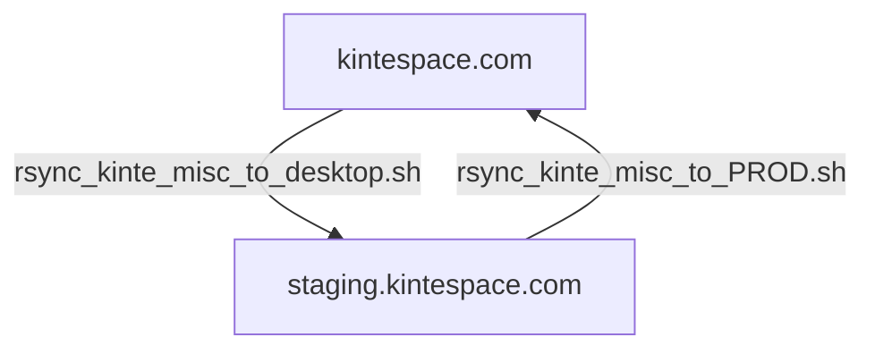
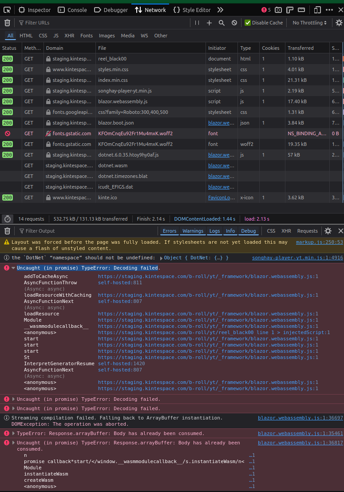
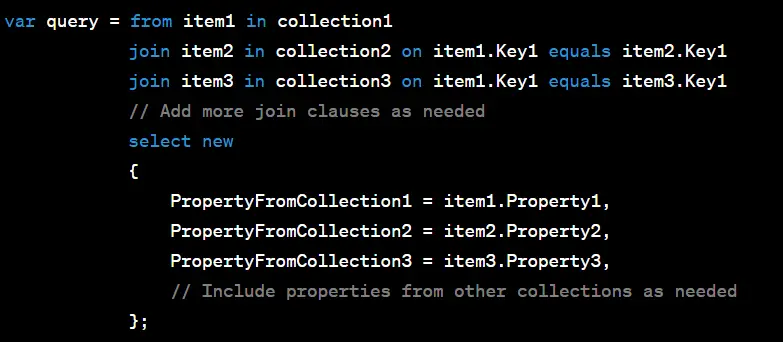

---json
{
  "documentId": 0,
  "title": "studio status report: 2024-10",
  "documentShortName": "2024-11-01-studio-status-report-2024-10",
  "fileName": "index.html",
  "path": "./entry/2024-11-01-studio-status-report-2024-10",
  "date": "2024-11-01T21:11:44.117Z",
  "modificationDate": "2024-11-01T21:11:44.117Z",
  "templateId": 0,
  "segmentId": 0,
  "isRoot": false,
  "isActive": true,
  "sortOrdinal": 0,
  "clientId": "2024-11-01-studio-status-report-2024-10",
  "tag": "{\n  \u0022extract\u0022: \u0022month 10 of 2024 was about switching the Studio over to HTTPS \\uD83D\\uDD12\\u2728 and getting day-job lessons about calculating diffs \\uD83D\\uDC07\\uD83D\\uDD73\\uFE0F It is factually incorrect for me to say that Google \\u2018forced\\u2019 me to switch one of my Studio publications, kintespace.com, over to HT\\u2026\u0022\n}"
}
---

# studio status report: 2024-10

## month 10 of 2024 was about switching the Studio over to HTTPS 🔒✨ and getting day-job lessons about calculating diffs 🐇🕳️

It is factually incorrect for me to say that Google ‘forced’ me to switch one of my Studio publications, kintespace.com, over to HTTPS. Simultaneously, I am _not_ going to defend a need to stay on HTTP. But the bottom line is this: developing `Songhay.Player.YouTube` [[GitHub](https://github.com/BryanWilhite/Songhay.Player.YouTube)] is pointless without “compliance” with Google policies. I think I spent over half of the month dealing with Google—the selected Obsidian notes below should show this. But before we got on with that, here is the Obsidian graph view of the month:

<div style="text-align:center">


</div>

The two biggest dots on the graph above are:

- Songhay Publications — KinteSpace
- Azure

Selected Obsidian notes should reflect this:

## the <acronym title="Electronic Frontier Foundation">EFF</acronym> offers [[Certbot]] for automatic [[Let’s Encrypt]] renewal

This looks like technical activism at its best:

<div style="text-align:center">


<https://certbot.eff.org/>

</div>

Unlike the video found by [[2023-08-14#hardware okay, the old guy gets it 👴 <acronym title="Secure Sockets Layer [deprecated in 2011]">SSL</acronym> (<acronym title="Transport Layer Security">TLS</acronym>) is free|my previous research]], this video features the command line—a not-so-“scary” command line:

<div style="text-align:center">

<figure>
    <a href="https://www.youtube.com/watch?v=ghZXFyIyK1o">
        
    </a>
    <p><small>How to Get Fully Automated Let's Encrypt SSL Renewal (no coding)</small></p>
</figure>

</div>

The whole [[Certbot]] experience starts \[📹 [watch](https://youtu.be/ghZXFyIyK1o?t=164) \] with the following command:

```shell
$ snap install --classic certbot

```

The catch is whether this news from 2019 from [[A2 Hosting]] relates to [[Songhay Publications - KinteSpace|kintespace.com]]:

>The Certbot documentation at [https://certbot.eff.org](https://certbot.eff.org) recommends using _snapd_ for Certbot installation. However, _snapd_ is incompatible with our VPS infrastructure, so you should use your Linux distribution's package manager to install Certbot directly. Alternatively, you can use one of the many other client applications available for managing Let's Encrypt certificates. For more information, please visit [https://letsencrypt.org/docs/client-options](https://letsencrypt.org/docs/client-options).
>
>—“[How to secure an unmanaged server with a Let's Encrypt SSL certificate](https://www.a2hosting.com/kb/security/ssl/securing-your-site-with-a-lets-encrypt-ssl-certificate/)”
>

When this is still the case, there is an [[Apache]]-Linux (`pip`) pathway for installation \[📖 [docs](https://certbot.eff.org/instructions?ws=apache&os=pip) \]

## [[Songhay Publications - KinteSpace|kintespace.com]] the richest North American <acronym title="African Descendant of Slavery">ADOS</acronym> is David Steward, chairman of World Wide Technology

>**David Lloyd Steward** (born July 2, 1951) is an American billionaire businessman. He is chairman and founder of [World Wide Technology](https://en.wikipedia.org/wiki/World_Wide_Technology "World Wide Technology"), one of the largest African-American-owned businesses in America.
>
>According to _Forbes_, in 2024 Steward was one of 13 black billionaires worldwide. He was ranked 178th on the [Bloomberg Billionaires Index](https://en.wikipedia.org/wiki/Bloomberg_Billionaires_Index "Bloomberg Billionaires Index") list of American billionaires in 2024 with a $12.8 Billion.
>
>—<https://en.wikipedia.org/wiki/David_Steward>
>

<div style="text-align:center">

<figure>
    <a href="https://www.youtube.com/watch?v=OJIaGViWKWI">
        
    </a>
    <p><small>My Missouri Lecture: A Conversation with David Steward, Founder and Chairman, World Wide Technology</small></p>
</figure>

</div>

## [[Songhay Publications - KinteSpace|kintespace.com]]: the 2019 docs are accurate—`snapd` does not work on [[A2 Hosting]] 😐

Continuing from [[2024-10-04#the <acronym title="Electronic Frontier Foundation">EFF</acronym> offers Certbot for automatic Let’s Encrypt renewal|yesterday]], I installed `snapd` according to [the instructions](https://snapcraft.io/docs/installing-snap-on-ubuntu) and got these warnings:

```plaintext
snapd.failure.service is a disabled or a static unit, not starting it.
snapd.mounts-pre.target is a disabled or a static unit, not starting it.
snapd.mounts.target is a disabled or a static unit, not starting it.
snapd.snap-repair.service is a disabled or a static unit, not starting it.
```

Then, following [the instructions](https://snapcraft.io/docs/installing-snap-on-ubuntu), I tested `snap` and got the unpleasant news:

```shell
$ sudo snap install hello-world
error: system does not fully support snapd: cannot mount squashfs image using "squashfs": mount:
       /tmp/syscheck-mountpoint-1430420498: mount failed: Operation not permitted.
```

## [[Songhay System Studio]]: “Camilo Aguilar on the Rsync Algorithm” #to-do

<div style="text-align:center">

<figure>
    <a href="https://www.youtube.com/watch?v=X3Stha8pxXc">
        
    </a>
    <p><small>Camilo Aguilar on the Rsync Algorithm [PWL NYC]</small></p>
</figure>

</div>

## [[Songhay Publications - KinteSpace|kintespace.com]]: the `*_misc_*` scripts for the <acronym title="Hypertext Transfer Protocol Secure">HTTPS</acronym> drama

Okay, for the sake of quick and dirty, I think I need two scripts:

1. `rsync_kinte_misc_to_desktop.sh`
2. `rsync_kinte_misc_to_PROD.sh`

These scripts form a dirty cycle like this:



The reason why I fixed these scripts with `*_misc_*` is due to the `rsync` commands changing based on the current need. Today’s need is about targeting files that need `http://` changed to `https://`.

## [[Songhay System Studio]]: my introduction to <acronym title="# Language-Agnostic SEntence Representations">LASER</acronym> by “Facebook Research”

Lydia Nishimwe:

<div style="text-align:center">

<figure>
    <a href="https://www.youtube.com/watch?v=myTk7LKf7Zs">
        
    </a>
    <p><small>Making Sentence Embeddings Robust to User-Generated Content</small></p>
</figure>

</div>

>LASER is a library to calculate and use multilingual sentence embeddings.
>
>—<https://github.com/facebookresearch/LASER>
>

## [[Songhay Publications - KinteSpace|kintespace.com]]: `Uncaught (in promise) TypeError: Decoding failed`

The [[Songhay Player - YouTube (F♯)]] is failing on staging:

<div style="text-align:center">



</div>

The [[Songhay Player - Progressive Audio (F♯)|b-roll progressive audio player]] is throwing the same errors 😐

This is likely due to GZIP compression:

>GZIP compression can be a great way to improve a website’s performance. However, if something goes wrong during the compression process, it may trigger an ERR_CONTENT_DECODING_FAILED error.
>
>—“[How To Fix the ERR_CONTENT_DECODING_FAILED Error (6 Methods)](https://kinsta.com/knowledgebase/err_content_decoding_failed/)”
>

## [[Entity Framework]]: a study of the `Queryable.Join` method for more than two entities is needed 🔍🧠 #to-do

I am surprised to find that it is difficult to find a published study on `Queryable.Join` \[📖 [docs](https://learn.microsoft.com/en-us/dotnet/api/system.linq.queryable.join?view=net-8.0) \] for multiple entities _in fluent syntax_. The closest thing I can find [this](https://dotnettutorials.net/lesson/linq-join-with-multiple-data-sources/) <acronym title="Structured Query Language">SQL</acronym>-like syntax:

<div style="text-align:center">



</div>

I think a fluent _translation_ (not equivalent) of the above is out there but I need to make sure that I am not confusing `Enumerable.Join` \[📖 [docs](https://learn.microsoft.com/en-us/dotnet/api/system.linq.enumerable.join?view=net-8.0) \] (<acronym title="Language Integrated Query">LINQ</acronym>- to-objects) with `Queryable.Join`.

A so-called “complete” tutorial [out there in the wild](https://stackify.com/the-linq-join-operator-a-complete-tutorial/) does not have an example like the one above 😐 ==I strongly suspect== that the <acronym title="Language Integrated Query">LINQ</acronym> story of replicating `JOIN` in <acronym title="Structured Query Language">SQL</acronym> _fluently_ is not a feel-good success. My first hint is about the docs clearly specifying that `.Join` is about _two_ sequences not an $n$-number of sequences. This means an anonymous object has to be passed from one `.Join` call to the next:

```csharp
var query = dbContext.Collection1
    .Join(dbContext.Collection2,
        cItem1 => cItem1.Key1,
        cItem2 => cItem2.Key2,
        (cItem1, cItem2) =>
        new
        {
            cItem1.Key1,
            cItem2.Key2,
        })
    .Join(dbContext.Collection3,
        anon => anon.Key2,
        cItem3 => cItem3.Key3,
        (anon, cItem3) =>
        new
        {
            anon.Key1,
            anon.Key2,
            cItem3.Key3,
        })
```

This `.Join` chaining cannot possibly be the “right” thing to do! (I would need to see how, say, <acronym title="Language Integrated Query">LINQ</acronym>-to-<acronym title="Structured Query Language">SQL</acronym> would translate something like above.) In a world where joining actually _is_ the “right” thing to do, I would rather write <acronym title="Structured Query Language">SQL</acronym> and run it with [[Songhay Data Access (C♯)|ADO.NET]] or [[Dapper]].

## [[Songhay Publications - KinteSpace]]: i really would like to use `htmx` but…

This Studio was introduced to `htmx` a [[2024-08-29#Songhay Publications Publications Hypermedia Systems|couple of months ago]] without any plans for its usage. Then came the realization that something must done about the automatic updating/rebuilding of the [[Songhay Publications - KinteSpace|kintespace.com]] ‘Index Hero Splash’ page. I was actually thinking that the page could be refreshed passively with a cron job—but I was not paying respect to this Studio’s investment in [[Web Components]], specifically [[Songhay Web Components]]—and what is behind this effort is [[Lit]]. Now [[Lit]] [came from Polymer](https://lit.dev/articles/lit-for-polymer-users/) and, according to my [[Joplin]] notes from 2020:

>The Polymer people were behind Web Components and standards for years (perhaps since the announcement of the standard in 2011). They have a tiny wrapper around the standards called LitElement.

Even though `htmx` supports [[Web Components]] \[📖 [docs](https://htmx.org/examples/web-components/) \], today I flippantly and ignorantly assume that [[Lit]] (and the entirely of JavaScript) has more to offer—and it would probably take me months to rebuild [[Songhay Web Components]] with `htmx` 😐

## [[dotnet|.NET]]: `SystemTextJson.JsonDiffPatch` replaces [[Compare-Net-Objects]]❓

More #day-job progress shows that `SystemTextJson.JsonDiffPatch` \[🔗 [GitHub](https://github.com/weichch/system-text-json-jsondiffpatch) \] \[📦 [NuGet](https://www.nuget.org/packages/SystemTextJson.JsonDiffPatch) \] not only replaces [[Compare-Net-Objects]] but also introduces me to the world of standardized <acronym title="JavaScript Object Notation">JSON</acronym> ‘patching’ (e.g. [RFC 6902](https://www.rfc-wiki.org/wiki/RFC6902)).

Some weird, [[JSON Diff Patch]] history:

- `SystemTextJson.JsonDiffPatch` is the non-Newtonsoft-JSON ‘port’ of `JsonDiffPatch.Net` \[🔗 [Github](https://github.com/wbish/jsondiffpatch.net) \]
- `JsonDiffPatch.Net` can be thought of as the server-side “compatible” compliment of `jsondiffpatch` \[🔗 [GitHub](https://github.com/benjamine/jsondiffpatch) \] which is a [[Typescript]] library with [a great demo page](http://benjamine.github.io/jsondiffpatch/index.html)

>[!question]
>Does `SystemTextJson.JsonDiffPatch` replace [[Compare-Net-Objects]]?

The short answer is _no_. Unlike [[ObjDiff]], `SystemTextJson.JsonDiffPatch` requires serializing [[dotnet|.NET]] objects into <acronym title="JavaScript Object Notation">JSON</acronym> which can be a performance-hogging deal breaker.

## [[Compare-Net-Objects]] is dead to me 💀

>Kellerman Software has been purchased by 4Penny.net
>
>—<https://github.com/GregFinzer/Compare-Net-Objects>
>

## [[Songhay Publications|Publications]]: `microdiff`, a dependency-free JavaScript  library…

…claims to be the fastest diff lib:

>🚀 More than double the speed of other object diff libraries
>
>—<https://github.com/AsyncBanana/microdiff>
>

## [[Songhay Publications - Day Path|Songhay Day Path Blog]] is now running on <acronym title="Hypertext Transfer Protocol Secure">HTTPS</acronym>

My thought [[2023-03-22#Songhay Publications - Day Path Songhay Day Path Blog switching to <acronym title="Hypertext Transfer Protocol Secure">HTTPS</acronym>|early last year]] appears to be right:

>I think ticking **HTTPS Only** on is all that is needed…

The only bit missing was to find `http://songhayblog` and change it to `https://songhayblog` 🧹✅

## open pull requests on GitHub 🐙🐈

- <https://github.com/BryanWilhite/Songhay.HelloWorlds.Activities/pull/14>
- <https://github.com/BryanWilhite/dotnet-core/pull/67>

## sketching out development projects

The current, unfinished public projects on GitHub:

- replacing the Angular app in `http://kintespace.com/player.html` with a Bolero app 🚜🔥 depends on:

  - completing [issue #54](https://github.com/BryanWilhite/Songhay.Publications/issues/54): move `Songhay.Publications.DataAccess` out of the kinté space repo 🚜
  - generating Publication indices from SQLite for `Songhay.Publications.KinteSpace`
  - generating a new repo with proposed name, `Songhay.Modules.Bolero.Index` ✨🚧 and add a GitHub Project

The proposed project items:

- switch Studio from Material Design to Bulma 💄 ➡️ 💄✨

🐙🐈<https://github.com/BryanWilhite/>
