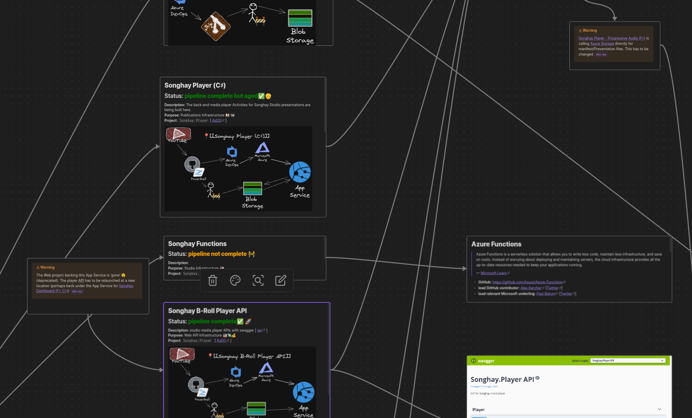
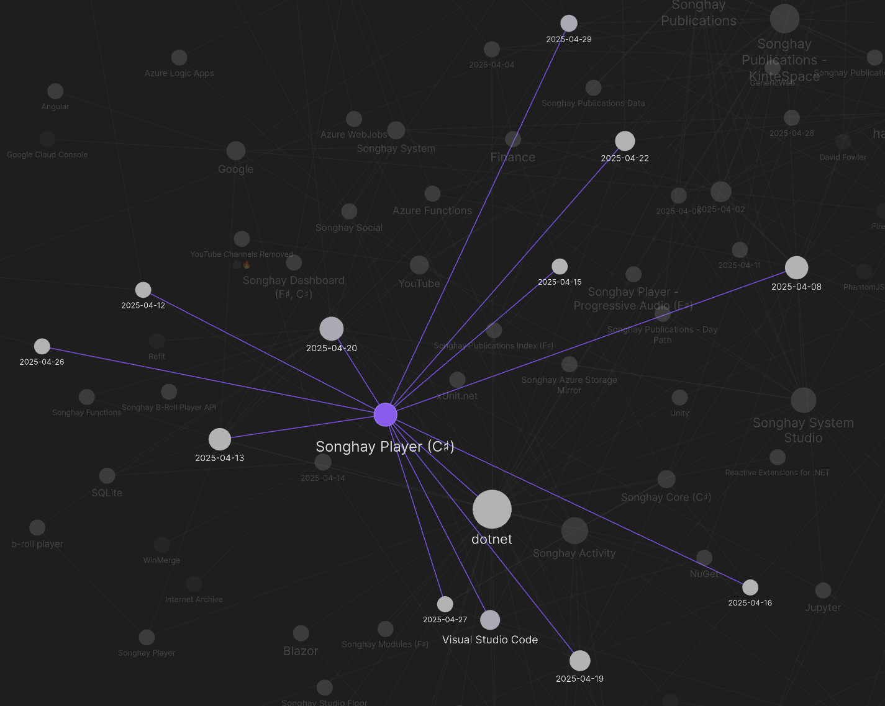
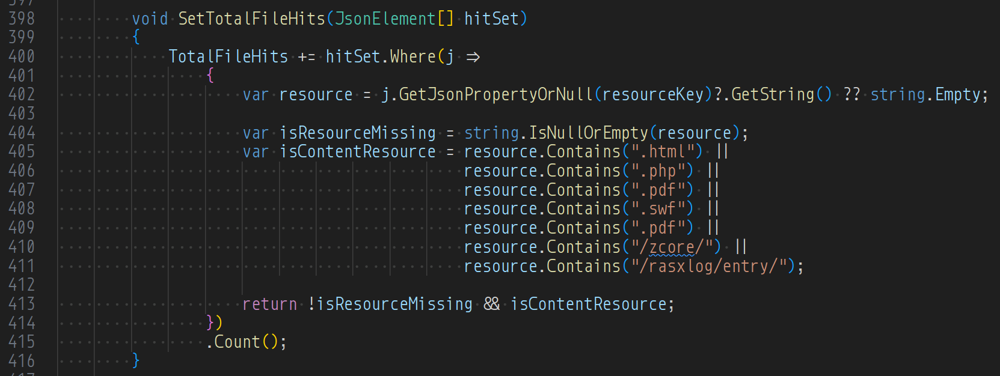
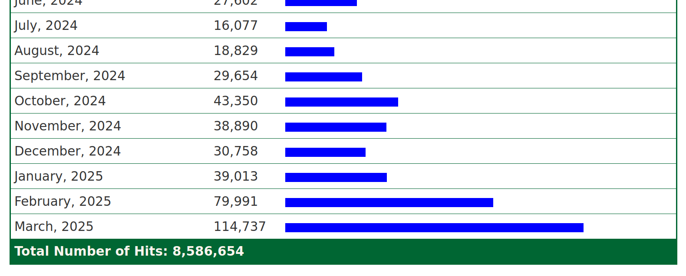
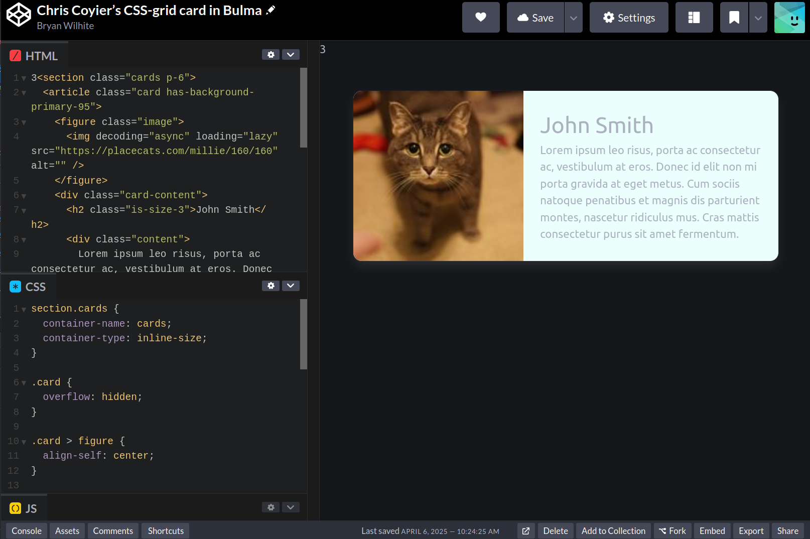
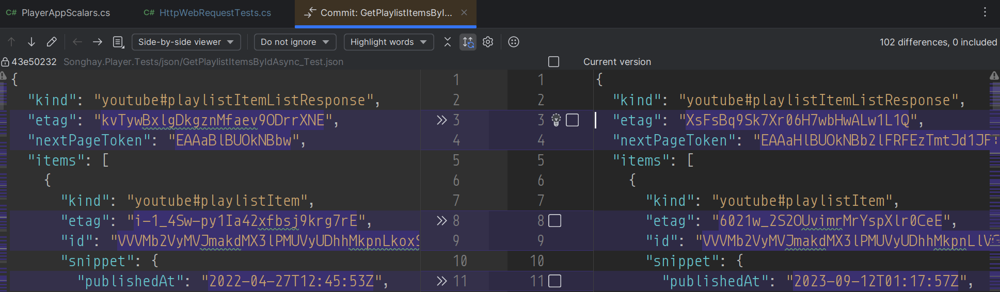

---json
{
  "documentId": 0,
  "title": "studio status report: 2025-04",
  "documentShortName": "2025-04-29-studio-status-report-2025-04",
  "fileName": "index.html",
  "path": "./entry/2025-04-29-studio-status-report-2025-04",
  "date": "2025-04-29T18:54:28.895Z",
  "modificationDate": "2025-04-29T18:54:28.895Z",
  "templateId": 0,
  "segmentId": 0,
  "isRoot": false,
  "isActive": true,
  "sortOrdinal": 0,
  "clientId": "2025-04-29-studio-status-report-2025-04",
  "tag": "{\n  \u0022extract\u0022: \u0022month 04 of 2025 was about envisioning a road map toward getting the next-generation b-roll player services working Currently, the Studio canvas shows two warnings directly related to player services: Obsidian Studio canvas detail What should emerge from \\u2026\u0022\n}"
}
---

# studio status report: 2025-04

## month 04 of 2025 was about envisioning a road map toward getting the next-generation b-roll player services working

Currently, the Studio canvas shows two warnings directly related to player services:

<div style="text-align:center">



</div>

What should emerge from the visual detail above are:

- Songhay Player (C♯) [not in a public repo]
- Songhay Functions [will be a project inside the Songhay Player (C♯) Solution]

The Studio graph shows a whopping ten days were spent on Songhay Player (C♯) alone:

<div style="text-align:center">



</div>

Stuff from the #day-job soaked up the bulk of the rest of my time where I learned something new yet again: how to generate SQL statements through ‘conversation’ (talking to myself) with a Jupyter Notebook. This is not quite as ginger-billionaire sexy (and security-hole-making) as using <acronym title="Artificial Intelligence">AI</acronym> for the same purpose but this organic solo performance is far more energy efficient 😐

Whatever is written in the previous paragraph has nothing to do with the top priority of my Studio: generating a new `index.html` page with eleventy (see “sketching out development projects” below). My selected notes below should show that _some_ time was spent on this ‘top priority’:

## [[Songhay Publications Analytics|kintespace.com analytics]]: “Abusive AI Web Crawlers: Get Off My Lawn”

Is this abuse happening to kintespace.com?

>This new attack comes from a great many IP addresses, each making a tiny number of requests – often just one – from viable-looking but randomly generated User-Agents. We’ve had some success detecting and blocking these but this has not been without some problems. There have been periods where some of our servers have been struggling under the sheer number of connections they’ve had to deal with and some of the blocks we’ve put in place have impacted some legitimate users, especially those on very old computers. If this is you then we’re sorry you’ve been caught up in this.
>
>To give you some idea of the scale, one of our shared hosting servers has in the last month been averaging over 1.5 million fraudulent requests from 290,000 unique IP addresses per day. These are addresses that we have a very high confidence are not making legitimate requests. We’ve identified 5.1 million unique IP addresses during this period and 3.4 million of those have only made a _single_ request, which has made it very difficult for us to block them proactively.
>
>…
>
>The vast majority of these requests are from consumer ISP networks from a wide variety of countries with Brazil being the biggest contributor by far.
>
>—“[Abusive AI Web Crawlers: Get Off My Lawn](https://www.mythic-beasts.com/blog/2025/04/01/abusive-ai-web-crawlers-get-off-my-lawn/)”
>

## [[Songhay Publications Analytics]]: adding `"/rasxlog/entry/"`

The addition of `"/rasxlog/entry/"` as a ‘content resource’ will drastically increase `TotalFileHits`:

<div style="text-align:center">



</div>

The visualization shows the increase, drastically:

<div style="text-align:center">



</div>

## [[dotnet|.NET]]: not-very-effective `JsonNode` extension methods

These two extension methods are going in the wrong direction:

```csharp
/// <summary>
/// Gets the reference-type property value of the specified <see cref="JsonNode"/>
/// of <see cref="JsonValueKind.Object" />
/// or defaults to null.
/// </summary>
/// <typeparam name="T">type constrained to <c>class</c></typeparam>
/// <param name="node">The <see cref="JsonNode"/>.</param>
/// <param name="propertyName">Name of the property.</param>
public static T? GetPropertyReferenceValueOrNull<T>(this JsonNode? node, string propertyName) where T: class
{
    JsonValue? jsonValue = node.GetPropertyJsonValueOrNull(propertyName);
    if (jsonValue == null) return null;

    return !jsonValue.TryGetValue(out T? value) ? null : value;
}

/// <summary>
/// Gets the property value of the specified <see cref="JsonNode"/>
/// of <see cref="JsonValueKind.Object" />
/// or defaults to null.
/// </summary>
/// <typeparam name="T">type constrained to <c>struct</c></typeparam>
/// <param name="node">The <see cref="JsonNode"/>.</param>
/// <param name="propertyName">Name of the property.</param>
public static T? GetPropertyValueOrNull<T>(this JsonNode? node, string propertyName) where T: struct
{
    JsonValue? jsonValue = node.GetPropertyJsonValueOrNull(propertyName);
    if (jsonValue == null) return null;

    return !jsonValue.TryGetValue(out T? value) ? null : value;
}
```

>[!important]
>Constraining `T` to a `struct` should be replaced by an extension method that returns `JsonValue`.
>
>Constraining `T` to a `class` should be replaced by an extension methods that return `JsonArray` and `JsonObject`.

Not doing this can lead to ‘losing the reference’ or perhaps cloning child nodes inside a `JsonNode`. For example, below `jsonArray` will lose its reference to the `JsonArray` inside `node`:

```csharp
JsonNode? node = JsonNode.Parse(jO.RootElement.GetRawText());

JsonArray? jsonArray = node.GetPropertyReferenceValueOrNull<JsonArray>(summaryArrayPropertyName);

jsonArray?.Add(jOData);
```

>[!error]
>Adding `jOData` to `jsonArray` will not update the `JsonArray` inside of `node`.

I have replaced `GetPropertyReferenceValueOrNull<JsonArray>` with:

```csharp
public static JsonArray? GetPropertyJsonArrayOrNull(this JsonNode? node, string propertyName)  
{  
    if (node == null) return null;  
    if (node.GetJsonValueKind() != JsonValueKind.Object) return null;  
  
    if (!node.AsObject().TryGetPropertyValue(propertyName, out JsonNode? outputNode)) return null;  
  
    return outputNode is not JsonArray ? null : outputNode.AsArray();  
}
```

## [[Azure]]: use IBM-speak; use the term “workload”

>A workload, in the most general sense, is the amount of time and computing resources a system or network takes to complete a task or generate a particular output. It refers to the total system demand of all users and processes at a given moment.
>
>—“[What is a workload?](https://www.ibm.com/think/topics/workload)”
>

## [[dotnet|.NET]]: `IConfiguration` and `ILogger` should never be `null` 💡✨

Previously, I thought that `IConfiguration` alone should never _intentionally_ be `null` without regard to unit-testing scenarios. Now, I can include `ILogger` in this confidence because of my discovery of `NullLogger.Instance` \[📖 [docs](https://learn.microsoft.com/en-us/dotnet/api/microsoft.extensions.logging.abstractions.nulllogger.instance?view=net-9.0-pp) \] #to-do

>The good news is that the Microsoft.Extensions.Logging.Abstractions namespace comes with null objects right out of the box. All you need to do is use `NullLogger.Instance` and `NullLoggerFactory.Instance` as default instances in your constructor. That’s it. Your class can now depend on these instances, as though there is a real instance.
>
>—“[ILogger and Null Object Pattern](https://www.christianfindlay.com/blog/ilogger-nullobject)”
>

## [[Songhay Publications - KinteSpace|kintespace.com]] is using “next generation” <acronym title="Cascading Style Sheets">CSS</acronym> 😐🧠🐈

The [[2025-03-29#cards as responsive, two-column grids|cards as responsive, two-column grids]] experiment is progressing quite well:


<https://codepen.io/rasx/pen/raNbNwx>

Certainly, I did not plan to run into the use of the `@container` at-rule \[📖 [docs](https://developer.mozilla.org/en-US/docs/Web/CSS/@container) \] instead of media queries. In the 2022 article, “[Next Gen CSS: @container](https://css-tricks.com/next-gen-css-container/),” `@container` was considered a Chrome experiment:

>Chrome is experimenting with `@container`, a property within the CSS Working Group [Containment Level 3 spec](https://github.com/w3c/csswg-drafts/issues?q=is%3Aissue+label%3Acss-contain-3+) being championed by [Miriam Suzanne](https://twitter.com/TerribleMia) of [Oddbird](https://css.oddbird.net/rwd/query/), and a group of engineers across the web platform. `@container` brings us the ability to **style elements based on the size of their parent container**.

BTW: placekitten.com has new competition: <https://placecats.com/>

## [[dotnet|.NET]]: “.NET 10 Preview 3 is now available!”

[[dotnet|.NET 10]] picks:

- [Stack Allocation of Small Arrays of Reference Types](https://github.com/dotnet/core/blob/main/release-notes/10.0/preview/preview3/runtime.md#stack-allocation-of-small-arrays-of-reference-types)
- [Console apps can natively create container images](https://github.com/dotnet/core/blob/main/release-notes/10.0/preview/preview3/sdk.md#console-apps-can-natively-create-container-images)
- [Explicitly control the image format of containers](https://github.com/dotnet/core/blob/main/release-notes/10.0/preview/preview3/sdk.md#explicitly-control-the-image-format-of-containers)
- [Reference fingerprinted static web assets in standalone Blazor WebAssembly apps](https://github.com/dotnet/core/blob/main/release-notes/10.0/preview/preview3/aspnetcore.md#reference-fingerprinted-static-web-assets-in-standalone-blazor-webassembly-apps)
- [`HttpClient` response streaming enabled by default on WebAssembly](https://github.com/dotnet/core/blob/main/release-notes/10.0/preview/preview3/aspnetcore.md#httpclient-response-streaming-enabled-by-default-on-webassembly)
- [Set the environment at build-time for standalone Blazor WebAssembly apps](https://github.com/dotnet/core/blob/main/release-notes/10.0/preview/preview3/aspnetcore.md#set-the-environment-at-build-time-for-standalone-blazor-webassembly-apps)
- [Validation support in minimal APIs](https://github.com/dotnet/core/blob/main/release-notes/10.0/preview/preview3/aspnetcore.md#validation-support-in-minimal-apis)
- [OpenAPI support enabled by default in the ASP.NET Core Web API (native AOT) template](https://github.com/dotnet/core/blob/main/release-notes/10.0/preview/preview3/aspnetcore.md#openapi-support-enabled-by-default-in-the-aspnet-core-web-api-native-aot-template)
- [Support for Server-Sent Events (SSE)](https://github.com/dotnet/core/blob/main/release-notes/10.0/preview/preview3/aspnetcore.md#support-for-server-sent-events-sse)

## [[Songhay Player]]: can `etag` data from [[Google]] be used to determine whether data has been changed? #to-do

I think the short answer is _yes_.

<div style="text-align:center">



</div>

The [HTTP ETag](https://en.wikipedia.org/wiki/HTTP_ETag) is used for cache validation:

>An ETag is an opaque identifier assigned by a Web server to a specific version of a resource found at a [URL](https://en.wikipedia.org/wiki/Uniform_Resource_Locator "Uniform Resource Locator"). If the resource representation at that URL ever changes, a new and different ETag is assigned. Used in this manner, ETags are similar to [fingerprints](https://en.wikipedia.org/wiki/Fingerprint_(computing) "Fingerprint (computing)") and can quickly be compared to determine whether two representations of a resource are the same.

>[!important]
>Recognizing ETags should speed up the processing of b-roll player data from [[Google]] dramatically 🧠💡

## [[xUnit.net]]: my new `ProjectDirectoryAttribute` ✨

Yesterday, while working on [[Songhay Player (C♯)]], I discovered that requiring a type argument for `ProjectFileDataAttribute` is unnecessary. My new `Theory` attribute, `ProjectDirectoryAttribute` takes advantage of what has always been there—the `MethodInfo` of the test method on the test class:

```csharp
public override IEnumerable<object[]> GetData(MethodInfo testMethod)
{
    Type methodType = testMethod.DeclaringType.ToReferenceTypeValueOrThrow();

    //…

}
```

The intent behind `ProjectDirectoryAttribute` is to conveniently get the conventional directory of the `*.csproj` file on the test-method level. This attribute is just an [[xUnit.net]] wrapper around my `GetNetCoreProjectDirectoryInfo` method \[🔗 [GitHub](https://github.com/BryanWilhite/SonghayCore/blob/45c4479e2bb5079ba9121640859b53407fd4b601/SonghayCore.xUnit/Extensions/AssemblyExtensions.cs#L57) \]. Although investigating whether some kind of “fixture” can be developed to share the project directory `DirectoryInfo` on the test class level is worth the effort #to-do, the `ProjectDirectoryOption` enumeration allows flexibility, changing the ‘test root’ path for each method.

`ProjectDirectoryAttribute` needs to be migrated into the [[Songhay Core (C♯)]] Solution #to-do  Also, the overloads containing the `Type` argument of the `ProjectFileDataAttribute` constructor, need to be marked obsolete #to-do

## [[Songhay System Studio]]: “China’s Kling 2.0 stuns with Hollywood-level visuals: 7 compelling videos to watch”

>KLING 2.0 Master comes with significant improvements in dynamics as it now offers more range of motion on the character subject with fluid movements and natural speed. The company claims that the new model comes with more dramatic expressions as seen in professional-level acting. It is offering more cinematic visuals and rich details even with text-to-video. The model allows for better style consistency with image to video enabling control over desired stylisation.
>
>—“[China’s Kling 2.0 stuns with Hollywood-level visuals: 7 compelling videos to watch](https://indianexpress.com/article/technology/artificial-intelligence/chinas-kling-ai-2-0-stuns-with-hollywood-level-visuals-9949447/)”
>

<div style="text-align:center">

<figure>
    <a href="https://www.youtube.com/watch?v=a9KhKC04Hjo">
        
    </a>
    <p><small>Kling AI 2.0 is HERE: The BEST AI Video Generator of 2025?</small></p>
</figure>

</div>

## [[Songhay Player (C♯)]]: understanding the heart of the problem and memorializing this understanding in an integration test 😐🥣

The issue that evaded me for a week was about forgetting about the purpose of `UpdatePlaylistItemContentDetailsAsync`. This extension method is calling the [[YouTube]] <acronym title="Application Programming Interface">API</acronym> to download a `"youtube#playlistItemListResponse"` object in order to replace all of the `items` of this object with their corresponding `"youtube#video"` object. The purpose of this is to get more details about a given YouTube video (such as `duration`).

`YouTubePlaylistItemsActivityTests.StartAsync_with_InputString_and_OutputString_Test` now has the following assertions:

```csharp
// assert:
Assert.NotNull(json);
JsonObject? jO = JsonNode.Parse(json)?.AsObject();
JsonArray? jA = jO?["items"]?.AsArray();
Assert.NotEmpty(jA?.OfType<JsonObject>()!);
Assert.All(jA?.OfType<JsonObject>()!, arrayItemObject => Assert.Equal("youtube#video", arrayItemObject["kind"]?.GetValue<string>()));
```

Had these assertions been in place a week ago—blah, blah, blah 😐

## [[Netflix]]: “You Read That Right: We’re Introducing a New Way to Experience Subtitles”

>[Fifty percent of Americans](https://preply.com/en/blog/americas-subtitles-use/) say they watch content with subtitles most of the time. It’s a habit we see reflected on Netflix too—nearly half of all viewing hours on Netflix in the US happen with subtitles or captions on, so we’re making the experience even better for members.
>
>—“[You Read That Right: We’re Introducing a New Way to Experience Subtitles](https://about.netflix.com/en/news/introducing-a-new-way-to-experience-subtitles)”
>

## open pull requests on GitHub 🐙🐈

- <https://github.com/BryanWilhite/SonghayCore/pull/181>
- <https://github.com/BryanWilhite/Songhay.HelloWorlds.Activities/pull/14>
- <https://github.com/BryanWilhite/dotnet-core/pull/67>

## sketching out development projects

Eliminating Angular JS in the Studio is the top priority. Replacing the Angular JS app (`http://kintespace.com/player.html`) for the kinté space depends on:

- generating a new `index.html` page with eleventy
- supplementing the index with responsive images

Proposed future items:

- complete upgrade to .NET 8.0
- replace current b-roll player API with Azure Functions
- switch Studio Publications from Material Design to Bulma 💄 ➡️ 💄✨
- start `Songhay.Modules.Bolero.Index` project
- generate responsive and social images with AI

🐙🐈<https://github.com/BryanWilhite/>
