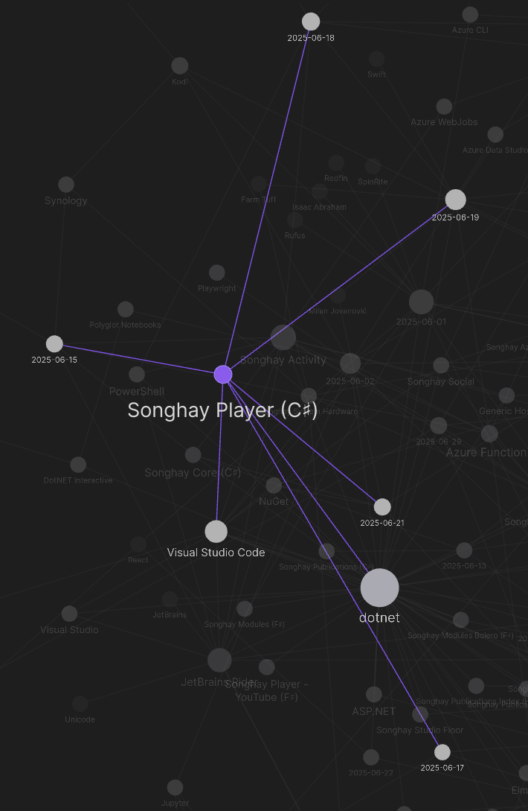

---json
{
  "documentId": 0,
  "title": "studio status report: 2025-06",
  "documentShortName": "2025-06-29-studio-status-report-2025-06",
  "fileName": "index.html",
  "path": "./entry/2025-06-29-studio-status-report-2025-06",
  "date": "2025-06-29T18:43:37.788Z",
  "modificationDate": "2025-06-29T18:43:37.788Z",
  "templateId": 0,
  "segmentId": 0,
  "isRoot": false,
  "isActive": true,
  "sortOrdinal": 0,
  "clientId": "2025-06-29-studio-status-report-2025-06",
  "tag": "{\n  \u0022extract\u0022: \u0022month 06 of 2025 was about releasing the b-roll player API Month 06 of 2025 was about releasing the b-roll player API in Microsoft Azure, solidifying the architectural practice of this Studio as this release features: - the premiere use of Microsoft\\u2019s Htt\\u2026\u0022\n}"
}
---

# studio status report: 2025-06

## month 06 of 2025 was about releasing the b-roll player <acronym title="Application Programming Interface">API</acronym>

Month 06 of 2025 was about releasing the b-roll player <acronym title="Application Programming Interface">API</acronym> in Microsoft Azure, solidifying the architectural practice of this Studio as this release features:

- the premiere use of Microsoft’s `HttpTriggerAttribute.Route` \[🔗 [GitHub](https://github.com/Azure/azure-functions-dotnet-worker/blob/ba0f4dc6e0318af9a493198179dc46a29afb7e57/extensions/Worker.Extensions.Http/src/HttpTriggerAttribute.cs#L59) \] attribute for endpoints which allows me to match routes already set up on the legacy Player <acronym title="Application Programming Interface">API</acronym>
- the premiere use of Microsoft’s keyed <acronym title="Dependency Injection">DI</acronym> which is new to dotnet|.NET 8.0
- the keyed injection of Activities into Functions classes which formally define the ‘tree’ of inputs and outputs of the domain
- the premiere use of the new ‘boundary-crossing’ abstractions of this Studio (e.g. `IApiEndpoint` \[🔗 [GitHub](https://github.com/BryanWilhite/SonghayCore/blob/main/SonghayCore/Abstractions/IApiEndpoint.cs) \]) which still find quite revolutionary-but-not-at-all-glamorous at the moment (more detail is in [last month’s report](https://songhayblog.azurewebsites.net/entry/2025-05-30-studio-status-report-2025-05/))
- the premiere use of `IConfiguration` as a form of input, causing the new Studio convention of `*ShellActivity` Activities which are concerned with reading command-line input

This API release allows me to make the claim I made over two months ago true: this Studio is in a ready state to focus on building for the front end. Two months ago [my notes referenced](https://songhayblog.azurewebsites.net/entry/2025-04-29-studio-status-report-2025-04/) this Pen: <https://codepen.io/rasx/pen/raNbNwx> This Pen represents the push toward replacing the old-ass Angular JS (and, yes, I mean Angular _JS_) home splash for kintespace.com with a splash based on eleventy. Ideally, more to come…

According to the Obsidian Graph View, only five days were spent on the b-roll player API:

This is down from the ‘epic’ 16 days used up [last month](https://songhayblog.azurewebsites.net/entry/2025-05-30-studio-status-report-2025-05/) which is understandable as the front end concerns emerge. Speaking of which, here are the NuGet packages released by this Studio for month 06:

- `Songhay.Publications` 8.0.3 \[🔗 [NuGet](https://www.nuget.org/packages/Songhay.Publications/8.0.3) \]
- `SonghayCore` 8.0.2 \[🔗 [NuGet](https://www.nuget.org/packages/SonghayCore/8.0.2) \]

These releases were needed to support the dependencies of the Player API.

The following selected notes should show a month of front-end awareness and maybe a little day-job concern:

## open pull requests on GitHub 🐙🐈

- <https://github.com/BryanWilhite/Songhay.HelloWorlds.Activities/pull/14>
- <https://github.com/BryanWilhite/dotnet-core/pull/67>

## sketching out development projects

Eliminating Angular JS in the Studio is the top priority. Replacing the Angular JS app (`http://kintespace.com/player.html`) for the kinté space depends on:

- generating a new `index.html` page with eleventy
- supplementing the index with responsive images

Proposed future items:

- complete upgrade to .NET 8.0
- replace current b-roll player API with Azure Functions
- switch Studio Publications from Material Design to Bulma 💄 ➡️ 💄✨
- start `Songhay.Modules.Bolero.Index` project
- generate responsive and social images with AI

🐙🐈<https://github.com/BryanWilhite/>
