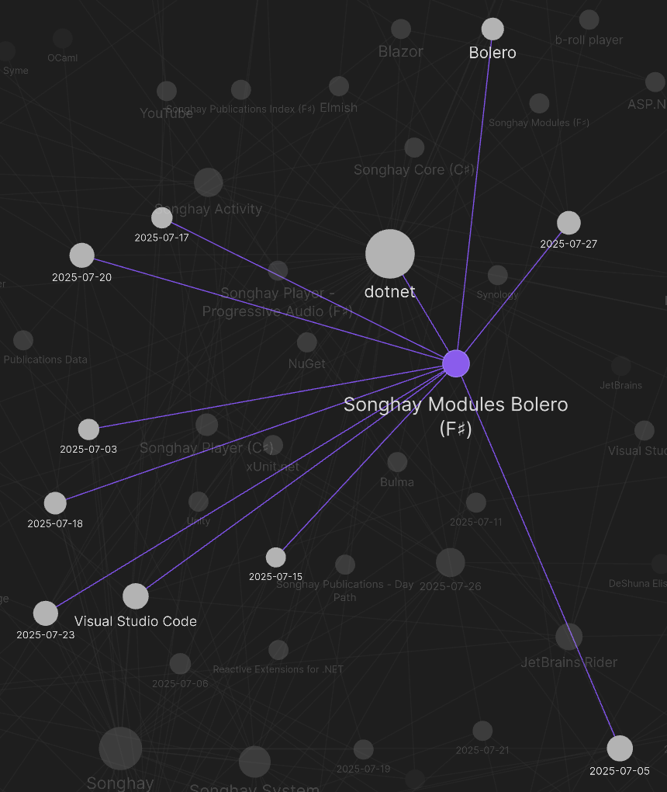
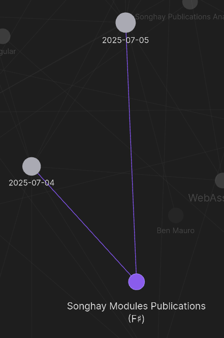
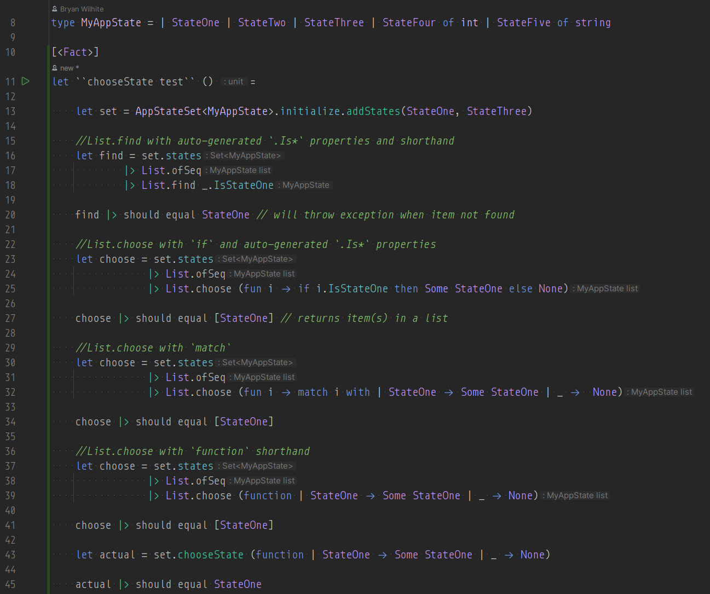
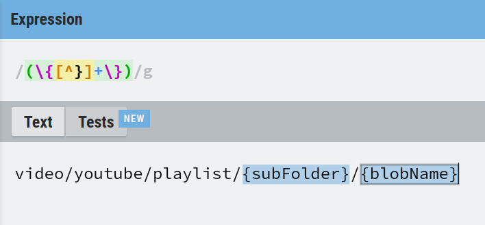

---json
{
  "documentId": 0,
  "title": "studio status report: 2025-07",
  "documentShortName": "2025-07-29-studio-status-report-2025-07",
  "fileName": "index.html",
  "path": "./entry/2025-07-29-studio-status-report-2025-07",
  "date": "2025-07-29T17:53:03.777Z",
  "modificationDate": "2025-07-29T17:53:03.777Z",
  "templateId": 0,
  "segmentId": 0,
  "isRoot": false,
  "isActive": true,
  "sortOrdinal": 0,
  "clientId": "2025-07-29-studio-status-report-2025-07",
  "tag": "{\n  \u0022extract\u0022: \u0022month 07 of 2025 was about readying the Studio WebAssembly assets for the new b-roll player API Month 07 of 2025 was about readying the Studio WebAssembly assets for the new b-roll player API released last month. In so doing, the following NuGet p\\u2026\u0022\n}"
}
---

# studio status report: 2025-07

## month 07 of 2025 was about readying the Studio WebAssembly assets for the new b-roll player API

Month 07 of 2025 was about readying the Studio [[WebAssembly]] assets for the new b-roll player <acronym title="Application Programming Interface">API</acronym> released [last month](https://songhayblog.azurewebsites.net/entry/2025-06-29-studio-status-report-2025-06/). In so doing, the following [[NuGet]] packages were updated:

- `Songhay.Modules` [8.0.1](https://www.nuget.org/packages/Songhay.Modules/8.0.1) 📦🚀
- `Songhay.Modules.Bolero` [8.0.3](https://www.nuget.org/packages/Songhay.Modules.Bolero/8.0.3) 📦🚀
- `Songhay.Modules.Publications` [8.2.0](https://www.nuget.org/packages/Songhay.Modules.Publications/8.2.0) 📦🚀

The Obsidian graph view sees seven days spent on `Songhay.Modules.Bolero`:



…only two days were taken for `Songhay.Modules.Publications`:



…and the graph view sees nothing for `Songhay.Modules`; however, [[GitHub]] itself ([#15](https://github.com/BryanWilhite/Songhay.Modules/issues/15)) shows one day devoted. We have a total of nine days of Studio-work moments which is a four day increase over [last month](https://songhayblog.azurewebsites.net/entry/2025-06-29-studio-status-report-2025-06/). Selected notes below should provide some color for the work done this month:

## [[dotnet|.NET]] (F♯): `List.choose` vs. `List.find`

The [docs](https://fsharp.github.io/fsharp-core-docs/reference/fsharp-collections-listmodule.html#find) show quite clearly that `List.find` throws an exception while `List.choose` returns an empty list when the item in the list is not found.

I have written a unit test for myself so that I do not forget a few things:



- Lines 18 and 25: auto-generated `.Is*` properties (new in F♯ 9) \[📖 [docs](https://learn.microsoft.com/en-us/dotnet/fsharp/language-reference/discriminated-unions#is-properties-on-cases) \] might help to make the syntax understandable for beginners
- Lines 32 and 39: a reminder of the `function` shorthand (see “[F#: function keyword](https://www.markhneedham.com/blog/2010/02/07/f-function-keyword/)”)
- Line 43 is the `actual` start of the test 😐

When I am feeling spiffy and fastidious, I should move lines 15 through 41 to a Jupyter Notebook #to-do

## [[dotnet|.NET]] <acronym title="Artificial Intelligence">AI</acronym>: the Intent Integrity Chain 😐⛓

Using <acronym title="Artificial Intelligence">AI</acronym> with <acronym title="Test-Driven Development">TDD</acronym> (to make something better than [[SpecFlow]] and [[Cucumber]]) promises to make machine-generated code far more reliable within the guide rails of a formal specification:

<figure>
    <a href="https://www.youtube.com/watch?v=hUXGR0a9NLs">
        
    </a>
    <p><small>Junie Livestream 6: How to Survive AI with the Intent Integrity Chain by Baruch Sadogursky</small></p>
</figure>

## [[Songhay Modules Publications (F♯)]]: the `PresentationDocument` identifies all possible client-side facing document formats used in this Studio 😐🧠💡

It looks like this now:


From the Studio-centric perspective, the only format ‘missing’ above is [[LaTeX]] and SGML 😐 This `PresentationDocument` needs to be used in the `PresentationPart` type:


Staring at `PresentationPart` might lead to a question like:

>[!question]
>Do the concepts behind `Pages` and `Playlist` clash/overlap the `PresentationDocument` concept?

The short answer is _no_.

One part of a `Presentation` can be a `PresentationDocument` of type `Html` that loads from the server—and then the client will _transform_ that `Html` into `Pages` or a `Playlist` _before_ rendering for display. A `Playlist` can be in many different `PresentationDocument` formats and pagination can be applied to many different `PresentationDocument` formats.

Alternatively, a part of a `Presentation` can be a `PresentationDocument` of type `Html` (etc.) that loads from the _database_ server to be processed on the _server_ side to add pagination and/or playlist concepts.

## `FsToolkit.ErrorHandling` Error `FS3343`

Upgrading `FsToolkit.ErrorHandling` to `5.x` broke the build:

```console
Error FS3343 : The 'let! ... and! ...' construct may only be used if the computation expression builder defines either a 'Bind4' method or appropriate 'MergeSources' and 'Bind' methods
```

This must be because of changes to `FsToolkit.ErrorHandling.ResultCE.result` \[🔗 [GitHub](https://github.com/demystifyfp/FsToolkit.ErrorHandling/blob/master/src/FsToolkit.ErrorHandling/ResultCE.fs) \] such that this is no longer supported:

```fsharp
result {

    let! id = (useCamelCase, element) ||> Id.fromInput itemType
    and! name = (useCamelCase, element) ||> Name.fromInput itemType
    and! displayText =  (useCamelCase, element) ||> displayTextGetter itemType
    and! resourceIndicator =
        match resourceIndicatorGetter with
        | Some getter -> ((useCamelCase, element) ||> getter itemType)
        | _ -> Ok None

    return
        {
            id = id
            itemName = name.toItemName
            displayText = displayText
            resourceIndicator = resourceIndicator
        }
}
```

…my quick fix is to fall back to non-parallelism, causing a performance hit:

```fsharp
result {

    let! id = (useCamelCase, element) ||> Id.fromInput itemType
    let! name = (useCamelCase, element) ||> Name.fromInput itemType
    let! displayText =  (useCamelCase, element) ||> displayTextGetter itemType
    let! resourceIndicator =
        match resourceIndicatorGetter with
        | Some getter -> ((useCamelCase, element) ||> getter itemType)
        | _ -> Ok None

    return
        {
            id = id
            itemName = name.toItemName
            displayText = displayText
            resourceIndicator = resourceIndicator
        }
}
```

There appears to be one issue in the `FsToolkit.ErrorHandling` repo that recognizes my problem here: “[Question: parallel async CE #333](https://github.com/demystifyfp/FsToolkit.ErrorHandling/issues/333)”  The following comment sounds ominous:

>…`and!` for the official `async` CE was rejected.
>
>—<https://github.com/demystifyfp/FsToolkit.ErrorHandling/issues/333#issuecomment-2969639301>
>

…where the phrase “was rejected” suggests (to me) that the `FsToolkit.ErrorHandling` folks were not the cause of this breaking change.

## [[ASP.NET]] feature in [[dotnet|.NET 9.0]]: `MapStaticAssets` replaces `UseStaticFiles` ✨ #to-do

>Map Static Assets can replace [UseStaticFiles](https://learn.microsoft.com/en-us/dotnet/api/microsoft.aspnetcore.builder.staticfileextensions.usestaticfiles) in most situations. However, Map Static Assets is optimized for serving the assets from known locations in the app at build and publish time. If the app serves assets from other locations, such as disk or embedded resources, [UseStaticFiles](https://learn.microsoft.com/en-us/dotnet/api/microsoft.aspnetcore.builder.staticfileextensions.usestaticfiles) should be used.
>
>Map Static Assets ([MapStaticAssets](https://learn.microsoft.com/en-us/dotnet/api/microsoft.aspnetcore.builder.staticassetsendpointroutebuilderextensions.mapstaticassets)) also replaces calling [UseBlazorFrameworkFiles](https://learn.microsoft.com/en-us/dotnet/api/microsoft.aspnetcore.builder.componentswebassemblyapplicationbuilderextensions.useblazorframeworkfiles) in apps that serve Blazor WebAssembly framework files, and explicitly calling [UseBlazorFrameworkFiles](https://learn.microsoft.com/en-us/dotnet/api/microsoft.aspnetcore.builder.componentswebassemblyapplicationbuilderextensions.useblazorframeworkfiles) in a Blazor Web App isn't necessary because the API is automatically called when invoking [AddInteractiveWebAssemblyComponents](https://learn.microsoft.com/en-us/dotnet/api/microsoft.extensions.dependencyinjection.webassemblyrazorcomponentsbuilderextensions.addinteractivewebassemblycomponents).
>
>—“[Static asset delivery in server-side Blazor apps](https://learn.microsoft.com/en-us/aspnet/core/blazor/fundamentals/static-files?view=aspnetcore-9.0#static-asset-delivery-in-server-side-blazor-apps)”
>

This feature \[📹 [watch](https://youtu.be/2xXc1hNwp0o?t=1405) \] is highlighted in the following video:

<figure>
    <a href="https://www.youtube.com/watch?v=2xXc1hNwp0o">
        
    </a>
    <p><small>What's New for ASP.NET Core & Blazor in .NET 9</small></p>
</figure>

## [[Songhay Modules Publications (F♯)]]: addressing #12

For [#12](https://github.com/BryanWilhite/Songhay.Modules.Publications/issues/12), I recommend no work be done for this because:

The `Songhay.Modules.Publications` package is intended for client-side, [[WebAssembly]] usage. It should not duplicate the types in `Songhay.Publications` which relatively recently saw the addition of the following:

- `ImageCandidate` \[🔗 [GitHub](https://github.com/BryanWilhite/Songhay.Publications/blob/main/Songhay.Publications/Models/ImageCandidate.cs) \]
- `ImageSize` \[🔗 [GitHub](https://github.com/BryanWilhite/Songhay.Publications/blob/main/Songhay.Publications/Models/ImageSize.cs) \]
- `ResponsiveImage` \[🔗 [GitHub](https://github.com/BryanWilhite/Songhay.Publications/blob/main/Songhay.Publications/Models/ResponsiveImage.cs) \]

I currently assume that these ‘server-side’ types will be reduced to one of the `PresentationDocument` cases before appearing on the client-side (most likely <acronym title="JavaScript Object Notation">JSON</acronym>, <acronym title="HyperText Markup Language">HTML</acronym> or XHTML). There should be no _immediate_ need to process any type like the types listed above on the Client, specifically the _Web_ Client.

## [[Python]]: Toga is a Python native, OS native GUI toolkit.

[Russell Keith-Magee](https://github.com/freakboy3742), the leading contributor to [Toga](https://github.com/beeware/toga), presents:

<figure>
    <a href="https://www.youtube.com/watch?v=-HlWDVuZbYU">
        
    </a>
    <p><small>How to build a cross-platform graphical user interface with Python - Russell Keith-Magee</small></p>
</figure>

## [[Songhay Publications|Publications]]: Maximiliano Firtman promotes “vanilla” JavaScript

<figure>
    <a href="https://www.youtube.com/watch?v=GEbDlvrdSQk">
        
    </a>
    <p><small>Vanilla Web: You Don't Need that Library - Maximiliano Firtman - NDC Oslo 2025</small></p>
</figure>

## [[Songhay Publications|Publications]]: SDUI is an acronym from [[Netflix]]

>With the goal of building a flexible, configuration-driven system, we looked to **server-driven UI** (SDUI) as an appealing solution. SDUI is a design approach where the server dictates the structure and content of the UI, allowing for dynamic updates and customization without requiring changes to the client application. Client applications like web, mobile, and TV devices, act as rendering engines for SDUI data. After our teams weighed and vetted all the details, the dust settled and we landed on an approach similar to Command Query Responsibility Segregation ([CQRS](https://www.geeksforgeeks.org/cqrs-command-query-responsibility-segregation/)).
>
>—“[Netflix Tudum Architecture: from CQRS with Kafka to CQRS with RAW Hollow](https://netflixtechblog.com/netflix-tudum-architecture-from-cqrs-with-kafka-to-cqrs-with-raw-hollow-86d141b72e52)”
>

## [[Rivian]]: “Yes, Rivian uses Android Automotive OS to build its software experience” 😐💸

I am not happy about this:

>Google’s Android Automotive software has been [adopted by many carmakers](https://9to5google.com/2024/01/22/ford-android-automotive-2024-gallery/) for the EV era, but it tends to vary between different brands. This week Google and Rivian confirmed to _9to5Google_ that the EV-maker uses Android Automotive as the base of its software experience, something that was previously not known.
>
>Rivian’s operating system powers the software experience on the Rivian R1T and R1S, and will also power the [upcoming R2 and R3](https://electrek.co/2024/03/07/rivian-r2-electric-suv-unveiling-design-cheaper-price/). The platform is specific to the company’s vehicles and controls virtually of the features in the EVs.
>
>—“[Yes, Rivian uses Android Automotive OS to build its software experience](https://9to5google.com/2024/05/17/rivians-software-is-based-on-android-automotive-google-says/)”
>

## [[Songhay Modules Bolero (F♯)]]: I am going to use `Regex` to parse my <acronym title="Universal Resource Identifier">URI</acronym> templates 😐

I am looking at what think is the ‘procured’ source code \[🔗 [GitHub](https://github.com/kurrent-io/KurrentDB/blob/cdd53f9c4b1a35503f21117439005c9e621c7983/src/KurrentDB.NETCore.Compatibility/System.UriTemplate/UriTemplate.cs#L20) \] for `UriTemplate` \[📖 [docs](https://learn.microsoft.com/en-us/dotnet/api/system.uritemplate?view=netframework-4.8.1) \] which was not migrated from the full .NET Framework and I am seeing a bunch of `while` loops and a `ConcurrentDictionary<string, string>`.

This Studio uses `Tavis.UriTemplates` \[🔗 [GitHub](https://github.com/tavis-software/Tavis.UriTemplates) \] and that source code has dictionaries a `foreach` loop \[🔗 [GitHub](https://github.com/tavis-software/Tavis.UriTemplates/blob/main/src/UriTemplates/UriTemplate.cs) \].

A “pure” F♯ approach might be related to the parsing libraries [listed on Awesome F#](https://github.com/fsprojects/awesome-fsharp?tab=readme-ov-file#parsing) but I am too uninformed to see anything there without an explicit example, “parsing” a <acronym title="Universal Resource Identifier">URI</acronym> “template.” My [F# Snippets search](https://fssnip.net/search/uri) brought up:

>A Uri parser using the Cashel library [1]. This implementation is using ArraySegment as the underlying state, as I'm using it within a server, but it would be trivial to switch it to using a list. Also, note that I am not parsing the Uri into any specific structure, though that, too, would be trivial. For my current purposes, I just needed to validate the Uri. [1] https://github.com/panesofglass/cashel
>
>—“[Uri Parser](https://fssnip.net/2e/title/Uri-Parser)”
>

…and I am not seeing a thing 😐

At this time, I can see this:



…which means this expression is the equivalent of all of the looping above: `/(\{[^}]+\})/g` —I am sure there is a technical reason behind avoiding `Regex`. I look for ward to finding out about this later ⌛

## [[Songhay Publications|Publications]]: “Tailwind is the Worst of All Worlds”

>For reasons we'll get into later, Tailwind decided to burst on to the scene and become the default styling solution for all modern web development despite taking each and every one of these problems, exacerbating them, and applying them to places that didn't have them before. Lets see how Tailwind replicates CSS's main paradigms. Remember, inline styles let you control single element styles simply and fairly explicitly: `style="background: red; color: blue;"`. Classes let you control multi-element styles simply, with the slight annoyance that it's easy to misspell your class name and spend way too long debugging before realizing it: `class="todo-item"`.
>
>Tailwind exclusively offers inline styles via classes. Classes are single strings separated by spaces, not key-value pairs. So the classes must be something like `class="bg-red txt-blue"`. Key and value must be obscured into a plain string, lowering readability and writability. If you misspell one of these plain strings your editor is not going to tell you. You'll just have to find out once you get into the browser. Did you notice that `txt-blue` is wrong, and it should actually be `text-blue`? No? Get used to it, you'll make that mistake daily because Tailwind is inconsistent in how it names things.
>
>—“[Tailwind is the Worst of All Worlds](https://colton.dev/blog/tailwind-is-the-worst-of-all-worlds/)”
>

## [[Azure]]: <acronym title="Kusto Query Language">KQL</acronym> queries _can_ be run from [[dotnet|.NET]] workloads 😐🤓 #day-job #to-do

`Microsoft.Azure.Kusto.Data` \[🔗 [NuGet](https://www.nuget.org/packages/Microsoft.Azure.Kusto.Data) \] has been out there since 2019. The following docs serve as an intro:

- “[Set up your development environment to use Kusto client libraries](https://learn.microsoft.com/en-us/kusto/api/get-started/app-set-up?view=azure-data-explorer&tabs=csharp)”
- “[Create an app to run basic queries](https://learn.microsoft.com/en-us/kusto/api/get-started/app-basic-query?view=azure-data-explorer&tabs=csharp)”
- “[KQL quick reference](https://learn.microsoft.com/en-us/kusto/query/kql-quick-reference?view=microsoft-fabric)”

## open pull requests on GitHub 🐙🐈

- <https://github.com/BryanWilhite/Songhay.HelloWorlds.Activities/pull/14>
- <https://github.com/BryanWilhite/dotnet-core/pull/67>

## sketching out development projects

Eliminating Angular JS in the Studio is the top priority. Replacing the Angular JS app (`http://kintespace.com/player.html`) for the kinté space depends on:

- generating a new `index.html` page with eleventy
- supplementing the index with responsive images

Proposed future items:

- complete upgrade to .NET 8.0
- replace current b-roll player API with Azure Functions
- switch Studio Publications from Material Design to Bulma 💄 ➡️ 💄✨
- start `Songhay.Modules.Bolero.Index` project
- generate responsive and social images with AI

🐙🐈<https://github.com/BryanWilhite/>
