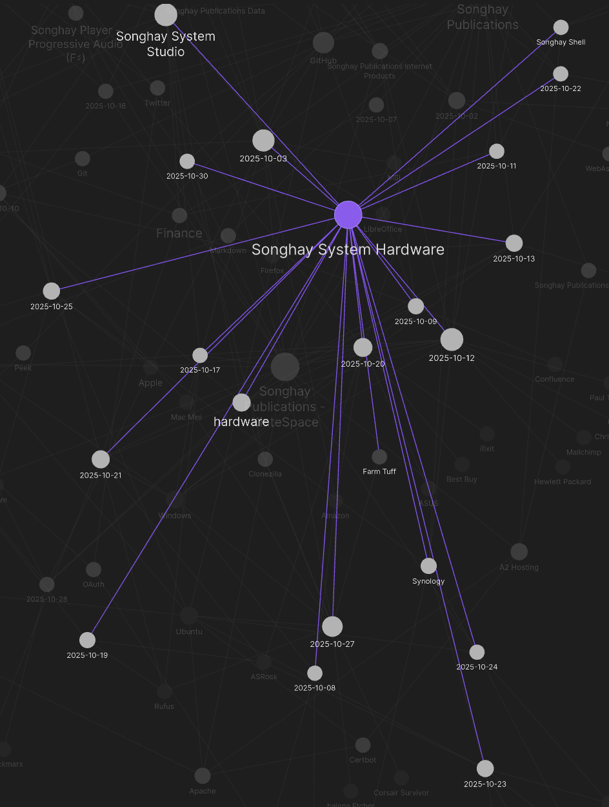
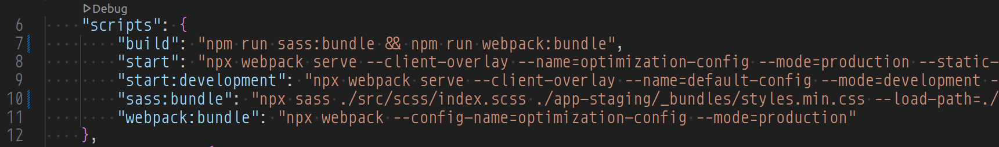
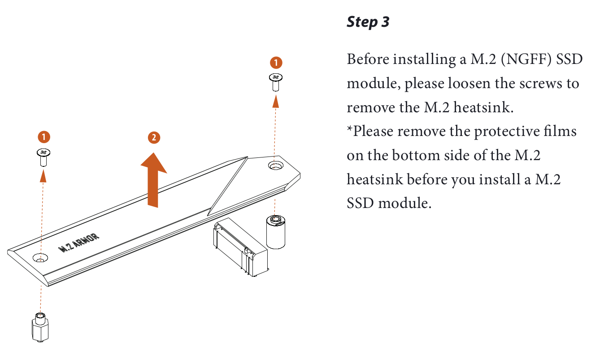
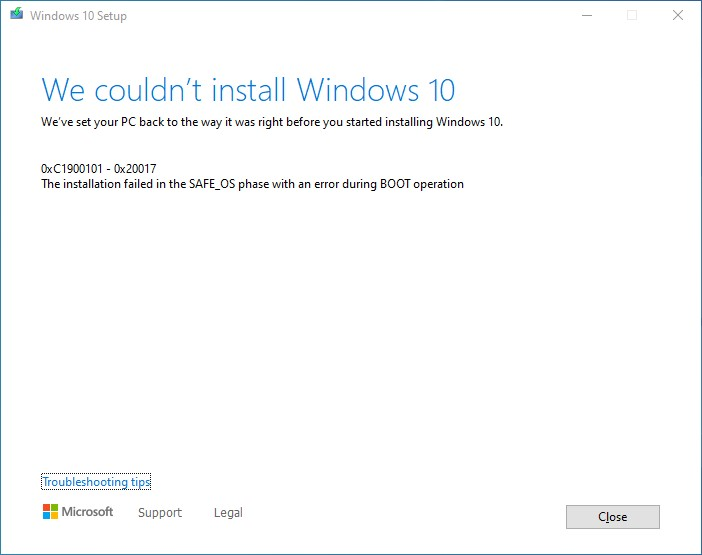

---json
{
  "documentId": 0,
  "title": "studio status report: 2025-10",
  "documentShortName": "2025-10-30-studio-status-report-2025-10",
  "fileName": "index.html",
  "path": "./entry/2025-10-30-studio-status-report-2025-10",
  "date": "2025-10-30T20:39:18.837Z",
  "modificationDate": "2025-10-30T20:39:18.837Z",
  "templateId": 0,
  "segmentId": 0,
  "isRoot": false,
  "isActive": true,
  "sortOrdinal": 0,
  "clientId": "2025-10-30-studio-status-report-2025-10",
  "tag": "{\n  \u0022extract\u0022: \u0022I instinctively procrastinated but eventually I had to face it: month 10 of 2025 was about addressing the end of support for Windows 10 in this Studio \\uD83D\\uDE10 I tracked this miserable experience (miserable, largely because I tried too many times to upgrade to \\u2026\u0022\n}"
}
---

# studio status report: 2025-10

I instinctively procrastinated but eventually I had to face it: month 10 of 2025 was about addressing the end of support for Windows 10 in this Studio 😐 I tracked this miserable experience (miserable, largely because I tried too many times to upgrade to Windows 11 on an early <acronym title="Trusted Platform Module">TPM</acronym>-based ASRock motherboard) under the relatively new topic, Songhay System Hardware:

<div style="text-align:center">



</div>

We see that over half of the month was burned up dealing with the needs of Microsoft. Here is executive summary of my response to the death of Windows 10:

- my ‘Farm Tuff’ wagon desktop PC now runs Ubuntu 24.04 on my old MSI motherboard
- my HP Envy 360 laptop was ‘cloned’ with CloneZilla and upgraded in place, according to the preferences of Microsoft

Selected notes of the month follow:

## .NET: “Compliance libraries in .NET” #to-do #day-job

>.NET provides libraries that offer foundational components and abstractions for implementing compliance features, such as data classification and redaction, in .NET applications. These abstractions help developers create and manage data in a standardized way. In this article, you get an overview on the data classification and redaction compliance libraries.
>
>…
>
>Data redaction helps protect sensitive information in logs, error messages, or other outputs to comply with privacy rules and protect sensitive data. The [Microsoft.Extensions.Compliance.Redaction](https://learn.microsoft.com/en-us/dotnet/api/microsoft.extensions.compliance.redaction) library provides various redactors, such as the [ErasingRedactor](https://learn.microsoft.com/en-us/dotnet/api/microsoft.extensions.compliance.redaction.erasingredactor) and [HmacRedactor](https://learn.microsoft.com/en-us/dotnet/api/microsoft.extensions.compliance.redaction.hmacredactor). You can configure these redactors and register them using the `AddRedaction` methods. Additionally, you can create custom redactors and redactor providers to suit your specific needs.
>
>—“[Compliance libraries in .NET](https://learn.microsoft.com/en-us/dotnet/core/extensions/compliance)”
>

## Sass: use `@use` instead of `@import` unless you can’t 😐

>The `@use` rule is intended to replace the old [`@import` rule](https://sass-lang.com/documentation/at-rules/import), but it’s intentionally designed to work differently. Here are some major differences between the two:
>
> - `@use` only makes variables, functions, and mixins available within the scope of the current file. It never adds them to the global scope. This makes it easy to figure out where each name your Sass file references comes from, and means you can use shorter names without any risk of collision.
> - `@use` only ever loads each file once. ==This ensures you don’t end up accidentally duplicating your dependencies’ CSS many times over.==
> - `@use` must appear at the beginning your file, and cannot be nested in style rules. Nested imports can be migrated to [mixin calls or `meta.load-css()`](https://sass-lang.com/documentation/breaking-changes/import/#nested-imports).
> - Each `@use` rule can only have one URL.
> - `@use` requires quotes around its URL, even when using the [indented syntax](https://sass-lang.com/documentation/syntax#the-indented-syntax).
>
>—“[Differences From @import](https://sass-lang.com/documentation/at-rules/use/#differences-from-import)”
>

The following _cannot_ be replaced by `@use`:

```sass
@import url('https://fonts.googleapis.com/css?family=Roboto:300,400,500');
```

>The replacement of `@import` for `@use`/`@forward` is specifically so that the Sass version of the import function no longer shares custody with the vanilla CSS version of it.
>
>In this instance, you're trying to use the vanilla functionality, so `@import url('https://fonts.googleapis.com/css?family=Montserrat&display=swap')` is the correct syntax to use.
>
>—[StackOverflow answer](https://stackoverflow.com/a/62938973/22944)
>

## Azure Functions: yes, `TimerTrigger` can be configurable with environment variables 😐👏

```csharp
[Function("timerFunction")]
public void Run(
    [TimerTrigger("%TIMER_SCHEDULE%", RunOnStartup = true)] TimerInfo myTimer,
    FunctionContext context
){//…}
```

>The function uses the `%TIMER_SCHEDULE%` environment variable to determine the execution schedule, making it configurable without code changes.
>
>—“[Azure Functions C# Timer Trigger using Azure Developer CLI](https://learn.microsoft.com/en-us/samples/azure-samples/functions-quickstart-dotnet-azd-timer/starter-timer-trigger-csharp/)”
>

The docs are _not_ clear about this: per the example above, use `TIMER_SCHEDULE` as the environment variable (the `%` characters are not to be used in the environment variable name).

The following is also not clear about naming the environment variable because it if focusing on naming for the `TimerTrigger`:

>You can put the schedule expression in an app setting and set this property to the app setting name wrapped in **%** signs, as `%ScheduleAppSetting%`.
>
>—“[Timer trigger for Azure Functions](https://learn.microsoft.com/en-us/azure/azure-functions/functions-bindings-timer?tabs=python-v2%2Cisolated-process%2Cnodejs-v4&pivots=programming-language-csharp)”
>

## Application Insights: “What is OpenTelemetry?”

> A brief explanation of what OpenTelemetry is and isn’t.
>
> OpenTelemetry is:
>
> - An **[observability](https://opentelemetry.io/docs/concepts/observability-primer/#what-is-observability) framework and toolkit** designed to facilitate the
>
> - [Generation](https://opentelemetry.io/docs/concepts/instrumentation)
> - Export
> - [Collection](https://opentelemetry.io/docs/concepts/components/#collector)
>
> of [telemetry data](https://opentelemetry.io/docs/concepts/signals/) such as [traces](https://opentelemetry.io/docs/concepts/signals/traces/), [metrics](https://opentelemetry.io/docs/concepts/signals/metrics/), and [logs](https://opentelemetry.io/docs/concepts/signals/logs/).
>
> - **Open source**, as well as **vendor- and tool-agnostic**, meaning that it can be used with a broad variety of observability backends, including open source tools like [Jaeger](https://www.jaegertracing.io/) and [Prometheus](https://prometheus.io/), as well as commercial offerings. OpenTelemetry is **not** an observability backend itself.
>
> A major goal of OpenTelemetry is to enable easy instrumentation of your applications and systems, regardless of the programming language, infrastructure, and runtime environments used.
>
> The backend (storage) and the frontend (visualization) of telemetry data are intentionally left to other tools.
>
> —“[What is OpenTelemetry?](https://opentelemetry.io/docs/what-is-opentelemetry/)”
>

## Publications: “In Praise of RSS and Controlled Feeds of Information”

>The focused, reductive nature of RSS readers means you don’t get the full website experience, but that is arguably for the better in a lot of cases. We already mentioned the lack of suggested articles with engagement bait that could easily draw you in, but another notable omission is the comments section. It is very easy to slip into the comments section at the bottom of an article and spend far too much time reading those. You can still do that in an RSS reader by opening the article in your browser, scrolling down to the comments and diving in. At least in my case, that is a safe amount of friction to prevent me from doing it most of the time. Less is more!
>
>—“[In Praise of RSS and Controlled Feeds of Information](https://blog.burkert.me/posts/in_praise_of_syndication/)”
>

## Bulma order of Sass 😐

The documentation shows us these “CSS Library” categories:

- Elements
- Components
- Form
- Columns
- Grid
- Layout

…which are followed by [CSS Helpers](https://bulma.io/documentation/helpers/).

Based on 2025-10-03#Bulma using `@forward` instead of `@use` 😐|previous research, the order of `@use` and `@import` appears to be:

1. Layout (with base styles, typography and themes)
2. Elements
3. Columns
4. Grid
5. Components
6. Form
7. Helpers

## Songhay Publications Internet Products: the new, fundamental `npm` scripts 😐🎏

Fundamentally, we now see two, conventional bundle scripts:

1. `sass:bundle`
2. `webpack:bundle`

All other scripts are built on top of these two:

<div style="text-align:center">



</div>

Welcome, again, to the publishing business!

## Windows 11 and Rufus

This video finally shows me why Rufus is so critical for Windows 11 installation:

<div style="text-align:center">

<figure>
    <a href="https://www.youtube.com/watch?v=J2pCBrhpdjw">
        
    </a>
    <p><small>Rufus and Windows 11 - 24H2</small></p>
</figure>

</div>

## Songhay System Hardware: Error code: `0xc0000428` stops upgrade cold 😐🧊

<div style="text-align:center">


</div>

In a lost weekend, I have seen this error message countless times:

## Songhay System Hardware: this video made me think that the SSD slot next to he graphics card under the heat shield has priority 😐

The ASRock motherboard manual shows the ‘hidden’ slot:



This video talk about the “top slot,” expansion-card SSD slots and thermal pads:

<div style="text-align:center">

<figure>
    <a href="https://www.youtube.com/watch?v=zjSn64vh_Vk">
        
    </a>
    <p><small>Don't make these mistakes with your NVMe SSD installation - NVMe tips and tricks</small></p>
</figure>

</div>

## Songhay System Hardware: I am beyond tired of this shit 😐💩

Windows 10 refuses to upgrade:

<div style="text-align:center">



</div>

```console
0xC1900101 - 0x20017
The installation failed in the SAFE_OS phase with an error during BOOT operation
```

>0xC1900101 is a frequently observed code which occurs at any stage of the upgrade process; It is also called the generic rollback code, which points to the presence of an incompatible driver. Along with updating the drivers, it is suggested that Windows Setup be run using a minimal set of drivers and startup programs by performing a clean boot before initiating the upgrade process.
>
>—“[0xC1900101 – 0x20017, Installation failed in SAFE_OS phase](https://www.thewindowsclub.com/installation-failed-in-safe_os-phase-with-an-error-during-boot-operation-0xc1900101-0x20017)”
>

Also, see “[Windows Vista, Windows 7, Windows Server 2008 R2, Windows 8.1, and Windows 10 setup log file locations](https://learn.microsoft.com/en-us/troubleshoot/windows-client/setup-upgrade-and-drivers/windows-setup-log-file-locations).”

## Songhay System Hardware: news flash 🗞⚡ <acronym title="Non-Volatile Memory, Express" >NVMe</acronym> is the replacement for SATA

>**NVM Express** (**NVMe**) or **Non-Volatile Memory Host Controller Interface Specification** (**NVMHCIS**) is an [open](https://en.wikipedia.org/wiki/Open_standard "Open standard"), [logical-device](https://en.wikipedia.org/wiki/Logical_device "Logical device") [interface](https://en.wikipedia.org/wiki/Interface_(computing) "Interface (computing)") [specification](https://en.wikipedia.org/wiki/Functional_specification "Functional specification") for accessing a computer's [non-volatile storage](https://en.wikipedia.org/wiki/Non-volatile_storage "Non-volatile storage") media usually attached via the [PCI Express](https://en.wikipedia.org/wiki/PCI_Express "PCI Express") bus. The initial _NVM_ stands for _[non-volatile memory](https://en.wikipedia.org/wiki/Non-volatile_memory "Non-volatile memory")_, which is often NAND [flash memory](https://en.wikipedia.org/wiki/Flash_memory "Flash memory") that comes in several physical form factors, including [solid-state drives](https://en.wikipedia.org/wiki/Solid-state_drive "Solid-state drive") (SSDs), PCIe add-in cards, and [M.2](https://en.wikipedia.org/wiki/M.2 "M.2") cards, the successor to [mSATA](https://en.wikipedia.org/wiki/MSATA "MSATA") cards. NVM Express, as a logical-device interface, has been designed to capitalize on the low [latency](https://en.wikipedia.org/wiki/Hard_disk_drive_performance_characteristics#Access_time "Hard disk drive performance characteristics") and internal parallelism of solid-state storage devices.
>
>—<https://en.wikipedia.org/wiki/NVM_Express>
>

These explain why cable management is so awesome in newer computers:

<div style="text-align:center">

<figure>
    <a href="https://www.youtube.com/watch?v=zjSn64vh_Vk">
        
    </a>
    <p><small>Don't make these mistakes with your NVMe SSD installation - NVMe tips and tricks</small></p>
</figure>

<figure>
    <a href="https://www.youtube.com/watch?v=r3Jy5dHOj3g">
        
    </a>
    <p><small>SSD vs HDD vs NVMe vs SATA vs mSATA vs M2: Storage Devices EXPLAINED!</small></p>
</figure>

</div>

## open pull requests on GitHub 🐙🐈

- <https://github.com/BryanWilhite/Songhay.HelloWorlds.Activities/pull/14>
- <https://github.com/BryanWilhite/dotnet-core/pull/67>

## sketching out development projects

Eliminating Angular JS in the Studio is the top priority. Replacing the Angular JS app (`http://kintespace.com/player.html`) for the kinté space depends on:

- generating a new `index.html` page with eleventy
- supplementing the index with responsive images

Proposed future items:

- complete upgrade to .NET 8.0
- switch Studio Publications from Material Design to Bulma 💄 ➡️ 💄✨
- start `Songhay.Modules.Bolero.Index` project
- generate responsive and social images with AI

🐙🐈<https://github.com/BryanWilhite/>
