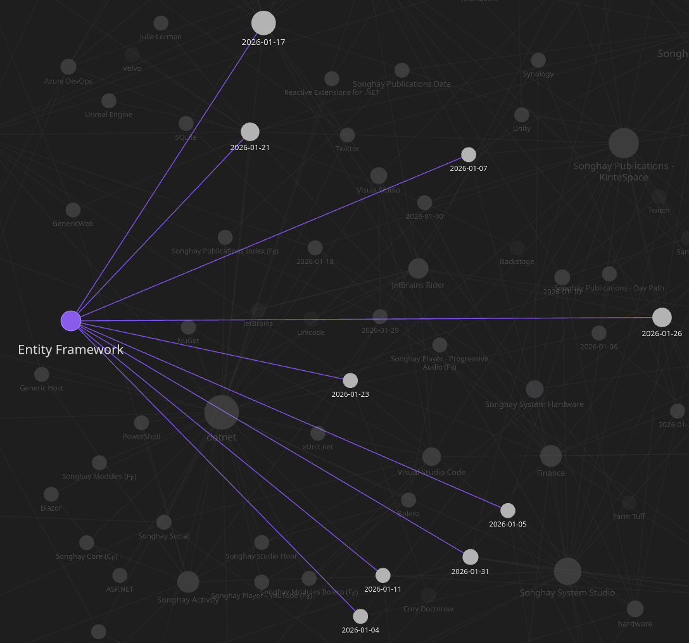
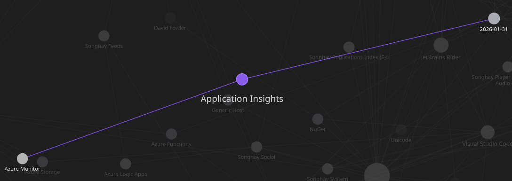
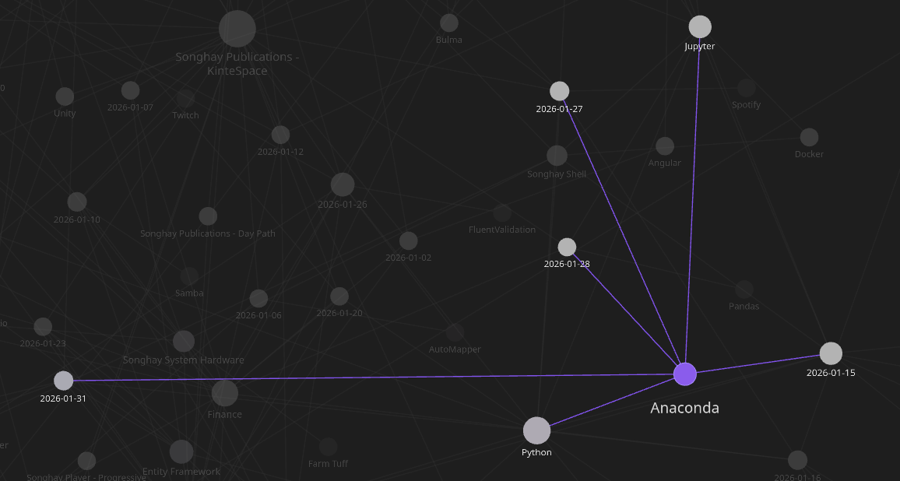

---json
{
  "documentId": 0,
  "title": "studio status report: 2026-01",
  "documentShortName": "2026-01-31-studio-status-report-2026-01",
  "fileName": "index.html",
  "path": "./entry/2026-01-31-studio-status-report-2026-01",
  "date": "2026-01-31T11:30:23.416Z",
  "modificationDate": "2026-01-31T11:30:23.416Z",
  "templateId": 0,
  "segmentId": 0,
  "isRoot": false,
  "isActive": true,
  "sortOrdinal": 0,
  "clientId": "2026-01-31-studio-status-report-2026-01",
  "tag": "{\n  \u0022extract\u0022: \u0022Month 01 of 2026 was about not getting the re-release of kintespace.com almost out the \\u2018door\\u2019\\u2014even though well over 90% is done! The month was mostly spent on #day-job drama, including: - a new understanding of DDD aggregates and how Entity Framework supp\\u2026\u0022\n}"
}
---

# studio status report: 2026-01

Month 01 of 2026 was about _not_ getting the re-release of kintespace.com almost out the ‘door’—even though well over 90% is done! The month was mostly spent on #day-job drama, including:

- a new understanding of <acronym title="Domain-Driven Design">DDD</acronym> aggregates and how Entity Framework _supports_ them
- the very real possibility that the Application Insights `TelemetryClient` can be centralized with Azure Functions middle-ware

…and then more days were used on Studio minutiae like:

- establishing modern, responsive-image conventions for Studio publications (like kintespace.com)
- how Anaconda probably needs to be reinstalled with every _minor_ release of Python

Let’s see how this vicious surprise attack of new things to learn soaked up days in this Obsidian month:

…nine days on Entity Framework…

…which overlaps with one day on Application Insights (and Azure Functions)…

…but Anaconda adds three more days of not working on Studio Publications. So we have 12 days here of _not_ re-releasing a website. Let’s regard those 12 days as ‘all’ of my ‘free’ time for this month.

…and here is a punchline: the Anaconda drama was a self-made blocker in front of establishing the new responsive image conventions aforementioned! I could have worked _around_ my Anaconda problems to get kintespace.com out the door; but, in my luxuriant poverty, I refused to do so 😐🧱

My Studio notes on responsive images start [in a Jupyter Notebook](https://github.com/BryanWilhite/jupyter-central/blob/main/wand-responsive-images/generating-responsive-images.ipynb). And every sucker for Jupyter knows that Jupyter depends on Python—and, in my case, my Studio uses Python via Anaconda. In my little world, no Anaconda means no updated responsive-image document—and no updated responsive image document means the re-release of kintespace.com is blocked.

Selected Obsidian notes of this month should provide some color:

## Testcontainers for .NET: #day-job #to-do

>Testcontainers for .NET is a library to support tests with throwaway instances of Docker containers for all compatible .NET Standard versions. The library is built on top of the .NET Docker Remote API and provides a lightweight implementation to support your test environment in all circumstances.
>
>Choose from existing pre-configured modules and start containers within a second, to support and run your tests. Or create your own container images with Dockerfiles and run your containers and tests immediately afterward.
>
>—<https://dotnet.testcontainers.org/>
>

The following video is a not-so-great intro to `Testcontainers.MsSql` \[📖 [docs](https://dotnet.testcontainers.org/modules/mssql/) \]:

<figure>
    
    
<small>The Common Entity Framework Mistake You MUST Fix</small>

</figure>

## Angular: “Forms with Angular Signals”

>Signal Forms is ==an experimental library== that allows you to manage form state in Angular applications by building on the reactive foundation of signals. With automatic two-way binding, type-safe field access, and schema-based validation, Signal Forms help you create robust forms.
>
>—“[Forms with Angular Signals](https://angular.dev/guide/forms/signals/overview)”
>

## Entity Framework: does the `DatabaseFacade` class \[📖 [docs](https://learn.microsoft.com/en-us/dotnet/api/microsoft.entityframeworkcore.infrastructure.databasefacade?view=efcore-10.0) \] replace Dapper? #to-do #day-job

The short answer is, _yes_ 👇

<figure>
    
    
<small>Will This New EF Core Feature Be The End Of Dapper?</small>

</figure>

<figure>
    
    
<small>Everything You Need To Know About EF Core 8 Raw SQL Queries</small>

</figure>

## .NET Facets over AutoMapper? #day-job #to-do

!Pasted image 20260106092909.png

>Think of a diamond. The whole stone is your domain model, it contains everything about the entity. But when you view it from different angles, you see different **facets**, specific views that show only what matters from that perspective.
>
>—“[Facets in .NET](https://tim-maes.com/blog/2025/09/28/facets-in-dotnet-(2)/)”
>

<figure>
    
    
<small>Stop Mapping in .NET Use Facets Instead</small>

</figure>

## Entity Framework: about four ways to see the generated <acronym title="Structured Query Language">SQL</acronym> #day-job #to-do

1. `Microsoft.EntityFrameworkCore.Database.Command` in `appsettings.json`
2. `ToQueryString()` extension method
3. `LogTo()` call in `Program.cs`
4. Visual Studio debug visualization

Background reading:

- “[How to Show the Generated SQL Query in EF Core](https://code-maze.com/efcore-show-generated-sql-query/)”
- “[3 Ways to View and Log the SQL Generated by Entity Framework Core 5](https://eamonkeane.dev/3-ways-to-view-sql-generated-by-entity-framework-core-5/)”
- “[Enabling Detailed Entity Framework Error Logging for Better Debugging](https://www.tekonline.com.au/enabling-detailed-entity-framework-error-logging-for-better-debugging/)”

## Publications: “Why Developers Are Ditching Frameworks for Vanilla JavaScript”

>The problem wasn’t frameworks themselves; [it was the culture that grew around them](https://thenewstack.io/how-to-build-framework-agnostic-uis-with-web-components/). New frameworks emerged monthly, each claiming to fix what the last one broke. Companies refactored entire products just to keep up with the shifting ecosystem. The result? Endless churn, [technical debt disguised as innovation](https://www.atlassian.com/agile/software-development/technical-debt), and developers trapped in a loop of constant relearning.
>
>In 2025, the realization hit: The web doesn’t need another layer. It needs a reset. And that reset came in the form of Vanilla JavaScript.
>
>—“[Why Developers Are Ditching Frameworks for Vanilla JavaScript](https://thenewstack.io/why-developers-are-ditching-frameworks-for-vanilla-javascript/?utm_source=TrendingTech&utm_medium=email&utm_content=subscriber_id:5595802&utm_campaign=Weekly%20Technology%20Trends%20-%201/9/26)”
>

## Songhay Player (C♯) and #day-job: can `TelemetryClient` be moved to middle-ware?

Today at the #day-job, I learned about `IFunctionsWorkerMiddleware` as introduced in “[Azure Functions – Middleware (dotnet-isolated)](https://salihcantekin.com/azure-functions-middleware-dotnet-isolated/).” This leads to the following questions:

- can `FunctionContext` be passed correctly with the `HttpTrigger` Azure Functions signature? (Without this, data cannot be passed from the function method to the middle-ware—e.g. `context.Items["MyCustomData"] = "Hello from function!";`)
- does `FunctionContext` _actually_ contain the function parameters—as explained in a [StackOverflow answer](https://stackoverflow.com/a/73801544/22944) (see \[📖 [docs](https://learn.microsoft.com/en-us/dotnet/api/microsoft.azure.functions.worker.bindingcontext.bindingdata?view=azure-dotnet#microsoft-azure-functions-worker-bindingcontext-bindingdata) \])?

## Internet Products: yes, there are responsive-image testing tools—starting with the browser tools 😐📋 #to-do

- “[How to test Responsive Images](https://www.browserstack.com/guide/how-to-test-responsive-images)” (Google Chrome Device Mode and the BrowserStack Responsive Tool)
- TOOLSADAY [Responsive Image Checker](https://toolsaday.com/seo/responsive-image-checker)

## .NET C♯: “World's Fastest .NET CSV Parser.” #day-job #to-do 😐

>Modern, minimal, fast, zero allocation, reading and writing of separated values (`csv`, `tsv` etc.). Cross-platform, trimmable and AOT/NativeAOT compatible. Featuring an opinionated API design and pragmatic implementation targetted at machine learning use cases.
>
>—<https://github.com/nietras/Sep>
>

## mystery solved: KDE Plasma does _not_ use the equivalent of the GNOME “keyring” by default 😐💡✨

>[!important]
>By default, KDE Plasma requires calling `ssh-add` manually which is tedious but more secure.

This [SuperUser answer](https://superuser.com/a/819805) _finally_ reveals what has been going on:

>…you might want to just start [`ssh-agent` in your `.bash_profile`](https://wiki.archlinux.org/index.php/SSH_keys#ssh-agent) and eval the output instead of starting a subshell, and then use `ssh-add` yourself manually once each time you log in.
>
>Another option would be to use the [GNOME Keyring](https://wiki.archlinux.org/index.php/GNOME_Keyring)'s SSH agent emulation instead of using `ssh-agent`. Unlike `ssh-agent` that doesn't save your passphrase, the GNOME Keyring will store the passphrase to the key in a keyring so you don't have to add keys manually.
>

These revelations lead to comparing GNOME Keyring and KWallet KDE Wallet:

>Alright, let’s break down what these two are all about. At their core, **GNOME Keyring** and **KWallet** are essentially digital vaults designed to store your sensitive credentials – think usernames, passwords, API keys, and even SSH/GPG keys – in an encrypted format. They act as a central hub, so instead of remembering dozens of complex passwords, you only need to recall one master password.
>
>- **GNOME Keyring:** This is the default password manager for the GNOME desktop environment, which is common in distributions like Ubuntu and Fedora. It’s designed to work seamlessly in the background, integrating with applications like NetworkManager for Wi-Fi passwords, web browsers, and other GNOME-native apps.
>- **KWallet KDE Wallet:** Similarly, KWallet is the go-to password manager for the KDE Plasma desktop environment, prevalent in Kubuntu and many other distributions. It serves the same purpose: securely storing passwords and other secrets, and integrating with KDE applications, browsers, and system services.
>
>—“[Gnome Keyring And KWallet: Your Linux Password Managers Explained](https://www.acciyo.com/gnome-keyring-and-kwallet-your-linux-password-managers-explained/)”
>

## my biggest Entity Framework talk of 2025 #to-do 😐

<figure>
    
    
<small>Stop using Entity Framework as a DTO provider! - Chris Klug - Azure Dev Summit 2025</small>

</figure>

### related reading

- “[Table Splitting in EF Core: When to Use It (and Why It Hurts Sometimes)](https://bytecrate.dev/table-splitting-ef-core-when-to-use-why-it-hurts/)”
- “[Shadow and Indexer Properties](https://learn.microsoft.com/en-us/ef/core/modeling/shadow-properties)”
- “[Model configuration for auto-including navigations](https://learn.microsoft.com/en-us/ef/core/querying/related-data/eager#model-configuration-for-auto-including-navigations)”
- “[Configuring a value converter](https://learn.microsoft.com/en-us/ef/core/modeling/value-conversions?tabs=data-annotations)” (shows the `HasConversion` method)
- “[Dynamic EF operations with `EF.Property`](https://www.alwaysdeveloping.net/dailydrop/2022/09/06-ef-property/)”
- “[The Fluent API `HasDiscriminator` Method](https://www.learnentityframeworkcore.com/configuration/fluent-api/hasdiscriminator-method)”
- “[EF Core Lazy Loading Explained & Best Practices (2025)](https://amarozka.dev/ef-core-lazy-loading/)” (because Chris Klug consistently doe not recommend lazy loading)

## Entity Framework: “the Aggregate pattern is about transactional consistency”

Wow, I had no idea that _eventual consistency_ was related to <acronym title="Domain-Driven Design">DDD</acronym>:

>First and foremost the Aggregate pattern is about transactional consistency. At the end of a committed database transaction, a single Aggregate should be completely up to date. That means that any business rules regarding data consistency must be met and the persistence store should hold that consistent state, leaving the Aggregate correct and ready to use by the next use case. Figure 1 illustrates two such consistency boundaries, with two different Aggregates.
>
>…
>
>The problem that many have with designing Aggregates is that they don’t consider the true business constraints that require data to be transactionally consistent and instead design Aggregates in large clusters as shown in Figure 2. Designing Aggregates in this way is a big mistake if you expect them (1) to be used by many thousands of users, (2) to perform well, and (3) to scale to the demands of the Internet.
>
>…
>
>When two or more Aggregates have at least some dependencies on updates, use eventual consistency.
>
>—“[Modeling Aggregates with DDD and Entity Framework](https://kalele.io/modeling-aggregates-with-ddd-and-entity-framework/)”
>

By the way, this article goes on to show me how an interface can be used to define the <acronym title="Domain-Driven Design">DDD</acronym> ‘business-rule’ members to be implemented by the ‘domain model’ class:

>I think you get the idea. We create an interface that we want our client to see and we hide the implementation details inside the implementing class.

However, the article turns _against_ the use of interfaces:

>There is really no good reason to create a Separated Interface. It would be very unlikely that we would ever create two or more implementations of `IProduct` or any of the other interfaces. The best reason we have for creating a Separated Interface is when there could be or are multiple implementations, and is just not going to happen in this Core Domain.

## Anaconda: “`CondaEnvironmentError`: cannot remove current environment”

>The error "`CondaEnvironmentError`: cannot remove current environment" occurs for multiple reasons:
>
> 1. Trying to delete a `conda` environment that is currently active.
> 2. Using an incorrect command to delete a `conda` environment.
> 3. Trying to delete the `base` conda environment which cannot be deleted.
>
>—“[`CondaEnvironmentError`: cannot remove current environment](https://bobbyhadz.com/blog/condaenvironmenterror-cannot-remove-current-environment)”
>

There we have the first written evidence (from a third party) that the `base` environment cannot be deleted.

…

The following statements about Anaconda have to be verified ( #to-do ):

- tools like `anaconda-navigator` _always_ run off the `base` environment
- environments cannot be upgraded _beyond_ a major release of `python` (my observed behavior of `conda update python` \[📖 [docs](https://docs.conda.io/projects/conda/en/latest/user-guide/tasks/manage-python.html#updating-python) \])
- the _only_ way to work with the next major release of `python` (without reinstalling Anaconda entirely) is to generate a new environment (e.g. `conda create -n myenv python=3.14` \[📖 [docs](https://docs.conda.io/projects/conda/en/latest/user-guide/tasks/manage-environments.html#creating-an-environment-with-commands) \])
- the `base` environment of Anaconda is ‘trapped’ on the major release of python that was available when it was installed

When my last bullet point up there is found to be true, then:

- Why should all of these data science packages like Pandas and Jupyter Notebooks be installed in the `base` environment by default? Is there a way to disable this—or is this one of the reasons why Miniconda exists?
- Do they expect us to use the `base` environment as some kind of read-only guide for adding packages (manually?) to a new environment that we must generate? Is the `base` environment the ‘reference environment’?

## open pull requests on GitHub 🐙🐈

- <https://github.com/BryanWilhite/Songhay.HelloWorlds.Activities/pull/14>
- <https://github.com/BryanWilhite/dotnet-core/pull/67>

## sketching out development projects

- upgrade `SonghayCore`, `Songhay.Publications`, `Songhay.DataAccess`, etc. to .NET 10 📦🔝
- consider using Lerna to coordinate the two levels of `npm` scripts 🧠👟
- use a Jupyter Notebook to track finding and changing Amazon links to open source links 📓⚙
- use a Jupyter Notebook to convert flickr links to Publications (responsive image) links 📓⚙
- establish `DataAccess` logic for Obsidian markdown metadata 🔨✨
- establish `DataAccess` logic for Index data, including adding and removing Obsidian documents (and Segments) 🔨✨
- package `DataAccess` logic in `*Shell` project for `npm` scripting 🚜✨
- convert rasx() context repo to the relevant conventions shown in the diagram above 🔨🚜
- retire the old `kinte-space` repo for kintespace.com 🚜🧊
- convert Songhay Day Path Blog repo to the relevant conventions shown in the diagram above 🔨🚜
- re-release Songhay Dashboard by updating its repo to the relevant conventions shown in the diagram above 🔨🚜
- start development of Songhay Publications Index (F♯) experience for WebAssembly 🍱✨
- start development of Songhay Publications - Data Editor to establish a <acronym title="Graphical User Interface">GUI</acronym> for `*Shell` and provide visualizations and interactions for Publications data 🍱✨

🐙🐈<https://github.com/BryanWilhite/>
