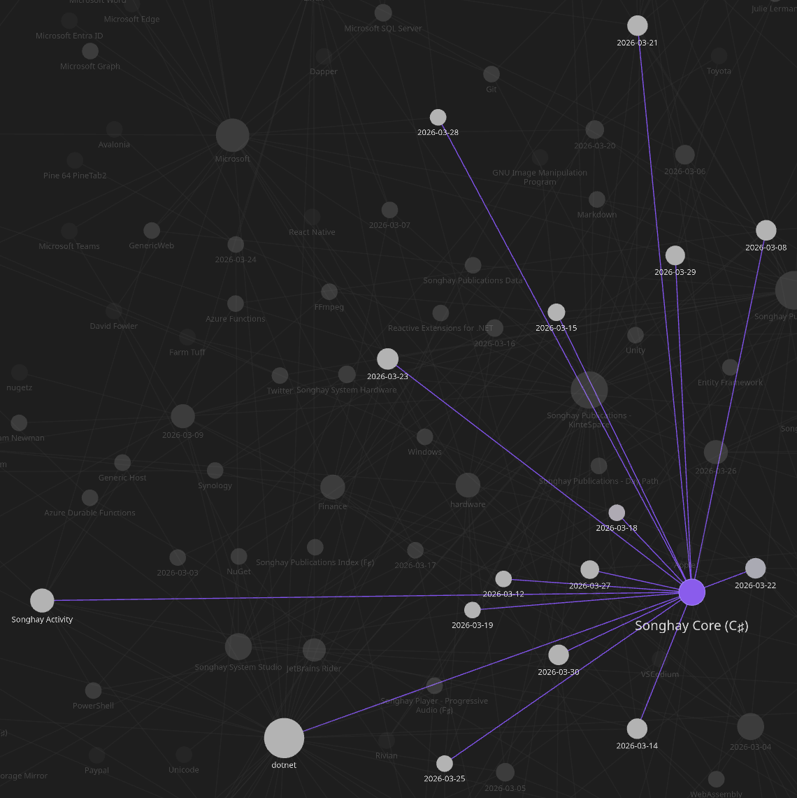
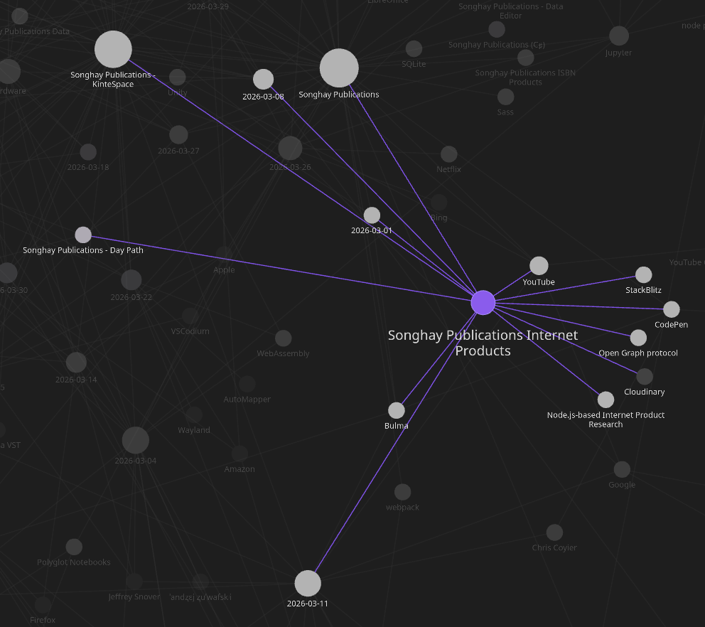
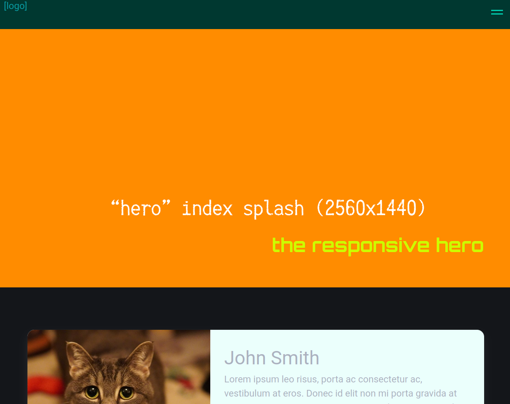
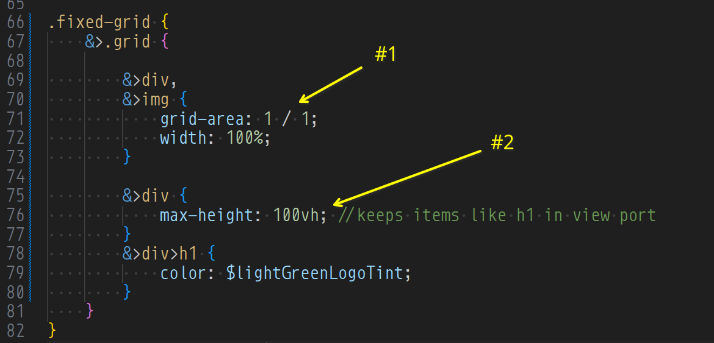

---json
{
  "documentId": 0,
  "title": "studio status report: 2026-03",
  "documentShortName": "2026-03-31-studio-status-report-2026-03",
  "fileName": "index.html",
  "path": "./entry/2026-03-31-studio-status-report-2026-03",
  "date": "2026-03-31T20:02:14.046Z",
  "modificationDate": "2026-03-31T20:02:14.046Z",
  "templateId": 0,
  "segmentId": 0,
  "isRoot": false,
  "isActive": true,
  "sortOrdinal": 0,
  "clientId": "2026-03-31-studio-status-report-2026-03",
  "tag": "{\n  \u0022extract\u0022: \u0022Month 03 of 2026 continued not getting the re-release of kintespace.com almost out the \\u2018door.\\u2019 This delay is well within the realm of inexcusable! Here were my alleged blockers: - At the beginning of this month, I wrote in my notes, \\u2019The time is long over\\u2026\u0022\n}"
}
---

# studio status report: 2026-03

Month 03 of 2026 continued _not_ getting the re-release of kintespace.com almost out the ‘door.’ This delay is well within the realm of inexcusable! Here were my alleged blockers:

- At the beginning of this month, I wrote in my notes, ’The time is long overdue to get to know the `FormData` \[📖 [docs](https://developer.mozilla.org/en-US/docs/Web/API/FormData) \] interface as a foundational abstraction in [[JavaScript]].’ …and then I took a day writing extensive notes 😐
- I made other new [[Entity Framework]] notes for #day-job and Studio futures, officially recognizing “[Field-only properties](https://learn.microsoft.com/en-us/ef/core/modeling/backing-field?tabs=fluent-api#field-only-properties)” for the first time (because this is foundation of building with <acronym title="Entity Framework">EF</acronym> under the influence of <acronym title="Domain-Driven Design">DDD</acronym>).
- I slipped into possibly needing paging rows from [[Microsoft SQL Server]] at the current #day-job, discovering to my embarrassment that `OFFSET` has been around since SQL Server 2012 (11.x) 😐😲 …more notes for the day there…
- Then (mid-month) I had to start filling out my U.S. tax forms for 2025 🤦
- _Then_ I started working (obsessively) on a new <acronym title="pull request">PR</acronym> ([Dev/version 10.0.0#187](https://github.com/BryanWilhite/SonghayCore/pull/187)) for the .NET 10 version of `SonghayCore` ⌛

This ‘obsession’ ate up about 12 days for month 03:



Only three days were used for Publications:



Selected notes of month 03 follow:

## [[Songhay Publications Internet Products|Internet Products]]: the index cards layout has problems


- the cards are too tall above the [[Bulma]] widescreen breakpoint
- there is a ‘flash’ of white space on the bottom of the card image

## [[Songhay Publications Internet Products|Internet Products]]: the responsive ‘hero’ image layout is functional 😐

The two-cell <acronym title="Cascading Style Sheets">CSS</acronym> grid layout appears to be a success:





1. the `grid-area` selection applied to both cells of this two-cell grid here is the ‘secret sauce’ that makes `img` effectively a background image (also, selecting a `width` of 100% assure that the grid will not “flash” white space on the x-sides)
2. the `max-height` selection of `100vh` prevents the visuals ‘stacked’ on top of `img` from falling out of the view port

## [[Polyglot Notebooks]]: “DEPRECATION ANNOUNCEMENT: Polyglot Notebooks” 😐😠

They have not done something like this, so personal to me, since they dropped Microsoft Money:

>The Polyglot Notebooks Extension will be deprecated on **March 27th, 2026**.
>
>## ❓What This Means
>
> - **The extension will not be disabled or uninstalled from your VS Code.**
> - **You can continue using the extension after the deprecation date if you don't uninstall it, but future VS Code updates may eventually break it.**
> - No new features will be added to Polyglot Notebooks or the .NET Interactive kernel for Jupyter notebook usage.
> - Bug fixes and support will end immediately.
> - The extension will be marked as deprecated in the VS Code marketplace.
> - Issues in this repository related to the Polyglot Notebooks extension will be closed as not planned.
> - Issues in this repository related to using .NET Interactive as a kernel in other Jupyter frontends will be closed as not planned.
>
>—“[DEPRECATION ANNOUNCEMENT: Polyglot Notebooks](https://github.com/dotnet/interactive/issues/4163)”
>

This is a definitive kick in the face for data scientists:

>"This is a disaster for us. We use polyglot Notebooks for All our data science courses. All the people saying do not trust or rely on Microsoft were sadly right again," [remarked](https://old.reddit.com/r/programming/comments/1r28bdg/microsoft_discontinues_polyglot_notebooks_c/o4y6q7o/) a user on Reddit.
>
>The deprecation has surfaced another long-standing issue, which is that Azure Data Studio (ADS), a fork of VS Code specifically for working with SQL databases, is set for retirement at the end of this month. The main replacement for ADS is meant to be the SQL Server extension for VS Code, but ==Polyglot Notebooks were documented as the recommended replacement for data analysts==, as opposed to developers or DBAs (database administrators).
>
>—“[Microsoft deprecates Polyglot Notebooks: Developers react](https://www.devclass.com/databases/2026/02/14/microsoft-deprecates-polyglot-notebooks-developers-react/4091167)”
>

## [[Steve Sanderson]] answers the need to specify the hell out of <acronym title="Artificial Intelligence">AI</acronym> 😐

<figure>
    <a href="https://www.youtube.com/watch?v=L1w6wBxhpgE">
        
    </a>
    <p><small>Keynote: AI-Powered App Development - Steve Sanderson - NDC London 2026</small></p>
</figure>

Instead of doing something resembling something I saw in a [[JetBrains]] lecture (the “[[2025-07-02#dotnet .NET <acronym title="Artificial Intelligence">AI</acronym> the Intent Integrity Chain 😐⛓|intent integrity chain]]”), Sanderson introduces what the “community” is actually doing: [Agent Skills](https://github.com/heilcheng/awesome-agent-skills#what-are-agent-skills):

>Think of **Agent Skills** as "how-to guides" for AI assistants. Instead of the AI needing to know everything upfront, skills let it learn new abilities on the fly, like giving someone a recipe card instead of making them memorize an entire cookbook.

The bit about Ralph Wiggum reveals that <acronym title="Artificial Intelligence">AI</acronym> agents can deliberately _not_ complete a task—so they have to be told to finish, sometimes repeatedly:


<https://ralph-wiggum.ai/>

## [[AuthHero]]: “SPA Authentication: A Complete Guide (2026)”

Here is my introduction to <acronym title="Backend-for-Frontend">BfF</acronym>:

>The "best" way to implement authentication depends on a single critical question: **Does your session need to live on one domain, or across many?**
>
>### 1. The BFF (Backend-for-Frontend) ⭐ Recommended
>
>**The gold standard for security.** A server-side proxy handles the login and stores tokens in a secure, server-side session. The SPA only sees a first-party, `Secure`, `HttpOnly` cookie.
>
>—“[SPA Authentication: A Complete Guide (2026)](https://www.authhero.net/guides/spa-authentication#spa-authentication-a-complete-guide-2026)”
>

### additional reading

- “[Sam Newman - Backends For Frontends](https://samnewman.io/patterns/architectural/bff/)”
- “[Backend-for-Frontend (BFF) Architecture in 2025: Why Developers Should Care|Dev Tech Insights](https://devtechinsights.com/backend-for-frontend-bff-architecture-2025/)”
- “[Backends for Frontends pattern](https://learn.microsoft.com/en-us/azure/architecture/patterns/backends-for-frontends)”
- “[Authentication and authorization to APIs in Azure API Management](https://learn.microsoft.com/en-us/azure/api-management/authentication-authorization-overview)”

## [[Dapper]]: “How C# Strings Silently Kill Your SQL Server Indexes in Dapper” #day-job #to-do 

`nvarchar`-to-`varchar` conversion is effectively a full table scan:

>When you pass a C# `string` through an anonymous object, Dapper maps it to `nvarchar(4000)`. That’s the default mapping for `System.String` in ADO.NET — and honestly, it makes sense from a “safe default” perspective. But if your column is `varchar`, SQL Server has to convert _every single value in the column_ to `nvarchar` before it can compare. This is called **CONVERT_IMPLICIT**, and it means SQL Server can’t use your index. Full scan. Every time.
>
>…
>
>The fix is almost embarrassingly simple. You just tell Dapper explicitly that the parameter is `varchar`, not `nvarchar`. You do this with `DynamicParameters` and `DbType.`
>
>—“[How C# Strings Silently Kill Your SQL Server Indexes in Dapper](https://consultwithgriff.com/dapper-nvarchar-implicit-conversion-performance-trap)”
>

## [[Microsoft SQL Server]]: `OFFSET` has been around since SQL Server 2012 (11.x) and later versions #day-job 😐😲

I castigate myself by openly admitting (in these notes) that I was unaware that [[Microsoft SQL Server]] supported “paging” data with `OFFSET` \[📖 [docs](https://learn.microsoft.com/en-us/sql/t-sql/queries/select-order-by-clause-transact-sql?view=sql-server-ver17#offset--integer_constant--offset_row_count_expression---row--rows-) \] since the 2012 time frame 🤦 I have been unaware of this for over 14 years!

Previously, I thought MySQL was strangely alone in this functionality among the databases used in my Studio. While MySQL uses `LIMIT` and `OFFSET` \[📖 [docs](https://dev.mysql.com/doc/refman/8.4/en/select.html) \], it appears that SQL Server uses `TOP` and `OFFSET`. By the way, speaking of the databases used in my Studio, [[SQLite]] also uses `LIMIT` and `OFFSET` \[📖 [docs](https://sqlite.org/lang_select.html#limitoffset) \].

**Further reading:** “[SQL Server Pagination with `COUNT(*)` `OVER()` Window Function](https://consultwithgriff.com/sql-pagination-count-over-trick)” 📖

## [[eleventy]]: “Eleventy v4 will be Build Awesome v4.”—what the hell is this? 😐

>First and foremost, it’s very important to recognize how instrumental Font Awesome has been to the progress the Eleventy project has made in the last 18 months — and you can review a lot of those in the [Eleventy, 2025 in Review](https://www.11ty.dev/blog/review-2025/) highlights!
>
>Secondly, ==the name change== is _not_ a clean break for Eleventy — this is a continuation of the open source project under the larger Awesome banner. Eleventy v4 will be Build Awesome v4. I, [Zach](https://zachleat.com/), am still lovingly shepherding the open source project forward, the same as before.
>
>—“[What does Build Awesome mean for Eleventy?](https://www.11ty.dev/blog/build-awesome/#what-does-build-awesome-mean-for-eleventy)”
>

## stupid [[jQuery]] tricks: selecting the text of an `option` element instead of its `.val()` 😐🐕

The following will get the contents of the `option.value` attribute:

```javascript
const myValue = $('select#my-thing').val();
```

…but _sometimes_ we’ll need the `.text()` of the selected `option`; we can get this using the `:selected` pseudo class:

```javascript
const myThing = $('select#my-thing');
const myValue = $('option:selected', myThing).text();
```

## [[RxJS]]: “Advanced RxJS with Ben Lesh | Build IT Better S01E16”

The title of this video is misleading:

<figure>
    <a href="https://www.youtube.com/watch?v=ehwaPIZwMuE">
        
    </a>
    <p><small>Advanced RxJS with Ben Lesh | Build IT Better S01E16</small></p>
</figure>

One of the big takeaways from this talk is the large number of [[JavaScript]] libraries that “accidentally” reinvents the Observable.

## [[Songhay Core (C♯)]]: `HtmlUtility` re-org 😐🚜

Here is the new intent:

```tree
.
├── Models
│   ├── RegexScalars.cs
.
.
├── Xml
│   ├── HtmlUtility._.cs
│   └── HtmlUtility.Regex.cs ✨
└── RegexUtility.cs ✨
```

- `RegexScalars.cs` centralizes all `Regex` patterns in the entire Core.
- `HtmlUtility._.cs` is the old `HtmlUtility.cs`, renamed for traditional partial-class file ordering preferences.
- `HtmlUtility.Regex.cs` centralizes all HTML-string-related `Regex` partial methods and pattern getters in one place.
- `RegexUtility.cs` centralizes all ‘simple’-string-related `Regex` partial methods and pattern getters in one place.

## [[VSCodium]]: okay, while working on a _plain_ text file…

…at the #day-job, I was unable to use the <key>Ctrl + d</key> convention to multi-select instances of the same text because the stupid-ass “co-pilot” shit was in the way (this might have been due to my recent installation of [Data Wrangler](https://code.visualstudio.com/docs/datascience/data-wrangler) and its <acronym title="Artificial Intelligence">AI</acronym> hard sell). This disrespect from [[Microsoft]] prompted me to start a [[VSCodium]] install.

## open pull requests on GitHub 🐙🐈

- <https://github.com/BryanWilhite/SonghayCore/pull/187>
- <https://github.com/BryanWilhite/Songhay.HelloWorlds.Activities/pull/14>
- <https://github.com/BryanWilhite/dotnet-core/pull/67>

## sketching out development projects

- upgrade `SonghayCore`, `Songhay.Publications`, `Songhay.DataAccess`, etc. to .NET 10 📦🔝
- consider using Lerna to coordinate the two levels of `npm` scripts 🧠👟
- use a Jupyter Notebook to track finding and changing Amazon links to open source links 📓⚙
- use a Jupyter Notebook to convert flickr links to Publications (responsive image) links 📓⚙
- establish `DataAccess` logic for Obsidian markdown metadata 🔨✨
- establish `DataAccess` logic for Index data, including adding and removing Obsidian documents (and Segments) 🔨✨
- package `DataAccess` logic in `*Shell` project for `npm` scripting 🚜✨
- convert rasx() context repo to the relevant conventions shown in the diagram above 🔨🚜
- retire the old `kinte-space` repo for kintespace.com 🚜🧊
- convert Songhay Day Path Blog repo to the relevant conventions shown in the diagram above 🔨🚜
- re-release Songhay Dashboard by updating its repo to the relevant conventions shown in the diagram above 🔨🚜
- start development of Songhay Publications Index (F♯) experience for WebAssembly 🍱✨
- start development of Songhay Publications - Data Editor to establish a <acronym title="Graphical User Interface">GUI</acronym> for `*Shell` and provide visualizations and interactions for Publications data 🍱✨

🐙🐈<https://github.com/BryanWilhite/>
