---json
{
  "documentId": 0,
  "title": "studio status report: 2026-05",
  "documentShortName": "2026-05-30-studio-status-report-2026-05",
  "fileName": "index.html",
  "path": "./entry/2026-05-30-studio-status-report-2026-05",
  "date": "2026-05-30T22:28:06.003Z",
  "modificationDate": "2026-05-30T22:28:06.003Z",
  "templateId": 0,
  "segmentId": 0,
  "isRoot": false,
  "isActive": true,
  "sortOrdinal": 0,
  "clientId": "2026-05-30-studio-status-report-2026-05",
  "tag": "{\n  \u0022extract\u0022: \u0022I have not yet released kintespace.com. I am still working on the Index (home \\uD83C\\uDFE0\\uD83D\\uDCC4): kintespace.com Index page What is left to do (generally\\u2014without rabbit holes \\uD83D\\uDC07\\uD83D\\uDD73) are a few bits: - use a flowing flex layout of \\u2018visitor thumbs\\u2019 in the space visitors s\\u2026\u0022\n}"
}
---

# studio status report: 2026-05

I have not yet released kintespace.com. I am still working on the Index (home 🏠📄):


What is left to do (generally—without rabbit holes 🐇🕳) are a few bits:

- use a flowing flex layout of ‘visitor thumbs’ in the space visitors section 🍱✨
- render YouTube ‘top ten’ videos in the space visitors section 🍱✨
- generate an [[Open Graph protocol]] image for the Index page 🖼⚙✨

Month 05 of this year has over _twenty_ days of working toward the release of kintespace.com:


The biggest rabbit hole 😐🐰🕳 of the month was around my desire to use Jupyter Notebooks (hooking into ImageMagick via Python) to generate the images for Index (shown above). This approach will allow me to preserve the repetitive procedures needed to generate multiple images of the same size and visual style.

Selected notes below should reveal the miserable details:

## Internet Products: `console.log(getIndexData())` returns the expected global data in `11ty/.eleventy.js` ✋👓✅

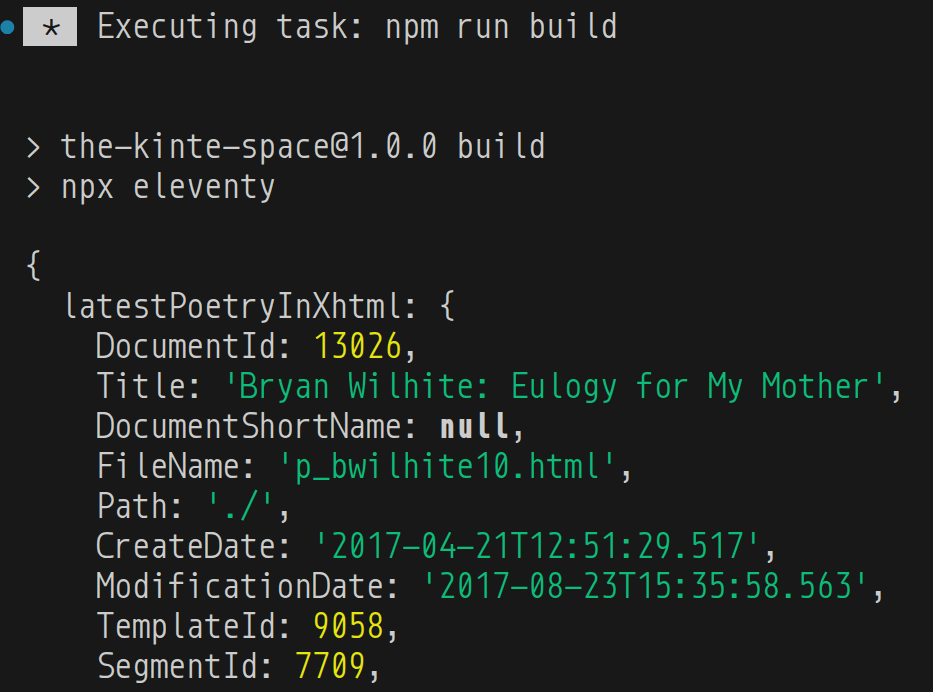

```json
{
  latestPoetryInXhtml: {
    DocumentId: 13026,
    Title: 'Bryan Wilhite: Eulogy for My Mother',
    DocumentShortName: null,
    FileName: 'p_bwilhite10.html',
    Path: './',
    CreateDate: '2017-04-21T12:51:29.517',
    ModificationDate: '2017-08-23T15:35:58.563',
    TemplateId: 9058,
    SegmentId: 7709,
    IsRoot: true,
    IsActive: true,
    SortOrdinal: null,
    ClientId: 'b6cf01d8-229d-44e7-9312-7f56f437b454',
    Tag: null
  },
  latestPoetryInPdf: {
    DocumentId: 9313,
    Title: 'David Mandessi Diop: Aux Mystificateurs',
    DocumentShortName: null,
    FileName: 'p_daviddiop3.html',
    Path: './',
    CreateDate: '2006-06-21T12:47:48',
    ModificationDate: '2011-07-12T16:35:16.65',
    TemplateId: 9058,
    SegmentId: 4516,
    IsRoot: true,
    IsActive: true,
    SortOrdinal: null,
    ClientId: '2006-06-21-12-47-48-IDAMAQDBIDANAQDB-1',
    Tag: '2011-07-Upgrade'
  },
  latestPoetryInStreams: {
    DocumentId: 9985,
    Title: 'Kai Davis: The Kai Davis Collection (YouTube.com)',
    DocumentShortName: null,
    FileName: 'p_kai_davis.html',
    Path: './',
    CreateDate: '2011-12-26T20:25:26',
    ModificationDate: '2017-01-19T16:32:12.04',
    TemplateId: 9058,
    SegmentId: 4691,
    IsRoot: true,
    IsActive: true,
    SortOrdinal: null,
    ClientId: '2011-12-26-20-25-26-IDAJQKACIDAKQKAC-1',
    Tag: null
  },
  latestProse: {
    DocumentId: 13023,
    Title: 'Ezrah Aharone: Nat Turner’s Mental and Military Motivations',
    DocumentShortName: null,
    FileName: 'kp_aharone24.html',
    Path: './',
    CreateDate: '2016-12-08T21:24:50.547',
    ModificationDate: '2016-12-08T21:24:50.547',
    TemplateId: 9059,
    SegmentId: 7707,
    IsRoot: true,
    IsActive: true,
    SortOrdinal: null,
    ClientId: null,
    Tag: null
  },
  latestInterviewsAndDocumentary: {
    DocumentId: 13043,
    Title: 'MIKE D.: Unseen Interviews Collection',
    DocumentShortName: null,
    FileName: 'p_reel_black00.html',
    Path: './',
    CreateDate: '2017-07-27T15:37:53.623',
    ModificationDate: '2017-08-23T15:36:54.95',
    TemplateId: 9058,
    SegmentId: 7712,
    IsRoot: true,
    IsActive: true,
    SortOrdinal: null,
    ClientId: 'a8454cf6-2b2a-4dcd-91c7-8c48f0db75df',
    Tag: null
  },
  latestDigitizedArt: {
    DocumentId: 9976,
    Title: 'Public Broadcasting Service: Alive from Off Center Collection',
    DocumentShortName: null,
    FileName: 'p_alive_from_off_center.html',
    Path: './',
    CreateDate: '2011-04-30T21:34:47',
    ModificationDate: '2017-01-19T16:32:11.447',
    TemplateId: 9058,
    SegmentId: 4686,
    IsRoot: true,
    IsActive: true,
    SortOrdinal: null,
    ClientId: '2011-04-30-21-34-47-IDAJIJBBIDAKIJBB-1',
    Tag: '2011-07-Upgrade'
  },
  latestRasxContext: {
    DocumentId: 13019,
    Title: 'Today’s Food: 2011–2014',
    DocumentShortName: null,
    FileName: 'rasx56.html',
    Path: './',
    CreateDate: '2016-07-11T21:25:37.893',
    ModificationDate: '2016-07-11T21:35:15.633',
    TemplateId: 9059,
    SegmentId: 7704,
    IsRoot: true,
    IsActive: true,
    SortOrdinal: null,
    ClientId: null,
    Tag: null
  }
}
```

## [[Ubuntu]]: “Ubuntu infrastructure has been down for more than a day”

>According to a [moderator](https://askubuntu.com/questions/1566282/ubuntu-infrastructure-not-responding-returning-503-or-other-errors/1566298#1566298) on AskUbuntu.com, URLs that remained unavailable include:
>
> - security.ubuntu.com 
> - jaas.ai
> - archive.ubuntu.com
> - canonical.com 
> - maas.io
> - blog.ubuntu.com
> - developer.ubuntu.com
> - Ubuntu Security API – CVEs
> - Ubuntu Security API – Notices
> - academy.canonical.com
> - ubuntu.com
> - portal.canonical.com
> - assets.ubuntu.com
>
>Ubuntu and Canonical infrastructure went down hours after researchers released potent exploit code that allowed untrusted users in data centers, university settings, and elsewhere to gain all-powerful root control of servers running virtually all Linux distributions, including Ubuntu. The outage has limited Ubuntu’s ability to communicate security guidance to affected users. As noted earlier, updates remain available from mirror sites.
>
>Stressor sites, also known as booter sites, have operated for [decades](https://arstechnica.com/information-technology/2015/01/a-hacked-ddos-on-demand-site-offers-a-look-into-mind-of-booter-users/). The DDoS-as-a-service operators have come under the attention of law enforcement in multiple countries, but attempts to shut down this scourge have never succeeded.
>
>—“[Ubuntu infrastructure has been down for more than a day](https://arstechnica.com/security/2026/05/ubuntu-infrastructure-has-been-down-for-more-than-a-day/)”
>

## Internet Products: the global data is working 😐

Wow, can I actually get on with my Publications life? 👇


## [[Amazon]]: “Amazon is Disabling Old Kindles... Buy One of These Instead”

<figure>
    <a href="https://www.youtube.com/watch?v=WbFGK-tjiEY">
        
    </a>
    <p><small>Amazon is Disabling Old Kindles... Buy One of These Instead</small></p>
</figure>

Recommended alternatives:

- <https://www.kobo.com/>
- <https://www.boox.com/>

## [[Songhay Publications (C♯)]]: `JsonObjectExtensions.WithExtract` needs to be marked `Obsolete`…

…because `JsonObjectExtensions.WithConventionalFrontMatterForDocumentForPublicationProperties` will replace it. The following members depend on `WithExtract`:

- `IDocumentExtensions.ToYaml` overloads
- `IDocumentExtensions.WritePublicationEntryWithYamlFrontMatter`

Added issue: <https://github.com/BryanWilhite/Songhay.Publications/issues/65>

## Internet Products: `rxExtract` support appears rock solid 😐🪨

I upped extract length to 255 characters:

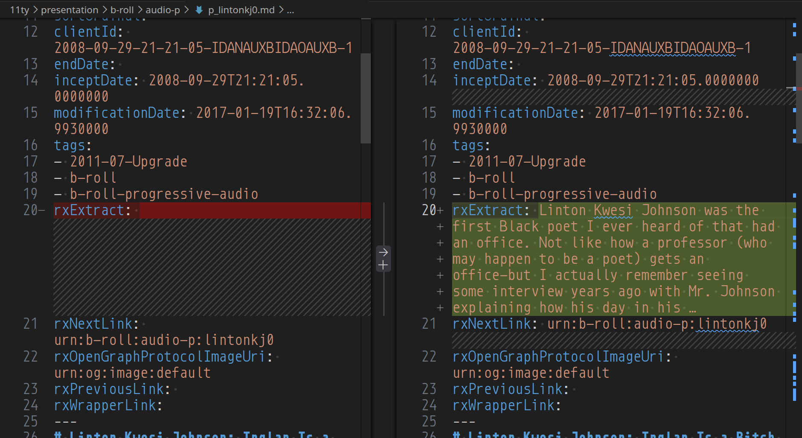

## Internet Products: a publication pipeline based on a primal definition of a Document

In this Studio a text-based document is made up of _lines_—and in the context of [[Markdown]] text there are two kinds of lines:

1. front matter lines
2. content lines

From this very primal understanding, we can start walking into complexity (nuance)—we will see that:

- front matter implies that a Document has tags (keywords) and properties (name-value pairs)
- front matter properties _define_ the Publications Document
- front matter can be saved as <acronym title="YAML Ain’t Markup Language">YAML</acronym> but manipulated in automation as <acronym title="JavaScript Object Notation">JSON</acronym>
- front matter can be aggregated to build the Publications Index

>[!important]
>Most famous/traditional word processors do not recognize the existence of front matter as this concept get buried under Document properties and tags—and this Document metadata has traditionally not been available for automation outside of a ‘hostile’ proprietary document format (even when that format is <acronym title="Extensible Markup Language">XML</acronym>) that is designed to support word-processing software—_not_ data interchange.

## [[Songhay Data Access (C♯)]]: `GenericRepository<T, TKey>` does not support nullable keys 😐

`GenericRepository<T, TKey>` does not support nullable keys because it is currently constrained to `struct`—and, according to today’s research, constraining to `struct` only supports non-nullable `struct` types.

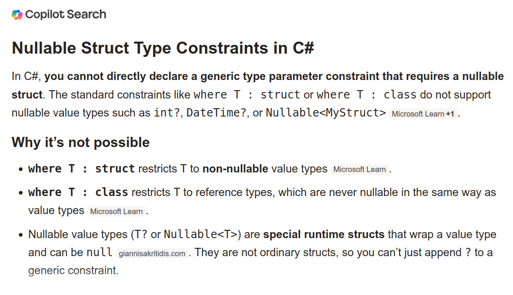

This means we have to do stuff like the stuff on line 214:

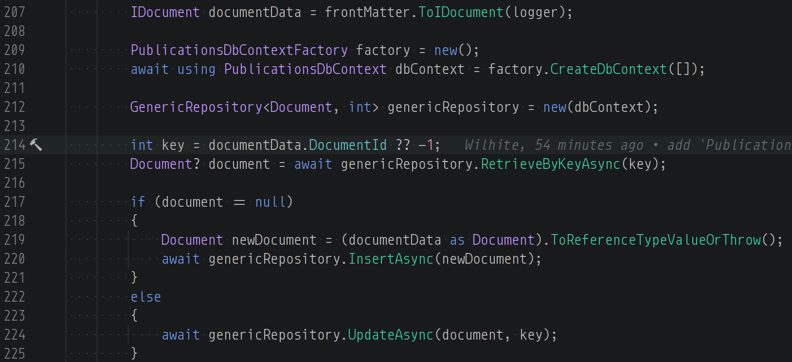

This is a hack:

```csharp
int key = documentData.DocumentId ?? -1;
```

…where `DocumentId` is of type `int?`.

BTW, this is the upsert pattern that’s new to this Studio:

```csharp
Document? document = await genericRepository.RetrieveByKeyAsync(key);

if (document == null)
{
    Document newDocument = (documentData as Document).ToReferenceTypeValueOrThrow();
    await genericRepository.InsertAsync(newDocument);
}
else
{
    await genericRepository.UpdateAsync(document, key);
}
```

## Publications: it did not occur to me that Go does not need a third-party Web server 😐

>Go is an open-source programming language developed by Google that has gained immense popularity for its simplicity yet powerful concurrency capabilities. One area where Go excels is building fast and efficient web servers. Its high-performance HTTP package makes it easy to start serving web content quickly.
>
>—“[Make Your Own Web Server With Go: A Comprehensive Guide - ExpertBeacon](https://expertbeacon.com/make-your-own-web-server-with-go-a-comprehensive-guide/)”
>

### related reading

- “[Mastering Go Web Servers: From Zero to Hero](https://dev.to/leapcell/mastering-go-web-servers-from-zero-to-hero-58i3)”
- “[Writing Web Applications](https://go.dev/doc/articles/wiki/)”
- <https://github.com/caddyserver/caddy>
- [[2024-11-06#Songhay Publications Publications “Moving my website from Netlify to Caddy”]]

## [[Entity Framework]] and [[SQLite]]: auto-incrementing is not happening 😐

My first attempt to `INSERT` data in [[Songhay Publications - KinteSpace|the kinté space]] repo:

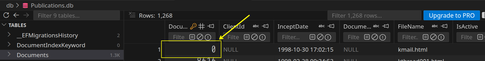

This time, the answer is clear:

>By convention, integer primary keys are automatically configured with AUTOINCREMENT when they are not part of a composite key and don't have a foreign key on them. However, you may need to explicitly configure a property to use SQLite AUTOINCREMENT when the property has a value conversion from a non-integer type, or when overriding conventions…
>
>—“[Configuring AUTOINCREMENT](https://learn.microsoft.com/en-us/ef/core/providers/sqlite/value-generation)”
>

>[!important]
>I assume I am having this issue because I am using `int?` instead of `int` which means I need to configure explictly:

```csharp
protected override void OnModelCreating(ModelBuilder modelBuilder)
{
    modelBuilder.Entity<Blog>()
        .Property(b => b.Id)
        .HasConversion<int>()
        .UseAutoincrement();
}
```

New issue added: <https://github.com/BryanWilhite/Songhay.Publications/issues/71>

## [[Lunr]] code has not been touched in six years 😐

Does this mean that [[Lunr]] (lunr.js) is “perfect” or… let me run `npm-check`…

There is no update for the [[Lunr]] package.

Apparently there are no release dependencies for [[Lunr]]:

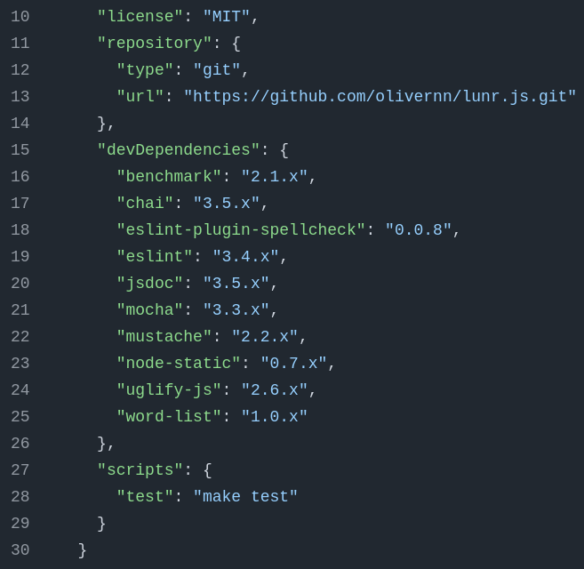
<https://github.com/olivernn/lunr.js/blob/master/package.json>

## [[DB Browser for SQLite]]: surely, this is my new daily driver 😐🗃

I have vastly underestimated this desktop utility:

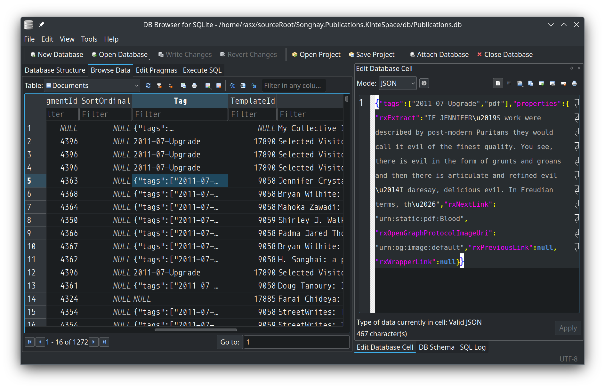

I think it was installed as a [[Debian]] package:

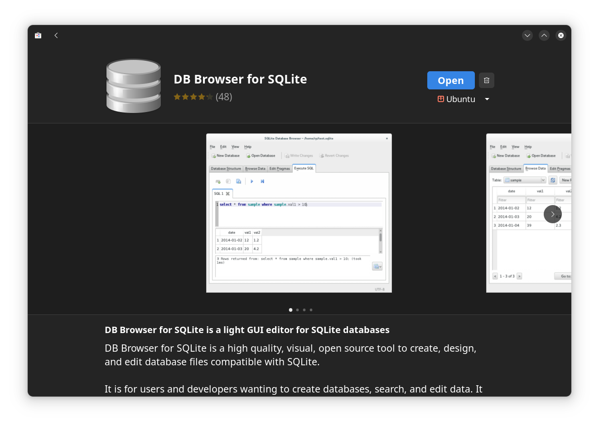

## [[JavaScript]]: Composites are proposed by [[Google]] to determine object equality 😐

>[Nice 9-minute video](https://www.youtube.com/watch?v=hFenspfGLTk) from Matt Pocock (from about a year ago) introducing composites. The problem of not being able to compare objects definitely feels worth solving. Or, more accurately, fixing the issue where when compare two objects that look exactly the same, it’s still `false`. And that using them as keys doesn’t work. Sounds like Records & Tuples were close, but the performance downsides were too strong. [Composites](https://github.com/tc39/proposal-composites) are more likely to happen.
>
>—“[Arrays, objects… now ‘composites’?](https://frontendmasters.com/blog/arrays-objects-now-composites/)”
>

```javascript
const pos1 = Composite({ x: 1, y: 4 });
const pos2 = Composite({ x: 1, y: 4 });
Composite.equal(pos1, pos2); // true
```

## [[Azure]]: my forecast keeps going up 😐😠💸

Here is the month 04 breakdown:

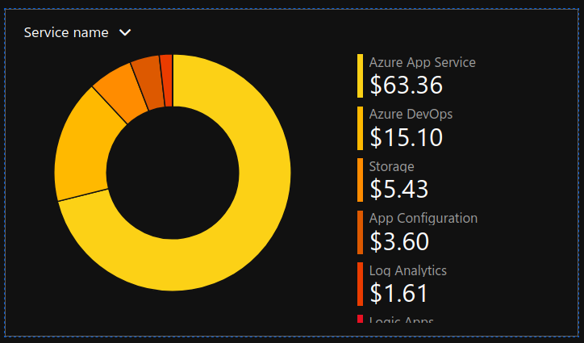

Here is the mid-month 05 breakdown:

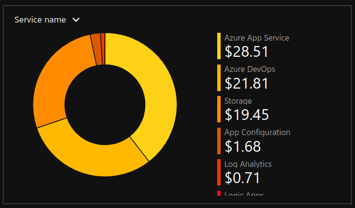

- my storage costs have quadrupled (at least) 😲
- my AzDO costs have almost doubled 😠

## [[JupyterLite]]: “JupyterLite is a reboot of several attempts at making a full static Jupyter distribution that runs in the browser, without having to start the Python Jupyter Server on the host machine.” #to-do 😐🍱

>JupyterLite is part of the [Project Jupyter](https://jupyter.org/) [Frontends subproject](https://jupyterlab-team-compass.readthedocs.io).
>
>Not all the features available in JupyterLab and the Classic Notebook will work with JupyterLite, but many do!
>
>Don’t hesitate to check out the [documentation](https://jupyterlite.readthedocs.io/en/stable/howto/index.html) for more information and project updates.
>
>—<https://jupyterlite.readthedocs.io/en/stable/>
>

## [[Python]]: I choose the `class` form of `Enum` 😐

Support for enumerations \[📖 [docs](https://docs.python.org/3/library/enum.html) \] was added to [[Python]] as of version 3.4. I am using this with [[Wand]]:

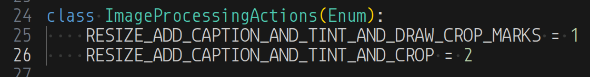

I am using this enumeration with an `if`-`elif` structure and the `class` form is more friendly with the code-completion features of a decent <acronym title="Integrated Development Environment">IDE</acronym>:

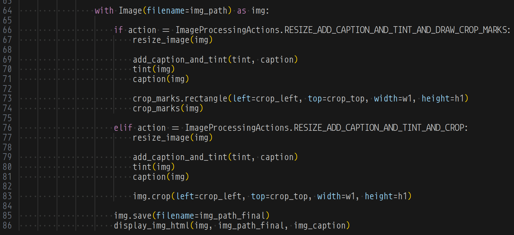

I was not able to use the newer `match` structure \[📖 [docs](https://docs.python.org/3/whatsnew/3.10.html#pep-634-structural-pattern-matching) \] (available since version 3.10) in the [[Jupyter|Jupyter Notebook]] even though the kernel was 3.13x.

## [[Jupyter]]: “Use Python Variable in Bash Effortlessly”

I am having difficulty finding official documentation for this:

>In Jupyter notebooks, you can use Python variables in bash commands by utilizing the `!` operator with the variable encapsulated in curly braces to access its value directly.
>
>Here’s how you can do it:

```python
my_var = "Hello, World!"

# You can use it in a bash command like this:
!echo {my_var}
```

>
>—“[Jupyter: Use Python Variable in Bash Effortlessly](https://bashcommands.com/jupyter-use-python-variable-in-bash)”
>

## open pull requests on GitHub 🐙🐈

- <https://github.com/BryanWilhite/Songhay.HelloWorlds.Activities/pull/14>
- <https://github.com/BryanWilhite/dotnet-core/pull/67>

## sketching out development projects


- retire the old `kinte-space` repo for kintespace.com 🚜🧊
- establish `DataAccess` logic for Obsidian markdown metadata 🔨✨
- establish `DataAccess` logic for Index data, including adding and removing Obsidian documents (and Segments) 🔨✨
- package `DataAccess` logic in `*Shell` project for `npm` scripting 🚜✨
- consider using Lerna to coordinate the two levels of `npm` scripts in the kinté space repo 🧠👟
- use a Jupyter Notebook to track finding and changing Amazon links to open source links in the kinté space repo 📓⚙
- use a Jupyter Notebook to convert flickr links to Publications (responsive image) links in the kinté space repo 📓⚙
- convert rasx() context repo to the relevant conventions shown in the diagram above 🔨🚜
- convert Songhay Day Path Blog repo to the relevant conventions shown in the diagram above 🔨🚜
- re-release Songhay Dashboard by updating its repo to the relevant conventions shown in the diagram above 🔨🚜
- start development of Songhay Publications Index (F♯) experience for WebAssembly 🍱✨
- start development of Songhay Publications - Data Editor to establish a <acronym title="Graphical User Interface">GUI</acronym> for `*Shell` and provide visualizations and interactions for Publications data 🍱✨

🐙🐈<https://github.com/BryanWilhite/>
