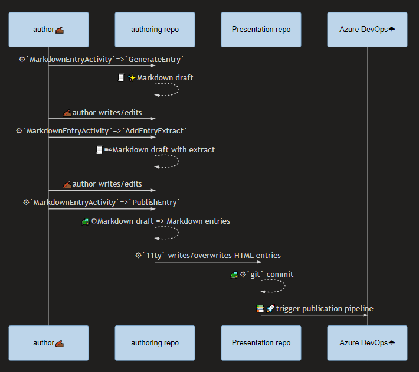
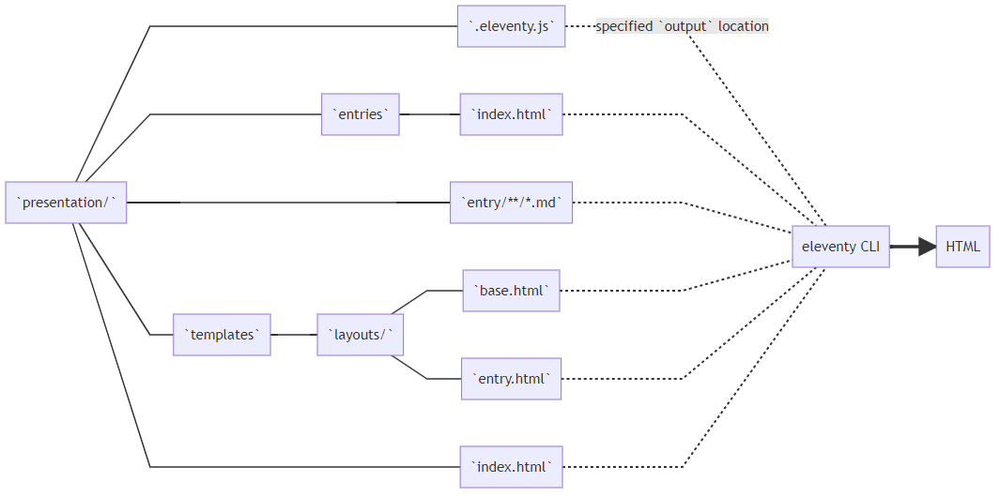
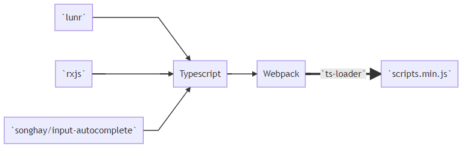
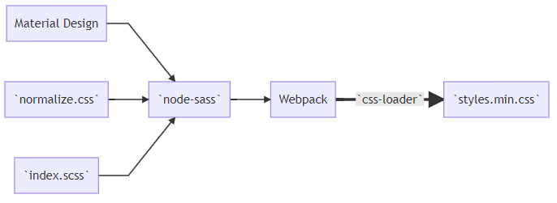

---json
{
  "documentId": 0,
  "title": "my blogging workflow for 2020 is all about `11ty` (eleventy)",
  "documentShortName": "2020-06-11-my-blogging-workflow-for-2020-is-all-about-11ty-eleventy",
  "fileName": "index.html",
  "path": "./entry/2020-06-11-my-blogging-workflow-for-2020-is-all-about-11ty-eleventy",
  "date": "2020-06-11T20:39:15.42Z",
  "modificationDate": "2020-06-11T20:39:15.42Z",
  "templateId": 0,
  "segmentId": 0,
  "isRoot": false,
  "isActive": true,
  "sortOrdinal": 0,
  "clientId": "2020-06-11-my-blogging-workflow-for-2020-is-all-about-11ty-eleventy",
  "tag": "{\r\n  \"extract\": \"As of this writing, my Blogging workflow looks like this: authoring workflow Above we see the author (me ✍🏾) generating Markdown in one repository and using 11ty.dev (eleventy) to write files in another. These are the authoring repo and the Presentation …\"\r\n}"
}
---

# my blogging workflow for 2020 is all about `11ty` (eleventy)

As of this writing, my Blogging workflow looks like this:

Above, we see _the author_ (me ✍🏾) generating Markdown in one repository and using [11ty.dev](https://www.11ty.dev/) (eleventy) to write/overwrite files in another. These are the authoring repo and the Presentation repo, respectively. For this Blog post being read (by you) right now:

- <https://github.com/BryanWilhite/Blog> is the authoring repo
- <https://github.com/BryanWilhite/day-path> is the Presentation repo

These are my known reasons why I am using _two_ repositories when you are likely to use one or none:

- the authoring repo depends on a couple of eleventy `npm` packages, vastly reducing hidden storage costs and increasing portability
- `git` pushes are cheap and plentiful in the authoring repo while a push in the app Presentation repo kicks off automated deployment by design, making-big-and simple automated deployment instead of celebrating the complex.

Effectively, the authoring repo is a portable collection of word processing documents that can be cloned and pulled all over the place while the Presentation repo depends on over 100MB of `npm` packages and is concerned with the look and feel of a user interface. This separation mirrors what happens to most WordPress users who _perceptually_ experience two separate web sites to write and view content.

What’s _not_ so effective is the separation of eleventy templates (`*.html` and `*.liquid` files) from the Presentation repo. In the beginning design phase, I have felt they are _trapped_ in the authoring repo when they should live with the Presentation. However, as the visual design settles down, I can look at these things as data (user interface as data) and metadata which works well when we see authoring as _managing_ data as well as producing it.

## the `Songhay.Publications` 📦 package

Blog publication is a practice of my Studio which is part of a larger Publications enterprise, standing on top of my `Songhay.Publications` [📦 package](https://www.nuget.org/packages/Songhay.Publications/). The sequence diagram shown above shows the `MarkdownEntryActivity` managing Markdown files. `MarkdownEntryActivity` is part of the `Songhay.Publications` NuGet package.

The [GitHub project for the `1.0.3` release](https://github.com/BryanWilhite/Songhay.Publications/projects/1) of this package goes into _way_ too much detail about building `Songhay.Publications`—and, I do look forward to writing more about the automation of Markdown workflows in future.

## eleventy flows

By convention, `settings.json` data flow to the template type configured for eleventy. Even though most eleventy samples—like [`eleventy-base-blog`](https://github.com/11ty/eleventy-base-blog)—choose [Nunjucks](https://mozilla.github.io/nunjucks/) from Mozilla, I am currently using [Liquid](https://shopify.github.io/liquid/) from Shopify (probably under the influence of [Jekyll](https://jekyllrb.com/)).

Liquid has a [snippets concept](https://shopify.dev/tutorials/develop-theme-templates#snippets) that allows me to break down a template into smaller chunks. The following diagram is trying to show `settings.json` data flowing into several `*.liquid` snippets:

When we first try out eleventy and after we enjoy its [zero-config feature](https://www.11ty.dev/docs/resources/#zero-config), we focus on the `.eleventy.js` file [📖 [docs](https://www.11ty.dev/docs/config/)]. My primary need for for this file was to define [a collection](https://www.11ty.dev/docs/collections/) of Markdown files under my conventional `entry/` directory. The magic of eleventy is its ability to load all of these Markdown files into memory (which feels [not quite scalable](https://github.com/11ty/eleventy/issues/695#issuecomment-532896598)) and render HTML in the specified `output` location:

My other conventional directory, `entries/`, shown above, takes advantage of the [front matter](https://www.11ty.dev/docs/data-frontmatter/) in the Markdown entries to render [pagination](https://www.11ty.dev/docs/pagination/#paging-a-collection).

## Presentation repo flows

The Presentation repo depends on over 100MB of `npm` packages and is concerned with the look and feel of a user interface. We can break these concerns down into distinct ‘flows’:

### Typescript flow

The `presentation/templates/snippets/head.liquid` snippet shown in the eleventy flow diagram above references both `scripts.min.js` and `styles.min.css`.

### Sass flow

## why build all of this?

**This is a violent departure from WordPress.** …and most of the violence was self-inflicted. The technical motivation away from WordPress was simply because my work has no need for a dedicated database connection. The use of static files as a data source works for me (and is a veiled admission that I Blog alone—there is no team of co-authors writing concurrently). The strategic motivation away from WordPress were its frequent security problems.

**My Markdown front matter is _mine_.** Many of the alternatives to what I’ve built here _must_ have opinionated front matter. [`eleventy-plugin-blog`](https://github.com/sielay/eleventy-plugin-blog) is an example of this. I want flexibility and intra-Studio operability with my front matter and eleventy gives us this by design and by default.

**Building on Typescript and C# is a priority.** What I assume is the leader in this [Jamstack](https://jamstack.org/) space, Jekyll, is built on Ruby but eleventy is creature of Node.js—eleventy is all about Javascript—which allows me to use Typescript.

**Using Visual Studio Code as a word processor is _not_ strange to me.** I am such a long-time Microsoft Word user that I have used [VBA](https://docs.microsoft.com/en-us/office/vba/library-reference/concepts/getting-started-with-vba-in-office), followed by [VSTO](https://docs.microsoft.com/en-us/visualstudio/vsto/office-solutions-development-overview-vsto?view=vs-2019). I have tried to use Word in particular and Microsoft Office in general as _my_ publishing platform. This did not work out for me. I currently have more respect for _text_ than the 20th-century-based graphical experience of the typical Office offering (this includes Open Source alternatives as well).

<https://github.com/BryanWilhite/>
