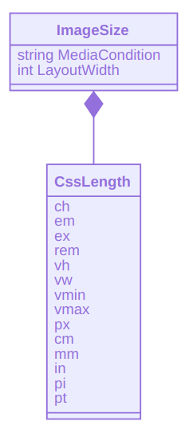
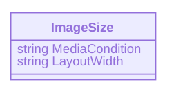

---json
{
  "documentId": 0,
  "title": "Flippant Remarks about Responsive Images",
  "documentShortName": "2020-08-04-flippant-remarks-about-responsive-images",
  "fileName": "index.html",
  "path": "./entry/2020-08-04-flippant-remarks-about-responsive-images",
  "date": "2020-08-05T03:32:39.592Z",
  "modificationDate": "2020-08-05T03:32:39.592Z",
  "templateId": 0,
  "segmentId": 0,
  "isRoot": false,
  "isActive": true,
  "sortOrdinal": 0,
  "clientId": "2020-08-04-flippant-remarks-about-responsive-images",
  "tag": "{\n  \"extract\": \"Self-identifying 10x developer, Ire Aderinokun (@ireaderinokun) was one of earliest writers on the subject of responsive images that addressed its combinatorial complexities in an actionable way. In 2016, with “Responsive Images—The srcset and sizes Attri…\"\n}"
}
---

# Flippant Remarks about Responsive Images

Self-identifying [10x developer](https://twitter.com/ireaderinokun/status/1249752431002619911), Ire Aderinokun (@ireaderinokun) was one of earliest writers on the subject of responsive images that addressed its combinatorial complexities _in an actionable way_. In 2016, with “[Responsive Images—The `srcset` and `sizes` Attributes](https://bitsofco.de/the-srcset-and-sizes-attributes/)”, she adeptly cut through to the technical issue at hand: learn how to use the `srcset` and `sizes` attributes.

<!-- cSpell:disable -->
<blockquote class="twitter-tweet"><p lang="en" dir="ltr">I’m now a 10x developer <a href="https://t.co/MvNo2eGt1P">pic.twitter.com/MvNo2eGt1P</a></p>&mdash; Ire Aderinokun (@ireaderinokun) <a href="https://twitter.com/ireaderinokun/status/1249752431002619911?ref_src=twsrc%5Etfw">April 13, 2020</a></blockquote> <script async src="https://platform.twitter.com/widgets.js" charset="utf-8"></script>
<!-- cSpell:enable -->

In 2017, a [learnedia.com article](https://learnedia.com/responsive-images-srcset-attribute-picture-element/) addresses the other major issue related to implementing responsive images: when to use the `picture` element:

>In case you are using `<picture>` element, you are strictly telling browser which image to use on different viewport widths. …This is different because **now browser won’t make a decision on it’s own** which image to serve. That is useful when you are serving different images on different viewport widths. It could also be variations of the same image cropped differently to look better on some devices.

Of course, in 2015 Chris Coyier _literally_ wrote “[Responsive Images: If you’re just changing resolutions, use `srcset`.](https://css-tricks.com/responsive-images-youre-just-changing-resolutions-use-srcset/)” This is great news once you know the lay of land but the article from Ire Aderinokun just clicked for me.

The point that Chris was trying to make is that most of the time responsive image declarations are going to look like this:

```html

```

Everything related to responsive images beyond this linear, directly proportional relationship with the viewport (including the use of `picture`) should be considered “advanced topics.”

## looking at `srcset` and `sizes`

With the focus provided above, we can now look through the reference material:

> `srcset` is a string which identifies one or more image candidate strings, separated using commas (`,`) each specifying image resources to use under given circumstances. Each image candidate string contains an image URL and an optional width or pixel density descriptor that indicates the conditions under which that candidate should be used instead of the image specified by the `src` property. —[MDN](https://developer.mozilla.org/en-US/docs/Web/API/HTMLImageElement/srcset)

By reading this reference material, I am inspired to sketch out a [data transfer object](https://en.wikipedia.org/wiki/Data_transfer_object) (DTO) for responsive images:


> The `srcset` property, along with the `sizes` property, are a crucial component in designing responsive web sites, as they can be used together to make pages that use appropriate images for the rendering situation. —[MDN](https://developer.mozilla.org/en-US/docs/Web/API/HTMLImageElement/srcset)

It is considered a bit of challenge to describe when `srcset` and `sizes` should be used together. But before we get back to that, the MDN reference entry introduces `sizes`:

> `sizes` allows you to specify the layout width of the image for each of a list of media conditions. This provides the ability to automatically select among different images—even images of different orientations or aspect ratios—as the document state changes to match different media conditions. Each condition is specified using the same conditional format used by media queries. —[MDN](https://developer.mozilla.org/en-US/docs/Web/API/HTMLImageElement/sizes)

The DTO for `sizes` might be this:



where `CssLength` represents [CSS length](https://developer.mozilla.org/en-US/docs/Web/CSS/length). Or we can avoid struggling with units in a programming paradigm not optimized for it and just use strings (like before in `ImageCandidate`):



## when `srcset` and `sizes` should be used together

[Chris Coyier explains](https://css-tricks.com/sometimes-sizes-is-quite-important/) that the `srcset` convention as implemented in browsers will “assume you’re probably going to render [an] image at 100vw wide.” This implies that, by default, the largest image will be rendered in a `srcset` declaration like this:

```html

```

However, what if you want to show _more_, smaller images (e.g. `food-small.jpg`) when the viewport is larger and _fewer_, larger images when the viewport is smaller? Declaring `sizes` addresses this case:

```html

```

This `img` declaration with `sizes` breaks the linear, directly proportional relationship Chris was telling us about earlier.

## what about all of those DTOs?

I inserted `ImageCandidate` and `ImageSize` classes among these flippant remarks to annoy the world with yet more object-oriented programming and to propose the possible need for _centralizing_ responsive image design decisions in a data store behind a [Web API](https://en.wikipedia.org/wiki/Application_programming_interface#Web_APIs).

Such an API could expose data that can be transformed into `srcset` (`sizes`) declarations for HTML _and_ CSS selectors for [responsive background images](https://www.webfx.com/blog/web-design/responsive-background-image/). Such expensive transformations can take place at design time with a tool like [11ty](https://www.11ty.dev/).

## related links

- “[Responsive Images—The `srcset` and `sizes` Attributes](https://bitsofco.de/the-srcset-and-sizes-attributes/)”
- “[Responsive images with `srcset` and `sizes` attributes vs picture element](https://learnedia.com/responsive-images-srcset-attribute-picture-element/)”
- “[`<picture>`: The Picture element—HTML: Hypertext Markup Language | MDN](https://developer.mozilla.org/en-US/docs/Web/HTML/Element/picture)”
- “[Screen Sizes | Viewport Sizes and Pixel Densities for Popular Devices](http://screensiz.es/)”
- “[Sometimes `sizes` is quite important.](https://css-tricks.com/sometimes-sizes-is-quite-important/)”
- “[Don’t use `<picture>` (most of the time)](https://cloudfour.com/thinks/dont-use-picture-most-of-the-time/)”
- “[Responsive Full Background Image Using CSS](https://www.webfx.com/blog/web-design/responsive-background-image/)”
- “[Planning for Responsive Images](https://css-tricks.com/planning-for-responsive-images/)”
- “[Responsive Images—Serve Scaled Images](https://www.keycdn.com/blog/responsive-images)”
- “[How to use responsive images](https://blog.ycombinator.com/how-to-use-responsive-images/)”
- “[Responsive Images—6 Simple Ways](https://benmarshall.me/responsive-images/)”
- <https://responsivebreakpoints.com/>
- <http://responsiveimages.org/>

<https://github.com/BryanWilhite/>
