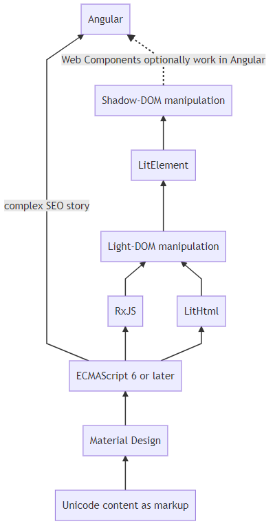

---json
{
  "documentId": 0,
  "title": "A Return to Progressive Enhancement with LitHtml and `11ty` (@eleven_ty)",
  "documentShortName": "2020-10-30-a-return-to-progressive-enhancement-with-lithtml-and-11ty-eleven-ty",
  "fileName": "index.html",
  "path": "./entry/2020-10-30-a-return-to-progressive-enhancement-with-lithtml-and-11ty-eleven-ty",
  "date": "2020-10-31T00:47:44.926Z",
  "modificationDate": "2020-10-31T00:47:44.926Z",
  "templateId": 0,
  "segmentId": 0,
  "isRoot": false,
  "isActive": true,
  "sortOrdinal": 0,
  "clientId": "2020-10-30-a-return-to-progressive-enhancement-with-lithtml-and-11ty-eleven-ty",
  "tag": "{\n  \"extract\": \"Who is old enough to remember what progressive enhancement is? This term is a relic from the Web 1.0 days, ending about 16 years ago. Web 1.0 will forever be marginalized by the billions made from Web 2.0 and beyond. Post-Web-1.0 is about loading a near-i…\"\n}"
}
---

# A Return to Progressive Enhancement with LitHtml and `11ty` (@eleven_ty)

Who is old enough to remember what [progressive enhancement](https://en.wikipedia.org/wiki/Progressive_enhancement) is? This term is a relic from the [Web 1.0](https://en.wikipedia.org/wiki/Web_2.0#Web_1.0) days, ending about 16 _years_ ago. Web 1.0 will forever be marginalized by the billions made from Web 2.0 and beyond. Post-Web-1.0 is about loading a near-infinite, continuous surface of high-performance, data-collecting engagement, starting with the Single Page Application (SPA) and, perhaps, ending with [dog-shaped IOT](https://www.cnbc.com/2020/06/22/75000-boston-dynamics-robot-dog-for-sale-take-a-look.html). Thinking of the Web as discrete documents is not welcome in this brave new world.

From where I am standing, Web 1.0 was about documents in particular and identifiable resources (RESTful indicators) in general. Web 1.0 was also about open standards. Web 1.0 thinking survives here and there in what we call the [Jamstack](https://en.wikipedia.org/wiki/Netlify#Jamstack), another brave new world led by [Mathias Biilmann](https://github.com/biilmann) and [Christian Bach](https://www.linkedin.com/in/christianbachdk/) of Netlify. Mathias is a fluent speaker of [Ruby](https://en.wikipedia.org/wiki/Ruby_(programming_language)) so, for those of us grunting with Javascript (and the eventual, horrible truth of C++), we may find ourselves attracted to Zach Leatherman’s [eleventy](https://github.com/11ty/eleventy/). (Zach, by the way, is on the Netlify team.)

For those of us who like to say, “What the hell are you talking about!,”—or just “Wha?” for short, I think Raymond Camden’s introduction to eleventy, embedded in his “[Highlight: Adding Location Services to Your JAMStack [06/18 @ 7PM PT]](https://www.twitch.tv/videos/655331534)” Twitch talk, is an excellent way to place a move to eleventy in particular and Jamstack in general in a compelling, coherent context. Raymond did not stop using [Vue.js](https://vuejs.org/) when he got into the Jamstack; like me, he just _added_ eleventy to his toolbox. I am not “abandoning” [my investments](https://github.com/BryanWilhite/songhay-ng-workspace) in Angular, I am just _adding_ the ability to respect the document as well as the SPA.

I assume the following diagram makes all of this ‘adding’ easier to understand:

**Unicode content as markup.** At the bottom of this diagram, I am starting with ‘Unicode content as markup’ which, for the purposes of this article, is just another way of saying _static HTML documents_—documents that can be generated by eleventy. Then, we proceed upward eventually along two paths. One path leads to Angular (the SPA) and the other has several levels of _enhancement_, leading to another Google technology called [LitHtml](https://lit-element.polymer-project.org/) which finally can lead right into Angular. The SPA path assumes your static HTML is a container for hosting and the other path assumes your static HTML is just a document.

The diagram is showing you that the left path is essentially all-in on SPA while the right path has far more granular levels of expressive power. This right path only makes sense when you are thinking about enhancing discrete documents (or other resources). Most of us Web developers show our respect for discrete documents when we build our Blog (because most of us cannot become a Jedi unless we build our own Blog site). For me, the ideas behind the diagram above were put into practice when I built [my eleventy-based Blog](http://songhayblog.azurewebsites.net/entry/2020-06-11-my-blogging-workflow-for-2020-is-all-about-11ty-eleventy).

**Material Design.** The next level of enhancement progress is the use of CSS technology which my practice confines to [Material Design](https://en.wikipedia.org/wiki/Material_Design), another Google effort began in 2014.

**ECMAScript 6 or later.** [ECMAScript 2015](https://en.wikipedia.org/wiki/ECMAScript#6th_Edition_%E2%80%93_ECMAScript_2015) or ES6 brings us modules via the `import` keyword. This “good part” of Javascript is an essential building block that I would have found difficult to live without in a post-[jQuery](https://en.wikipedia.org/wiki/JQuery) Javascript world.

**Light-DOM manipulation with RxJS and LitHtml.** The ‘Light-DOM’ is just the [DOM](https://en.wikipedia.org/wiki/Document_Object_Model)—and, for over a decade, jQuery, a masterpiece of [John Resig](https://github.com/jeresig), was the undisputed leader of DOM manipulation. It could only be unseated from its position of prominence by advances in W3C standards, implemented by the leading browser technology. These technological advances lead me to [RxJS](https://rxjs.dev/), starring ex-Angular-team member [Ben Lesh](https://github.com/benlesh), and [LitHtml](https://lit-html.polymer-project.org/), a Polymer project starring [Justin Fagnani](https://github.com/justinfagnani) of Google.

RxJS (which happens to be a core component of Angular) wraps the [`XMLHttpRequest` (XHR) API](https://developer.mozilla.org/en-US/docs/Web/API/XMLHttpRequest) and the [Fetch API](https://developer.mozilla.org/en-US/docs/Web/API/Fetch_API) under a [reactive](https://en.wikipedia.org/wiki/Reactive_programming) layer, featuring the [Observable](https://en.wikipedia.org/wiki/Reactive_extensions#A-Observable).

LitHtml takes advantage of Javascript [template literals](https://developer.mozilla.org/en-US/docs/Web/JavaScript/Reference/Template_literals), specifically [_tagged templates_](https://www.freecodecamp.org/news/a-quick-introduction-to-tagged-template-literals-2a07fd54bc1d/). It allows us to move beyond the need for, say, [Moustache.js](http://mustache.github.io/) and transition into browser standards. In SPA terms, LitHtml is here to take care of [one-way data-binding](https://lit-html.polymer-project.org/guide/template-reference#binding-types).

**LitElement and Shadow-DOM manipulation.** [LitElement](https://lit-element.polymer-project.org/) represents our transition into the the realm of the [Shadow DOM](https://developer.mozilla.org/en-US/docs/Web/Web_Components/Using_shadow_DOM) populated with the Web Component. It may be important to highlight these points:

- LitElement is just a base class of the Web Component, quite far from a framework
- the Shadow DOM is not a _virtual DOM_; React documentation, for example, makes [a significant effort to distinguish the React Component from the Web Component](https://reactjs.org/docs/web-components.html)
- it is a relatively useful oversimplification to compare the Shadow DOM to a special kind of `iframe` node
- for those of us that were introduced to `CUSTOM_ELEMENTS_SCHEMA` when [working with Karma-Jasmine in Angular](http://songhayblog.azurewebsites.net/entry/2018-12-31-flippant-remarks-about-karma-jasmine-in-angular/), it has [another use](https://www.grapecity.com/blogs/using-web-components-in-angular) that allows us to re-use standard Web Components in Angular

The promise here is that Angular can be considered a _destination_ for Web Components. And, with [Angular elements](https://angular.io/guide/elements), an Angular SPA can be ‘reduced’ to a Web Component. It should now be considered quite ignorant to regard the static HTML files generated by eleventy as being hopelessly separated from the SPA application. We see here that there are progressive levels of expression, providing a new kind of user experience that was not _easily_ possible [before 2018](https://www.sitepen.com/blog/web-components-in-2018/).

## Related Resources

- “[What Is the Difference Between Shadow DOM and Virtual DOM?](https://www.blog.duomly.com/what-is-the-difference-between-shadow-dom-and-virtual-dom/)”
- “[Lit Element rendering strategies explained](https://julienrenaux.fr/2019/04/01/lit-element-rendering-strategies-explained/)”
- “[Angular 9 Web Components: Custom Elements & Shadow DOM](https://www.techiediaries.com/angular/angular-9-web-components-custom-elements-shadow-dom/)”
- “[9 Web Components UI Libraries You Should Know in 2020](https://blog.bitsrc.io/9-web-component-ui-libraries-you-should-know-in-2019-9d4476c3f103)”
- “[Web Components will replace your frontend framework](https://blog.usejournal.com/web-components-will-replace-your-frontend-framework-3b17a580831c)”

@[BryanWilhite](https://twitter.com/BryanWilhite)
