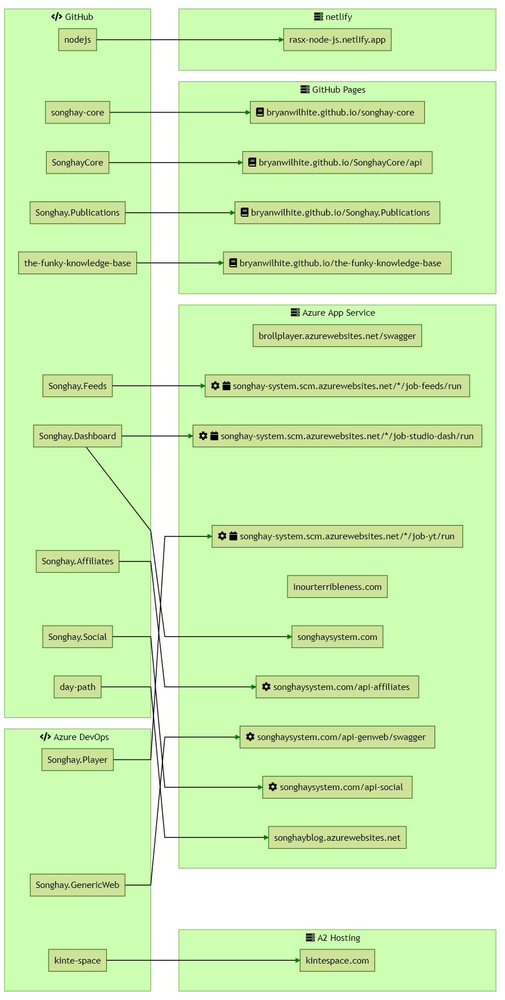

---json
{
  "documentId": 0,
  "title": "studio status report: 2020-10",
  "documentShortName": "2020-10-30-studio-status-report-2020-10",
  "fileName": "index.html",
  "path": "./entry/2020-10-30-studio-status-report-2020-10",
  "date": "2020-10-31T00:49:49.554Z",
  "modificationDate": "2020-10-31T00:49:49.554Z",
  "templateId": 0,
  "segmentId": 0,
  "isRoot": false,
  "isActive": true,
  "sortOrdinal": 0,
  "clientId": "2020-10-30-studio-status-report-2020-10",
  "tag": "{\n  \"extract\": \"month 10 of 2020 was about making Jupyter notes and reviving Node.js-based repositories I spent a lot of time this month documenting things about Studio machines that most pros would memorize. For every studio machine, there is now a notebook about key sh…\"\n}"
}
---

# studio status report: 2020-10

## month 10 of 2020 was about making Jupyter notes and reviving Node.js-based repositories

I spent a lot of time this month documenting things about Studio machines that most pros would memorize. For every studio machine, there is now a notebook about key shell apps like:

- `az`
- `conda`
- `dotnet`
- `npm`
- `python`

The “normal” IT pro would get familiar with a machine by strolling up to a terminal and typing things (from memory) at over 90 words a minute. What Jupyter notebooks give me is the command (and arguments) that I often forget and the output from when that command was last run. This is totally awesome to me! I feel like the cognitive load is lighter, opening up more space for more creative work.

## reviving Node.js-based repositories

Here, on my planet, in order to work on the Stills API, I need to:

- generate responsive images ✅
- upload the responsive images ✅
- build responsive layouts

The `srcset` and `sizes` data used for the layout can be used as a control for automated testing of Stills API functionality that generate `srcset` and `sizes` data.

Deciding where to build these layouts was not a trivial task. This is largely because I forgot about my investment in <https://rasx-node-js.netlify.app/>. To cut down on all this forgetting, I turned to more documentation:

where the asterisk in `.scm.azurewebsites.net/*/job-` stands for `api/triggeredwebjobs`.

So the top of this huge-ass diagram shows me that <https://rasx-node-js.netlify.app/> is driven by the `nodejs` [repo](https://github.com/BryanWilhite/nodejs) which will host my responsive layouts.

The last prerequisite (delay) before I back on the schedule below was going through the `npm` packages with `npm outdated`, `npm update`, `npm audit`, etc. This `npm` updating/auditing spread to [`songhay-ng-workspace`](https://github.com/BryanWilhite/songhay-ng-workspace), [`unicorn-whale`](https://github.com/BryanWilhite/unicorn-whale) and should continue to any Node repo with depend-a-bot alerts.

## sketching out a development schedule (revision 11)

The schedule of the month:

- add Stills API to `Songhay.Player` (b-roll player) 🕸🌩
- consider upgrading to .NET Core 3.0
- use `@songhay/index` as a side-car app for “Day Path” and “the rasx() context” 🚛📦
- add proposed [content Web component](https://github.com/BryanWilhite/songhay-web-components/issues/10)
- use the learnings from existing npm packages to build `@songhay/player-audio-???` 📦✨
- modernize the kinté hits page into a progressive web app 💄✨
- convert Day Path Blog and SonghaySystem.com to HTTPs by default 🔐
- use the learnings of previous work to upgrade and re-release the kinté space 🚀

@[BryanWilhite](https://twitter.com/BryanWilhite)
