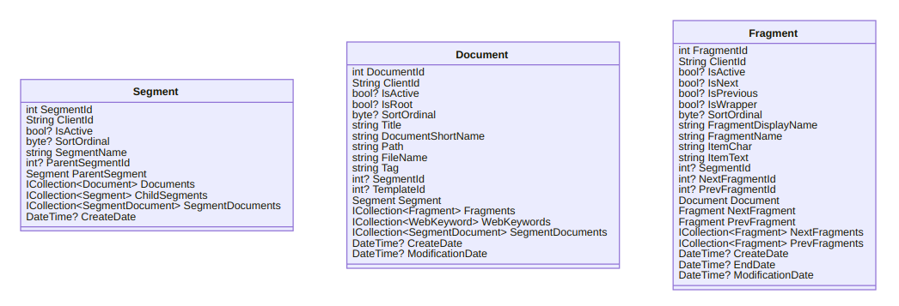
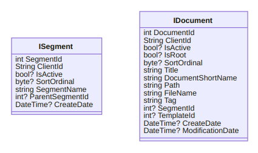

---json
{
  "documentId": 0,
  "title": "Songhay Publications and the Concept of the Index",
  "documentShortName": "2020-12-24-songhay-publications-and-the-concept-of-the-index",
  "fileName": "index.html",
  "path": "./entry/2020-12-24-songhay-publications-and-the-concept-of-the-index",
  "date": "2020-12-25T02:07:04.715Z",
  "modificationDate": "2020-12-25T02:07:04.715Z",
  "templateId": 0,
  "segmentId": 0,
  "isRoot": false,
  "isActive": true,
  "sortOrdinal": 0,
  "clientId": "2020-12-24-songhay-publications-and-the-concept-of-the-index",
  "tag": "{\n  \"extract\": \"What you are reading now is a Songhay Publication, this Blog. A Songhay Publication centers around the Document [GitHub]. Several Document instances can be grouped under one or more Segment [GitHub] instances. Further up the hierarchy, a Segment can group…\"\n}"
}
---

# Songhay Publications and the Concept of the Index

What you are reading now is a Songhay Publication, this Blog. A Songhay Publication centers around the `Document` [[GitHub](https://github.com/BryanWilhite/Songhay.Publications/blob/master/Songhay.Publications/Models/Document.cs)]. Several `Document` instances can be grouped under one or more `Segment` [[GitHub](https://github.com/BryanWilhite/Songhay.Publications/blob/master/Songhay.Publications/Models/Segment.cs)] instances. Further up the hierarchy, a `Segment` can group other `Segment` instances. Here is a diagram of the `Segment`, the `Document` (and the `Fragment`) to confuse almost everyone including me:



Some of the confusion comes from legacy [Entity Framework](https://docs.microsoft.com/en-us/aspnet/entity-framework) concerns, specifically the use of `ICollection<T>` and other _association_ properties. When I simplify my life with small-scale use of static JSON files, we can remove our concern for defining associations. Moreover, my small-scale use of Markdown eliminates the need (almost entirely) for `Fragment`. After all of this removing and eliminating, at least _I_ can understand why I have the core interfaces, `ISegment` [[GitHub](https://github.com/BryanWilhite/Songhay.Publications/blob/master/Songhay.Publications/Models/ISegment.cs)] and `IDocument` [[GitHub](https://github.com/BryanWilhite/Songhay.Publications/blob/master/Songhay.Publications/Models/IDocument.cs)], of Songhay Publications:



## the Web Publication Index

Compiling a collection of `Segment` groups into a file renders an _Index_. Meanwhile, in the real world, [there is the confusion](https://english.stackexchange.com/questions/45555/is-a-table-of-contents-an-index) between a “table of contents” and an _Index_. As of this writing in the Songhay studio, we avoid this confusion by defining an _Index_ here and looking forward to defining a Keyword Index (which is a real-world index).

All of this fantastic thinking about the Index comes from [my work](https://github.com/BryanWilhite/nodejs/tree/master/responsive-layouts) on rendering a Web Publication Index in HTML. I have been working on the visual design of two kinds of Index layouts:

1. the Index
2. the Blog Index

Behind the visual design is the _information_ design (too many years of my life was spent here). Both of these visual layouts are driven by a static JSON file this getting closer and closer to shapes of the models in `Songhay.Publications`. Today, I assume Songhay Index data will eventually look like this:

```json
[
  {
    "segmentName": "Section 1",
    "segments": [
      {
        "segmentName": "Section 1.1",
        "segments": [
          {
            "segmentName": "Section 1.1.1"
          },
          {
            "segmentName": "Section 1.1.2"
          },
          {
            "segmentName": "Section 1.1.3"
          }
        ]
      },
      {
        "segmentName": "Section 1.2",
        "segments": [
          {
            "segmentName": "Section 1.2.1"
          },
          {
            "segmentName": "Section 1.2.2"
          },
          {
            "segmentName": "Section 1.2.3"
          }
        ]
      },
      {
        "segmentName": "Section 1.3",
        "segments": [
          {
            "segmentName": "Section 1.3.1"
          },
          {
            "segmentName": "Section 1.3.2"
          },
          {
            "segmentName": "Section 1.3.3"
          }
        ]
      }
    ]
  },
  {
    "segmentName": "Section 2",
    "segments": [
      {
        "segmentName": "Section 2.1",
        "segments": [
          {
            "segmentName": "Section 2.1.1"
          },
          {
            "segmentName": "Section 2.1.2"
          },
          {
            "segmentName": "Section 2.1.3"
          }
        ]
      },
      {
        "segmentName": "Section 2.2",
        "segments": [
          {
            "segmentName": "Section 2.2.1"
          },
          {
            "segmentName": "Section 2.2.2"
          },
          {
            "segmentName": "Section 2.2.3"
          }
        ]
      }
    ]
  }
]
```

The JSON above is truncated for prose reading which means that `Document` data has been left out. For example, `Section 2.2` would have documents shaped like this:

```json
{
  "segmentName": "Section 2.2",
  "segments": [
    {
      "segmentName": "Section 2.2.1",
      "documents": [
        {
            "title": "Article 2.2.1.1",
            "fileName ": "..",
            "modificationDate ": "..",
            "path": "..",
            "sortOrdinal": "..",
            "tag": ".."
        },
        {
            "title": "Article 2.2.1.2",
            "fileName ": "..",
            "modificationDate ": "..",
            "path": "..",
            "sortOrdinal": "..",
            "tag": ".."
        },
        {
            "title": "Article 2.2.1.3",
            "fileName ": "..",
            "modificationDate ": "..",
            "path": "..",
            "sortOrdinal": "..",
            "tag": ".."
        }
      ]
    },
    {
      "segmentName": "Section 2.2.2",
      "documents": [
        {
            "title": "Article 2.2.2.1",
            "fileName ": "..",
            "modificationDate ": "..",
            "path": "..",
            "sortOrdinal": "..",
            "tag": ".."
        },
        {
            "title": "Article 2.2.2.2",
            "fileName ": "..",
            "modificationDate ": "..",
            "path": "..",
            "sortOrdinal": "..",
            "tag": ".."
        }
      ]
    },
    {
      "segmentName": "Section 2.2.3",
      "documents": [
        {
            "title": "Article 2.2.3.1",
            "fileName ": "..",
            "modificationDate ": "..",
            "path": "..",
            "sortOrdinal": "..",
            "tag": ".."
        },
        {
            "title": "Article 2.2.3.2",
            "fileName ": "..",
            "modificationDate ": "..",
            "path": "..",
            "sortOrdinal": "..",
            "tag": ".."
        },
        {
            "title": "Article 2.2.3.3",
            "fileName ": "..",
            "modificationDate ": "..",
            "path": "..",
            "sortOrdinal": "..",
            "tag": ".."
        }
      ]
    }
  ]
}
```

## the Songhay Publications Index in Typescript

The JSON above can be used as a guide to define a single Index entry in Typescript:

```typescript
interface IndexEntry extends Partial<Segment> {
  segments?: IndexEntry[];
  documents?: Partial<Document>[];
}
```

I made [a little manual test](https://stackblitz.com/edit/songhay-index-entry) to verify that this interface is working.

## distinguishing the search index from the Publication Index

I have opened [an issue in the Publications repo](https://github.com/BryanWilhite/Songhay.Publications/issues/23) because I introduced the _Index_ concept to Songhay Publications to refer to a _search_ Index. [My work on a lunr search index at the beginning of this year](https://github.com/BryanWilhite/Blog/issues/25) was and is very exciting but lost sight of the bigger picture: a search Index must be distinguished from the Publication Index being introduced here.

Why can’t this search index be related to the Publication Index? Let us take a look at the lunr search index in use as of this writing:

```json
[
  {
    "extract": "...",
    "clientId": "..",
    "inceptDate": "...",
    "modificationDate": "...",
    "title": "..."
  },
  {
    "extract": "...",
    "clientId": "..",
    "inceptDate": "...",
    "modificationDate": "...",
    "title": "..."
  },
]
```

It is clear that what we are looking at is an array of `Partial<Document>` with this `extract` property tacked on. (The `inceptDate` property, by the way, maps to the `createDate` property on `Document`; there is [an issue out there](https://github.com/BryanWilhite/Songhay.Publications/issues/27) addressing this weirdness).

Songhay Publications has [a method for producing an extract](https://github.com/BryanWilhite/Songhay.Publications/blob/master/Songhay.Publications/Extensions/MarkdownEntryExtensions.cs#L85) from `Document`. So it is quite clear that a search index is a very simplified form of our new Publications Index.

Again, in Typescript we can formally and precisely define the `SearchIndexEntry`:

```typescript
interface SearchIndexEntry extends Partial<Document> {
  string extract;
}
```

By writing this, I see now that I can replace the `LunrIndexEntry` [I have defined for this Blog Publication](https://github.com/BryanWilhite/day-path/blob/master/src/ts/models/lunr-index-entry.ts) with the more generalized `SearchIndexEntry`.

@[BryanWilhite](https://twitter.com/BryanWilhite)
