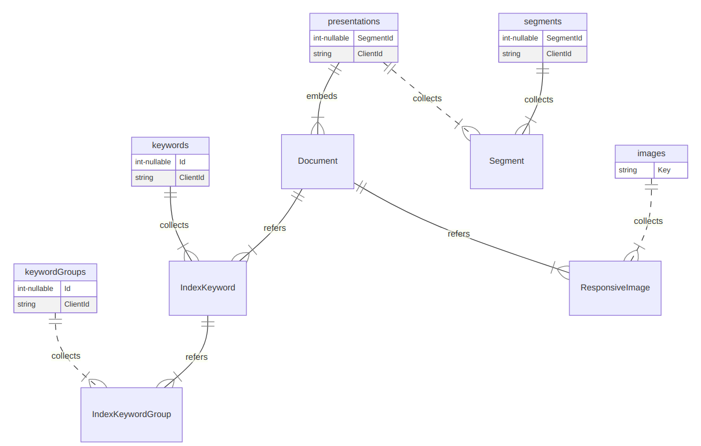

---json
{
  "documentId": 0,
  "title": "studio status report: 2021-05",
  "documentShortName": "2021-05-24-studio-status-report-2021-05",
  "fileName": "index.html",
  "path": "./entry/2021-05-24-studio-status-report-2021-05",
  "date": "2021-05-24T18:50:26.915Z",
  "modificationDate": "2021-05-24T18:50:26.915Z",
  "templateId": 0,
  "segmentId": 0,
  "isRoot": false,
  "isActive": true,
  "sortOrdinal": 0,
  "clientId": "2021-05-24-studio-status-report-2021-05",
  "tag": "{\n  \"extract\": \"month 05 of 2021 was about getting the b-roll player and LiteDB working in the Studio The latest addition to b-roll player technology is a NuGet package called Polly [GitHub] which allows the b-roll player to define formal retry policies with respect to c…\"\n}"
}
---

# studio status report: 2021-05

## month 05 of 2021 was about getting the b-roll player and LiteDB working in the Studio

The latest addition to b-roll player technology is a NuGet package called `Polly` [[GitHub](https://github.com/App-vNext/Polly)] which allows the b-roll player to define formal [retry policies](https://docs.microsoft.com/en-us/azure/architecture/patterns/retry) with respect to calling 3<sup>rd</sup>-party REST APIs (like the quite unreliable [YouTube Data API](https://developers.google.com/youtube/v3)).

A Polly policy can be defined like this:

```csharp
var retryCount = 10;

retryPolicy = Policy
    .Handle<HttpRequestException>()
    .Or<TaskCanceledException>()
    .Or<TimeoutException>()
    .WaitAndRetryAsync(
        retryCount,
        retryAttempt => TimeSpan.FromSeconds(3),
        (exception, timeSpan, context) =>
        {
            traceSource?.TraceError(exception);
            traceSource?.TraceInformation($"Retrying in {timeSpan.Seconds} 
seconds (attempt {context.Count} of {retryCount})...");
        }
    );
```

(where `context.Count` is not what I think it is) and this policy can wrap a service call like this:

```csharp
internal static async Task<JObject> GetPlaylistItemsByIdAsync(this 
RestApiMetadata restApiMetadata, string playlistId, AsyncPolicy retryPolicy)
{
    traceSource?.TraceVerbose($"{nameof(GetPlaylistItemsByIdAsync)}:");
    traceSource?.WriteLine($"Getting playlist items with {nameof(playlistId)} `
{playlistId}`...");
    if (restApiMetadata == null) throw new ArgumentNullException(nameof
(restApiMetadata));
    if (retryPolicy == null) throw new ArgumentNullException(nameof(retryPolicy));
    var uri = restApiMetadata.ToUriForYouTubePlaylistItems(playlistId);
    string responseString = await retryPolicy
        .ExecuteAsync(async () =>
        {
            return await new HttpRequestMessage(HttpMethod.Get, uri)
                .GetContentAsync()
                .ConfigureAwait(continueOnCapturedContext: false);
        })
        .ConfigureAwait(continueOnCapturedContext: false);
    var jObject = JObject.Parse(responseString);
    return jObject;
}
```

I suffered _for years_ without even thinking of needing something like this! Thanks goes out to [Nick Chapsas](https://twitter.com/nickchapsas), his video, “[How to add clean Retrying in .NET Core using Polly](https://www.youtube.com/watch?v=yXzn6HxTufM),” changed my life! In fact, his YouTube channel is far ahead of the usual .NET YouTube channels and podcasts, [many of them curated](http://songhaysystem.com/player/video/youtube/uploads/player/video/youtube/uploads/songhay/code) by the b-roll player.

### b-roll player .NET binaries need PowerShell

I run the routines for YouTube channel curation on my desktop using Visual Studio Code which opens a folder mirroring the JSON files used in production Azure Storage. I am treating these hundreds of JSON files like a data source and the PowerShell scripts are therefore the stored procedures of this primitive database.

Here is an example:

```powershell
$settingsPath = $args[0]

if (-not(Test-Path $settingsPath)) {
    Write-Warning "Cannot find path $settingsPath. Exiting script."
    exit
}

Set-Location $PSScriptRoot

$appRoot = "$($env:HOME)/appRoot/songhay/player/"
$jsonRoot = Resolve-Path -Path "../json"

$settings = Get-Content -Path $settingsPath | ConvertFrom-Json

$azStorageCnn = $settings.ProgramMetadata.CloudStorageSet.SonghayCloudStorage.classic

Write-Output "Looking for channel files..."

$channelFiles = Get-ChildItem -Path $jsonRoot -Filter "youtube-channels-*.json"

$channelFiles | ForEach-Object {
    $channels = Get-Content -Path $_.FullName | ConvertFrom-Json

    $channels | ForEach-Object {

        $fileName = $_.name

        "downloading youtube-channels/$fileName..."

        &az storage blob download-batch `
            --connection-string $azStorageCnn `
            --destination $jsonRoot `
            --pattern "youtube-channels/$fileName" `
            --source "player-video"

        $channelFile = "$jsonRoot/youtube-channels/$fileName"
        $uploadsFile = "$jsonRoot/youtube-uploads/$fileName"

        Push-Location -Path $appRoot

        &dotnet `
            Songhay.Player.Shell.dll `
            YouTubePlaylistItemsActivity `
            --json-file $channelFile `
            --output-file $uploadsFile

        if ($LASTEXITCODE -ne 0) {
            exit $LASTEXITCODE
        }

        Start-Sleep -Milliseconds 500

        if (Test-Path $uploadsFile) {

            &az storage blob upload `
                --container-name player-video `
                --connection-string $azStorageCnn `
                --file $uploadsFile `
                --name "youtube-uploads/$fileName"

            Remove-Item -Path $uploadsFile -Verbose

        }

        Pop-Location

        Remove-Item -Path $channelFile -Verbose
    }

    Remove-Item -Path $_.FullName -Verbose

    if ($channelFiles[-1].FullName -ne $_.FullName) {

        Write-Output "Sleeping for 73 seconds to provide Google with a tax haven..."

        Start-Sleep -Seconds 73

    }
}

Write-Output "Updating indices..."

$filter = "youtube-index-*.json"

&az storage blob download-batch `
    --connection-string $azStorageCnn `
    --destination $jsonRoot `
    --pattern $filter `
    --source "player-video"

$indexFiles = Get-ChildItem -Path $jsonRoot -Filter $filter

$indexFiles | ForEach-Object {

    Push-Location -Path $appRoot

    $indexOutputFile = $_.FullName.Replace(".json", "-output.json")

    &dotnet `
        Songhay.Player.Shell.dll `
        YouTubeIndexActivity `
        --update-yt-index `
        --json-file $_.FullName `
        --output-file $indexOutputFile

    if ($LASTEXITCODE -ne 0) {
        exit $LASTEXITCODE
    }

    Start-Sleep -Milliseconds 500

    Pop-Location

    Remove-Item -Path $_.FullName -Verbose

    Rename-Item -Path $indexOutputFile -NewName $_.FullName -Verbose

    &az storage blob upload-batch `
        --connection-string $azStorageCnn `
        --destination "player-video" `
        --pattern "$([System.IO.Path]::GetFileName($_.FullName))" `
        --source "$jsonRoot"

    Remove-Item -Path $_.FullName -Verbose
}

$filter = "youtube-topten.json"

&az storage blob download-batch `
    --connection-string $azStorageCnn `
    --destination $jsonRoot `
    --pattern $filter `
    --source "player-video"

$indexFiles = Get-ChildItem -Path $jsonRoot -Filter $filter

$indexFiles | ForEach-Object {

    $topTenIndex = Get-Content -Path $_.FullName | ConvertFrom-Json

    Push-Location -Path $appRoot

    $topTenIndex.PSObject.Properties | ForEach-Object {

        $propertyName = $_.Name
        $list = [string]::Join(",", $topTenIndex."$propertyName")
        $indexOutputFile = "$jsonRoot/youtube-uploads/youtube-index-$propertyName-top-ten.json"

        &dotnet `
            Songhay.Player.Shell.dll `
            YouTubeIndexActivity `
            --update-yt-topten-index `
            --list $list `
            --output-file $indexOutputFile

        if ($LASTEXITCODE -ne 0) {
            exit $LASTEXITCODE
        }

        Start-Sleep -Milliseconds 500

        &az storage blob upload-batch `
            --connection-string $azStorageCnn `
            --destination "player-video/youtube-uploads" `
            --pattern "youtube-index-$propertyName-top-ten.json" `
            --source "$jsonRoot/youtube-uploads"

        Remove-Item -Path $indexOutputFile -Verbose
    }

    Pop-Location

    Remove-Item -Path $_.FullName -Verbose
}
```

This script feels too large for my comfort but note that:

```powershell
$settings = Get-Content -Path $settingsPath | ConvertFrom-Json

$azStorageCnn = $settings.ProgramMetadata.CloudStorageSet.SonghayCloudStorage.classic
```

represents my discovery that my primitive secrets file can be called from a script.

- My use of the Azure CLI (`az`) from PowerShell might look brilliant but the right thing to do is to use [the Az PowerShell module](https://docs.microsoft.com/en-us/powershell/azure/new-azureps-module-az?view=azps-5.9.0).
- Using `Push-Location -Path $appRoot` helps .NET not throw errors while looking for configuration files like `appsettings.json`.
- Using `if ($LASTEXITCODE -ne 0) { exit $LASTEXITCODE }` is basically saying there is zero-tolerance for unhandled exceptions _in this entire script_ which would be crazy without Polly (but sometimes you have to be ‘crazy’ in order to setup a Polly policy correctly).
- `$topTenIndex.PSObject.Properties | ForEach-Object` makes looping through a hunk of JSON shaped like a .NET Dictionary possible without having to hard-code keys.

This script can run on my local desktop and _should_ run in an Azure WebJob, scheduled by Azure Logic Apps. I may continue to use a WebJob while Azure Functions tries to [catch up with .NET 5](https://visualstudiomagazine.com/articles/2021/03/24/azure-functions-net5.aspx) and 6.

### loading ancient SQL Azure data into LiteDB

The experimental test that defines my first Publications [LiteDB](https://www.litedb.org/) looks like this:

```csharp
[Theory]
[InlineData("db", "KinteSpace.db")]
public void ShouldGenerateDb(string dbDirectory, string dbFileName)
{
    var dbPath = GetDbPath(dbDirectory, dbFileName);
    using var db = new LiteDatabase(dbPath);
    ILiteCollection<Segment> presentations;
    ILiteCollection<Segment> segments;
    ILiteCollection<IndexKeyword> keywords;
    ILiteCollection<IndexKeywordGroup> keywordGroups;
    ILiteCollection<ResponsiveImage> images;
    presentations = db.GetCollection<Segment>(nameof(presentations));
    presentations.DeleteAll();
    presentations.EnsureIndex(i => i.ClientId, unique: true);
    presentations.EnsureIndex(
        nameof(Segment.Documents).ToLowerInvariant(),
        $"$.{nameof(Segment.Documents)}[*].{nameof(Document.ClientId)}"
        );
    segments = db.GetCollection<Segment>(nameof(segments));
    segments.DeleteAll();
    segments.EnsureIndex(i => i.ClientId, unique: true);
    segments.EnsureIndex(
        nameof(Segment.Segments).ToLowerInvariant(),
        $"$.{nameof(Segment.Segments)}[*].{nameof(Segment.ClientId)}"
        );
    keywords = db.GetCollection<IndexKeyword>(nameof(keywords));
    keywords.DeleteAll();
    keywords.EnsureIndex(i => i.ClientId, unique: true);
    keywords.EnsureIndex(
        nameof(IndexKeyword.Groups).ToLowerInvariant(),
        $"$.{nameof(IndexKeyword.Groups)}[*].{nameof(IndexKeywordGroup.ClientId)}"
        );
    keywordGroups = db.GetCollection<IndexKeywordGroup>(nameof(keywordGroups));
    keywordGroups.DeleteAll();
    keywordGroups.EnsureIndex(i => i.ClientId, unique: true);
    images = db.GetCollection<ResponsiveImage>(nameof(images));
    images.EnsureIndex(i => i.Key, unique: true);
    var mapper = BsonMapper.Global;
    mapper.Entity<Document>()
        .DbRef(
            i => i.IndexKeywords,
            keywords.Name);
    mapper.Entity<Document>()
        .DbRef(
            i => i.ResponsiveImages,
            images.Name);
    mapper.Entity<IndexKeyword>()
        .DbRef(
            i => i.Groups,
            keywordGroups.Name);
    mapper.Entity<Segment>().Id(i => i.SegmentId);
    mapper.Entity<Document>().Id(i => i.DocumentId);
    mapper.Entity<IndexKeyword>().Id(i => i.Id);
    mapper.Entity<ResponsiveImage>().Id(i => i.Key);
    var dbInfo = new FileInfo(dbPath);
    Assert.True(dbInfo.Exists);
}
```

This experiment should produce a no-SQL schema that looks like this:



Unless I am yet again deeply mistaken, this database design is locked an loaded, ready to generate a Publication index for search and browsing static HTML (generated by [11ty.dev](https://www.11ty.dev/)).

Success here means my Studio is _finally_, _finally_, _finally_ in position to produce new web sites!

## sketching out a development schedule (revision 16)

The schedule of the month:

- ~~rebuild `Songhay.Player` Activities with zero dependencies on the file-system and `Songhay.Cloud*` libraries~~
- ~~incorporate LiteDB [🐙🐈 [GitHub](https://github.com/mbdavid/litedb)] into `Songhay.Publications.KinteSpace`~~
- generate Publication indices from LiteDB for `Songhay.Publications.KinteSpace`
- build Web components required for new version of SonghaySystem.com 🖼
- upgrade [`songhay-ng-workspace`](https://github.com/BryanWilhite/songhay-ng-workspace) to Angular latest 📦↑
- complete [project](https://github.com/BryanWilhite/songhay-dashboard/projects/1) associated with new version of SonghaySystem.com ✅
- use `@songhay/index` as a side-car app for “Day Path” and “the rasx() context” 🚛📦
- add proposed [content Web component](https://github.com/BryanWilhite/songhay-web-components/issues/10)
- use the learnings from existing npm packages to build `@songhay/player-audio-???` 📦✨
- modernize the kinté hits page into a progressive web app 💄✨
- convert Day Path Blog and SonghaySystem.com to HTTPs by default 🔐
- use the learnings of previous work to upgrade and re-release the kinté space 🚀

@[BryanWilhite](https://twitter.com/BryanWilhite)
