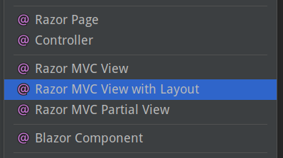
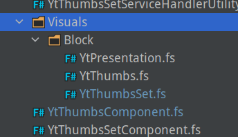
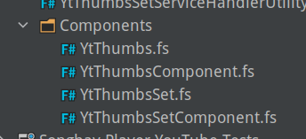

---json
{
  "documentId": 0,
  "title": "studio status report: 2022-05",
  "documentShortName": "2022-05-29-studio-status-report-2022-05",
  "fileName": "index.html",
  "path": "./entry/2022-05-29-studio-status-report-2022-05",
  "date": "2022-05-29T18:53:33.556Z",
  "modificationDate": "2022-05-29T18:53:33.556Z",
  "templateId": 0,
  "segmentId": 0,
  "isRoot": false,
  "isActive": true,
  "sortOrdinal": 0,
  "clientId": "2022-05-29-studio-status-report-2022-05",
  "tag": "{\n  \"extract\": \"month 5 of 2022 was about releasing SonghaySystem.com and addressing my deprecated DevOps pipelines For about eight months during 2021 I planned to release an eleventy version of SonghaySystem.com. A GitHub project at  represents this intent. This elevent…\"\n}"
}
---

# studio status report: 2022-05

## month 5 of 2022 was about releasing SonghaySystem.com and addressing my deprecated DevOps pipelines

For about eight months during 2021 I planned to release an [eleventy](https://www.11ty.dev/) version of SonghaySystem.com. A GitHub project at <https://github.com/BryanWilhite/songhay-dashboard/projects/1> represents this intent. This eleventy-centric focus makes 2021 sense as [I started 2020 with eleventy celebrations](http://songhayblog.azurewebsites.net/entry/2020-02-08-studio-status-report-2020-01/) and that party raged through [the summer of 2020](http://songhayblog.azurewebsites.net/entry/2020-06-11-my-blogging-workflow-for-2020-is-all-about-11ty-eleventy/), leading to [a manifesto-like Blog post](http://songhayblog.azurewebsites.net/entry/2020-10-30-a-return-to-progressive-enhancement-with-lithtml-and-11ty-eleven-ty/) in Autumn.

By the eleventh month (no pun intended) of 2021, I completely switched to Bolero, an ‘experiment’ represented by the GitHub project at <https://github.com/BryanWilhite/Songhay.Dashboard/projects/2>. This ‘experiment’ concluded about six months later, on 5/14, with the release of SonghaySystem.com.

Sadly, I _will_ understate the significance of this success. I consider this a defect of my character. To publicly introduce my new relationship with F#, I _did_ write “[flippant remarks about F#](http://songhayblog.azurewebsites.net/entry/2022-03-30-flippant-remarks-about-f)” but more educational self-promotion is needed. As I write this, I am more concerned with the fact that I set a completely different repo for the eleventy push and forgot about it! _I will need to delete this repo ASAP, breaking some of the links in this document._

Additionally, I was quite disappointed to find that the Azure Pipeline, supporting the release of SonghaySystem.com, was effectively deprecated by Microsoft. I have started looking into `az pipelines` [📖 [docs](https://docs.microsoft.com/en-us/cli/azure/pipelines?view=azure-cli-latest)] and `az devops` [📖 [docs](https://docs.microsoft.com/en-us/cli/azure/devops?view=azure-cli-latest)] of the Azure CLI to bypass the sluggish Portal UX as Microsoft transitions most ungracefully with poor communication.

## my continuing interest in eleventy

Yes, I admit it: my continuing interest in eleventy has taken a back seat to F#-based approaches. This would be quite an uncomfortable situation politically, from a self-marketing POV, had I somehow became an eleventy “influencer.” Yet again, I can take advantage of being almost entirely ignored by “the community” (wherever that is) and quietly consider moving to the F# equivalent of eleventy.

My original intent with eleventy was to avoid slipping into another language culture that was _not_ JavaScript/TypeScript (which is what can happen with something like [Hugo](https://gohugo.io/) or [Jekyll](https://jekyllrb.com/)—Go and Ruby, respectively). I regard JavaScript as the _conservative_ choice for static website development but I also regard using .NET (via F#) to generate static websites as the _ultra-orthodox_ conservative approach to web development.

Can Fornax [[GitHub](https://github.com/ionide/Fornax)] _replace_ eleventy? I have opened [a GitHub issue](https://github.com/BryanWilhite/dotnet-core/issues/41) to address this question.

BTW: I do not think my work with Web Components (under the [`songhay-web-components`](https://github.com/BryanWilhite/songhay-web-components) repo) was a forgettable waste of time. As long as I am into static Web site generation (which will be _forever_) I will be into Web Components!

### moving away from from Material Design toward Bulma

One of the side effects of the new release of SonghaySystem.com is my new use of [Bulma](https://bulma.io/). The main reason for doing this is _not_ my [dissatisfaction with Google](http://songhayblog.azurewebsites.net/entry/2020-08-21-strongly-disagree-final-remarks-for-the-google-candidate-experience-survey/). There are two objective points:

1. Material design depends on JavaScript like most of the popular JavaScript frameworks.
2. The way the project has been handled is typical of corporate bloat/bureaucracy playing catch up with the smaller, more independent projects.

So what might happen is that I will end up keeping eleventy for my Studio blogging platform, dropping Material design from the stack. And Google will still be in my development mix in the form of [Lit Element and Lit HTML](https://lit.dev/).

## selected month-05 notes

The following is from internal, Studio notes (stored in [Joplin](https://joplinapp.org/)):

### all the different ASP.NET Core views

These, a shown by Rider, are not all the views:



The list above informs the following table:

| view name | docs |
|- |-
| Blazor Component | “Blazor apps are built using Razor components, informally known as Blazor components.” [📖 [docs](https://docs.microsoft.com/en-us/aspnet/core/blazor/components/?view=aspnetcore-6.0)] |
| Razor MVC Partial View | “Partial views reduce code duplication by managing reusable parts of views.” [📖 [docs](https://docs.microsoft.com/en-us/aspnet/core/mvc/views/partial?view=aspnetcore-6.0)] |
| Razor MVC View | ASP.NET Core MVC [📖 [docs](https://docs.microsoft.com/en-us/aspnet/core/tutorials/choose-web-ui?view=aspnetcore-6.0#aspnet-core-mvc)] |
| Razor Page | ASP.NET Core Razor Pages [📖 [docs](https://docs.microsoft.com/en-us/aspnet/core/tutorials/choose-web-ui?view=aspnetcore-6.0#aspnet-core-razor-pages)] |
| View Component | “View components are similar to partial views in that they allow you to reduce repetitive code, but they're appropriate for view content that requires code to run on the server in order to render the webpage.” [📖 [docs](https://docs.microsoft.com/en-us/aspnet/core/mvc/views/view-components?view=aspnetcore-6.0)] |

#### related links

- “[Why You Should Use View Components, not Partial Views, in ASP.NET Core](https://www.telerik.com/blogs/why-you-should-use-view-components-not-partial-views-aspnet-core)”
- “[Don’t replace your View Components with Razor Components](https://andrewlock.net/dont-replace-your-view-components-with-razor-components/)”
- Misleading paragraph about Razor components #[24631](https://github.com/dotnet/AspNetCore.Docs/issues/24631)

### my `System.Diagnostics.CodeAnalysis` work might be overwork

The day job has provided me with my first .NET 6 project in the wild. By default, `null`-related warnings are popping out all over the place. In these early days of mine, I am basically sticking `[AllowNull]` [📖 [docs](https://docs.microsoft.com/en-us/dotnet/api/system.diagnostics.codeanalysis.allownullattribute?view=net-6.0)] everywhere to get rid of the most common warning.

I assume that I will become more sophisticated over time and mix some or all of the following into a future solution:

| my pick | remarks |
|- |-
| Optional [[GitHub](https://github.com/nlkl/Optional)] | A direct replacement for `null` that can be shocking and sacrilegious to DBMS-oriented devs. |
| `NullGuard.Fody` [[GitHub](https://github.com/Fody/NullGuard)] | “In [implicit](https://github.com/Fody/NullGuard#implicit-mode) mode everything is assumed to be not-null, unless attributed with `[AllowNull]`. This is how NullGuard has been working always.” This mode appears to be what I am dealing with currently. |
| Attributes for null-state static analysis [📖 [docs](https://docs.microsoft.com/en-us/dotnet/csharp/language-reference/attributes/nullable-analysis)] | I am already using one attribute, `[AllowNull]`, now but may need more expressive power around _preconditions_ and _postconditions_. |
| C# Records [📖 [docs](https://docs.microsoft.com/en-us/dotnet/csharp/language-reference/builtin-types/record)] | C# records can be mapped (with, say, AutoMapper) from day-job EF classes because “records and record structs aren’t appropriate for use as entity types in Entity Framework Core.” |

#### using `[AllowNull]` with anemic `string` class properties

I am seeing myself using `[AllowNull]` in a situation like this:

```csharp
[AllowNull]
public string? MyProperty { get; set; }
```

Specifying `Nullable<string>` feels redundant (because `default(string) == null`) but, again, day-job EF classes support `DbNull` with `Nullable<T>`.

The next massive use of `[AllowNull]` is per `string` parameter in a method signature.

### `Microsoft.AspNetCore.Mvc.Rendering.IHtmlHelper` extensions

In my salad days before my tragic journey into SPAs, I was very proud of my collection of long-lost (archived somewhere on optical media) `IHtmlHelper` extensions that make custom methods show up on the Razor `@Html` helper.

Here in the 21<sup>st</sup> century, day-job demands I make a nostalgic return to a new collection of `IHtmlHelper` extensions. This method is quite generic and should not go out of MVC style:

```csharp
public static HtmlString Concatenate(this IHtmlHelper helper, params HtmlString[] htmlStrings)
{
    if (helper == null) throw new ArgumentNullException(nameof(helper));

    var sb = new StringBuilder();

    foreach (var htmlString in htmlStrings) sb.Append(htmlString);

    return new HtmlString(sb.ToString());
}
```

This method is based on [a StackOverflow answer](https://stackoverflow.com/a/32063616/22944).

Another one that is quite general purpose is `AddMarkup`:

```csharp
public static HtmlString AddMarkup(this IHtmlHelper helper, string html, bool condition)
{
    if (helper == null) throw new ArgumentNullException(nameof(helper));

    return condition ? new HtmlString(html) : HtmlString.Empty;
}
```

### Bolero: packaging of components

This is not working:



This is better (and is working):



This organization eliminates `Visuals.Block` with `Components` which contains types and modules per Component.

## sketching out a development schedule (revision 21)

The schedule of the month:

- ~~complete [project](https://github.com/BryanWilhite/songhay-dashboard/projects/1) associated with new version of SonghaySystem.com~~ 📜🚜🔨
- convert Day Path Blog and SonghaySystem.com to HTTPs by default 🔐
- generate Publication indices from LiteDB for `Songhay.Publications.KinteSpace`
- switch Studio from Material Design to Bulma 💄 ▶️ 💄✨
- use the learnings of previous work in Bolero to upgrade and re-release the kinté space 🚀

<https://github.com/BryanWilhite/>
