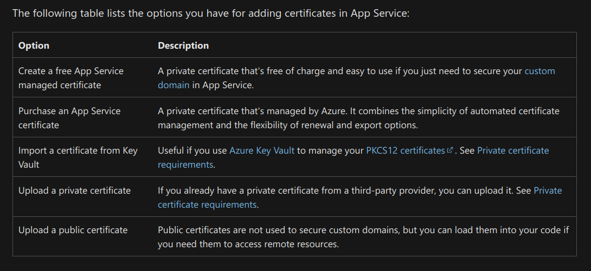
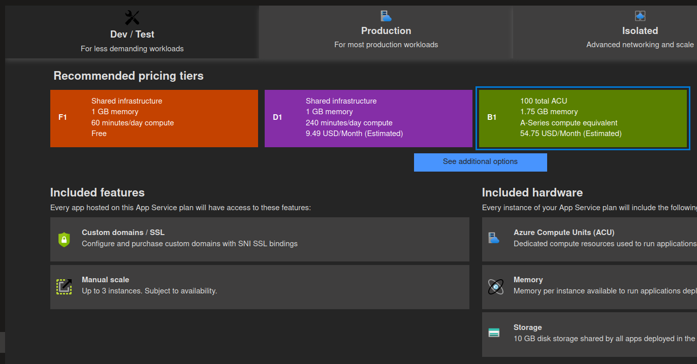

---json
{
  "documentId": 0,
  "title": "studio status report: 2022-06",
  "documentShortName": "2022-06-26-studio-status-report-2022-06",
  "fileName": "index.html",
  "path": "./entry/2022-06-26-studio-status-report-2022-06",
  "date": "2022-06-26T17:45:41.469Z",
  "modificationDate": "2022-06-26T17:45:41.469Z",
  "templateId": 0,
  "segmentId": 0,
  "isRoot": false,
  "isActive": true,
  "sortOrdinal": 0,
  "clientId": "2022-06-26-studio-status-report-2022-06",
  "tag": "{\n  \"extract\": \"month 06 of 2022 was about reporting a bug in Bolero, significantly revising the development schedule and consolidating my Validation portfolio My first GitHub Issue lodged to a second party that has escalated to a bug happens to be with Bolero. This came…\"\n}"
}
---

# studio status report: 2022-06

## month 06 of 2022 was about reporting a bug in Bolero, significantly revising the development schedule and consolidating my Validation portfolio

My first GitHub Issue lodged to a second party that has escalated to [a bug](https://github.com/fsbolero/Bolero/issues/261) happens to be with Bolero. This came from my work on responding to a major design change that Loïc Denuzière [introduced](https://github.com/fsbolero/Bolero/pull/253) in the second month of this year: changing the array-based HTML DSL to one based on computation expressions. (To see my work on this, see [all of the June commits](https://github.com/BryanWilhite/Songhay.Dashboard/commits/develop) on the `Songhay.Dashboard` develop branch.) To explain (mostly to my future self) why I decided to respond to Loïc’s breaking change across Bolero version, see “the eight .NET Studio crises” below. The gist here is that ‘the Songhay Dashboard and all of its Solution dependencies have to be upgraded to the latest version of Bolero’ because I cannot start building out a new b-roll player on Bolero without the shared F# libraries supporting `Songhay.Dashboard`. These are the shared F# libraries that should be broken out into their respective NuGet packages:

| proposed package name | proposed tagline |
|- |-
| `Songhay.Modules` | core reusable, opinionated concerns for *all* 🧐 of my F# projects |
| `Songhay.Modules.Bolero` | shared functionality for *all* 🧐 of my Bolero projects |
| `Songhay.Modules.Publications` | shared functionality for Songhay Studio Publications |
| `Songhay.Player.YouTube` | shared functionality for YouTube on the b-roll player |

`Songhay.Modules` is my F# ‘equivalent’ to the venerable `SonghayCore` [[GitHub](https://github.com/BryanWilhite/SonghayCore)]. Quite naturally it will be smaller than `SonghayCore`—even after `SonghayCore` is [trimmed down](https://github.com/BryanWilhite/SonghayCore/issues/131) in future releases.

`Songhay.Modules.Bolero` is very disruptive in my Studio! This work is effectively replacing (or ‘causing’ the sun-setting of):

- 🧊 `songhay-ng-workspace` [[GitHub](https://github.com/BryanWilhite/songhay-ng-workspace)] (should be set to read-only)
- 🧊 `unicorn-whale` [[GitHub](https://github.com/BryanWilhite/unicorn-whale)] (should be set to read-only)
- 🧊 `Songhay.Mvvm` [[GitHub](https://github.com/BryanWilhite/Songhay.Mvvm)] (should be set to read-only)
- 🧊 `Songhay.Desktop.Controls.AnalogDigit` [[GitHub](https://github.com/BryanWilhite/Songhay.Desktop.Controls.AnalogDigit)] (should be set to read-only)
- 🧊 `Songhay.StudioFloor` [[GitHub](https://github.com/BryanWilhite/Songhay.StudioFloor)] (should be set to read-only)
- 🔥 `Songhay.WebFormsOne` [[GitHub](https://github.com/BryanWilhite/Songhay.WebFormsOne)] (should be deleted)

I am choosing WebAssembly UI technology over traditional SPA technology and WPF legacy. The deletion of `Songhay.WebFormsOne` shows that my recent work on validation (see below) on modern .NET meets, exceeds and preserves my day-job/legacy experience with ASP.NET.

`Songhay.Modules.Publications` should work hand-in-hand with `Songhay.Publications` [[GitHub](https://github.com/BryanWilhite/Songhay.Publications)] as I struggle to balance server-side bias toward C# while I make firm commitment to the client side with F#.

`Songhay.Player.YouTube` is the first shared component for the new b-roll player. It draws heavily from my Angular-based work on `player-video-you-tube` [[GitHub](https://github.com/BryanWilhite/songhay-ng-workspace/tree/master/songhay/projects/songhay/player-video-you-tube)]. This is the first small step toward a new b-roll player for a new kintespace.com!

## cannot convert SonghaySystem.com to HTTPs by default?

Previously, there was this item on the development schedule sketch:

> convert Day Path Blog and SonghaySystem.com to HTTPs by default 🔐

This item was removed because of the disappointment coming from researching how to get HTTPS working on Azure. See “SonghaySystem.com HTTPS info” below.

## sketching out a development schedule (revision 22)

The schedule of the month:

- release NuGet package for `Songhay.Modules` 📦🚀
- release NuGet package for `Songhay.Modules.Bolero` 📦🚀
- release NuGet package for `Songhay.Modules.Publications` 📦🚀
- release NuGet package for `Songhay.Player.YouTube` 📦🚀
- upgrade `SonghayCore` to .NET 6
- generate a new repo with proposed name, `Songhay.Player.ProgressiveAudio` ✨🚧
- consider adding `dotnet-b-roll*` samples to the `dotnet-core` [[GitHub](https://github.com/BryanWilhite/dotnet-core)] repo 🚜✨
- upgrade the Studio to .NET 6 📦🔼
- generate Publication indices from LiteDB for `Songhay.Publications.KinteSpace`
- switch Studio from Material Design to Bulma 💄 ➡️ 💄✨
- revise/update `Songhay.HelloWorlds.Activities` [[GitHub](https://github.com/BryanWilhite/Songhay.HelloWorlds.Activities)] with current Studio knowledge of ASP.NET and Azure Functions
- document how to run ASP.NET via Apache on Linux for future version of kintespace.com 📖
- document the public APIs of Songhay System (and somehow automate this process) 📖

This 22<sup>nd</sup> revision is huge change with renewed focus! Finally, efforts toward a new kintespace.com are *officially* on the list!

## the validation ‘portfolio’ of this Studio

As of month 06, these are the validation samples available:

- jQuery unobtrusive validation over ASP.NET MVC [[GitHub](https://github.com/BryanWilhite/dotnet-core/tree/master/dotnet-web-mvc-unobtrusive-validation)]
- jQuery validation over ASP.NET MVC [[GitHub](https://github.com/BryanWilhite/dotnet-core/tree/master/dotnet-web-mvc-validation)]
- 🚧 Angular forms over ASP.NET [[GitHub](https://github.com/BryanWilhite/dotnet-core/tree/master/dotnet-web-mvc-angular-forms)] (incomplete/needs revision)

My take on validation in the world of Bolero is missing from the list above. Nevertheless, my conscious effort to study and present these samples publicly is the long-awaited compromise with the “job market” that I did not know I was waiting for! More importantly, my professional level of User Experience is now demonstrably increased (more to come).

## selected Studio notes from month 06

### the eight .NET Studio crises

There are eight crises related to .NET Studio projects:

1. the current kintespace.com b-roll player players are out of date and dependent on the `brollplayer` server
2. the `brollplayer` server should be replaced by the `songhay-system-player` server
3. the `songhay-system-player` server source code has to be rewritten to accommodate a massive refactoring of the Player Activities over the Player Shell
4. the new kintespace.com b-roll player(s) will be based on Blazor but this requires <mark>running ASP.NET via Apache</mark>
5. the new Blazor-based b-roll player will be dependent on F# libraries developed for the Songhay Dashboard (so this code has to be broken out into libraries/packages)
6. the Songhay Dashboard and all of its Solution dependencies have to be upgraded to the latest version of Bolero which will not be trivial due to breaking changes
7. kintespace.com needs to run on HTTPS to make a Google-dominated world ‘happy’
8. Azure WebJobs should be replaced by a combination of Azure Logic Apps and Azure Functions (the Studio has to be professional about finding serverless equivalents to the file system operations used by WebJobs—or just use containers, VMs, or A2 Hosting)

I will avoid sifting through the tangle here and identify the crises that are *completely* independent (apart from #7 and #8 which are *too* independent at the moment):

3. the `songhay-system-player` server source code has to be rewritten to accommodate a massive refactoring of the Player Activities over the Player Shell
6. the Songhay Dashboard and all of its Solution dependencies have to be upgraded to the latest version of Bolero which will not be trivial due to breaking changes

Resolving #3 will have little immediate effect on the other crises. However, resolving #6 will make #5 and #4 possible which would lead me to #3—almost half of my Studio problems gone!

Almost all of these crises require dull grunt work except for running ASP.NET via Apache.

### SonghaySystem.com HTTPS info

<https://docs.microsoft.com/en-us/azure/app-service/configure-ssl-certificate?tabs=apex%2Cportal>



It looks like I am back to old Microsoft pricing from the 1990s:



50 bucks a month just to have “free” SSL?

### A2 Hosting Free SSL

>The free SSL Certificate included in our plans offers basic website protection. It allows you to setup trusted HTTPS on websites for encrypted connections. The protection offered is just as secure as paid certificate options, however there are certainly are a number of reasons why you might want to consider one of our paid SSL Certificate options. Paid certificates include options such as warranties, Extended Validations (EV), and Organization Validations (OV).
>
> — <https://www.a2hosting.com/ssl-certificates/free>

<https://www.digicert.com/difference-between-dv-ov-and-ev-ssl-certificates>

### turn off all SQL Azure services for the Studio

When [SQL Server 2017 was released](https://en.wikipedia.org/wiki/Microsoft_SQL_Server#Milestones), it came with Linux support. That was my first, huge hint that the $13/month being spent on idle SQL Azure instances should go away. That is $156/year for at least five years just *given* away to Microsoft!

In the worst case scenario, at my small scale, I should be able to run SQL Server on A2 Hosting for $8.99/month!

### news flash 📰🗲: the direct replacement of an Azure WebJob

In this Studio, the direct replacement of an Azure WebJob is a Linux (with its traditional [cron jobs](https://www.hostinger.com/tutorials/cron-job)) server at A2 Hosting. These tiny jobs have had no need to scale beyond one server. Welcome to the land of the obvious!

This is something to consider when the Azure-based alternatives just do not feel comfortable.

### jQuery Validation: with `.rules()` validation for `datalist` [second attempt]

<https://codepen.io/rasx/pen/RwQdBzO>

The following actually uses the API as intended (but poorly documented) by the authors:

```javascript
(($) => {
  $(() => {
    const abBrands = [];

    $("#adhesive-bandage-brands > option").each((_, option) => {
      abBrands.push($(option).val());
    });

    $.validator.setDefaults({
      debug: true
    });

    const confineToDataList = (value, input, param) => {

      console.info("rule invoked", {value, input, param});

      if (value.length === 0) {
        return true;
      }

      return param.includes(value);
    };

    $.validator.addMethod(
      "confine_to_datalist",
      confineToDataList,
      "Enter an item from the dropdown list only."
    );

    $('button[type="button"]').click((_) => {
      const validator = $("form").validate({
        rules: {
          brand: {
            confine_to_datalist: abBrands
          }
        }
      });

      if (validator.form()) {
        console.info("form is valid");
      } // see https://stackoverflow.com/a/50066345/22944
    });
  });
})(jQuery);
```

@[BryanWilhite](https://twitter.com/BryanWilhite)
