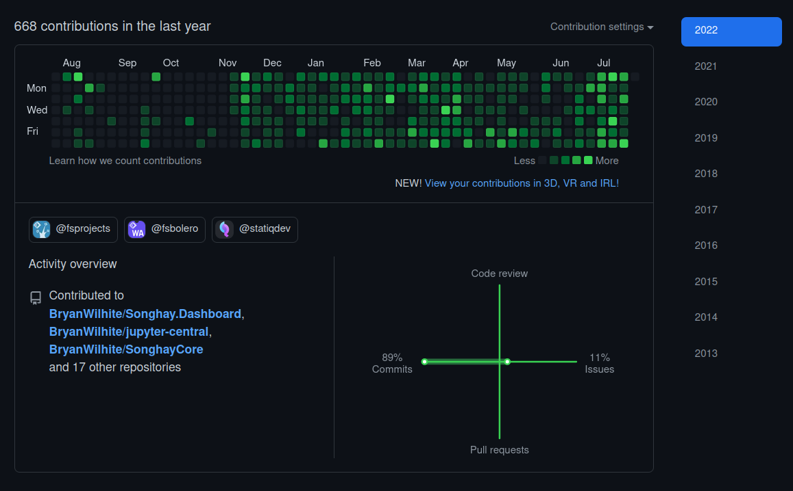
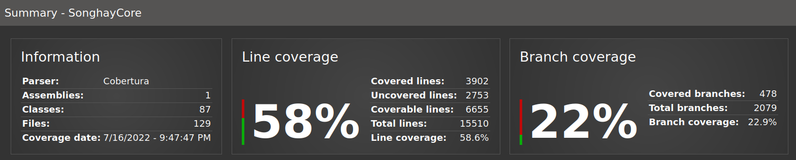
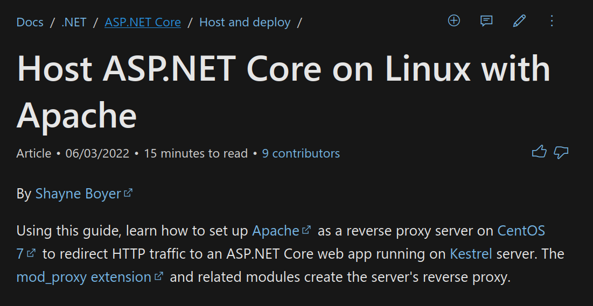
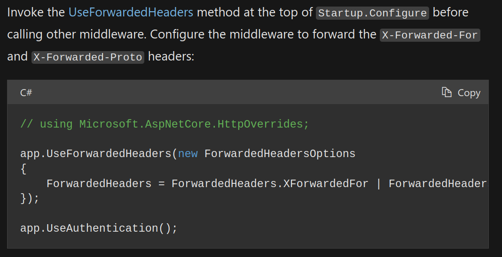
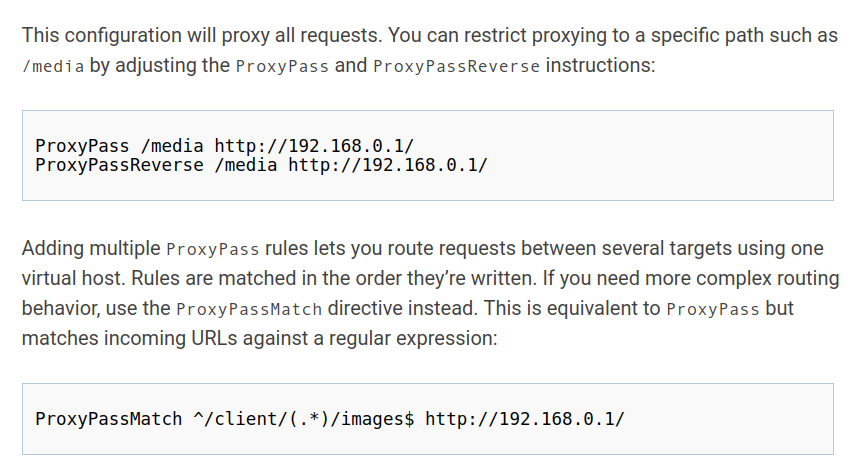

---json
{
  "documentId": 0,
  "title": "studio status report: 2022-07",
  "documentShortName": "2022-07-29-studio-status-report-2022-07",
  "fileName": "index.html",
  "path": "./entry/2022-07-29-studio-status-report-2022-07",
  "date": "2022-07-29T21:59:12.662Z",
  "modificationDate": "2022-07-29T21:59:12.662Z",
  "templateId": 0,
  "segmentId": 0,
  "isRoot": false,
  "isActive": true,
  "sortOrdinal": 0,
  "clientId": "2022-07-29-studio-status-report-2022-07",
  "tag": "{\n  \"extract\": \"month 07 of 2022 was about upgrading the Studio to .NET6 Sketching out a development schedule last month there was an item for revision 22 called “upgrade the Studio to .NET 6 📦🔼.” I removed that item for his month because what actually happened was the…\"\n}"
}
---

# studio status report: 2022-07

## month 07 of 2022 was about upgrading the Studio to .NET6

[Sketching out a development schedule last month](http://songhayblog.azurewebsites.net/entry/2022-06-26-studio-status-report-2022-06) there was an item for revision 22 called “upgrade the Studio to .NET 6 📦🔼.” I removed that item for his month because what actually happened was the release of:

- `SonghayCore` 6.0.1 [[NuGet](https://www.nuget.org/packages/SonghayCore/) 📦]
- `SonghayCore.Newtonsoft` 6.0.0 [[NuGet](https://www.nuget.org/packages/SonghayCore.Newtonsoft/) 📦]
- `Songhay.Publications` 6.0.1 [[NuGet](https://www.nuget.org/packages/Songhay.Publications/) 📦]
- `Songhay.Player` [internal to the Studio]

These moves effectively make it possible to incrementally upgrade everything else in the Studio. So instead of upgrading the entire Studio in one monumental go, the work this month removes the bottleneck related to recognizing .NET 6.0. I can look at my GitHub contributions this year so far and see the explosive growth as key decisions have been made around Studio UI technology (represented by `Songhay.Modules` 6.0.1 [[NuGet](https://www.nuget.org/packages/Songhay.Modules/) 📦]) and how the commitment to .NET 5.0, 6.0, etc. will unfold:

## the move to `SonghayCore` 6.0.1

All of this work is hard but moving to `SonghayCore` 6.0.1 was bloody hard work. This was largely because I am a [JetBrains Rider](https://www.jetbrains.com/rider/) user (on the Ubuntu desktop) and I finally turned its [ReSharper](https://www.jetbrains.com/resharper/documentation/documentation.html) functionality on the `SonghayCore` which sent me through loads of re-factoring. Additionally, I tasked myself with:

- upgrading to Statiq away from Wyam after [Dave Glick handled an issue for me](https://github.com/orgs/statiqdev/discussions/150#discussioncomment-3100086)
- publishing [coverlet coverage](https://bryanwilhite.github.io/SonghayCore/coverlet/) (see issue #[140](https://github.com/BryanWilhite/SonghayCore/issues/140))
- enabling `Nullable` (see issue #[134](https://github.com/BryanWilhite/SonghayCore/issues/134))

By adding ReportGenerator [[GitHub](https://github.com/danielpalme/ReportGenerator)] on top of coverlet [I can finally see](https://bryanwilhite.github.io/SonghayCore/coverlet/) that I have been messing about with over 15,000 lines of code for over six years:

This latest version of `SonghayCore` has the least amount of embarrassing code since its inception in 2016! The following illustrates packages dependent on `SonghayCore`:

## the move to `Songhay.Publications` 6.0.1

A near improvisational impulse to release `SonghayCore.Newtonsoft` 6.0.0 [[NuGet](https://www.nuget.org/packages/SonghayCore.Newtonsoft/) 📦] made the release of `Songhay.Publications` 6.0.1 relatively easy and quick. Since `Songhay.Player` depends on `Songhay.Publications`, the upgrade of `Songhay.Publications` removes and blockers in front of the b-roll player (which is pretty much the whole business behind Songhay System).

The following illustrates packages dependent on `Songhay.Publications`:

## sketching out a development schedule (revision 23)

The schedule of the month:

- ~~release NuGet package for `Songhay.Modules`~~ 📦🚀
- release NuGet package for `Songhay.Modules.Bolero` 📦🚀
- release NuGet package for `Songhay.Modules.Publications` 📦🚀
- release NuGet package for `Songhay.Player.YouTube` 📦🚀
- ~~upgrade `SonghayCore` to .NET 6~~  📦🔼
  - ~~upgrade `Songhay.Publications` to .NET 6~~  📦🔼
  - ~~upgrade `Songhay.Player` to .NET 6~~  📦🔼
- generate a new repo with proposed name, `Songhay.Player.ProgressiveAudio` ✨🚧
- consider adding `dotnet-b-roll*` samples to the `dotnet-core` [[GitHub](https://github.com/BryanWilhite/dotnet-core)] repo 🚜✨
- generate Publication indices from LiteDB for `Songhay.Publications.KinteSpace`
- switch Studio from Material Design to Bulma 💄 ➡️ 💄✨
- revise/update `Songhay.HelloWorlds.Activities` [[GitHub](https://github.com/BryanWilhite/Songhay.HelloWorlds.Activities)] with current Studio knowledge of ASP.NET and Azure Functions
- document how to run ASP.NET via Apache on Linux for future version of kintespace.com 📖
- document the public APIs of Songhay System (and somehow automate this process) 📖

## selected Studio notes from month 07

### ASP.NET: Host ASP.NET Core on Linux with Apache

<https://docs.microsoft.com/en-us/aspnet/core/host-and-deploy/linux-apache?view=aspnetcore-7.0>

>The app can also be published as a [self-contained deployment](https://docs.microsoft.com/en-us/dotnet/core/deploying/#self-contained-deployments-scd) if you prefer not to maintain the .NET Core runtime on the server.

The Microsoft docs do not cover this important part:

<https://www.howtogeek.com/devops/how-to-set-up-a-reverse-proxy-with-apache/>

### Azure Functions: news from the day job

According to the water cooler talk at the day job, we can use an Azure Function as Swagger endpoint for other Azure Functions. This suggests to me that we can build out a single API with several Azure Functions *in* Azure Functions. This implies that my studio would no longer have a need for Azure App Services (for Web API building).

This 2022 document makes mention of `AzureExtensions.Swashbuckle` [[GitHub](https://github.com/vitalybibikov/AzureExtensions.Swashbuckle)]: <https://www.c-sharpcorner.com/article/how-to-configure-swagger-in-azure-functions-apis/>

The slight discomfort with `AzureExtensions.Swashbuckle` is that it is *not* coming from Microsoft. I am seeing no Azure Functions equivalent of “[Get started with Swashbuckle and ASP.NET Core](https://docs.microsoft.com/en-us/aspnet/core/tutorials/getting-started-with-swashbuckle?view=aspnetcore-6.0&tabs=visual-studio)” which feels like the same old story of getting ahead of Microsoft until Microsoft catches up and likely forces a re-factor of everything!

@[BryanWilhite](https://twitter.com/BryanWilhite)
