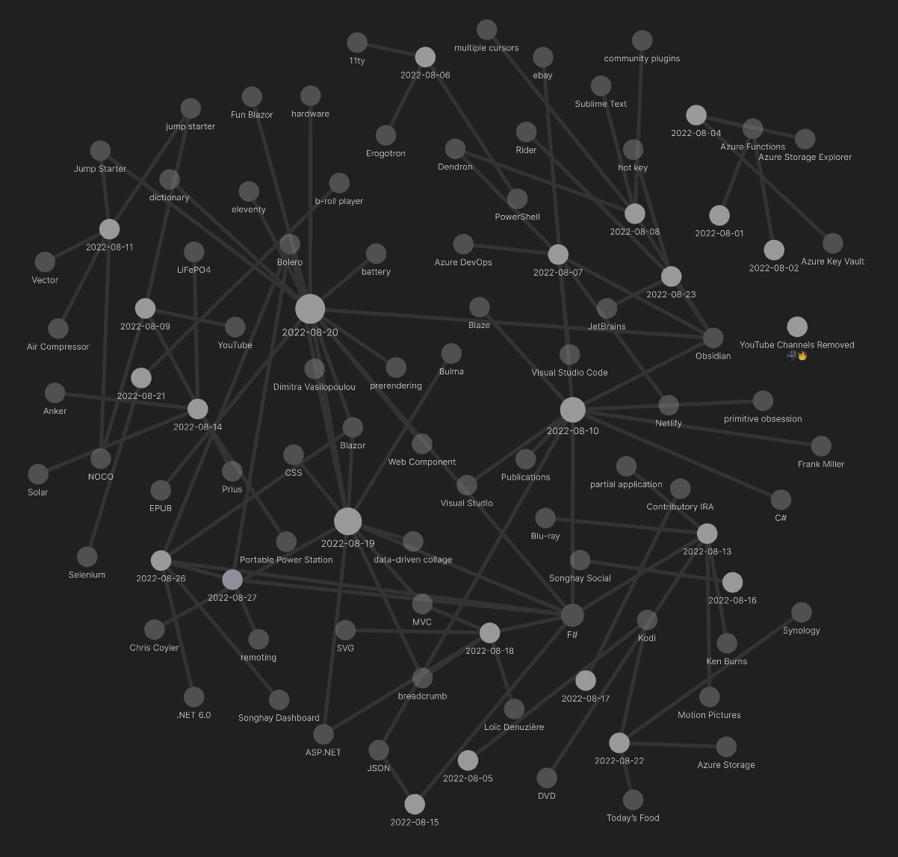
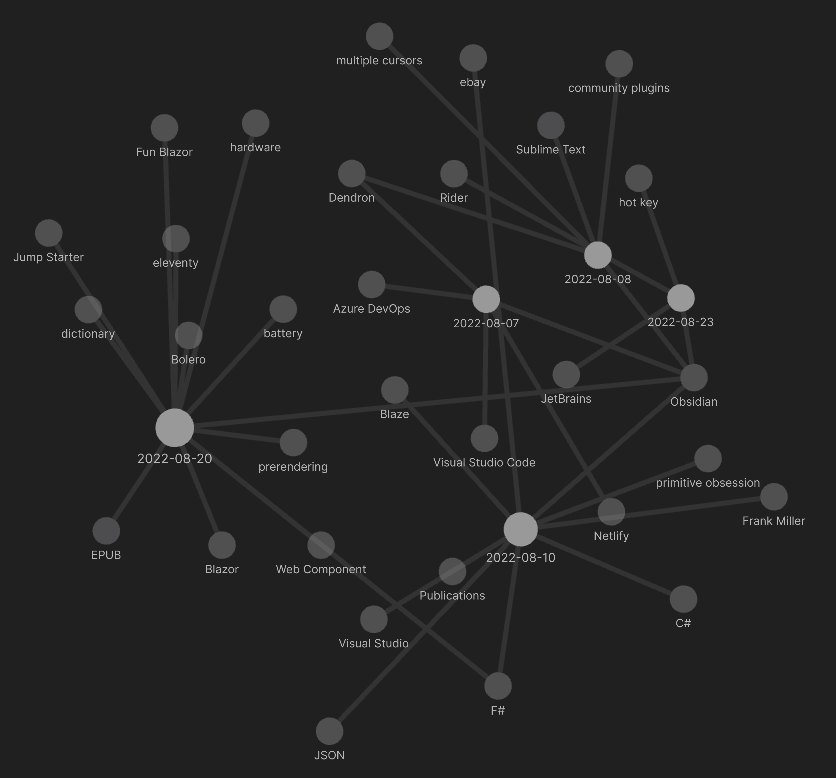
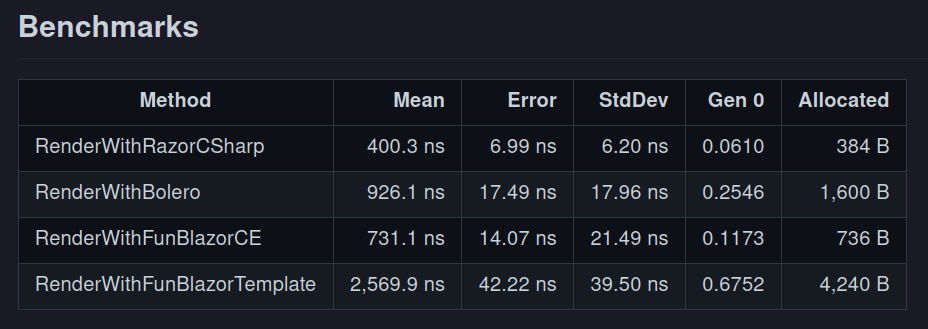

---json
{
  "documentId": 0,
  "title": "studio status report: 2022-08",
  "documentShortName": "2022-08-28-studio-status-report-2022-08",
  "fileName": "index.html",
  "path": "./entry/2022-08-28-studio-status-report-2022-08",
  "date": "2022-08-28T19:49:41.045Z",
  "modificationDate": "2022-08-28T19:49:41.045Z",
  "templateId": 0,
  "segmentId": 0,
  "isRoot": false,
  "isActive": true,
  "sortOrdinal": 0,
  "clientId": "2022-08-28-studio-status-report-2022-08",
  "tag": "{\n  \"extract\": \"month 07 of 2022 was about releasing Songhay.Modules.Publications 📦🚀 and switching to Obsidian The release of Songhay.Modules.Publications [GitHub] is summarized by the README on the repo itself: >The original intent of this project is the support of da…\"\n}"
}
---

# studio status report: 2022-08

## month 07 of 2022 was about releasing `Songhay.Modules.Publications` 📦🚀 and switching to Obsidian

The release of `Songhay.Modules.Publications` [[GitHub](https://github.com/BryanWilhite/Songhay.Modules.Publications)] is summarized by the [README](https://github.com/BryanWilhite/Songhay.Modules.Publications#readme) on the repo itself:

>The original intent of this project is the support of data access on the “client” side. There are two types currently considered:
>
> - `DisplayItemModel` [[source](https://github.com/BryanWilhite/Songhay.Modules/blob/main/Songhay.Modules/Models/DisplayItemModel.fs)]
> - `SyndicationFeed` [[source](https://github.com/BryanWilhite/Songhay.Modules/blob/main/Songhay.Modules/Models/SyndicationFeed.fs)]
>
>This project supports the generation of these types from JSON ‘shapes’ based on the [abstractions](https://github.com/BryanWilhite/Songhay.Publications/tree/master/Songhay.Publications/Abstractions) defined in `Songhay.Publications`.

My notes from 2022-08-10 goes into more details:

## my still-very-novel approach to `Songhay.Modules.Publications`

The intent behind `Songhay.Modules.Publications` is to translate any `Songhay.Publications` abstraction (defined in [[C#]] but transmitted as [[JSON]]) into any arrangement of `DisplayItemModel` (defined in [[F#]]).

I woke up this morning falling into the trap of thinking that `Songhay.Modules.Publications` is some kind of F# “port” of `Songhay.Publications`. No, there should be no code in C# that will use `DisplayItemModel` to the level of detail intended for F#.  This [[Publications]] module reveals the intent of this studio: to use C# on the server side and F# on the client side (but I am open to using F# on the server side as well but it is not as *necessary*).

Anyway, the novelty here is not the stuff in the previous paragraph. The novelty start with this:

```fsharp
type PublicationItem =  
    | Segment  
    | Document  
    | Fragment
```

`PublicationItem` is defined in a file called `Primitives.fs` but I woke up this morning thinking, Where is `Segment` defined? Such a question implies that there is a `type` called `Segment` out there on which `Primitives.fs` depends—which would violate my use of the word *Primitives*.

Such a question implies I *forgot* (which is why I am writing this now) about my intent to construct Publication Abstractions out of the Primitives in `Primitives.fs`. The intent is to translate JSON shaped like Publication Abstractions into arrangements of `DisplayItemModel` . From the elegant, minimalist F# point of view, *all Publication Abstractions are combinations of the Primitives* defined in `Songhay.Modules.Publications` and `Songhay.Modules`. The `fromInput` members hanging off of these primitives clearly show JSON being taken as input through expressions using said Primitives to produce output for said Primitives.

The novelty lies in the statement: *all Publication Abstractions are combinations of the Primitives* defined in `Songhay.Modules.Publications` and `Songhay.Modules`.

This is me using [[primitive obsession]] instead of <acronym title="Data Transfer Object">DTO</acronym>s.

## switching to Obsidian

I purposely left the `[[]]` (double-brackets) in the excerpt from my notes above to indicate that I have switched to [Obsidian](https://obsidian.md/) away from Joplin. The thing that should ‘sell’ Obsidian to most people is the [graph view](https://help.obsidian.md/Plugins/Graph+view):



This is literally showing me what my month 08 looks like. I can filter this graph down to *obsidian* and see about five days of writing about Obsidian:



BTW: 🎥 I recommend the [Nicole van der Hoeven YouTube channel](https://www.youtube.com/c/NicolevanderHoeven) for Obsidian users.

Here are my 08/08 notes on Obsidian:

## what is missing from Obsidian: [[multiple cursors]]

Obsidian supports a mouse-based, [multiple-cursor experience](https://help.obsidian.md/How+to/Working+with+multiple+cursors). There is already [an official request](https://forum.obsidian.md/t/sublime-texts-multiselect/40813/2) for a [[Sublime Text]] multiple-cursor experience that I enjoy very much in Visual Studio Code. Comments on this open request lead us to a community plugin: [Code Editor Shortcuts](https://github.com/timhor/obsidian-editor-shortcuts#code-editor-shortcuts).

## more of me, comparing [[Dendron]] with [[Obsidian]]

A highly-detailed [Dendron video by Bryan Jenks](https://www.youtube.com/watch?v=nfvx8rv77NA) hits me with a few things:

- Dendron is about the *Tree View* based on its *dot hierarchy,* implying the *Graph View* is not as central as it is in Obsidian.
- Dendron is about *structured* notes based on a schema as well as the free form—but is really about structured notes.
- Dendron comes with a calendar view by default as a smack in face of Obsidian.
- Wiki-linking a word or phrase without a note is essentially ignored by default in Dendron.

It *feels* like Dendron is for really incredible note takers who want to flow their notes into technical documentation. Obsidian leads with a minimalist approach. I immediately found Dendron as disruptive and chatty *by design* to my Visual Studio Code UX.

## removed ‘document how to run ASP.NET via Apache on Linux for future version of kintespace.com 📖’ from schedule (below)

Running ASP.NET on Linux is cool but not necessary. This is because I do not have a reason to pre-render HTML to present a Blazor (WebAssembly) home page. Being down in the weeds of getting Bolero to run on the server for SonghaySystem.com made me lose sight of the other flavor of Bolero: the client-side version of Bolero.

The client-side version of Bolero is closer to the role a traditional SPA (like Angular or React) plays in the Web world. This implies that my Studio work filed under [Songhay Angular workspace](https://github.com/BryanWilhite/songhay-ng-workspace) will have a client-side Bolero equivalent. Today, I assume we would see projects like:

- `Songhay.Modules.Bolero.Index` (the WebAssembly equivalent of my [Angular Index](https://github.com/BryanWilhite/songhay-ng-workspace/tree/master/songhay/projects/songhay/index) work)
- `Songhay.Player.YouTube` (the WebAssembly equivalent of my [Angular YouTube player](https://github.com/BryanWilhite/songhay-ng-workspace/tree/master/songhay/projects/songhay/player-video-you-tube))
- `Songhay.Player.ProgressiveAudio` ✨🚧 (see “sketching out a development schedule” below)

This realization also implies that `Songhay.Publications.KinteSpace` will be my progressive-enhancement masterpiece, my most advanced usage of [eleventy](https://www.11ty.dev/) with my Web components work and Bolero/Blazor/WebAssembly cherry on top. But “at the end of the day” the final product will be a bunch of files plopped on a server where (mostly) all the things needed from the server is related to serving static files!

## I probably do not need [[Fun Blazor]] over Bolero’s take on [[F#]] over [[Blazor]]

This [table](https://slaveoftime.github.io/Fun.Blazor.Docs/documents/About) from the Fun Blazor folks is not taking into account that [[Bolero]] now uses <acronym title="Computation Expression">CE</acronym>-based rendering:



And, by the way, I am still a bit shaken about how much faster ‘naked’ Blazor is (C# Blazor). Anyway, I probably do not need to worry about Fun Blazor because I was thinking that Fun Blazor was ‘more minimal’ than Bolero when it is not. I tend to forget about [the client-side-only Bolero](https://github.com/fsbolero/Bolero/issues/128) (which is the direct replacement of Angular) because it has no [[prerendering]] features. This functionality is important for `Songhay.Dashboard` but not at all important for my [progressive enhancement](http://songhayblog.azurewebsites.net/entry/2020-10-30-a-return-to-progressive-enhancement-with-lithtml-and-11ty-eleven-ty/) design with [[eleventy]] 💡

I can use my `dotnet-core` [repo](https://github.com/BryanWilhite/dotnet-core) to compare, say, [a minimal Bolero sample](https://github.com/kamcma/bolero-minimal-sample) from a couple years ago with the latest `dotnet` <acronym title="Command Line Interface">CLI</acronym> options:

```shell
dotnet new bolero-app --help

Bolero Hosted Application (F#)
Author: IntelliFactory
Options:                                                                                                                
  -m|--minimal     Create a minimal application                                                                         
                   bool - Optional                                                                                      
                   Default: false                                                                                       

  -s|--server      Include an ASP.NET Core server-side host                                                             
                   bool - Optional                                                                                      
                   Default: true                                                                                        

  -ht|--html       Use HTML templates (ignored if minimal=true)                                                         
                   bool - Optional                                                                                      
                   Default: true                                                                                        

  -hr|--hotreload  Include hot reload for HTML templates (ignored if html=false or server=false)                        
                   bool - Optional                                                                                      
                   Default: true                                                                                        

  -hp|--hostpage   How the static HTML content is generated (ignored if server=false)                                   
                       bolero    - A page defined with Bolero's html functions                                          
                       html      - A plain index.html file                                                              
                       razor     - A dynamically compiled Razor page                                                    
                   Default: bolero                                                                                      

  -pwa|--pwa       Create the client side as a progressive web app                                                      
                   bool - Optional                                                                                      
                   Default: false                                                                                       

  -ni|--nightly    Reference the nightly release of Bolero (see https://github.com/fsbolero/template for authentication)
                   bool - Optional                                                                                      
                   Default: false                                                                                       

  -p|--paket       Use Paket for NuGet package management                                                               
                   bool - Optional                                                                                      
                   Default: false 
```

I should try these:

- `dotnet new bolero-app -o Songhay.BoleroClientOnly -s=false`
- `dotnet new bolero-app -o Songhay.BoleroPwa -s=false -pwa=true`

## sketching out a development schedule (revision 24)

The schedule of the month:

- ~~release NuGet package for `Songhay.Modules`~~ 📦🚀
- release NuGet package for `Songhay.Modules.Bolero` 📦🚀
- ~~release NuGet package for `Songhay.Modules.Publications`~~ 📦🚀
- release NuGet package for `Songhay.Player.YouTube` 📦🚀
- generate a new repo with proposed name, `Songhay.Player.ProgressiveAudio` ✨🚧
- generate Publication indices from LiteDB for `Songhay.Publications.KinteSpace`
- generate a new repo with proposed name, `Songhay.Modules.Bolero.Index` ✨🚧
- switch Studio from Material Design to Bulma 💄 ➡️ 💄✨
- ~~revise/update `Songhay.HelloWorlds.Activities` [[GitHub](https://github.com/BryanWilhite/Songhay.HelloWorlds.Activities)] with current Studio knowledge of ASP.NET and Azure Functions~~

@[BryanWilhite](https://twitter.com/BryanWilhite)
