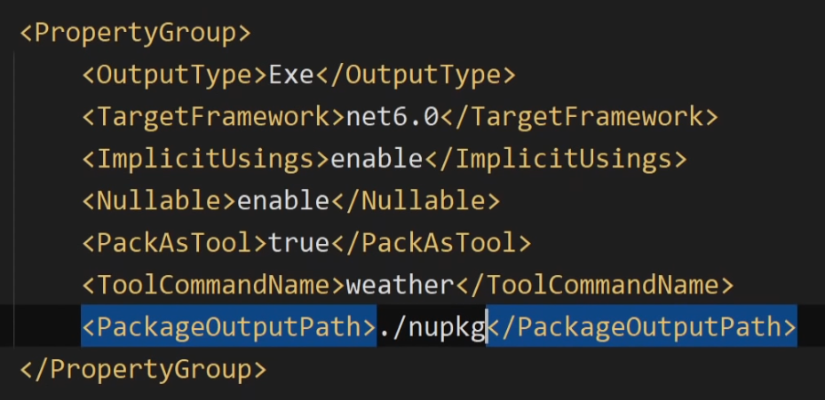

---json
{
  "documentId": 0,
  "title": "studio status report: 2022-10",
  "documentShortName": "2022-10-29-studio-status-report-2022-10",
  "fileName": "index.html",
  "path": "./entry/2022-10-29-studio-status-report-2022-10",
  "date": "2022-10-29T19:05:13.988Z",
  "modificationDate": "2022-10-29T19:05:13.988Z",
  "templateId": 0,
  "segmentId": 0,
  "isRoot": false,
  "isActive": true,
  "sortOrdinal": 0,
  "clientId": "2022-10-29-studio-status-report-2022-10",
  "tag": "{\n  \"extract\": \"month 10 of 2022 was about releasing AzureBlobStorageRestApiUtility and planning to release AzureKeyVaultRestApiUtility The release of AzureBlobStorageRestApiUtility (see issue #149) establishes one of two Azure utilities that are fundamental to the “clou…\"\n}"
}
---

# studio status report: 2022-10

## month 10 of 2022 was about releasing `AzureBlobStorageRestApiUtility` and planning to release `AzureKeyVaultRestApiUtility`

The release of `AzureBlobStorageRestApiUtility` (see [issue #149](https://github.com/BryanWilhite/SonghayCore/issues/149)) establishes one of two Azure utilities that are _fundamental_ to the “cloud strategy” of this Studio. Completion of [issue #151](https://github.com/BryanWilhite/SonghayCore/issues/151) will release `AzureKeyVaultRestApiUtility` making the following the statement true:

>This Studio uses <acronym title="Representational State Transfer">REST</acronym> <acronym title="Application Programming Interface">API</acronym>s in the cloud for secrets and storage.

“[How To Access Azure Key Vault Secrets Through Rest API Using Postman](https://www.c-sharpcorner.com/article/how-to-access-azure-key-vault-secrets-through-rest-api-using-postman/)” by Anupam Maiti was the breakthrough message to me and my brain 🧠 that finally showed me the way to a fundamental that _should_ have been in place years ago. I _should_ have been demanding a <acronym title="Representational State Transfer">REST</acronym>ful approach to storage and secrets instead of getting lost in <acronym title="Software Development Kit">SDK</acronym>s. The _Core_ should be as primal as possible.

## what month 10 looked like


Month 10 highlights:

## something that can run locally and in the cloud with very little modification _without_ using containers (or WebJobs)?

My lack of interest in containers is based on the reasonable fear that containers will be a rabbit hole 🐇🕳 —and they also _feel_ too heavy and cumbersome for a my work (no lift-and-shifty DBMS behind micro-service(s) here). Moreover, I _feel_ that Activity <acronym title="Dynamic-link Library">DLL</acronym>s should be used in the cloud in [[Azure Functions]] for _both_ local and cloud runs—because [[Songhay Activity]] <acronym title="Dynamic-link Library">DLL</acronym>s contain stateless Activities, working on _one_ input to produce _one_ output. The biggest obstacle in front of this is where to store/retrieve secrets 🐇🕳.

Once the secrets challenge is met, then PowerShell can loop through things (synchronously) locally, effectively testing how Azure Functions run _sequentially_. Finally, Azure Function Orchestrations will be the last piece to put in place, looping through for _parallel_ runs.

Step zero, before the secrets bit, is replacing PowerShell-based Azure Storage calls with <acronym title="Representational State Transfer">REST</acronym> calls in dedicated Activities. In summary:

0. replace PowerShell-based Azure Storage calls with <acronym title="Representational State Transfer">REST</acronym> calls in dedicated Activities (a [[Songhay Dashboard]] [Activity](https://github.com/BryanWilhite/Songhay.Dashboard/blob/8a8805f8af7a7dd3f9c3189866a2065d1022e7a0/Songhay.Dashboard.Activities/AppDataActivity.cs#L86) is improvisationally on the way)
1. add secure secrets layer to the cloud
2. replace PowerShell-based Activity-<acronym title="Dynamic-link Library">DLL</acronym> calls with calls to an Activity hosted in an Azure Function
3. Orchestrate  Activity-<acronym title="Dynamic-link Library">DLL</acronym> Azure Functions

## add your own tooling to the [[.NET]] <acronym title="Command Line Interface">CLI</acronym>

<a href="https://www.youtube.com/watch?v=JNDgcBDZPkU"></a>

The `dotnet pack` command will save a NuGet package to the relative path specified below:



To install globally for the CLI, we use the following command, punctuated by the namespace, `Weather.Cli`, of the packaged app:

```shell
dotnet tool install --global --add-source ./nupkg weather.cli
```

## “Lazy load assemblies in ASP.NET Core [[Blazor]] [[WebAssembly]]”

>Blazor WebAssembly app startup performance can be improved by waiting to load app assemblies until the assemblies are required, which is called _lazy loading_.
>
>\[📖 [docs](https://learn.microsoft.com/en-us/aspnet/core/blazor/webassembly-lazy-load-assemblies?view=aspnetcore-5.0) \]
>

I assume the [[b-roll player]] will leverage lazy loading to switch among players.

## some of my code is kind of famous this week


<https://sergeytihon.com/2022/10/01/f-weekly-39-2022-fsharp-systemtextjson-1-0-fable-4-theta/>

## sketching out a development schedule (revision 26)

The schedule of the month:

- install Studio ‘floors’ in `Songhay.Player.ProgressiveAudio` and `Songhay.Player.YouTube`☔☔
- add a GitHub Project for `Songhay.Player.ProgressiveAudio`🐝✨
- change `Songhay.Player.YouTube` to support kinté space presentations 🔨 🚜✨
- replace the Angular app in `http://kintespace.com/player.html` with a Bolero app 🚜🔥
- generate Publication indices from LiteDB for `Songhay.Publications.KinteSpace`
- generate a new repo with proposed name, `Songhay.Modules.Bolero.Index` ✨🚧 and add a GitHub Project
- switch Studio from Material Design to Bulma 💄 ➡️ 💄✨

@[BryanWilhite](https://twitter.com/BryanWilhite)
