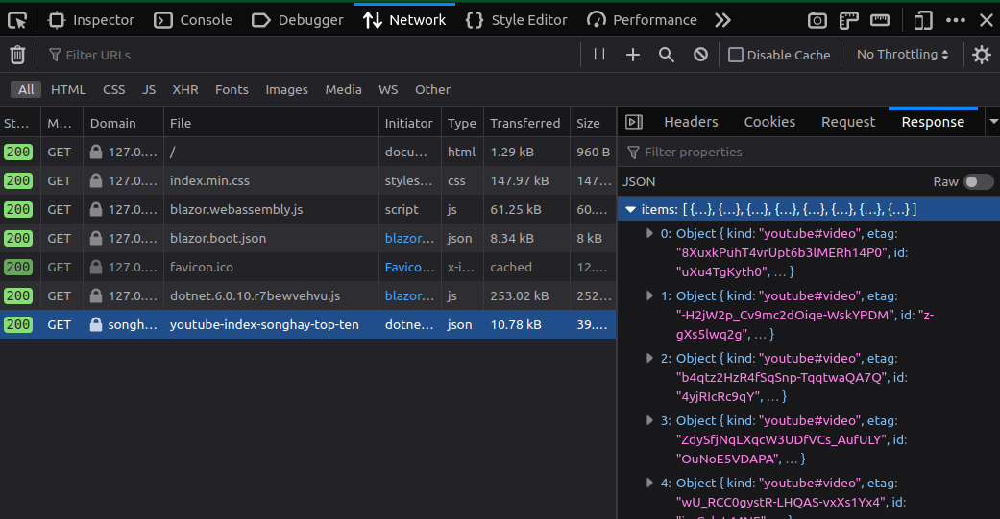

---json
{
  "documentId": 0,
  "title": "studio status report: 2022-11",
  "documentShortName": "2022-11-30-studio-status-report-2022-11",
  "fileName": "index.html",
  "path": "./entry/2022-11-30-studio-status-report-2022-11",
  "date": "2022-11-30T23:49:36.947Z",
  "modificationDate": "2022-11-30T23:49:36.947Z",
  "templateId": 0,
  "segmentId": 0,
  "isRoot": false,
  "isActive": true,
  "sortOrdinal": 0,
  "clientId": "2022-11-30-studio-status-report-2022-11",
  "tag": "{\n  \"extract\": \"month 11 of 2022 was about installing Studio ‘floors’ Songhay.StudioFloor.Client [GitHub] is the first Bolero-based Studio ‘floor,’ intending to demonstrate/document the Blazor/Bolero components of this repo. A side effect of this work is the  Songhay.Pla…\"\n}"
}
---

# studio status report: 2022-11

## month 11 of 2022 was about installing Studio ‘floors’

`Songhay.StudioFloor.Client` [[GitHub](https://github.com/BryanWilhite/Songhay.Player.YouTube/tree/main/Songhay.StudioFloor.Client)] is the first Bolero-based Studio ‘floor,’ intending to demonstrate/document the Blazor/Bolero components of this repo. A side effect of this work is the  `Songhay.Player.YouTube` 6.0.1 release [project](https://github.com/users/BryanWilhite/projects/8).

A huge chunk of this month was invested in learning how to upload (or, better, _scan_) files with modern ASP.NET (see below). Yes, this was a day-job thing but a great opportunity!

## what month 11 looked like


Month 11 highlights:

## Blazor: the Songhay Studio Floor _can_ make cross-domain requests✅



I assume that Blazor is handling all the <acronym title="# Cross-Origin Resource Sharing">CORS</acronym> stuff for me as long as the `BaseAddress` is constructed:

```fsharp
builder.Services.AddScoped<HttpClient>(fun _ ->  
    new HttpClient(BaseAddress = Uri YouTubeApiRootUri)) |> ignore
```

I can test this (perhaps) by changing `BaseAddress` and seeing what happens. This alleged importance of `BaseAddress` in Blazor implies that there must be an instance of `HttpClient` for every `BaseAddress` needed by the app?

## yes, it is wrong of me to be surprised that webpack cannot simply concatenate files…

The StackOverflow question, “[How do I concatenate and minify files using webpack](https://stackoverflow.com/questions/35471538/how-do-i-concatenate-and-minify-files-using-webpack)” seduced me into thinking that it is shocking that it cannot concatenate files without a plugin like `webpack-concat-plugin` \[[GitHub](https://github.com/hxlniada/webpack-concat-plugin)\]. And I still do not fully understand the `ModuleConcatenationPlugin` \[📖 [docs](https://webpack.js.org/plugins/module-concatenation-plugin/#debugging-optimization-bailouts) \].

My point is that webpack is designed for the situations I have outlined in my research:

- <https://github.com/BryanWilhite/nodejs/tree/master/webpack-getting-started-dev-server>
- <https://github.com/BryanWilhite/nodejs/tree/master/webpack-getting-started>
- <https://github.com/BryanWilhite/nodejs/tree/master/typescript-and-ajax>

These ‘situations’ are all about a `src` directory with an `index.js` or `index.ts` file in it which can load other files as modules. So, to make a long story  slightly longer, I should resort to `concat` \[[npm](https://www.npmjs.com/package/concat)\] when I need simple concatenation of files (which were in some cases packed by webpack).

## F♯: `FsToolkit.ErrorHandling` drama

I have probably been ignoring this warning for quite some time:

```console
Songhay.Modules.Bolero.Tests.fsproj: [NU1608] Detected package version outside of dependency constraint: FsToolkit.ErrorHandling 3.3.0 requires FSharp.Core (= 4.7.2) but version FSharp.Core 6.0.6 was resolved.
```

I flippantly assume that the `FsToolkit.ErrorHandling` developers are having a bit of adventure with NuGet packaging.

## Songhay Publications: how would ComiXology guided view tech work?

Today I flippantly assume that an image map of hash links can be generated with, say, [Image Map Generator](https://www.image-map.net/). The `coords` attribute of the image-map `area` element \[📖 [docs](https://developer.mozilla.org/en-US/docs/Web/HTML/Element/area) \] should have enough data to drive an animation that transitions between locations on an image.

## ComiXology, it’s “guided view” technology

>ComiXology's Guided View is a great way to experience digital comics. Designed for mobile devices, it allows readers to view things on a panel-by-panel basis, mimicking how you read a print comic. Now, that feature is available on Amazon's [Kindle app](https://itunes.apple.com/app/kindle-read-ebooks-magazines-textbooks/id302584613?mt=8) for iOS.
>
>—[engadget.com, 2017](https://www.engadget.com/2017-03-20-comixology-guided-view-kindle-update.html)
>

As of 2022, the Amazon influence has affected this technology:

>For one thing, it's noticeably slower and more prone to loading than before, and many users have noted individual books take up significantly more storage space now. The Kindle-inspired interface has become more convoluted, not to mention missing some of the organization features readers are accustomed to by now. The greater level of library customization and organization promised by Comixology has yet to materialize.
>
>—[ign.com](https://www.ign.com/articles/comixology-update-controversy-amazon-digital-comics)
>

## ASP.NET: my misread of “Upload files in ASP.NET Core”

When the Microsoft documentation [reads](https://learn.microsoft.com/en-us/aspnet/core/mvc/models/file-uploads?view=aspnetcore-6.0#file-upload-scenarios):

>Two general approaches for uploading files are buffering and streaming.
>

It can be slightly misleading (to me) because it can make one (me) think that the phrase “The entire file is read into an `IFormFile`” means that this loading take place _exclusively_ in server memory. The following misplaced sentence is surely meant to nullify this thinking:

>Any single buffered file exceeding 64 KB is moved from memory to a temp file on disk.
>

This single sentence implies that, yes, `IFormFile` will load its first 64 KB into memory _but_ the rest will be _streamed_ to “to the location named in the `ASPNETCORE_TEMP` environment variable.”

It follows that our “two general approaches for uploading files” is about avoiding using the 64 KB or not worrying about it. This 64 KB can become a problem when a server runs hundreds or thousands of _concurrent_ uploads:

>The disk and memory used by file uploads depend on the number and size of concurrent file uploads. If an app attempts to buffer too many uploads, the site crashes when it runs out of memory or disk space. If the size or frequency of file uploads is exhausting app resources, use streaming.
>

The streaming support in `IFormFile` is clearly defined what with the `IFormFile.OpenReadStream` method \[📖 [docs](https://learn.microsoft.com/en-us/dotnet/api/microsoft.aspnetcore.http.iformfile.openreadstream?view=aspnetcore-6.0#microsoft-aspnetcore-http-iformfile-openreadstream) \]. Bottom line: it is a serious mistake to think that `IFormFile`-based uploading has nothing to do with streaming.

## sketching out a development schedule (revision 27)

The schedule of the month:

- install Studio ‘floors’ in `Songhay.Player.ProgressiveAudio` ~~and `Songhay.Player.YouTube`☔~~☔
- add a GitHub Project for `Songhay.Player.ProgressiveAudio`🐝✨
- add kinté space presentations support to `Songhay.Player.YouTube` 🔨 🚜✨
- replace the Angular app in `http://kintespace.com/player.html` with a Bolero app 🚜🔥
- generate Publication indices from LiteDB for `Songhay.Publications.KinteSpace`
- generate a new repo with proposed name, `Songhay.Modules.Bolero.Index` ✨🚧 and add a GitHub Project
- switch Studio from Material Design to Bulma 💄 ➡️ 💄✨

@[BryanWilhite](https://twitter.com/BryanWilhite)
