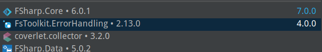
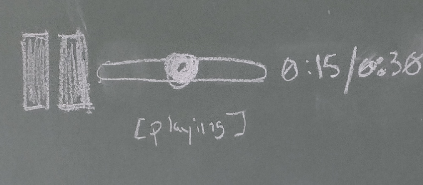

---json
{
  "documentId": 0,
  "title": "studio status report: 2022-12",
  "documentShortName": "2022-12-30-studio-status-report-2022-12",
  "fileName": "index.html",
  "path": "./entry/2022-12-30-studio-status-report-2022-12",
  "date": "2022-12-30T20:59:02.134Z",
  "modificationDate": "2022-12-30T20:59:02.134Z",
  "templateId": 0,
  "segmentId": 0,
  "isRoot": false,
  "isActive": true,
  "sortOrdinal": 0,
  "clientId": "2022-12-30-studio-status-report-2022-12",
  "tag": "{\n  \"extract\": \"month 12 of 2022 was about taking a vacation and Songhay.Player.ProgressiveAudio The day job energy provided me with a third (?) opportunity in my adult life to take half of the last month of the year off which is sitting around the “home office.” Month 1…\"\n}"
}
---

# studio status report: 2022-12

## month 12 of 2022 was about taking a vacation and `Songhay.Player.ProgressiveAudio`

The day job energy provided me with a third (?) opportunity in my adult life to take half of the last month of the year off which is sitting around the “home office.” Month 12 saw the “`Songhay.Player.ProgressiveAudio` release 6.0.0” [project](https://github.com/users/BryanWilhite/projects/9) get underway which is a very, very significant milestone. The _Progressive Audio_ name is at the top of the Obsidian Graph View:


Let’s drill into the Graph above with selected highlights:

## [[Songhay Player]]: “HTML5 Audio Player: The 10 Best Players”

Of the picks in “[HTML5 Audio Player: The 10 Best Players](https://catswhocode.com/html5-audio-player/)” I choose [audio.js](http://kolber.github.io/audiojs/) \[ [GitHub](https://github.com/kolber/audiojs) \] because it is essentially a ‘shim’ for the HTML5 `audio` element.

I’ll need to work through [the demos](https://github.com/kolber/audiojs/tree/master/demos) and see whether my choice is in the right place…

## The Daz Studio Masterclass

This one is from [Jay Versluis](https://www.versluis.com/):

>[The Daz Studio Masterclass](https://www.daz3d.com/community/masterclass?trk_msg=QPITHQHHKVGKF0TO9429U9SS5S&trk_contact=O3QRVPJEBL6RB8A0QUNFOKNCG8&trk_sid=9OME2QRE49MJ862UTV5D05CV7K&trk_link=UR7U7KVUJN8KJFM31SMUTPSV2S&utm_source=listrak&utm_medium=email&utm_term=Learn+More&utm_campaign=Introducing+the+Daz+Masterclass) is a 3-part series of courses that explore Daz Studio features, essential tips and tricks, and expert knowledge for creators of all skill levels. Enjoy Series 1 FREE, and unlock Series 2 and 3 with your Daz+ Membership. Ready, set, render!
>
>[[Daz 3D]]
>

## [[Ubuntu]]: “How to Master the Linux Tree Command”

- <https://vitux.com/linux-tree-command/>
- <https://stackoverflow.com/questions/19699059/print-directory-file-structure-with-icons-for-representation-in-markdown>

I have wondered 👣 for a long time where this came from:

```console
social-twitter
├── tweet-books
├── partitions
│   ├── KinteSpace
│   └── BryanWilhite
├── kinte-space
│   └── processed
└── bryan-wilhite
    └── processed
```

This is `tree` \[📖 [docs](https://github.com/Old-Man-Programmer/tree#readme)\]!

```bash
sudo apt-get install tree
```

The copying and pasting of `tree` output into [[Obsidian]] is nice for now but the exploration in “[Obsidian: Do almost anything (really!) with system commands](https://medium.com/@gareth.stretton/obsidian-do-almost-anything-really-with-system-commands-b496ffd0679c)” is out there waiting for me.

## [[F♯]]: latest `FsToolkit.ErrorHandling` drama resolved… kind of…

Version 4.x of `FsToolkit.ErrorHandling` will likely resolve the [[2022-11-08#F♯ : `FsToolkit.ErrorHandling` drama|latest drama]] around dependency constraints. The catch is this:

The next version of `FsToolkit.ErrorHandling` requires [[dotnet|.NET]] 7.0:



## while the tech world was “in love” with…

| world was using… | I was using… |
|-|-|
| PowerBuilder | Access 97 |
| PHP | ASP (VB Script) |
| Java Server Faces | ASP |
| Java Swing | Winforms (.NET 1.1) |
| Java Beans | ADO.NET |
| Spring Framework | Entity Framework |
| ASP.NET Web Forms | ASHX handlers with XSLT |
| Dojo Toolkit or Backbone | YUI |
| WordPress | WordPress |
| Node.js | ASP.NET |
| Ruby on Rails | ASP.NET MVC (C♯) |
| jQuery | jQuery |
| Angular JS | Angular JS |
| Headless WordPress (API only) | ASP.NET Web API |
| Android or iOS | Silverlight |
| CSS | SCSS | 
| AWS |  Azure |
| Bootstrap | Bootstrap |
| React | Angular (TypeScript) |
| Bootstrap |  Google Material Design |
| WordPress | 11ty |
| Bootstrap | Bulma |
| React or Vue | Bolero (F♯, WebAssembly) |

## [[Songhay Player]]: <acronym title="User Experience">UX</acronym> for audio playback

The [[Songhay Player for Progressive Audio]] should feature two controls, (i) the volume bar:


And (ii) the play-progress bar:




Both of these controls are horizontal lines that can responsively collapse to take up less horizontal space by hiding the progress bar.

## sketching out a development schedule (revision 28)

The schedule of the month:

- ~~install Studio ‘floors’ in `Songhay.Player.ProgressiveAudio` and `Songhay.Player.YouTube`☔~~☔
- ~~add a GitHub Project for `Songhay.Player.ProgressiveAudio`🐝✨~~
- add kinté space presentations support to `Songhay.Player.YouTube` 🔨 🚜✨
- replace the Angular app in `http://kintespace.com/player.html` with a Bolero app 🚜🔥
- generate Publication indices from LiteDB for `Songhay.Publications.KinteSpace`
- generate a new repo with proposed name, `Songhay.Modules.Bolero.Index` ✨🚧 and add a GitHub Project
- switch Studio from Material Design to Bulma 💄 ➡️ 💄✨

@[BryanWilhite](https://twitter.com/BryanWilhite)
