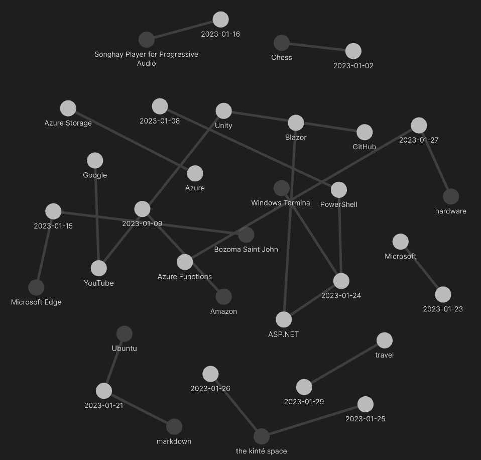
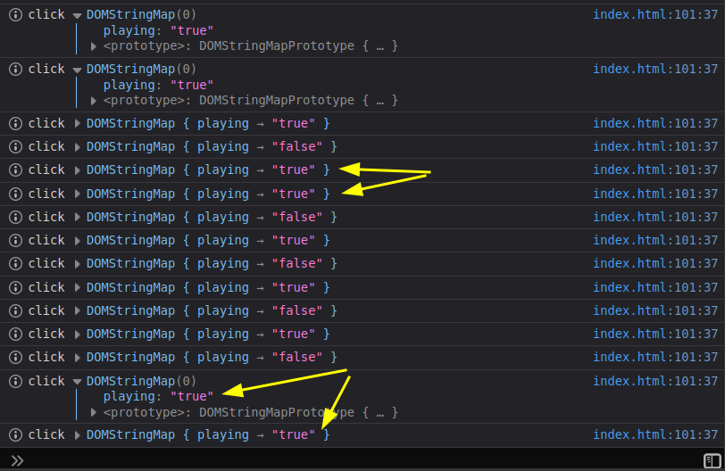
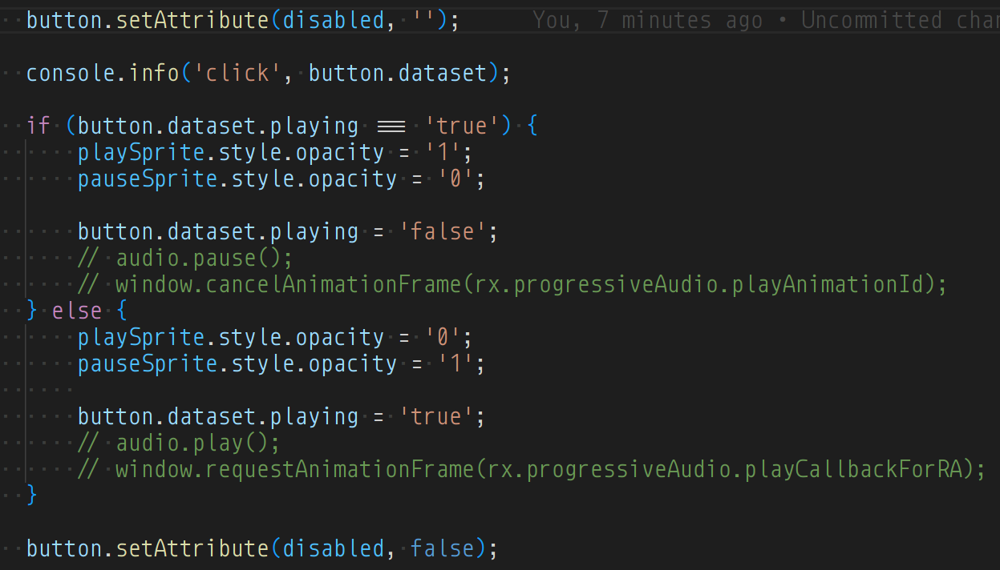

---json
{
  "documentId": 0,
  "title": "studio status report: 2023-01",
  "documentShortName": "2023-01-29-studio-status-report-2023-01",
  "fileName": "index.html",
  "path": "./entry/2023-01-29-studio-status-report-2023-01",
  "date": "2023-01-29T23:56:22.327Z",
  "modificationDate": "2023-01-29T23:56:22.327Z",
  "templateId": 0,
  "segmentId": 0,
  "isRoot": false,
  "isActive": true,
  "sortOrdinal": 0,
  "clientId": "2023-01-29-studio-status-report-2023-01",
  "tag": "{\n  \"extract\": \"month 01 of 2023 was about slow progress on Songhay.Player.ProgressiveAudio and the new topic of travel The “Songhay.Player.ProgressiveAudio release 6.0.0” project is still underway. There are two, audio-player samples showing this work: 1.\\nA third sample…\"\n}"
}
---

# studio status report: 2023-01

## month 01 of 2023 was about slow progress on `Songhay.Player.ProgressiveAudio` and the new topic of _travel_

The “`Songhay.Player.ProgressiveAudio` release 6.0.0” [project](https://github.com/users/BryanWilhite/projects/9) is _still_ underway. There are two, audio-player samples showing this work:

1. <https://rasx-node-js.netlify.app/html5/input-range-play-control/index.html>
2. <https://rasx-node-js.netlify.app/html5/input-range-volume-control/index.html>

A third sample is planned, demonstrating how a playlist of progressive audio files should be presented. These three pieces will work together to guide me toward how to build a WebAssembly-based product in Bolero/F#. For this month, like last month, the _Progressive Audio_ name is at the top of the Obsidian Graph View:



The size of this graph is embarrassingly smaller than that of last month. At the bottom of the graph is the new Studio topic, _travel_. Not a small amount of time was spent researching how to arrange travel in the 21<sup>st</sup> century as the following excerpts of Obsidian notes reveal:

## [[travel]]: Google Flights

Modern travel arrangement featuring commercial flight starts with searches for flights, reporting prices by date. [Google Flights](https://www.google.com/travel/flights) is the preferred way of getting these reports. The prices help drive the selection of departure and return dates. Ideally, these prices lead back to the airline directly—otherwise, the risk of getting an inflexible cheap flight is in play.

Once flight departure and return dates are selected, hotel and car rental searches follow. Hotel searches starts with the indirect booking sites until experience yields direct relationship with a hospitality brand.

## [[Azure Functions]]: support for dependency injection has been there for a while…

> Before you can use dependency injection, you must install the following NuGet packages:
>
> - [Microsoft.Azure.Functions.Extensions](https://www.nuget.org/packages/Microsoft.Azure.Functions.Extensions/)
> - [Microsoft.NET.Sdk.Functions](https://www.nuget.org/packages/Microsoft.NET.Sdk.Functions/) package version 1.0.28 or later
> - [Microsoft.Extensions.DependencyInjection](https://www.nuget.org/packages/Microsoft.Extensions.DependencyInjection/) (currently, only version 2.x or later supported)
>
>—[learn.microsoft.com](https://learn.microsoft.com/en-us/azure/azure-functions/functions-dotnet-dependency-injection#prerequisites)
>

```csharp
using Microsoft.Azure.Functions.Extensions.DependencyInjection;
using Microsoft.Extensions.DependencyInjection;

[assembly: FunctionsStartup(typeof(MyNamespace.Startup))]

namespace MyNamespace
{
    public class Startup : FunctionsStartup
    {
        public override void Configure(IFunctionsHostBuilder builder)
        {
            builder.Services.AddHttpClient();

            builder.Services.AddSingleton<IMyService>((s) => {
                return new MyService();
            });

            builder.Services.AddSingleton<ILoggerProvider, MyLoggerProvider>();
        }
    }
}
```

## [[Microsoft]] Windows 10 now ships with OpenSSH?

A [Linus Tech Tips video](https://www.youtube.com/watch?v=4GASGO0go5I) tells me a few things:

<figure>
    <a href="https://www.youtube.com/watch?v=4GASGO0go5I">
        
    </a>
    <p><small>Windows Doesn’t Suck! Microsoft Just Wants You To Think So…</small></p>
</figure>

First, there has been a `%ProgramData%\ssh` folder and it was empty:

```shell
PS> Get-ChildItem -Path C:\ProgramData\ssh\
```

Second, I am almost certain, I did not install OpenSSH (in 2021) yet here it is:

```shell
PS> Get-ChildItem -Path C:\WINDOWS\System32\OpenSSH


    Directory: C:\WINDOWS\System32\OpenSSH


Mode                 LastWriteTime         Length Name
----                 -------------         ------ ----
-a----         5/20/2021   1:48 PM         307712 scp.exe
-a----         5/20/2021   1:48 PM         374272 sftp.exe
-a----         5/20/2021   1:48 PM         481280 ssh-add.exe
-a----         5/20/2021   1:48 PM         382976 ssh-agent.exe
-a----         5/20/2021   1:48 PM         662016 ssh-keygen.exe
-a----         5/20/2021   1:48 PM         557568 ssh-keyscan.exe
-a----         5/20/2021   1:48 PM         946176 ssh.exe
```

## [[Songhay Player for Progressive Audio]]: storing/changing state in `data-` attributes is not reliable

The following is showing me that `data-` attributes work best when they are read-only:



I assumed that click behavior was being attenuated by `window` animation calls —but, by a process of elimination, I can see this is a `DomStringMap` mutation-delay problem:



There _must_ be a lag when setting `button.dataset.playing`.

## [[PowerShell]]: no signs seen of Microsoft unifying/standardizing environment variables across platforms

Issue #[1262](https://github.com/PowerShell/PowerShell/issues/1262) reveals the Microsoft attitude toward cross-platform unification/standardization of environment variables: there are no direct statements or forms of “apology” expressing concern. Issues #[3263](https://github.com/PowerShell/PowerShell/issues/3263) and #[2312](https://github.com/PowerShell/PowerShell/issues/2312) are closed not out of success but more of reducing duplicates and suggesting that some kind of deliberate effort of unification/standardization is not needed by design.

As of this writing, when `$env:COMPUTERNAME`, `$env:HOMEDRIVE` or `$env:OS` returns a value, this implies that PowerShell is running on Windows. Simultaneously,  `$env:DESKTOP_SESSION`, `$env:HOME` or `$env:PWD` returning values implies Linux. Even more explicit tests can be scripted like this:

```powershell
$studioServer = "[unknown]"

if(Test-Path -Path Env:COMPUTERNAME) {
    $studioServer = $env:COMPUTERNAME
}
```

@[BryanWilhite](https://twitter.com/BryanWilhite)
