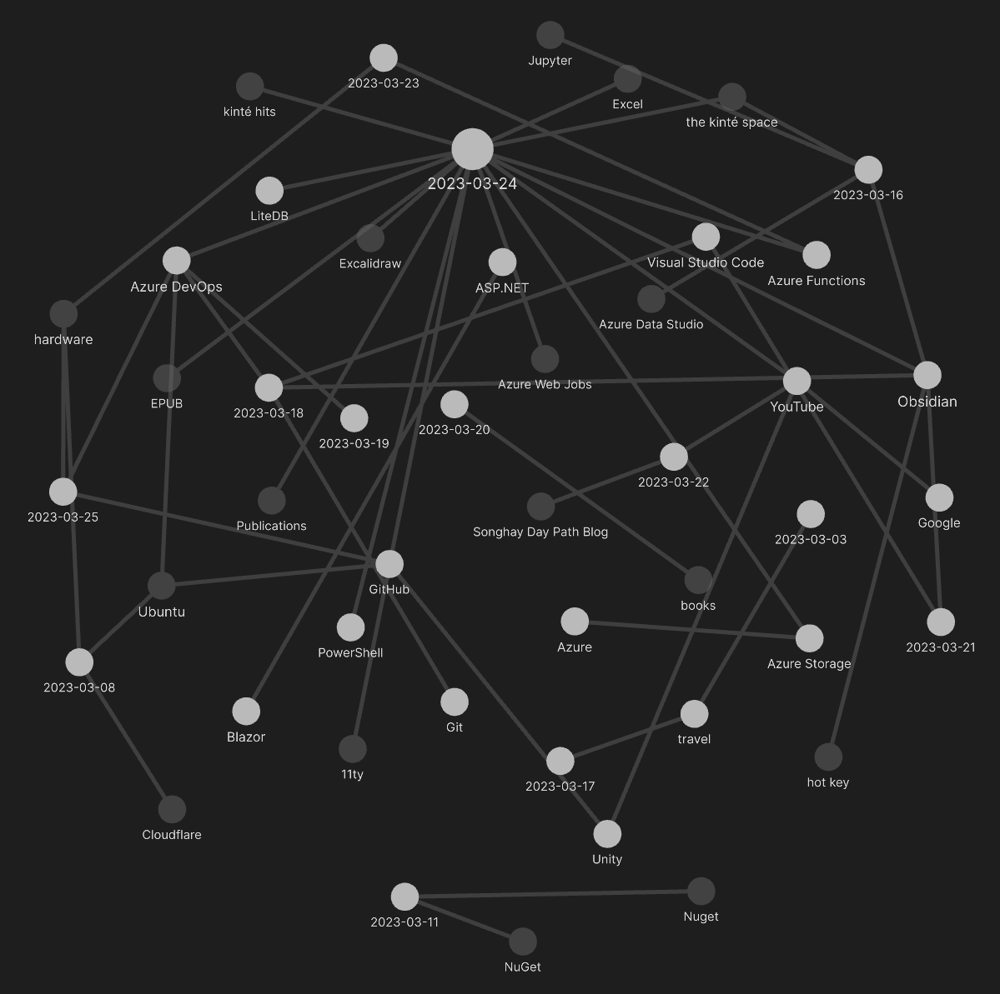

---json
{
  "documentId": 0,
  "title": "studio status report: 2023-03",
  "documentShortName": "2023-03-30-studio-status-report-2023-03",
  "fileName": "index.html",
  "path": "./entry/2023-03-30-studio-status-report-2023-03",
  "date": "2023-03-31T02:27:32.035Z",
  "modificationDate": "2023-03-31T02:27:32.035Z",
  "templateId": 0,
  "segmentId": 0,
  "isRoot": false,
  "isActive": true,
  "sortOrdinal": 0,
  "clientId": "2023-03-30-studio-status-report-2023-03",
  "tag": "{\n  \"extract\": \"month 03 of 2023 was about faster progress on Songhay.Player.ProgressiveAudio and some F# revelations The “Songhay.Player.ProgressiveAudio release 6.0.0” project is underway and moving much faster. The JSON-traversal work is solidified and a clear pattern…\"\n}"
}
---

# studio status report: 2023-03

## month 03 of 2023 was about faster progress on `Songhay.Player.ProgressiveAudio` and some F# revelations

The “`Songhay.Player.ProgressiveAudio` release 6.0.0” [project](https://github.com/users/BryanWilhite/projects/9) is underway and moving much faster. The JSON-traversal work is solidified and a clear pattern is established that can be used in my Studio forever. Yes, _forever_. I have a few new code files that _must_ be moved into the ‘F# core’:

| file | remarks |
| - | - |
| `Models/Primitives.fs` [[GitHub](https://github.com/BryanWilhite/Songhay.Player.ProgressiveAudio/blob/96a8bcdabefb43e3041da218f79e29275fd7d528/Songhay.Player.ProgressiveAudio/Models/Primitives.fs)] | This file has my incredible `JsonElementValue` type that has to be enshrined in `Songhay.Modules` [[GitHub](https://github.com/BryanWilhite/Songhay.Modules)] |
| `Models/CssPrimitives.fs` [[GitHub](https://github.com/BryanWilhite/Songhay.Player.ProgressiveAudio/blob/96a8bcdabefb43e3041da218f79e29275fd7d528/Songhay.Player.ProgressiveAudio/Models/CssPrimitives.fs)] | This one needs to go into `Songhay.Modules.Bolero` [[GitHub](https://github.com/BryanWilhite/Songhay.Modules.Bolero)] |
| `Models/PresentationPrimitives.fs` [[GitHub](https://github.com/BryanWilhite/Songhay.Player.ProgressiveAudio/blob/96a8bcdabefb43e3041da218f79e29275fd7d528/Songhay.Player.ProgressiveAudio/Models/PresentationPrimitives.fs)] and `Models/Presentation.fs` [[GitHub](https://github.com/BryanWilhite/Songhay.Player.ProgressiveAudio/blob/96a8bcdabefb43e3041da218f79e29275fd7d528/Songhay.Player.ProgressiveAudio/Models/Primitives.fs)] | I have been trying for years to realize a `Presentation` type. F# went a very long way toward making this new type possible! These files should end up in `Songhay.Modules.Publications` [[GitHub](https://github.com/BryanWilhite/Songhay.Modules.Publications)] |
| `LegacyPresentationUtility.fs` [[GitHub](https://github.com/BryanWilhite/Songhay.Player.ProgressiveAudio/blob/96a8bcdabefb43e3041da218f79e29275fd7d528/Songhay.Player.ProgressiveAudio/LegacyPresentationUtility.fs)] | This file reaches across _decades_ of time and loads the b-roll player manifest format currently in use on kintespace.com and should also be moved to `Songhay.Modules.Publications` |

The inside comedy here is that the removal of all of these files from `Songhay.Player.ProgressiveAudio` leaves almost no files in the project! The types and utilities _specific_ to progressive audio are not here yet.

## the Obsidian graph view of the month



There is a huge node (above) representing 3/24. On the 24<sup>th</sup> I wrote a pretty lengthy entry about the Studio “stick man” (excerpt below) which is a consequence of discovering how much [the Obsidian canvas](https://www.youtube.com/watch?v=rPescoJzcFA) allows me to visualize what is _in_ the Studio compared to my [previous work](http://songhayblog.azurewebsites.net/entry/2022-09-28-studio-status-report-2022-09/) with Excalidraw (which is now _incorporated_ in this new Canvas approach).

Selected Studio notes:

## the [[Songhay System Studio]] stick man

The stick man on the Canvas shows just how many manual processes I have on my plate 🍽. Today, I see _six_ stick men when I should be seeing about two:

1. the [[YouTube]] stick man
2. the analytics stick man for [[kinté hits]]
3. the syndication stick man
4. the spreadsheet stick man
5. the [[the kinté space]] stick man
6. the [[EPUB]] stick man

## [[Cloudflare]] Tunnel is better than VPN?

<div style="text-align:center">

<figure>
    <a href="https://www.youtube.com/watch?v=ZvIdFs3M5ic">
        
    </a>
    <p><small>You Need to Learn This! Cloudflare Tunnel Easy Tutorial</small></p>
</figure>

</div>

>The difference with [[Cloudflare]] Tunnels vs. your traditional VPN is that you don’t have to open ports in your firewall. With VPN, you connect into your VPN server (or sometimes directly to your router) through a hole that you’ve poked in your firewall.
>
><https://www.crosstalksolutions.com/cloudflare-tunnel-easy-setup/>
>

## huge [[Azure Data Studio]] tip: use temp tables to share data across <acronym title="Structured Query Language">SQL</acronym>-kernel cells in Jupyter notebook

A [StackOverflow answer](https://stackoverflow.com/a/59035152/22944) reveals that others have resorted to using temp tables to share data across cells well before my day-job discovery of this technique. This technique works well for tabular data. And it is important to [drop these temp tables](https://www.sqlshack.com/how-to-drop-temp-tables-in-sql-server/) at the end of the notebook:

```sql
IF OBJECT_ID(N'tempdb..#TempTableName') IS NOT NULL

BEGIN

    DROP TABLE #TempTableName

END
```

## <acronym title="Structured Query Language">SQL</acronym>: indexing for the day job

A GUID `UNIQUEIDENTIFER` column is the equivalent of a primary key in the 2020’s? My research says no:

> Using `UNIQUEIDENTIFER`s as primary keys, and as clustered indexes can lead to trouble over time.
>
> 1. I suggest that if you can avoid it, you should avoid a `UNIQUEIDENTIFER` for a primary key.
> 2. If you must use a `UNIQUEIDENTIFER`, [then] use `NEWSEQUENTIALID ( )` to generate the unique [identifier], not `NEWID()`.
>
>—[Steve Stedman](https://stevestedman.com/2021/09/should-i-use-a-unique-identifier-as-a-primary-key-2/)
>

- “[GUIDs as PRIMARY KEYs and/or the clustering key](https://www.sqlskills.com/blogs/kimberly/guids-as-primary-keys-andor-the-clustering-key/)” by Kimberly Tripp
- “[SQLskills SQL101: Indexing Basics](https://www.sqlskills.com/blogs/kimberly/sqlskills-sql101-indexing/)” by Kimberly Tripp
- “[Uniqueidentifier and Clustered Indexes](https://azure.microsoft.com/en-us/blog/uniqueidentifier-and-clustered-indexes/)”
- “[What are the best practices for using a GUID as a primary key, specifically regarding performance?](https://stackoverflow.com/questions/11938044/what-are-the-best-practices-for-using-a-guid-as-a-primary-key-specifically-rega)”
- “[Look-up Tables in SQL](https://www.red-gate.com/simple-talk/databases/sql-server/t-sql-programming-sql-server/look-up-tables-in-sql/)”

## sketching out development projects

The current, unfinished public projects on GitHub:

- finish the “`Songhay.Player.ProgressiveAudio` release 6.0.0” [project](https://github.com/users/BryanWilhite/projects/9)
- start the “`SonghayCore` 📦✨ release 6.0.5” [project](https://github.com/users/BryanWilhite/projects/7)

The proposed project items:

- add kinté space presentations support to `Songhay.Player.YouTube` 🔨 🚜✨
- replace the Angular app in `http://kintespace.com/player.html` with a Bolero app 🚜🔥
- generate Publication indices from LiteDB for `Songhay.Publications.KinteSpace`
- generate a new repo with proposed name, `Songhay.Modules.Bolero.Index` ✨🚧 and add a GitHub Project
- switch Studio from Material Design to Bulma 💄 ➡️ 💄✨

<https://github.com/BryanWilhite/>
