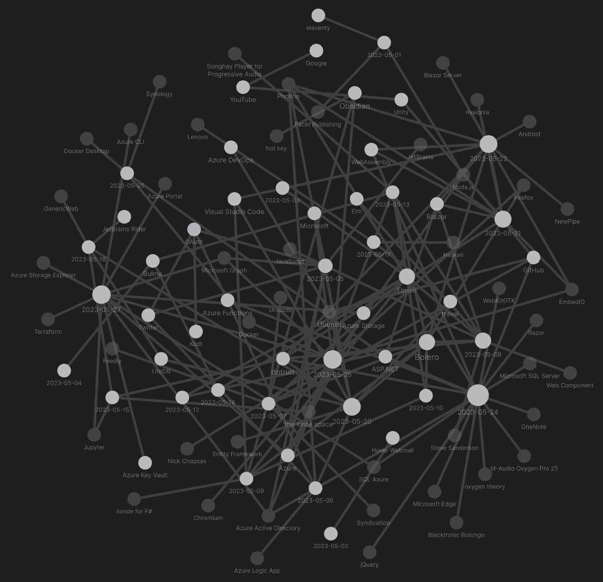
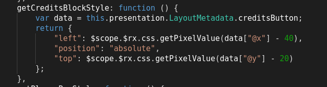
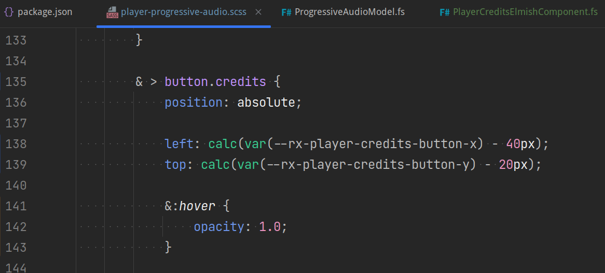
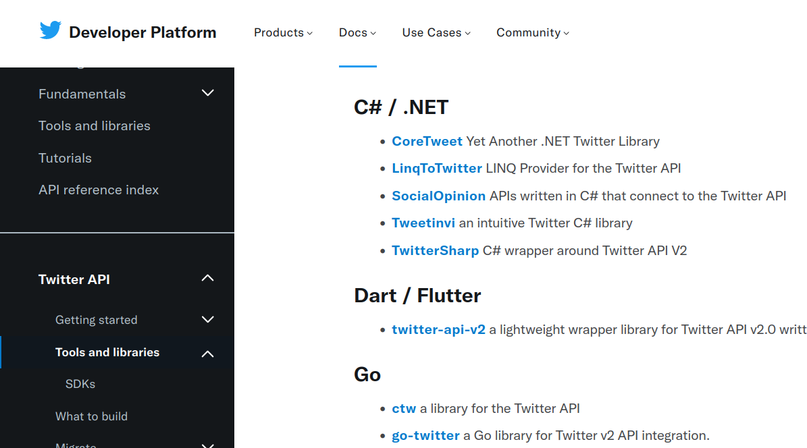
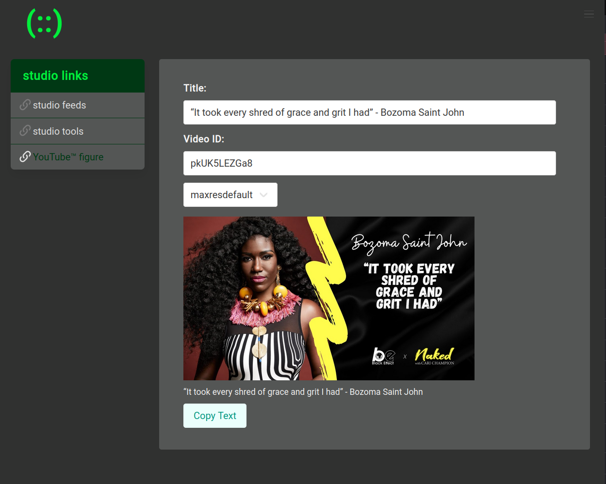
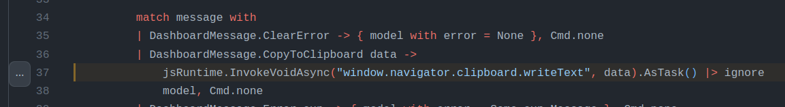
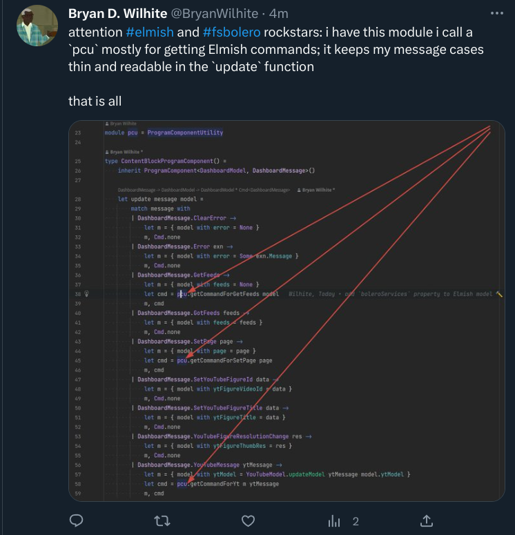
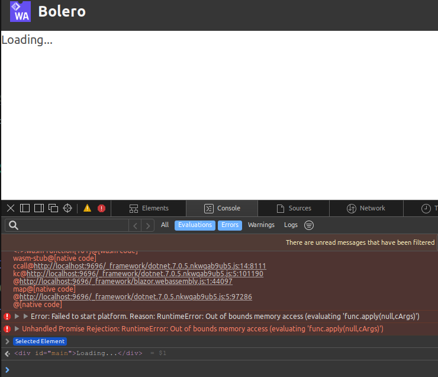
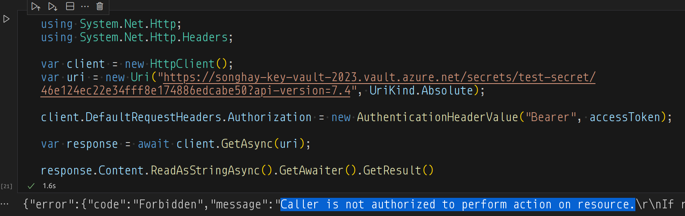
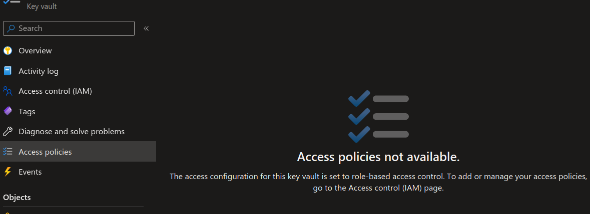

---json
{
  "documentId": 0,
  "title": "studio status report: 2023-05",
  "documentShortName": "2023-05-28-studio-status-report-2023-05",
  "fileName": "index.html",
  "path": "./entry/2023-05-28-studio-status-report-2023-05",
  "date": "2023-05-29T01:31:04.066Z",
  "modificationDate": "2023-05-29T01:31:04.066Z",
  "templateId": 0,
  "segmentId": 0,
  "isRoot": false,
  "isActive": true,
  "sortOrdinal": 0,
  "clientId": "2023-05-28-studio-status-report-2023-05",
  "tag": "{\n  \"extract\": \"month 05 of 2023 was about almost finishing the Songhay.Player.ProgressiveAudio project and some distracting but necessary Studio research The “Songhay.Player.ProgressiveAudio release 6.0.0” project is down to adding the last two components. The play/paus…\"\n}"
}
---

# studio status report: 2023-05

## month 05 of 2023 was about almost finishing the `Songhay.Player.ProgressiveAudio` project and some distracting but necessary Studio research

The “`Songhay.Player.ProgressiveAudio` release 6.0.0” [project](https://github.com/users/BryanWilhite/projects/9) is down to adding the last two components. The [play/pause control](https://rasx-node-js.netlify.app/html5/input-range-play-control/index.html) and the [playlist](https://rasx-node-js.netlify.app/html5/audio-playlist/index.html) which already exist in the form of HTML and JavaScript. These two need ‘translation’ into the world of Blazor/Bolero/F♯. The existence of these samples have not been mentioned in this report since [month 02 of 2023](http://songhayblog.azurewebsites.net/entry/2023-02-25-studio-status-report-2023-02/). As usual, I, of course, blame the French for my delay 🍟🏴

The “distractions” away from finishing the `Songhay.Player.ProgressiveAudio` project are reflected in the density of the Obsidian graph for this month:



Ideally, my selection of Obsidian journal notes for this month will reveal what was so “distracting”:

## [[Songhay Player - Progressive Audio (F♯)]]: not-so-fond memories of fudging manifest values



Here in the 21<sup>st</sup> century this the new way:



## the [[Bulma]] modal does not work with a fixed `navbar`

The [[Bulma]] fixed `navbar` \[📖 [docs](https://bulma.io/documentation/components/navbar/#fixed-navbar) \] hides the `modal-close` visual which is “a simple cross located in the top right corner” \[📖 [docs](https://bulma.io/documentation/components/modal/) \]. This a classic problem. Moreover, the default [[Bulma]] `navbar` experience is optimized for mobile (small screens) where the “simple cross” should be easy to find—and perhaps `navbar` is collapsed or absent.

On the desktop, the current recommendation is to use the [[Bulma]] `message` experience as `modal-content`:


The `message` close button (strangely called `delete`) invites the user to click closer to the actual message displayed instead of hunting for “a simple cross located in the top right corner.”

## [[Twitter]]: um, yeah… `CoreTweet` works 🎊

<https://github.com/CoreTweet/CoreTweet>

This screenshot is from my first [notebook](https://github.com/BryanWilhite/jupyter-central/blob/master/funkykb/csharp/twitter/core-tweet.ipynb) that loads Studio secrets from an environment variable:


\[🔗 [GitHub](https://github.com/BryanWilhite/jupyter-central/blob/master/funkykb/csharp/twitter/core-tweet.ipynb) \]

`CoreTweet` is recommended by what’s left of Twitter:


\[🔗 [link](https://developer.twitter.com/en/docs/twitter-api/tools-and-libraries/v2) \]

## [[Bolero]]: lessons learned from building `YouTubeFigureElmishComponent`

This is either a last gasp or the beginning of an actual lifestyle:



This is the `YouTubeFigureElmishComponent` \[🔗 [GitHub](https://github.com/BryanWilhite/Songhay.Dashboard/blob/main/Songhay.Dashboard.Client/Components/YouTubeFigureElmishComponent.fs) \]—now live at [SonghaySystem.com](https://songhaysystem.com/yt/figure)—which is based on [a CodePen](https://codepen.io/rasx/pen/gOjGQOv) of mine.

The greatest lesson learned with this accomplishment is how to implement [binding](https://fsbolero.io/docs/HTML#data-bindings). I see now that:

>[!important]
>[[Bolero]] (two-way?) binding is only available for the `input` element.

Because of this, the `select` element needs the `on.change` event handler:


\[🔗 [GitHub](https://github.com/BryanWilhite/Songhay.Dashboard/blob/810935a7041e5fc74b393e1b1b2acaef1453a6db/Songhay.Dashboard.Client/Components/YouTubeFigureElmishComponent.fs#L49) \]

The JavaScript work done for [the CodePen](https://codepen.io/rasx/pen/gOjGQOv) informs how [[Bolero]] calls out to the [Clipboard API](https://developer.mozilla.org/en-US/docs/Web/API/Clipboard_API):


\[🔗 [GitHub](https://github.com/BryanWilhite/Songhay.Dashboard/blob/810935a7041e5fc74b393e1b1b2acaef1453a6db/Songhay.Dashboard.Client/Components/ContentBlockProgramComponent.fs#L37) \]

The [[Elmish]] message call is needed to copy the title and link of the YouTube video to the clipboard for pasting into social media. The `jsRuntime.InvokeVoidAsync` invocation needs to be wrapped up in a function and sent to [[Songhay Modules Bolero (F♯)]] \[🔗 [GitHub](https://github.com/BryanWilhite/Songhay.Modules.Bolero) \] #to-do

## [[Bolero]]: i propose changing the `ClientUtility` into the `ProgramComponentUtility` #to-do 

The `ProgramComponentUtility` should centralize the `Remote` module that is already there but the new bit is centralizing the expressions that respond to all [[Elmish]] `update` cases. So we would see something like this:

```fsharp
module pcu = ProgramComponentUtility

type MyProgramComponent() =  
    inherit ProgramComponent<MyModel, MyMessage>()

    let update message model =
        match message with
        | Error ex ->
            let cmd = pcu.getCommandForError …
            model, cmd
        | GetReadMe ->
            let cmd = pcu.getCommandForGetReadMe …
            model, cmd
        | GotReadMe data ->
            let cmd = pcu.getCommandForGotReadMe …
            let m = pcu.getStateForGotReadMe …
            m, cmd
        | MyCompMsg msg ->
            let cmd = pcu.getCommandForMyCompMsg …
            let m = pcu.getStateForMyCompMsg …
            m, cmd
        | MyComp2Msg msg2 ->
            let cmd = pcu.getCommandForMyComp2Msg …
            let m = pcu.getStateForMyComp2Msg …
            m, cmd

    override this.Program = … // calls Program.mkProgram init update view
```

The `update` function shown above is suggesting that for every [[Elmish]] component the top-level message model has to have a member for it. The `update` function is also showing how messages are passed into child [[Elmish]] components which leads to the question, How are messages passed _out_ of these children? #to-do 

## [[Bolero]]: adding a conventional `blazorServices` property to the [[Elmish]] model

Adding a conventional `blazorServices` property:


The advantages of this move include:

- the need to pass these services via function arguments is eliminated
- the `blazorServices` property declares in one place what services are required for all components in the project
- it further underscores the importance of the `initialize` member

We can also see how this move simplifies the [[Elmish]] `Program` member:


Without this move the `update` function undergoes partial application to ‘hide’ the passing of services from the `Program.mkProgram` function.

## [[Bolero]]: the `pcu` is mostly about getting [[Elmish]] commands




### the significance of `pcu.getCommandForYt`

The `pcu.getCommandForYt` function shown above is implying that:

1. child [[Elmish]] components should _never_ be responsible for _loading_ the data it depends on
2. _all_ [[Elmish]] commands of the child component(s) can be handled by one function
3. getting an [[Elmish]] command is almost always completely independent from updating the [[Elmish]] model

_1_ is the requirement that makes ‘installing’ child [[Elmish]] both flexible (in the face of running over a server with remoting or on the client with `HttpClient`) and awkward.

_2_ is based on the my understanding of [[Elmish]] design: that all [[Elmish]] commands must be recognized by the parent Program. My work so far  has built [[Elmish]] commands that load external data for or send messages to child components.

_2_ also implies how the nesting of [[Elmish]] updates is used as suggested [[2023-05-08#Bolero : Elmish rock star Zaid Ajaj shows me how to scale Elmish apps|by rock star Zaid Ajaj]]. (See `Counter.update` and `Loader.update` in his sample `update` function \[🔗 [GitHub](https://github.com/Zaid-Ajaj/scaling-elmish-programs/blob/master/apps/refactored-spaghetti-2/src/App.fs#L27) \].)

_3_ is the justification for preferring the nesting of [[Elmish]] updates; this justification may quickly fall apart with more experience—or be further justified.

## [[Songhay Player - Progressive Audio (F♯)]]: there is more than one `Presentation` credits HTML micro-format 😐

This one is expected:

```plaintext
"<div>Audio Tracks by . . . . . . . <strong>Mikey Dread</strong></div><div>ActionScript and PHP  by . . . . . . . <strong>Bryan Wilhite</strong></div><div>CSS, XML and XSLT by . . . . . . . <strong>Bryan Wilhite</strong></div>"
```

These are not expected:

```plaintext
"<div>Production by . . . . . . . Maria Gilardin of <a href=\"http://www.tucradio.org/\">tucradio.org</a><br />Online Audio Post-production by . . . . . . . <strong>Bryan Wilhite</strong><br />Interface Design and Programming by . . . . . . . <strong>Bryan Wilhite</strong></div>"
```

```plaintext
"<div>Words and Flow by . . . . . . . <strong>Arundhati Roy</strong> and <strong>David Barsamian</strong><br />Sound Production by . . . . . . . <font style=\"BACKGROUND-COLOR: #dadada\"><strong>Jonathan Lawson</strong></font></div><div><br />Interface Design and Programming by . . . . . . . <strong>Bryan Wilhite</strong></div><div> </div>"
```

```plaintext
"<div>Sound Production by . . . . . . . <strong><a href=\"mailto:dblackrabbit@aol.com\">dv</a></strong></div><div>Online Audio Post-production by . . . . . . . <strong>Bryan Wilhite</strong></div><div>Production by . . . . . . . <strong><a href=\"http://www.radio4all.net/index.php?op=producer-info&amp;uid=690&amp;nav=&amp;\">Dan V.</a></strong></div><div>Interface Design and Programming by . . . . . . . <strong>Bryan Wilhite</strong></div>"
```

## ok, i get it: the [[Photino]] browser does not support [[WebAssembly]]

This error message is a clue:



```console
[Error] Error: Failed to start platform. Reason: RuntimeError: Out of bounds memory access (evaluating 'func.apply(null,cArgs)')
	u (blazor.webassembly.js:1:38561)
	(anonymous function) (blazor.webassembly.js:1:63630)
```

[The docs](https://docs.tryphotino.io/Photino-Blazor) provide a meager hint:

>Photino.Blazor is not Server-Side Blazor, nor is it WASM Client-Side Blazor. When the .NET (console) application starts, it uses the full .NET 6 framework. The framework can be pre-installed on the machine or it can come packaged with the application in the case of a “single file application.” Execution of all .NET code in Blazor is redirected to the same framework as the console app.

## [[dotnet|.NET]]: i give up…

I refuse to use server-side Blazor just to get it to run on the Linux Desktop.

>[!info]
>Today, I do not recommend using [[Photino]] in this Studio.

Outside of packaging and deployment for a lay public, I have failed to see how [[Photino]] is superior to a command like this:

```bash
microsoft-edge --new-window --window-size="800,600" --app=https://www.youtube.com
```

I did not find the awesome `--window-size` command line option among the output of `microsoft-edge --help`. The help output sent me to two dead <acronym title="Universal Resource Identifier">URI</acronym>s:

>As a GTK+ app, Microsoft Edge also obeys GTK+ command-line flags, such as `--display`.  See the GTK documentation for more:
>
> <http://library.gnome.org/devel/gtk/stable/gtk-running.html>
>
> <http://library.gnome.org/devel/gtk/stable/gtk-x11.html>
>

The closest resource to the intentions above is: <https://manpages.ubuntu.com/manpages/jammy/man7/gtk-options.7.html>

A search that led to “[Edge Command Line Arguments](https://textslashplain.com/2022/01/05/edge-command-line-arguments/)” led me to the gigantic “[List of Chromium Command Line Switches](https://peter.sh/experiments/chromium-command-line-switches/).”

## [[Docker]]: “Best Docker Containers for Synology NAS”

<figure>
    <a href="https://www.youtube.com/watch?v=-ApgO4P3DWc">
        
    </a>
    <p><small>Best Docker Containers for Synology NAS</small></p>
</figure>

| name | remarks |
| - | - |
| `jellyfin`  \[📹 [watch](https://youtu.be/-ApgO4P3DWc?t=182) \]| research needed #to-do  \[🔗 [link](https://hub.docker.com/r/jellyfin/jellyfin) \] |
| `portainer` \[📹 [watch](https://youtu.be/-ApgO4P3DWc?t=531) \] | `portainer` \[🔗 [link](https://hub.docker.com/r/portainer/portainer) \] is deprecated; use `portainer-ce instead` \[🔗 [link](https://hub.docker.com/r/portainer/portainer-ce) \] |
| `pihole` \[📹 [watch](https://youtu.be/-ApgO4P3DWc?t=578) \] | research needed: <https://pi-hole.net/> #to-do \[🔗 [link](https://hub.docker.com/r/pihole/pihole) \] |
| `dashy` \[📹 [watch](https://youtu.be/-ApgO4P3DWc?t=615) \] | research needed #to-do \[🔗 [link](https://hub.docker.com/r/lissy93/dashy) \]

## [[Azure]]: standardizing Studio cloud 🌩 security on <acronym title="Role-Based Access Control">RBAC</acronym>

Many days ago in this month—miserably late in the night—I successfully authenticated against the [[Microsoft Graph]] using `DeviceCodeCredentialOptions` \[🔗 [GitHub](https://github.com/BryanWilhite/jupyter-central/blob/master/funkykb/csharp/microsoft-graph-to-azure.ipynb) \] and `ClientSecretCredential` \[🔗 [GitHub](https://github.com/BryanWilhite/jupyter-central/blob/master/funkykb/csharp/microsoft-graph-app-only.ipynb) \]. What remained a challenge until today was _authorization_. This failure is characterized by `AuthorizationPermissionMismatch` error codes and “Caller is not authorized to perform action on resource” messages:



The `DeviceCodeCredentialOptions` approach is based on “[Microsoft identity platform and the OAuth 2.0 client credentials flow](https://learn.microsoft.com/en-us/azure/active-directory/develop/v2-oauth2-client-creds-grant-flow)” and provides great <acronym title="User Experience">UX</acronym> for manual/desktop applications.

The `ClientSecretCredential` approach is not recommended by [[Microsoft]] because it requires a secret generated by the [[Azure Active Directory]] app registration. Apps without a secret means using certificates? #to-do This video by [[Nick Chapsas]] probably exists because the answer to the previous question is _yes:_

<figure>
    <a href="https://www.youtube.com/watch?v=b21EQvfjvHc">
        
    </a>
    <p><small>How to securely store and load secrets using Azure Key Vault in .NET Core (using a certificate)</small></p>
</figure>

Today, I set up a new key vault under <acronym title="Role-Based Access Control">RBAC</acronym> which means the **Access policies** feature is disabled:



The motivation to set up a new vault was based on the suspicion that the [[Azure]] kids are not handling their own breaking changes correctly—possibly leaving older resources mysteriously non-responsive to maintenance.

This rather tedious video explains why we would want to use <acronym title="Role-Based Access Control">RBAC</acronym> over Access policies \[📹 [watch](https://youtu.be/ojHngqXsYQc?t=627) \]:

<figure>
    <a href="https://www.youtube.com/watch?v=ojHngqXsYQc">
        
    </a>
    <p><small>Keyvault Role based Access control</small></p>
</figure>

## sketching out development projects

The current, unfinished public projects on GitHub:

- finish the “`Songhay.Player.ProgressiveAudio` release 6.0.0” [project](https://github.com/users/BryanWilhite/projects/9)
- start the “`SonghayCore` 📦✨ release 6.0.5” [project](https://github.com/users/BryanWilhite/projects/7)

The proposed project items:

- add kinté space presentations support to `Songhay.Player.YouTube` 🔨 🚜✨
- replace the Angular app in `http://kintespace.com/player.html` with a Bolero app 🚜🔥
- generate Publication indices from LiteDB for `Songhay.Publications.KinteSpace`
- generate a new repo with proposed name, `Songhay.Modules.Bolero.Index` ✨🚧 and add a GitHub Project
- switch Studio from Material Design to Bulma 💄 ➡️ 💄✨

@[BryanWilhite](https://twitter.com/BryanWilhite)
