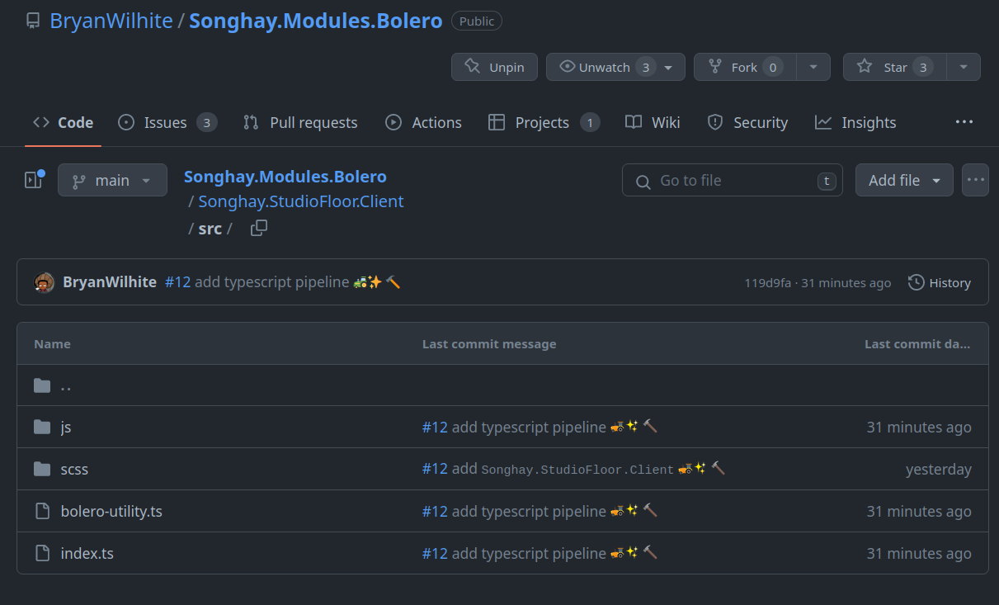

---json
{
  "documentId": 0,
  "title": "studio status report: 2023-06",
  "documentShortName": "2023-07-02-studio-status-report-2023-06",
  "fileName": "index.html",
  "path": "./entry/2023-07-02-studio-status-report-2023-06",
  "date": "2023-07-02T17:22:08.464Z",
  "modificationDate": "2023-07-02T17:22:08.464Z",
  "templateId": 0,
  "segmentId": 0,
  "isRoot": false,
  "isActive": true,
  "sortOrdinal": 0,
  "clientId": "2023-07-02-studio-status-report-2023-06",
  "tag": "{\n  \"extract\": \"month 06 of 2023 was about almost finishing the Songhay.Player.ProgressiveAudio project again An examination of the play/pause control and the playlist—introduced to the “Songhay.Player.ProgressiveAudio release 6.0.0” project in month 05—led to the very r…\"\n}"
}
---

# studio status report: 2023-06

## month 06 of 2023 was about almost finishing the `Songhay.Player.ProgressiveAudio` project _again_

An examination of the [play/pause control](https://rasx-node-js.netlify.app/html5/input-range-play-control/index.html) and the [playlist](https://rasx-node-js.netlify.app/html5/audio-playlist/index.html)—introduced to the “`Songhay.Player.ProgressiveAudio` release 6.0.0” [project](https://github.com/users/BryanWilhite/projects/9) in [month 05](http://songhayblog.azurewebsites.net/entry/2023-05-28-studio-status-report-2023-05)—led to the very real need to address how the `requestAnimationFrame` [📖 [docs](https://developer.mozilla.org/en-US/docs/Web/API/window/requestAnimationFrame)] method should interoperate with Bolero.

This ‘very real need’ led to the following projects:

- `songhay` release `0.3.5` 📦🚀 [[GitHub](https://github.com/users/BryanWilhite/projects/19/views/1)]
- `Songhay.Modules.Bolero` release `6.3.0` 📦🚀 [[GitHub](https://github.com/users/BryanWilhite/projects/20/views/1)]

The completion of the projects above will allow the `Songhay.Player.ProgressiveAudio` project to continue to conclusion.

## Obsidian graph for month 06

Quite coherently, Bolero (at the upper left below) hovers prominently in the Obsidian graph for month 06:


What follows are selections under this graph:

## [[Bolero]] demands more functionality from [[Songhay Core (Typescript)]]

A new [[Songhay Core (Typescript)]] project [is open](https://github.com/users/BryanWilhite/projects/19/views/1) to address the need for stuff like:

- `AnimationFrameOptions`
- `AnimationFrameUtility.throttleCallback`
- `DomUtility.runWhenWindowContentLoaded(f: () => void)`

## [[Songhay Modules Bolero (F♯)]]: issue #12

The main intent behind [issue #12](https://github.com/BryanWilhite/Songhay.Modules.Bolero/issues/12) is to explicitly import the TypeScript members referenced in `JsRuntimeUtility`. For example a line like this:

```fsharp
jsRuntime.InvokeAsync<string>($"{rx}.{CssUtility}.getComputedStylePropertyValue", elementRef, propertyName).AsTask()
```

…can be changed to this:

```fsharp
jsRuntime.InvokeAsync<string>($"{rx}.{BoleroUtility}.getComputedStylePropertyValue", elementRef, propertyName).AsTask()
```

…where `BoleroUtility` will be defined and saved in the Solution so it (and its associated, minified JavaScript) can be referenced in documentation explicitly. Even this slight improvement is still terrible!

The tree-shaking 🍂 features of [[webpack]] are supposed to make the associated, minified JavaScript files smaller.

## a new [[Typescript]] convention for the Studio

[Issue #12](https://github.com/BryanWilhite/Songhay.Modules.Bolero/issues/12) for [[Songhay Modules Bolero (F♯)]] is almost done! Completion of this issue means that:

>[!important]
>This Studio will _formally_ recognize that [[Blazor]] has _at least_ a 4.9 KB dependency on JavaScript in large part because of the need here for <acronym title="Cascading Style Sheets">CSS</acronym> animations.

Today the [[Typescript]] pipeline was installed:



The [tree-shaking](https://webpack.js.org/guides/tree-shaking/) experiment is successful… but the bandwidth savings is (to me) small. The entire [[Songhay Core (Typescript)]] optimized distribution is about 11 KB:


Tree-shaking it down to the types used by [[Songhay Modules Bolero (F♯)]] cuts the size in half:


But half of 11 KB is small from something already small. Ideally, all of this work will be an emotional boost for those happy few that will actually care about the [[Bolero]] story in this Studio 😐

Never-the-smaller, this move establishes a convention based on [[Typescript]] that will allow my [[Bolero]] work depend on horrible JavaScript in a more professional manner ✅

## [[Bolero]] and `JSInvokable` continued…

Continuing on from [[2023-06-26#Bolero and `JSInvokable`|before]]…

The [[Typescript]] stack for the [[Songhay Studio Floor]] of [[Songhay Modules Bolero (F♯)]] has a new addition: the `npm` [package](## @types/blazor__javascript-interop) `@types/blazor__javascript-interop` which adds hinting for the `DotNet` “namespace”:


“[Using JavaScript Interop in Blazor](https://chrissainty.com/using-javascript-interop-in-razor-components-and-blazor/)” by Chris Sainty finally shows me `DotNet` in action while [the official docs](https://learn.microsoft.com/en-us/aspnet/core/blazor/javascript-interoperability/call-dotnet-from-javascript?view=aspnetcore-7.0#invoke-a-static-net-method) made me think `DotNet` was not a ‘real’ object.

Following the Sainty article, I have a preference for the “instance method” invocation as shown above with the `instance` variable passed into `StudioFloorUtility.runMyAnimation`. This `instance` instance will call `getNextX` which is a [[dotnet|.NET]] member of the [[Elmish]] component displaying the button that will call `runMyAnimation`:


`eComp.componentRef` (from line 145 above) contains the instance needed to callback to the [[WebAssembly]] code. A call to `StudioFloorUtility.runMyAnimation` starts this process:


The process is:

1. call the JavaScript that will start a browser-window-level animation callback loop
2. the callback will call a [[dotnet|.NET]] method that returns data to the loop
3. the loop will use that data to continue or stop the loop

## sketching out development projects

The current, unfinished public projects on GitHub:

- finish the “`Songhay.Player.ProgressiveAudio` release 6.0.0” [project](https://github.com/users/BryanWilhite/projects/9)
- start the “`SonghayCore` 📦✨ release 6.0.5” [project](https://github.com/users/BryanWilhite/projects/7)

The proposed project items:

- add kinté space presentations support to `Songhay.Player.YouTube` 🔨 🚜✨
- replace the Angular app in `http://kintespace.com/player.html` with a Bolero app 🚜🔥
- generate Publication indices from LiteDB for `Songhay.Publications.KinteSpace`
- generate a new repo with proposed name, `Songhay.Modules.Bolero.Index` ✨🚧 and add a GitHub Project
- switch Studio from Material Design to Bulma 💄 ➡️ 💄✨

@[BryanWilhite](https://twitter.com/BryanWilhite)
