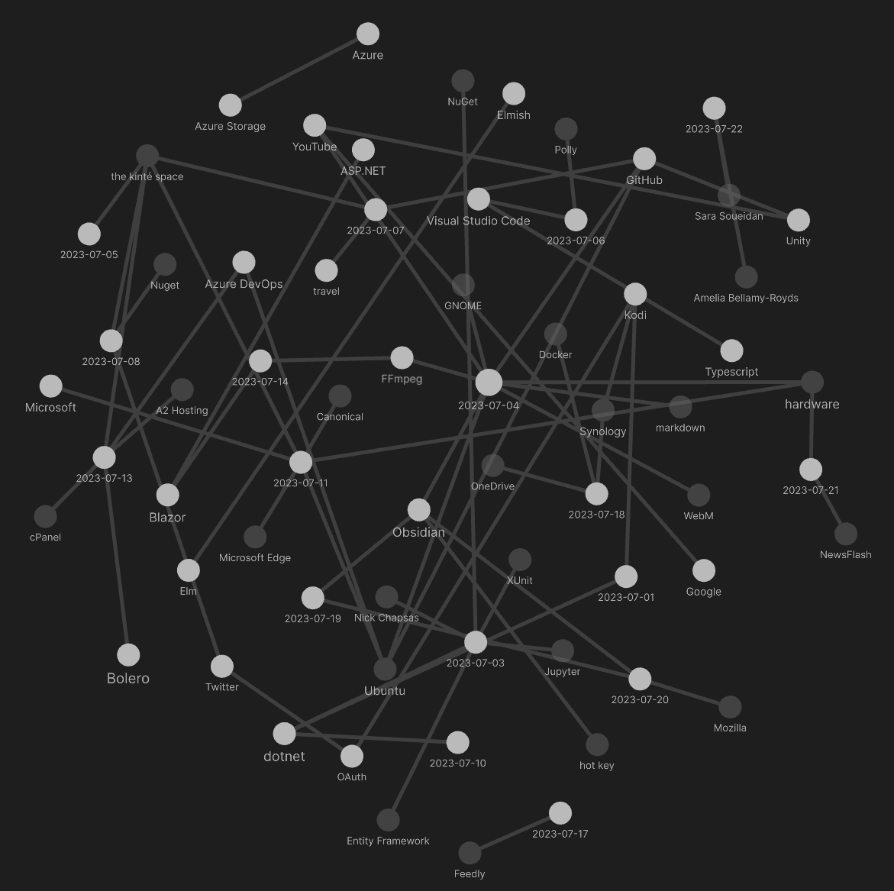

---json
{
  "documentId": 0,
  "title": "studio status report: 2023-07",
  "documentShortName": "2023-07-30-studio-status-report-2023-07",
  "fileName": "index.html",
  "path": "./entry/2023-07-30-studio-status-report-2023-07",
  "date": "2023-07-30T17:50:23.081Z",
  "modificationDate": "2023-07-30T17:50:23.081Z",
  "templateId": 0,
  "segmentId": 0,
  "isRoot": false,
  "isActive": true,
  "sortOrdinal": 0,
  "clientId": "2023-07-30-studio-status-report-2023-07",
  "tag": "{\n  \"extract\": \"month 07 of 2023 was about almost finishing the Songhay.Player.ProgressiveAudio project one last time My report for last month did not mention that songhay release 0.3.5 📦🚀 [GitHub] was released in month 06. Mentioning this makes the completion of Songh…\"\n}"
}
---

# studio status report: 2023-07

## month 07 of 2023 was about almost finishing the `Songhay.Player.ProgressiveAudio` project one last time

[My report for last month](http://songhayblog.azurewebsites.net/entry/2023-07-02-studio-status-report-2023-06) did not mention that `songhay` release `0.3.5` 📦🚀 [[GitHub](https://github.com/users/BryanWilhite/projects/19/views/1)] was released in month 06. Mentioning this makes the completion of `Songhay.Modules.Bolero` release `6.3.0` 📦🚀 [[GitHub](https://github.com/users/BryanWilhite/projects/20/views/1)] in month 07 line up with an actual plan. The fact that `Songhay.Player.ProgressiveAudio` release 6.0.0” [[GitHub]](https://github.com/users/BryanWilhite/projects/9) is still incomplete makes even me think, Do I have a plan to actually get this done?

The leading cause of my delays are new discoveries in the Studio. My selected Obsidian notes below should reveal that my relationship with <acronym title="Scalable Vector Graphics">SVG</acronym> has vastly improved. This is a discovery that allows me to take great steps forward. The other kind of Studio discovery makes me take steps backward—and that is what a emergency dependencies release like `Songhay.Modules.Bolero` release `6.3.0` 📦🚀 [[GitHub](https://github.com/users/BryanWilhite/projects/20/views/1)] represents.

## selected Obsidian notes



## [[Songhay Modules Bolero (F♯)]]: yes, it is _all_ working but…

…centralizing a `[<JSInvokable>]` method in a dedicated class like this:

![`[<JSInvokable>]` method in a dedicated class](../../image/day-path-2023-07-30-11-13-38.png)

…does _not_ work when we are expecting the state of `f` to change ‘by reference’ which is why I do not recommend using a type like this even though [it has been recommended by others](https://github.com/fsbolero/Bolero/issues/32#issuecomment-788973275).

## day job report: flippant remarks about [[Entity Framework]]

1. make the repository connection string `internal` and visible to relevant test projects
2. to avoid going to full-blown [SQL Server Integration Services](https://learn.microsoft.com/en-us/sql/integration-services/sql-server-integration-services?view=sql-server-ver16), use an [[XUnit]] test class (with `Skip` attributes) to retrieve data in hierarchical entities to be saved as a <acronym title="JavaScript Object Notation">JSON</acronym> ‘tree’ 🌳
3. load a <acronym title="JavaScript Object Notation">JSON</acronym> ‘tree’ 🌳 in a test method, hydrate the tree into hierarchical entities and use a LINQ `Flatten` routine to `DELETE` any existing data on the target database for an `INSERT` (this approach should be documented in a [[Jupyter]] notebook #to-do)
4. take advantage of `DbSet<TEntity>.Add(TEntity)` \[📖 [docs](https://learn.microsoft.com/en-us/dotnet/api/microsoft.entityframeworkcore.dbset-1.add?view=efcore-7.0#microsoft-entityframeworkcore-dbset-1-add(-0)) \] to auto-generate the `INSERT` statements needed
5. do not use `DbSet<TEntity>.Find` \[📖 [docs](https://learn.microsoft.com/en-us/dotnet/api/microsoft.entityframeworkcore.dbset-1.find?view=efcore-7.0#microsoft-entityframeworkcore-dbset-1-find(system-object())) \] and `DbSet<TEntity>.Remove` \[📖 [docs](https://learn.microsoft.com/en-us/dotnet/api/microsoft.entityframeworkcore.dbset-1.remove?view=efcore-7.0#microsoft-entityframeworkcore-dbset-1-remove(-0)) \] to delete an entity; use `RelationalDatabaseFacadeExtensions.ExecuteSqlRaw` \[📖 [docs](https://learn.microsoft.com/en-us/dotnet/api/microsoft.entityframeworkcore.relationaldatabasefacadeextensions.executesqlraw?view=efcore-7.0) \] instead

## day job report: the minimum needed for [[Songhay Activity]] functionality

The following seven files need to be explored in, say, a [[Jupyter]] notebook for the sake of documentation #to-do :

| file | location | remarks |
| - | - | - |
| `IActivity.cs` | [GitHub](https://github.com/BryanWilhite/SonghayCore/blob/master/SonghayCore/Abstractions/IActivity.cs) | synchronous `Start` based on `ProgramArgs` |
| `IProgramAssemblyInfo.cs` | [GitHub](https://github.com/BryanWilhite/SonghayCore/blob/master/SonghayCore/Abstractions/IProgramAssemblyInfo.cs) | interface to assembly metadata |
| `IActivityExtensions.Lazy.cs` | [GitHub](https://github.com/BryanWilhite/SonghayCore/blob/master/SonghayCore/Extensions/IActivityExtensions.Lazy.cs) | features the `GetActivity` method for the ‘Activity Getter’ |
| `ProgramArgsExtensions._.cs` | [GitHub](https://github.com/BryanWilhite/SonghayCore/blob/master/SonghayCore/Extensions/ProgramArgsExtensions._.cs) | centralizes routines for argument and command-line help text handling |
| `ActivitiesGetter.cs` | [GitHub](https://github.com/BryanWilhite/SonghayCore/blob/master/SonghayCore/Models/ActivitiesGetter.cs) | lazy-loads Activities into memory |
| `ProgramArgs.cs` | [GitHub](https://github.com/BryanWilhite/SonghayCore/blob/master/SonghayCore/Models/ProgramArgs.cs) | conventional command-line arguments |
| `ProgramAssemblyInfo.cs` | [GitHub](https://github.com/BryanWilhite/SonghayCore/blob/master/SonghayCore/Models/ProgramAssemblyInfo.cs) | conventional assembly information for display text |

## [[F♯]]: a video questioning the awesomeness of `Result<,_>`

<figure>
    <a href="https://www.youtube.com/watch?v=E4dI-zd4Cag">
        
    </a>
    <p><small>In Defense of Exceptions: Throw away your Result (Roman Provazník)</small></p>
</figure>

## [[the kinté space]]: [[Twitter]] frame is dead?

Is this just temporary or just more of the end❓

![[[Twitter]] frame is dead](../../image/day-path-2023-07-30-11-18-00.png)

## yes, [[Microsoft Edge]] was broken yesterday…

…and today it looks like it was fixed:

![[[Microsoft Edge]] was broken yesterday](../../image/day-path-2023-07-30-11-19-26.png)

I assume the [[Canonical]] people broke something the [[Microsoft]] people depended on. And, because I blindly update [[Ubuntu]] every day with `ucaresystem-core`, there was a day or two of inconvenience.

## <acronym title="Scalable Vector Graphics">SVG</acronym> experiments in [[Obsidian]]?

The short answer is _yes_. This is the ‘naïve’ `96`-`24` circular button:

<button style="width:96px; height: 96px; border-radius: 96px; border-width: 0; padding: 0;">
    <svg width="96" height="96">
        <polygon fill="orange" points="24,0 96,48 24,96" />
    </svg>
</button>

```html
<button style="width:96px; height: 96px; border-radius: 96px; border-width: 0; padding: 0;">
    <svg width="96" height="96">
        <polygon fill="orange" points="24,0 96,48 24,96" />
    </svg>
</button>
```

This is the `96`-`24` circular button with an `svg.viewBox`:

<button style="width:96px; height: 96px; border-radius: 96px; border-width: 0; padding: 0;">
    <svg width="96" height="96" viewbox="-40 -50 180 190">
        <polygon fill="orange" points="24,0 96,48 24,96" />
    </svg>
</button>

```html
<button style="width:96px; height: 96px; border-radius: 96px; border-width: 0; padding: 0;">
    <svg width="96" height="96" viewbox="-40 -50 180 190">
        <polygon fill="orange" points="24,0 96,48 24,96" />
    </svg>
</button>
```

In this design, the `viewBox` \[📖 [docs](https://developer.mozilla.org/en-US/docs/Web/SVG/Attribute/viewBox) \] is controlling the ‘padding’ around the arrow with respect to the button. These values are eye-balled 👀 where the `-40` `180` pair is regarded as pan-width values and the `-50` `190`, pedestal-height values. The terms _pan_ and _pedestal_ refer to [cinematic camera moves](https://www.videomaker.com/article/c10/14221-camera-movement-techniques/).

Now I will try to scale down this `96` button to a `64` button:

<button style="width:64px; height: 64px; border-radius: 64px; border-width: 0; padding: 0;">
    <svg width="64" height="64" viewbox="-40 -50 180 190">
        <polygon fill="orange" points="24,0 96,48 24,96" />
    </svg>
</button>

```html
<button style="width:64px; height: 64px; border-radius: 64px; border-width: 0; padding: 0;">
    <svg width="64" height="64" viewbox="-40 -50 180 190">
        <polygon fill="orange" points="24,0 96,48 24,96" />
    </svg>
</button>
```

What about a `32`:

<button style="width:32px; height: 32px; border-radius: 32px; border-width: 0; padding: 0;">
    <svg width="32" height="32" viewbox="-40 -50 180 190">
        <polygon fill="orange" points="24,0 96,48 24,96" />
    </svg>
</button>

❓

```html
<button style="width:32px; height: 32px; border-radius: 32px; border-width: 0; padding: 0;">
    <svg width="32" height="32" viewbox="-40 -50 180 190">
        <polygon fill="orange" points="24,0 96,48 24,96" />
    </svg>
</button>
```

This experiment shows that <acronym title="Scalable Vector Graphics">SVG</acronym> `polygon.points` do _not_ need to be changed when ‘scaling’ because of a _single_ `svg.viewBox` setting. This is wonderful! However, the scaling strategy described here requires all of these values to be changed to the same quantity:

- button `width` style
- button `height` style
- button `border-radius` style
- `svg.width`
- `svg.height`

## more <acronym title="Scalable Vector Graphics">SVG</acronym> experiments in [[Obsidian]]

[[2023-07-19#<acronym title="Scalable Vector Graphics">SVG</acronym> experiments in Obsidian ?|Yesterday]], I showed myself how important `svg.viewBox` is. But I also see that about 5 settings are needed to ‘scale’ an <acronym title="Scalable Vector Graphics">SVG</acronym> inside of  a container like a button.

However, [[Songhay Dashboard (F♯, C♯)]] is out there in production doing stuff like this:

![[[Songhay Dashboard (F♯, C♯)]] SVG(../../image/day-path-2023-07-30-11-24-27.png)


>[!question]
>Is `preserveAspectRatio="xMidYMid meet"` eliminating the need to set `svg.width` and `svg.height`?

Let’s start with this:

<button style="width:96px; height: 96px; border-radius: 96px; border-width: 0; padding: 0;">
    <svg width="96" height="96" viewbox="-40 -50 180 190">
        <polygon fill="orange" points="24,0 96,48 24,96" />
    </svg>
</button>

```html
<button style="width:96px; height: 96px; border-radius: 96px; border-width: 0; padding: 0;">
    <svg width="96" height="96" viewbox="-40 -50 180 190">
        <polygon fill="orange" points="24,0 96,48 24,96" />
    </svg>
</button>
```

Now, let’s replace two `svg` attributes with one `preserveAspectRatio="xMidYMid meet"`:

<button style="width:96px; height: 96px; border-radius: 96px; border-width: 0; padding: 0;">
    <svg preserveAspectRatio="xMidYMid meet" viewbox="-40 -50 180 190">
        <polygon fill="orange" points="24,0 96,48 24,96" />
    </svg>
</button>

```html
<button style="width:96px; height: 96px; border-radius: 96px; border-width: 0; padding: 0;">
    <svg preserveAspectRatio="xMidYMid meet" viewbox="-40 -50 180 190">
        <polygon fill="orange" points="24,0 96,48 24,96" />
    </svg>
</button>
```

Does this really mean the answer to our question is yes?

Now, according to the [[Mozilla]] [docs](https://developer.mozilla.org/en-US/docs/Web/SVG/Attribute/preserveAspectRatio) for `preserveAspectRatio` the setting above, `"xMidYMid meet"`, is the default—this means we could do this:

<button style="width:96px; height: 96px; border-radius: 96px; border-width: 0; padding: 0;">
    <svg viewbox="-40 -50 180 190">
        <polygon fill="orange" points="24,0 96,48 24,96" />
    </svg>
</button>

```html
<button style="width:96px; height: 96px; border-radius: 96px; border-width: 0; padding: 0;">
    <svg viewbox="-40 -50 180 190">
        <polygon fill="orange" points="24,0 96,48 24,96" />
    </svg>
</button>
```

So it must be `svg.viewBox` doing all of the heavy lifting! It follows that the answer to our question is _no_—but the default `preserveAspectRatio` helps.

I think I understand why I have `preserveAspectRatio` explicitly set in production: I am an old man 👴 that _still_ does not trust modern browsers! 

This experiment shows that only three values need to be changed for my <acronym title="Scalable Vector Graphics">SVG</acronym> scaling recipe:

- button `width` style
- button `height` style
- button `border-radius` style

The great news is that _all_ of these values are set in <acronym title="Cascading Style Sheets">CSS</acronym>.

## [[Sara Soueidan]]: back in 2014 I am sure I read Sarah’s introduction to `viewPort`

I assume that “[Understanding SVG Coordinate Systems and Transformations (Part 1) — The viewport, viewBox, and preserveAspectRatio](https://www.sarasoueidan.com/blog/svg-coordinate-systems/)” was my first introduction to `viewBox`—but Sarah took on the huge responsibility of introducing `viewBox` with a “view port” concept associated with `svg.width` and `svg.height`. This clearly has been too much responsibility for me! Today I prefer Amelia telling me to “forget” about `width` and `height`.

>[!info]
>Sarah is trying to tell me everything while Amelia is trying to tell me to start with `viewBox`.
>

Now I can ask the <acronym title="Scalable Vector Graphics">SVG</acronym> question of the century:

>[!question]
>When will my <acronym title="Scalable Vector Graphics">SVG</acronym>-based designs require custom settings for `svg.width`, `svg.height` _and_ `svg.viewBox` instead of just `svg.viewBox`? #to-do 

Sarah’s `viewBox` [demo](https://www.sarasoueidan.com/demos/interactive-svg-coordinate-system/) needs to be added to the [[Songhay Dashboard (F♯, C♯)]] #to-do 


## the word _scalable_ in <acronym title="Scalable Vector Graphics">SVG</acronym> comes with complications

Every introduction to <acronym title="Scalable Vector Graphics">SVG</acronym> graphics should come with the [[Amelia Bellamy-Royds]] article, “[How to Scale SVG](https://css-tricks.com/scale-svg/)” which directs our attention to the key fundamental:

>SVG stands for Scalable Vector Graphics. So, scaling SVG should be easy, right? Isn’t that what the SVG advocates have been saying all along, that SVG looks good at any size? It is, but yet it isn’t. SVG looks great at any scale, but it can scale in so many different ways that getting it to behave just the way you want can be confusing for SVG beginners. It doesn’t help that browsers have only recently started to adopt a standard approach to sizing inline SVG content.

The cultural reason why most technical topics in the English language are not introduced this way is because these observations are emotionally “negative”—like the following:

>SVG images, in contrast, can be drawn at any pixel size, so they don’t need a clearly defined height or width. And they won’t always have a clearly defined aspect ratio. You’re going to need to explicitly provide this information (and more) if you want the SVG to scale to fit the dimensions you give it.
>

Expressing “don’t” and “won’t” feels negative but clarifies for me what has always unpleasantly surprised me about my work with <acronym title="Scalable Vector Graphics">SVG</acronym>. I tend to forget the _scaling_ issues until I can’t. In fact, it has never occurred to me that:

>…SVG isn’t (just) an image. SVG is a document.

In the same manner there is a “view port” for the entire <acronym title="HyperText Markup Language">HTML</acronym> document, there must be a  “view port” for every <acronym title="Scalable Vector Graphics">SVG</acronym> visual. And Amelia warns us that `svg.height` and `svg.width` are _not_ implicitly defining an aspect ratio like what happens with raster images—more “negativity” that is much needed. Flat out she says:

>…forget `height` and `width`. You don’t actually want to set the _exact_ height and width anyway, you want the SVG to scale to match the width and/or height you set in the CSS. What you want is to set an _aspect ratio_ for the image, and have the drawing scale to fit. You want a `viewBox`.
>

What Amelia is implying here is the key fundamental of <acronym title="Scalable Vector Graphics">SVG</acronym> (expressed in terms of markup):

>[!important]
>The `svg.viewBox` attribute is _not_ optional. It should be regarded as the _required_ way to ‘see’ the visual displayed.
>

>The `viewBox` does many things:
> 
> - It defines the aspect ratio of the image.
> - It defines how all the lengths and coordinates used inside the SVG should be scaled to fit the total space available.
> - It defines the origin of the SVG coordinate system, the point where x=0 and y=0.
> 

Amelia then spends [the rest of her 2015 article](https://css-tricks.com/scale-svg/) trying to teach us to get familiar with `svg.viewBox`.

## sketching out development projects

The current, unfinished public projects on GitHub:

- finish the “`Songhay.Player.ProgressiveAudio` release 6.0.0” [project](https://github.com/users/BryanWilhite/projects/9)
- start the “`SonghayCore` 📦✨ release 6.0.5” [project](https://github.com/users/BryanWilhite/projects/7)

The proposed project items:

- replace the Angular app in `http://kintespace.com/player.html` with a Bolero app 🚜🔥
- add kinté space presentations support to `Songhay.Player.YouTube` 🔨 🚜✨
- generate Publication indices from LiteDB for `Songhay.Publications.KinteSpace`
- generate a new repo with proposed name, `Songhay.Modules.Bolero.Index` ✨🚧 and add a GitHub Project
- switch Studio from Material Design to Bulma 💄 ➡️ 💄✨

<https://github.com/BryanWilhite/>
