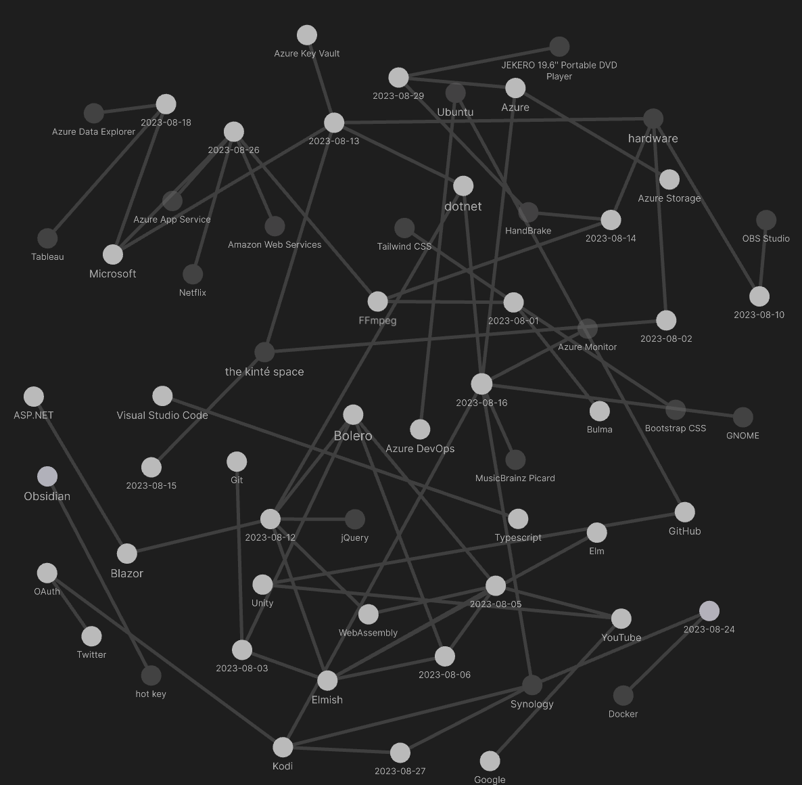
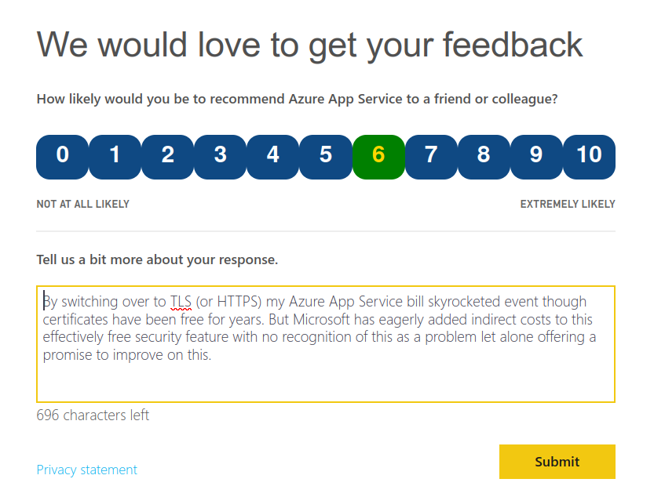

---json
{
  "documentId": 0,
  "title": "studio status report: 2023-08",
  "documentShortName": "2023-08-31-studio-status-report-2023-08",
  "fileName": "index.html",
  "path": "./entry/2023-08-31-studio-status-report-2023-08",
  "date": "2023-08-31T16:29:54.374Z",
  "modificationDate": "2023-08-31T16:29:54.374Z",
  "templateId": 0,
  "segmentId": 0,
  "isRoot": false,
  "isActive": true,
  "sortOrdinal": 0,
  "clientId": "2023-08-31-studio-status-report-2023-08",
  "tag": "{\n  \"extract\": \"month 08 of 2023 was about virtually finishing the Songhay.Player.ProgressiveAudio project I do not need to talk to myself about “the definition of done.” Yes, Songhay.Player.ProgressiveAudio release 6.0.0” [GitHub] is still incomplete but a major blocker…\"\n}"
}
---

# studio status report: 2023-08

## month 08 of 2023 was about virtually finishing the `Songhay.Player.ProgressiveAudio` project

I do not need to talk to myself about “[the definition of done](https://www.scrum.org/resources/what-definition-done).” Yes, `Songhay.Player.ProgressiveAudio` release 6.0.0” [[GitHub]](https://github.com/users/BryanWilhite/projects/9) is _still_ incomplete but a major blocker that was in the way of completion is done 🎊

The major blocker was about `Presentation` credits data (from my ancient relationship with [Microsoft InfoPath](https://en.wikipedia.org/wiki/Microsoft_InfoPath)) being ‘too unstructured.’ I knew about this issue as early as _three_ months ago (see “[there is more than one `Presentation` credits HTML micro-format](http://songhayblog.azurewebsites.net/entry/2023-05-28-studio-status-report-2023-05/)”). However, I wasted my time by approaching the challenge with regular expressions as the solution. I explored this `Regex`-based angle in [an abandoned Jupyter notebook](https://github.com/BryanWilhite/jupyter-central/blob/master/funkykb/fsharp/json/songhay-presentation-credits.ipynb) which was abandoned when I remembered one of my classic architectural principles:

>Prefer <acronym title="Extensible Hypertext Markup Language">XHTML</acronym> over <acronym title="HyperText Markup Language">HTML</acronym> which will allow the declarative <acronym title="User Interface">UI</acronym> to be _processed_ as data.

With an old, eco-conscious lightbulb 💡🧓 fished out of the kitchen drawer, I started [a new Jupyter notebook](https://github.com/BryanWilhite/jupyter-central/blob/master/funkykb/fsharp/json/songhay-presentation-credits-xml.ipynb) and explored the `XDocument`-based angle with great success 🎊 This success was directed into what is meant to be [the last issue](https://github.com/BryanWilhite/Songhay.Modules.Publications/issues/9) of `Songhay.Modules.Publications` release 6.3.0 📦🚀 [[GitHub](https://github.com/users/BryanWilhite/projects/21)].

This `Songhay.Modules.Publications` project along with the “`songhay` release `0.3.5` 📦🚀” [project](https://github.com/users/BryanWilhite/projects/19) make two NuGet package releases that support the virtually finished “`Songhay.Player.ProgressiveAudio` release 6.0.0” [project](https://github.com/users/BryanWilhite/projects/9). One small point being made here is that this `Songhay.Player.ProgressiveAudio` project depends on other projects. This approach introduces delays but should have long term benefits for the sake of reusability and reliability.

Unlike [the tangled density of three months ago](http://songhayblog.azurewebsites.net/entry/2023-05-28-studio-status-report-2023-05/), the Obsidian graph for this month is relatively tame:

<div style="text-align:center">



</div>

It looks like the graph is saying that most of the notes were about .NET, Bolero and Azure DevOps. Let’s see:

## [[Songhay Player - Progressive Audio (F♯)]]: adding `ProgressiveAudioModel.elmishServices` to pass `dispatch` to the [[Elmish]] `model`

To solve the design problem of pointing a browser-based animation-frame loop at a [[WebAssembly]] routine with the [[Bolero]] stack, I see only three options:

1. send the visual component where the routine is defined to the `model`-update (for the `DotNetObjectReference` to pass to the browser)
2. send a `dispatch` reference to the `model` where the routine is defined (and `model` is the `DotNetObjectReference` to pass to the browser)
3. define the routine in a custom type which will be the `DotNetObjectReference` to pass to the browser; this custom object would then need a `dispatch` reference

Today I choose option _2_ which starts with the means of passing `dispatch` with case `InitializeElmishServices`:

<div style="text-align:center">


</div>

This message will be used to pass `dispatch` to the conventional [[Elmish]] `model`:

<div style="text-align:center">


</div>

>[!warning]
>The `Dispatch<_>` type destroys the “[structural equality](https://camilotk.github.io/fsharp-by-example/chapters/equality/)” of the [[Elmish]] `model`, forcing the use of the `[<NoEquality; NoComparison>]` attribute.

An annoying side effect of this structural equality issue is this mess:

<div style="text-align:center">


</div>

~~A `shouldRender` function could be centralized on the `ProgressiveAudioModel`.~~

>[!important]
>~~Option _3_ might be a viable option when I find that is not that different from option _2_ but the structural equality issue is avoided.~~

Then the `dispatch` instance is dispatched in the top-level component:

<div style="text-align:center">


</div>

>[!important]
>The [[Elmish]] `Program.Dispatch` property is of type `StudioFloorMessage -> unit`

The [[Elmish]] update chain responds to this dispatch:

<div style="text-align:center">


</div>

Now, finally, the dispatcher on `model` can be used in the browser-driven animation loop:

<div style="text-align:center">


</div>

## [[Songhay Player - Progressive Audio (F♯)]]: option _1_ works!

My option _1_ [[2023-08-05#Songhay Player - Progressive Audio (F♯) adding `ProgressiveAudioModel.elmishServices` to pass `dispatch` to the Elmish `model`|from yesterday]] works! This works _without_ the “structural equality” problems of option _2_ mentioned previously<sup>1</sup>! No concept of `elmishServices` is needed. Instead, the `model` adds `playerControlsRef` to `blazorServices`:

<div style="text-align:center">


</div>

This makes sense because a reference to `Component` (which is the base type for _all_ [[Bolero]] components) is needed here for JavaScript interop via the `IJSRuntime` .

- - -
<sup>1</sup> <small>I failed to understand that adding a field of a function type to a record destroys structural equality.</small>

## now i understand why the <acronym title="Mozilla Developer Network">MDN</acronym> folks call them “custom properties” instead of “<acronym title="Cascading Style Sheets">CSS</acronym> variables”

When we see the `CSSStyleDeclaration.setProperty()` method \[📖 [docs](https://developer.mozilla.org/en-US/docs/Web/API/CSSStyleDeclaration/setProperty) \], it is clear that the first argument is called `propertyName`—but look at [my CodePen](https://codepen.io/rasx/pen/yLpRYRb):

```javascript
rx.CssUtility.setComputedStylePropertyValue(target, '--target-animation-name', 'fadeout');
```

I am passing `'--target-animation-name'` which will be passed to the `propertyName` argument of `CSSStyleDeclaration.setProperty()` \[🔗 [GitHub](https://github.com/BryanWilhite/songhay-core/blob/master/src/utilities/css.utility.ts#L164) \]. This has been a very strong hint that `--target-animation-name` is a custom property—and this explains why the `var()` <acronym title="Cascading Style Sheets">CSS</acronym> function \[📖 [docs](https://developer.mozilla.org/en-US/docs/Web/CSS/var) \] is needed to ‘convert’ the custom property into a variable.

## [[Songhay Modules Publications (F♯)]]: remember the `Presentation` credits issue?

I clearly forgot about the `Presentation` credits issue which was discovered on [[2023-05-15#Songhay Player - Progressive Audio (F♯) and Jupyter notebooks there is more than one `Presentation` credits HTML micro-format 😐 | 05-15]]. I whipped up a [Jupyter notebook](https://github.com/BryanWilhite/jupyter-central/blob/master/funkykb/fsharp/json/songhay-presentation-credits.ipynb) to just look at the issue but did nothing else—most likely because months of misery was spent on [a single issue](https://github.com/BryanWilhite/Songhay.Player.ProgressiveAudio/issues/4) for [[Songhay Player - Progressive Audio (F♯)]].

## [[dotnet|.NET]]: “Remove Moq From Your .NET Projects Right NOW!” #to-do 

Yeah, this is serious:

<div style="text-align:center">

<figure>
    <a href="https://www.youtube.com/watch?v=A06nNjBKV7I">
        
    </a>
    <p><small>Remove Moq From Your .NET Projects Right NOW!</small></p>
</figure>

</div>

## uselessly complaining to [[Microsoft]] about [[Azure App Service]]

By switching over to TLS (or HTTPS) my Azure App Service bill skyrocketed event though certificates have been free for years. But Microsoft has eagerly added indirect costs to this effectively free security feature with no recognition of this as a problem let alone offering a promise to improve on this.

<div style="text-align:center">



</div>

## sketching out development projects

The current, unfinished public projects on GitHub:

- finish the “`Songhay.Modules.Publications` release 6.3.0 📦🚀” [project](https://github.com/users/BryanWilhite/projects/21)
- finish the “`Songhay.Player.ProgressiveAudio` release 6.0.0” [project](https://github.com/users/BryanWilhite/projects/9)
- start the “`SonghayCore` 📦✨ release 6.0.5” [project](https://github.com/users/BryanWilhite/projects/7)

The proposed project items:

- replace the Angular app in `http://kintespace.com/player.html` with a Bolero app 🚜🔥
- add kinté space presentations support to `Songhay.Player.YouTube` 🔨 🚜✨
- generate Publication indices from LiteDB for `Songhay.Publications.KinteSpace`
- generate a new repo with proposed name, `Songhay.Modules.Bolero.Index` ✨🚧 and add a GitHub Project
- switch Studio from Material Design to Bulma 💄 ➡️ 💄✨

<https://github.com/BryanWilhite/>
