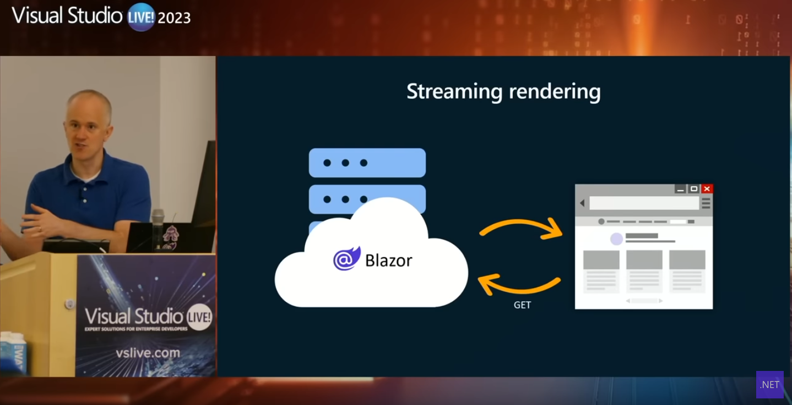
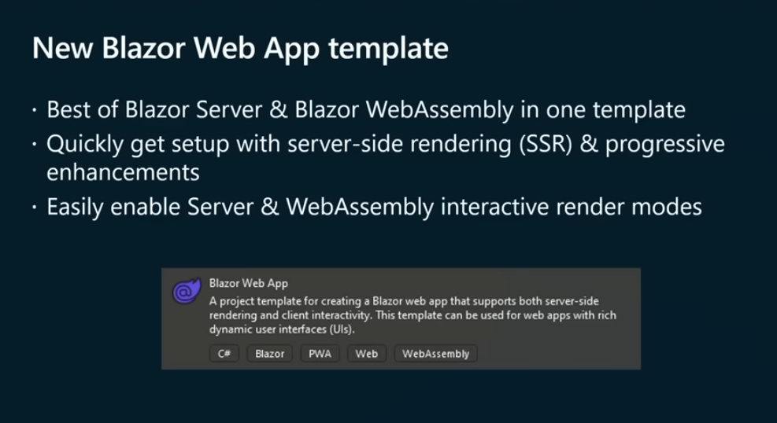
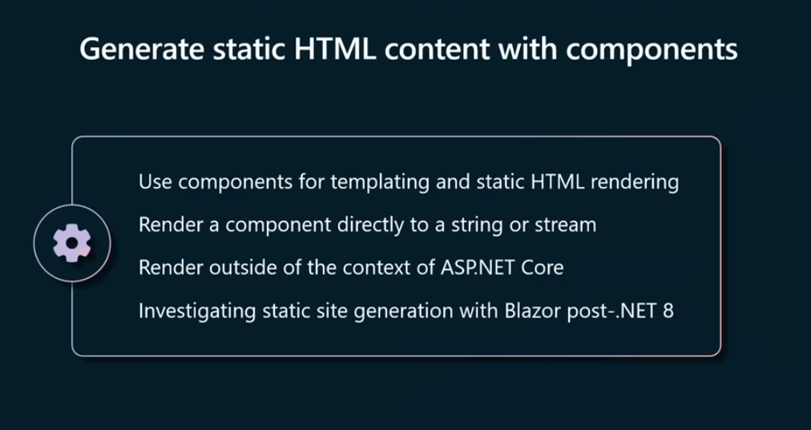
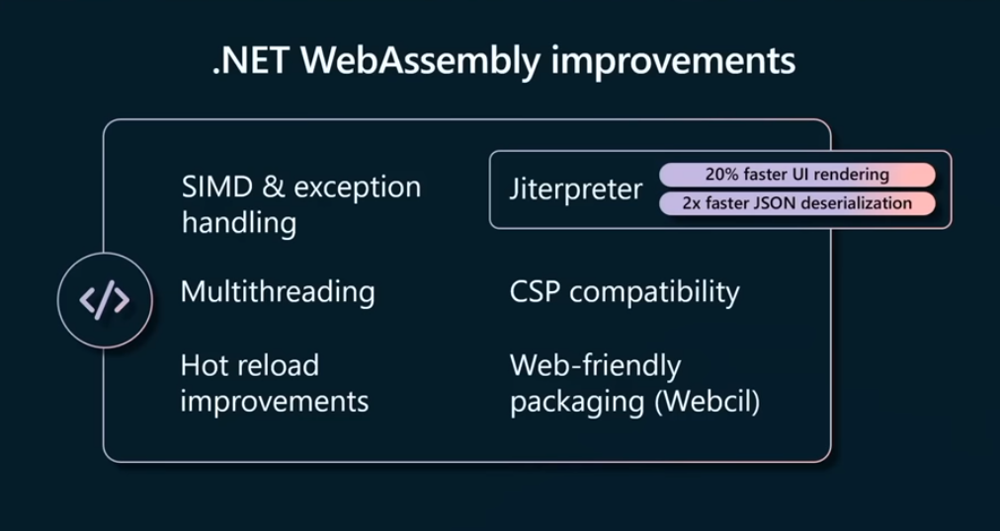
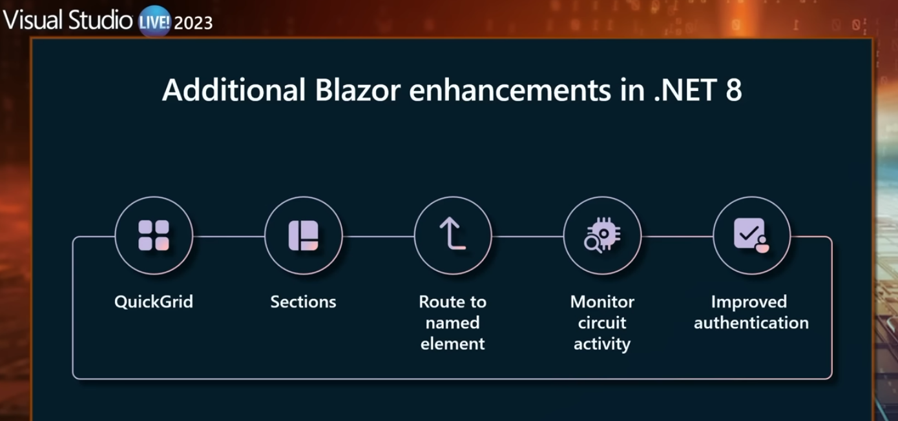

---json
{
  "documentId": 0,
  "title": "Blazor 8 with Dan Roth",
  "documentShortName": "2023-09-18-blazor-8-with-dan-roth",
  "fileName": "index.html",
  "path": "./entry/2023-09-18-blazor-8-with-dan-roth",
  "date": "2023-09-19T01:46:24.209Z",
  "modificationDate": "2023-09-19T01:46:24.209Z",
  "templateId": 0,
  "segmentId": 0,
  "isRoot": false,
  "isActive": true,
  "sortOrdinal": 0,
  "clientId": "2023-09-18-blazor-8-with-dan-roth",
  "tag": "{\n  \"extract\": \"This Visual Studio Live! 2023 video calls out the following highlights: - streaming rendering\\napply the @rendermode attribute to Blazor components\\nthe “Blazor Web App” template\\nRazorComponentResult for ASP.NET MVC❓\\nwill a future version of Blazor replace …\"\n}"
}
---

# Blazor 8 with Dan Roth

This Visual Studio Live! 2023 video calls out the following highlights:

- streaming rendering
- apply the `@rendermode` attribute to Blazor components
- the “Blazor Web App” template
- `RazorComponentResult` for ASP.NET <acronym title="Model View Controller">MVC</acronym>❓
- will a future version of Blazor replace eleventy]]❓
- Blazor 8 will stop sending `*.dll` files to the browser
- Blazor sections for parent-child component rendering

<figure>
    
    
<small>What's New in Blazor for .NET 8</small>

</figure>

## streaming rendering

This feature reduces the need for “web socket” connections by using the main request stream to asynchronously download static <acronym title="HyperText Markup Language">HTML</acronym>:

\[📹 [watch](https://youtu.be/QD2-DwuOfKM?t=1039) \]

📖 See “[Blazor in .NET 8: Server-side and Streaming Rendering](https://chrissainty.com/blazor-in-dotnet-8-server-side-and-streaming-rendering/).”

## apply the `@rendermode` attribute to Blazor components

The `@rendermode` attribute also reduces the need for “web socket” connections by pin-pointing _exactly_ which components  need server connection:

\[📹 [watch](https://youtu.be/QD2-DwuOfKM?t=1590) \]

## the “Blazor Web App” template

This new template ~~should eliminate the need for the older server-only or client-only templates~~ replaces the old Blazor Server template as Blazor will be able to “interactively” switch between server and WebAssembly modes:

\[📹 [watch](https://youtu.be/QD2-DwuOfKM?t=2001) \]

## `RazorComponentResult` for ASP.NET <acronym title="Model View Controller">MVC</acronym>❓

Clearly Microsoft wants to make progressively iterating to Blazor easier:

\[📹 [watch](https://youtu.be/QD2-DwuOfKM?t=2553) \]

The older ways of doing this sort of thing are covered in:

- “[How To Convert An MVC Project Into A Blazor Application Project](https://www.c-sharpcorner.com/article/how-to-convert-an-mvc-project-into-a-blazor-application-project/)”
- “[Migrating from MVC to Blazor](https://www.telerik.com/blogs/migrating-mvc-to-blazor)”

## wow, will a future version of Blazor replace eleventy]]❓

A future version of Blazor components may “generate static <acronym title="HyperText Markup Language">HTML</acronym> content”:

\[📹 [watch](https://youtu.be/QD2-DwuOfKM?t=2810) \]

## Blazor 8 will stop sending `*.dll` files to the browser

Blazor 8 promises to send a “[a normal binary WebAssembly module](https://github.com/dotnet/runtime/issues/80807)” to the browser by default:

\[📹 [watch](https://youtu.be/QD2-DwuOfKM?t=3083) \]

## Blazor sections for parent-child component rendering

Dan demos Blazor sections \[📹 [watch](https://youtu.be/QD2-DwuOfKM?t=3436) \] which are a direct response a similar feature that has been in <acronym title="Single Page Application">SPA</acronym> apps for years. For more, see “[ASP.NET 8 Blazor Sections Fully Explained](https://www.telerik.com/blogs/aspnet-8-blazor-sections-fully-explained).”

<https://github.com/BryanWilhite/>
