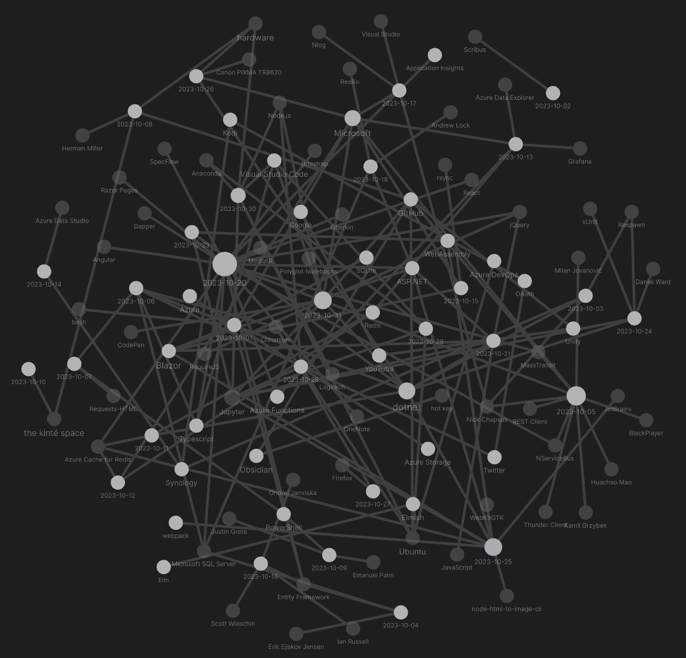

---json
{
  "documentId": 0,
  "title": "studio status report: 2023-10",
  "documentShortName": "2023-10-31-studio-status-report-2023-10",
  "fileName": "index.html",
  "path": "./entry/2023-10-31-studio-status-report-2023-10",
  "date": "2023-11-01T01:55:02.056Z",
  "modificationDate": "2023-11-01T01:55:02.056Z",
  "templateId": 0,
  "segmentId": 0,
  "isRoot": false,
  "isActive": true,
  "sortOrdinal": 0,
  "clientId": "2023-10-31-studio-status-report-2023-10",
  "tag": "{\n  \"extract\": \"month 10 of 2023 was about finding foundational bugs 🐛 in Songhay.Player.ProgressiveAudio (and finally using Redis Cache) No funny banter this month 😐 Issues #13 and #14 are currently holding up the release of the b-roll audio player. These challenges h…\"\n}"
}
---

# studio status report: 2023-10

## month 10 of 2023 was about finding foundational bugs 🐛 in `Songhay.Player.ProgressiveAudio` (and finally using Redis Cache)

No funny banter this month 😐 Issues [#13](https://github.com/BryanWilhite/Songhay.Player.ProgressiveAudio/issues/13) and [#14](https://github.com/BryanWilhite/Songhay.Player.ProgressiveAudio/issues/14) are currently holding up the release of the b-roll audio player. These challenges have emerged in a month that looks like this:



The major progress of this month was day-job related: I architected an app feature requiring [Azure Cache for Redis](https://learn.microsoft.com/en-us/azure/azure-cache-for-redis/cache-overview). This work bled into weekends 😵 but was well worth the desired accomplishment! Selected notes below should touch upon this grueling journey:

## [[Azure Cache for Redis]]: `IDistributedCache` does not support `SCAN` and `MGET` but is still needed


The following table summarizes the [[Redis]] commands the #day-job  needs:

| [[Redis]] command | <acronym title="IDistributedCache">IDC</acronym> method | <acronym title="IConnectionMultiplexer">ICM</acronym>/<acronym title="IDatabase">ID</acronym>/<acronym title="IServer">IS</acronym> method |
| - | - | - |
| `GET`<br />\[📖 [docs](https://redis.io/commands/get/) \] | `GetStringAsync`<br />\[📖 [docs](https://learn.microsoft.com/en-us/dotnet/api/microsoft.extensions.caching.distributed.distributedcacheextensions.getstringasync?view=dotnet-plat-ext-7.0) \] | `StringGetAsync(string)`<br />\[🔗 [GitHub](https://github.com/StackExchange/StackExchange.Redis/blob/main/src/StackExchange.Redis/Interfaces/IDatabaseAsync.cs#L2637) \] |
| `DEL`<sup>1</sup><br />\[📖 [docs](https://redis.io/commands/del/) \] | `RemoveAsync`<br />\[📖 [docs](https://learn.microsoft.com/en-us/dotnet/api/microsoft.extensions.caching.distributed.idistributedcache.removeasync?view=dotnet-plat-ext-7.0) \]<br />\[🔗 [GitHub](https://github.com/dotnet/aspnetcore/blob/main/src/Caching/StackExchangeRedis/src/RedisCache.cs#L459) \] | `KeyDeleteAsync`<br />\[🔗 [GitHub](https://github.com/StackExchange/StackExchange.Redis/blob/main/src/StackExchange.Redis/Interfaces/IDatabaseAsync.cs#L582) \] |
| `SET`<br />\[📖 [docs](https://redis.io/commands/set/) \] | `SetStringAsync`<br />\[📖 [docs](https://learn.microsoft.com/en-us/dotnet/api/microsoft.extensions.caching.distributed.distributedcacheextensions.setstringasync?view=dotnet-plat-ext-7.0) \] | `StringSetAsync`<br />\[🔗 [GitHub](https://github.com/StackExchange/StackExchange.Redis/blob/main/src/StackExchange.Redis/Interfaces/IDatabaseAsync.cs#L2833) \] |
| `MGET`<br />\[📖 [docs](https://redis.io/commands/mget/) \] | 🚫 | `StringGetAsync(string[])`<br />\[🔗 [GitHub](https://github.com/StackExchange/StackExchange.Redis/blob/main/src/StackExchange.Redis/Interfaces/IDatabaseAsync.cs#L2647) \] |
| `SCAN`<br />\[📖 [docs](https://redis.io/commands/scan/) \] | 🚫 | `KeysAsync`<br />\[🔗 [GitHub](https://github.com/StackExchange/StackExchange.Redis/blob/main/src/StackExchange.Redis/Interfaces/IServer.cs#L348) \] |
| `HGET`<br />\[📖 [docs](https://redis.io/commands/hget/) \] | 🚫 | `HashGetAsync`<br />\[🔗 [GitHub](https://github.com/StackExchange/StackExchange.Redis/blob/main/src/StackExchange.Redis/Interfaces/IDatabaseAsync.cs#L323) \] |

- - -
<sup>1</sup><small>There is no <code>MDEL</code> command as the <code>DEL</code> command supports multiple optional keys.</small>

`GetStringAsync` and `SetStringAsync` have an advantage over the <acronym title="IDatabase">ID</acronym> equivalents because [[Microsoft]] abstracts away the ceremony around setting expiration dates.

## welcome to Friday the 13<sup>th</sup> 🕸: when `IDistributedCache` writes a string into [[Redis]], it is actually writing a hash 😠 #day-job 

In order to support [[Redis]] cache entry expiration ❓ [[Microsoft]] is entering hashes on our behalf when we expect strings to be written! This means that:

>[!warning]
>`MGET` cannot be used with `IDistributedCache` [[Redis]] cache entries because these entries are hashes. There are no [[Redis]] commands that are the hash-equivalent of `MGET`.
>

It is an error to assume that `HMGET` \[📖 [docs](https://redis.io/commands/hmget/) \] is the equivalent of `MGET`. The hash getters of [[Redis]] are more concerned with returning _multiple_ values from a _single_ hash entry. I see _no_ concern for returning an array of arrays: multiple hash values.

## [[Songhay Player - Progressive Audio (F♯)]]: progressive `audio` features are actually needed for the progressive audio player 😐

The previous progressive audio player leveraged `audio5js` \[🔗 [GitHub](https://github.com/zohararad/audio5js) \] which correctly uses the `canplay` event \[🔗 [GitHub](https://github.com/zohararad/audio5js/blob/master/src/audio5.js#L579) \] while my design currently does not—not even incorrectly 😐

>[!error]
>Currently the [[Songhay Player - Progressive Audio (F♯)]] does not use the `canPlay` event \[📖 [docs](https://developer.mozilla.org/en-US/docs/Web/Guide/Audio_and_video_delivery/Cross-browser_audio_basics#canplay) \] which means large files that are not sufficiently downloaded fail to play (without any console error messages).
>

These are the minimum features needed based on the `canPlay` event:

- [x] the player controls should be disabled until the `canPlay` event fires or `HTMLMediaElement.readyState` is greater than `2` (`HAVE_FUTURE_DATA` or `HAVE_ENOUGH_DATA` \[📖 [docs](https://developer.mozilla.org/en-US/docs/Web/API/HTMLMediaElement/readyState#value) \])
- [x] when a playlist item is clicked the player controls should be disabled and the `canPlay` event should fire again and/or `HTMLMediaElement.readyState` is checked again
- [x] the playlist should be disabled until the current track `canPlay` and/or `HTMLMediaElement.readyState` is greater than `2`
- [x] data should be written to the console to track states (the `loadstart` event \[📖 [docs](https://developer.mozilla.org/en-US/docs/Web/Guide/Audio_and_video_delivery/Cross-browser_audio_basics#loadstart) \] and the `loadedmetadata` event \[📖 [docs](https://developer.mozilla.org/en-US/docs/Web/Guide/Audio_and_video_delivery/Cross-browser_audio_basics#loadedmetadata) \] should be tracked here)

[Issue #14](https://github.com/BryanWilhite/Songhay.Player.ProgressiveAudio/issues/14) is open for this.

### design critique

Because I decided 😐 to use a fucked up polling strategy in `ProgressiveAudioUtility.startPlayAnimation` I allowed myself to not care about `HTMLMediaElement.readyState`. I now consider this decision _insane_.

- [x] #14 add `PlayerAudioLoadStartEvent` and `PlayerAudioCanPlayEvent` messages 🔨🐎
- [x] #14 add `ProgressiveAudioModel.canPlay` boolean 🔨
- [x] #14 remove the polling strategy in `ProgressiveAudioUtility.startPlayAnimation`  🔨
- [x] #14 remove `ProgressiveAudioUtility.toggleElementEnabled` 🔨🔥
- [x] #14 use `ProgressiveAudioModel.canPlay` boolean to drive the application of `pointer-events: none` for the playlist 🔨🐎💄

## three new [[Jupyter]] notebooks to study [[JavaScript]] #day-job 

1. [[dotnet|.NET]]: `IDictionary<TKey,TValue>` and JavaScript’s `Map` \[🔗 [GitHub](https://github.com/BryanWilhite/jupyter-central/blob/master/funkykb/csharp/system-collections-generic-dictionary-and-javascript-map.ipynb) \]
2. JavaScript date math \[🔗 [GitHub](https://github.com/BryanWilhite/jupyter-central/blob/master/funkykb/csharp/system-datetime-and-javascript.ipynb) \]
3. [[jQuery]]: `.serializeArray` and `FormData`

## “How to list all routes in an [[ASP.NET]] Core application” #day-job 

<https://www.meziantou.net/list-all-routes-in-an-asp-net-core-application.htm>

```csharp
var builder = WebApplication.CreateBuilder(args);
var app = builder.Build();
app.UseRouting();

if (app.Environment.IsDevelopment())
{
    app.MapGet("/debug/routes", (IEnumerable<EndpointDataSource> endpointSources) =>
        string.Join("\n", endpointSources.SelectMany(source => source.Endpoints)));
}

app.Run();
```

## the [[Daniel Ward]] presentation on [[xUnit]]

<div style="text-align:center">

<figure>
    <a href="https://www.youtube.com/watch?v=PmkaRH3wk-4">
        
    </a>
    <p><small>xUnit Expanded – Better Testing With xUnit by Daniel Ward</small></p>
</figure>

</div>

The big news from this [[Daniel Ward]] presentation is the surprise about [[xUnit]] collections:

>How does xUnit.net decide which tests can run against each other in parallel? It uses a concept called _test collections_ to make that decision.
>
>By default, each test class is a unique test collection. Tests within the same test class will not run in parallel against each other.
>
>—<https://xunit.net/docs/running-tests-in-parallel>
>

Also see “[Shared Context between Tests](https://xunit.net/docs/shared-context.html)” 📖

>[!warning]
>The [[xUnit]] documentation makes _no_ mention of ordered testing.

[[Daniel Ward]] made no mention of ordered testing which may suggest that ordered tests are frowned upon or considered obsolete in the context of mocking and using containers with [[Respawn]].

I need to revisit this [[Daniel Ward]] video again for more detail #to-do

## [[Microsoft]]: “William A. Adams, Software Engineer, DEI Innovator, and Philanthropist”

<div style="text-align:center">

<figure>
    <a href="https://www.youtube.com/watch?v=np0P_UpdNL8">
        
    </a>
    <p><small>William A. Adams, Software Engineer, DEI Innovator, and Philanthropist</small></p>
</figure>

</div>

## sketching out development projects

The current, unfinished public projects on GitHub:

- replace the Angular app in `http://kintespace.com/player.html` with a Bolero app 🚜🔥
- finish the “`SonghayCore` 📦✨ release 6.0.5” [project](https://github.com/users/BryanWilhite/projects/7)
- start the “`Songhay.Publications.Models` 6.0.0” 📦🚀 [project](https://github.com/users/BryanWilhite/projects/23/views/1)

The proposed project items:

- add kinté space presentations support to `Songhay.Player.YouTube` 🔨 🚜✨
- generate Publication indices from SQLite for `Songhay.Publications.KinteSpace`
- generate a new repo with proposed name, `Songhay.Modules.Bolero.Index` ✨🚧 and add a GitHub Project
- switch Studio from Material Design to Bulma 💄 ➡️ 💄✨

<https://github.com/BryanWilhite/>
