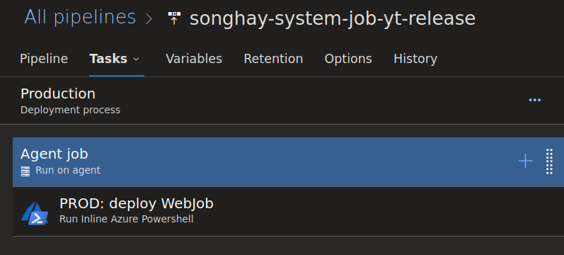
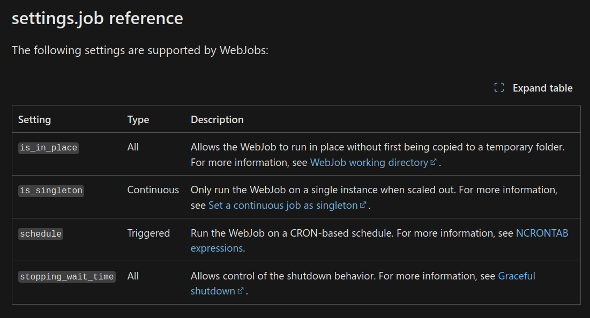
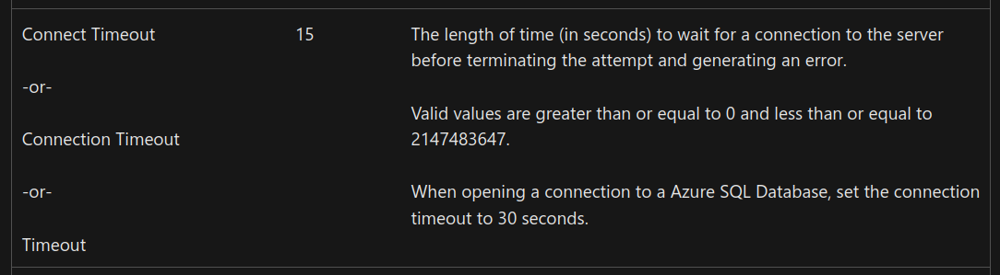
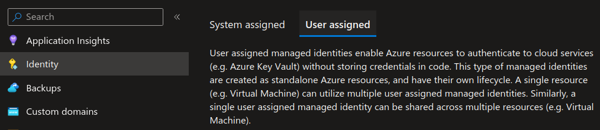
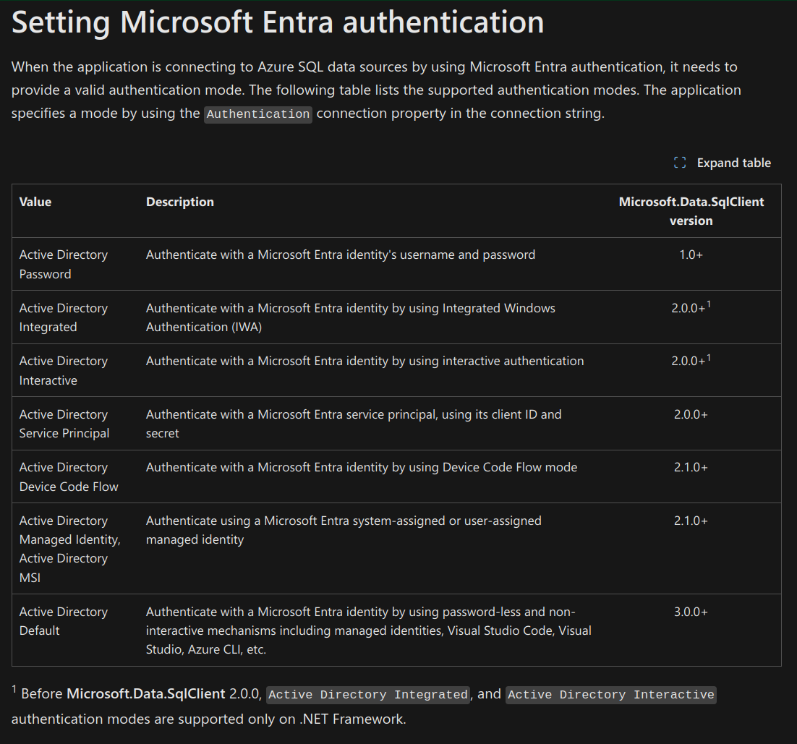

---json
{
  "documentId": 0,
  "title": "Azure WebJobs in 2023",
  "documentShortName": "2023-12-22-azure-webjobs-in-2023",
  "fileName": "index.html",
  "path": "./entry/2023-12-22-azure-webjobs-in-2023",
  "date": "2023-12-22T17:59:14.714Z",
  "modificationDate": "2023-12-22T17:59:14.714Z",
  "templateId": 0,
  "segmentId": 0,
  "isRoot": false,
  "isActive": true,
  "sortOrdinal": 0,
  "clientId": "2023-12-22-azure-webjobs-in-2023",
  "tag": "{\n  \"extract\": \"Azure Web Jobs [📖 docs ] remains the ‘last resort’ when running code in the Microsoft cloud 🌩 When Azure Functions [📖 docs ] cannot run your ‘executable’ (likely because it is a tightly-coupled, vertical stack of cross-boundary asynchronous calls that …\"\n}"
}
---

# Azure WebJobs in 2023

Azure Web Jobs \[📖 [docs](https://learn.microsoft.com/en-us/azure/app-service/webjobs-create) \] remains the ‘last resort’ when running code in the Microsoft cloud 🌩 When Azure Functions \[📖 [docs](https://learn.microsoft.com/en-us/azure/azure-functions/functions-overview?pivots=programming-language-csharp) \] cannot run your ‘executable’ (likely because it is a tightly-coupled, vertical stack of cross-boundary asynchronous calls that allocates too many resources for more than 10 minutes), then Azure Web Jobs is your fallback of choice when your enterprise is _still_ not using containers and the use dedicated virtual machines in the cloud is too expensive.

## the Visual Studio publish experience has improved

An archived article from 2018 [complains](https://learn.microsoft.com/en-us/archive/blogs/azuredev/webjobs-in-azure-with-net-core-2-1#deploying-to-azure) about the deployment experience, starting with the sentence, “Unfortunately, Microsoft messed up this feature in the worst way possible.” This situation as of 2023 has greatly improved. Most importantly Microsoft is no longer requiring a dedicated **Azure WebJob** project type as [introduced by bloggers in 2017](https://www.spdavid.com/post/azure-web-jobs-c-sharp/). This means that _any_ console app can be deployed as an Azure Web Jobs executable because the Visual Studio publish experience packages the console app (including a `run.cmd` file) automatically.

>[!important]
>_Any_ console app can be deployed as an Azure Web Jobs executable because the Visual Studio publish experience packages the console app (including a `run.cmd` file) automatically.
>

See “[Develop and deploy WebJobs using Visual Studio](https://learn.microsoft.com/en-us/azure/app-service/webjobs-dotnet-deploy-vs)” 📖 for more details.

## there is _still_ no default command-line experience for publishing/deploying

The commands under `az webapp webjob` \[📖 [docs](https://learn.microsoft.com/en-us/cli/azure/webapp/webjob?view=azure-cli-latest) \] are mostly for reporting (there are a few for deleting and starting jobs). The large number of ways a job can be packaged is likely the cause for the lack:

>The following file types are supported:
>
> - .cmd, .bat, .exe (using Windows cmd)
> - .ps1 (using PowerShell)
> - .sh (using Bash)
> - .php (using PHP)
> - .py (using Python)
> - .js (using Node.js)
> - .jar (using Java)
>
>—“[Supported file types for scripts or programs](https://learn.microsoft.com/en-us/azure/app-service/webjobs-create#acceptablefiles)”
>

What follows is a historical view of how one way of deployment works. I may help to compare what is written below with “[How To Deploy Web App and Web Job In A Single Pipeline](https://www.rahulpnath.com/blog/azure-webapp-with-webjobs-dotnet-core-build-depoy/)” by Rahul Pulikkot Nath #to-do . The method I used to package and deploy started with a `run.ps1` file in the `*.Shell` project directory of the console app:

```powershell
Set-Location $PSScriptRoot

$p = Start-Process Songhay.Player.Shell.exe -ArgumentList "PlayerYouTubeActivity" -NoNewWindow -PassThru -Wait

exit $p.ExitCode
```

This file was set to copy to the build output directory in the `*.Shell.csproj` file:

```xml
<ItemGroup>
    <None Update="run.ps1">
        <CopyToOutputDirectory>PreserveNewest</CopyToOutputDirectory>
    </None>
</ItemGroup>
```

At the Solution level, I would have a `azure-pipelines-shell.yml` file like this:

```yaml
name: $(System.TeamProject)_$(Build.DefinitionName)_$(Build.SourceBranchName)_$(Build.BuildId)

variables:
  BuildConfiguration: 'Release'
  RepoName: 'Songhay.Player'

trigger:
  batch: 'false'
  branches:
    include:
    - master
    - releases/*
  paths:
    exclude:
    - $(RepoName).Functions/*
    - $(RepoName).Functions.Tests/*
    - $(RepoName).Shell.Tests/*
    - $(RepoName).Tests/*
    - $(RepoName).Web/*
    - $(RepoName).Web.Tests/*

resources:
- repo: self

steps:
- task: UseDotNet@2
  displayName: 'Use .NET Core SDK 5.x'
  inputs:
    packageType: sdk
    version: 5.x

- task: DotNetCoreCLI@2
  displayName: 'dotnet restore'
  inputs:
    command: restore
    projects: $(RepoName).sln

- task: DotNetCoreCLI@2
  displayName: 'dotnet build'
  inputs:
    projects: $(RepoName).sln
    arguments: '--configuration $(BuildConfiguration)'

- task: downloadsSecureFile@0
  inputs:
    fileInput: '0bbd144a-8c21-4a46-bc4d-8faff4fdecec'
    targetPath: $(RepoName).Shell
    targetName: 'app-settings.shared.json'

- task: DotNetCoreCLI@2
  displayName: 'dotnet publish'
  inputs:
    command: publish
    publishWebProjects: false
    projects: '$(RepoName).Shell/*.csproj'
    arguments: '/property:GenerateFullPaths=true /consoleloggerparameters:NoSummary --configuration $(BuildConfiguration) --output $(Build.ArtifactStagingDirectory) --self-contained false --runtime win-x64'
    zipAfterPublish: true

- task: PublishBuildArtifacts@1
  displayName: 'Publish Artifact: drop'
  inputs:
    PathtoPublish: '$(Build.ArtifactStagingDirectory)'
```

This script would be referenced by the **Agent Job** task in the release pipeline:

<div style="text-align:center">



</div>

Then the Azure DevOps release pipeline would call `azure-pipelines-deployment.ps1` (also placed on the Solution level). The **Run Inline Azure Powershell** task would run the following:

```powershell
#Resource details :
$resourceGroupName = "songhay-system-resources";
$webAppName = "songhay-system"
$webJobName = "job-yt"
$webJobType="triggeredwebjobs"
$deploymentZipFileName="Songhay.Player.Shell.zip"
$Apiversion = "2015-08-01"

#Function to get Publishing credentials for the WebApp :
function Get-PublishingProfileCredentials($resourceGroupName, $webAppName) {

    $resourceType = "Microsoft.Web/sites/config"
    $resourceName = "$webAppName/publishingcredentials"
    $publishingCredentials = Invoke-AzureRmResourceAction `
        -ResourceGroupName $resourceGroupName `
        -ResourceType $resourceType `
        -ResourceName $resourceName `
        -Action list `
        -ApiVersion $Apiversion `
        -Force

    return $publishingCredentials
}

#Pulling authorization access token :
function Get-KuduApiAuthorisationHeaderValue($resourceGroupName, $webAppName) {

    $publishingCredentials = Get-PublishingProfileCredentials $resourceGroupName $webAppName
    return ("Basic {0}" -f [Convert]::ToBase64String([Text.Encoding]::ASCII.GetBytes(("{0}:{1}" -f 
                    $publishingCredentials.Properties.PublishingUserName, $publishingCredentials.Properties.PublishingPassword))))
}

Write-Host "Preparing to publish WebJob $webJobName..."

Write-Host "Getting KUDU access token..."
$accessToken = Get-KuduApiAuthorisationHeaderValue $resourceGroupName $webAppname

#Generating header to create and publish the Webjob :
$Header = @{
    'Content-Disposition' = 'attachment; attachment; filename=$deploymentZipFileName'
    'Authorization'       = $accessToken
}

$apiUrl = "https://$webAppName.scm.azurewebsites.net/api/$webJobType/$webJobName"

Write-Host "Calling ``$apiUrl``..."
Invoke-RestMethod `
    -Uri $apiUrl `
    -Headers $Header `
    -Method put `
    -InFile "$env:AGENT_RELEASEDIRECTORY\$env:BUILD_DEFINITIONNAME\drop\$deploymentZipFileName" `
    -ContentType 'application/zip'

<#
    📚 https://github.com/projectkudu/kudu/wiki/Deploying-a-WebJob-using-PowerShell-ARM-Cmdlets
#>
```

See “[Using the Inline PowerShell VSTS task](https://pgroene.wordpress.com/2016/05/20/using-the-inline-powershell-vsts-task/)” by Peter Groenewegen 📖

## the Azure App Service configuration settings override `appsettings.json`

I know from personal experience that Azure App Service configuration settings override `appsettings.json`. I have yet to find official Microsoft docs mentioning this. However, [back in 2016](https://blog.ploeh.dk/2014/05/16/configuring-azure-web-jobs/) Mark Seemann speculated that:

> As far as I can tell, it attempts to read configuration settings in this prioritized order:
>
> 1. Try to find the configuration value in the Web Site's online configuration (see below).
> 2. Try to find the configuration value in the .cscfg file.
> 3. Try to find the configuration value in the app.config file or web.config file.
>

This convention makes it possible to deploy the same code to two different servers (e.g. a _development_ and _production_ server) with different app settings without having to modify any local configuration settings. We make these changes under the Configuration “blade” in the Azure Portal \[📖 [docs](https://learn.microsoft.com/en-us/azure/app-service/configure-common?tabs=portal#configure-app-settings) \].

## the `Settings.job` file has been around for at least five years

The Azure Web Jobs <acronym title="Software Development Kit">SDK</acronym> GitHub repo refers to the `Settings.job` file [over twenty times](https://github.com/search?q=repo%3AAzure%2Fazure-webjobs-sdk+Settings.job&type=issues) while _not_ approaching it in any repo-level documentation 😐 I know from #day-job experience that Visual Studio will auto-generate this file during their deployment experience. The leading purpose of this file is to save your “[CRON expression](https://learn.microsoft.com/en-us/azure/app-service/webjobs-dotnet-deploy-vs#cron-expressions)” in the `schedule` property instead of entering it manually in the Azure Portal. Here is [the full list of settings](https://learn.microsoft.com/en-us/azure/app-service/webjobs-dotnet-deploy-vs#settingsjob-reference) for this file:

<div style="text-align:center">



</div>

## the most important timeout setting: `WEBJOBS_IDLE_TIMEOUT`

The setting `WEBJOBS_IDLE_TIMEOUT` is the most important WebJobs environment variable \[📖 [docs](https://learn.microsoft.com/en-us/azure/app-service/reference-app-settings?tabs=kudu%2Cdotnet#webjobs) \]. Idle time elapses when the job “has no CPU time or output” this is what often happens when the job is waiting for a database connection to open or waiting for a database query to finish. We can override the default setting of this environment variable under the Configuration “blade” in the Azure Portal \[📖 [docs](https://learn.microsoft.com/en-us/azure/app-service/configure-common?tabs=portal#configure-app-settings) \].

Here is the typical error message explicitly telling us to to change this setting:

```console
System.AggregateException: One or more errors occurred. ---> Kudu.Core.Infrastructure.CommandLineException: Command 'cmd /c ""run.cmd""' was aborted due to no output nor CPU activity for 121 seconds. You can increase the SCM_COMMAND_IDLE_TIMEOUT app setting (or WEBJOBS_IDLE_TIMEOUT if this is a WebJob) if needed.
cmd /c ""run.cmd""
   at Kudu.Core.Infrastructure.IdleManager.WaitForExit(IProcess process) in C:\Kudu Files\Private\src\master\Kudu.Core\Infrastructure\IdleManager.cs:line 45
```

By the way, `SCM_COMMAND_IDLE_TIMEOUT` is a _build automation_ \[📖 [docs](https://learn.microsoft.com/en-us/azure/app-service/reference-app-settings?tabs=kudu%2Cdotnet#build-automation) \] setting, having nothing to do with running production code.

Now, the _second_ most important Azure Web Jobs setting is the timeout setting in any database connection strings in use for the job:

<div style="text-align:center">



</div>

\[📖 [docs](https://learn.microsoft.com/en-us/dotnet/api/system.data.sqlclient.sqlconnection.connectionstring?view=dotnet-plat-ext-8.0#remarks) \]

Because Azure Functions is based on Azure Web Jobs]], this setting, `WEBJOBS_IDLE_TIMEOUT`, has the same use and importance in Azure Functions]].

## yes, _one_ app service can have system-assigned _and_ user-assigned <acronym title="Managed Identity">MI</acronym>s _simultaneously_

The <acronym title="User Experience">UX</acronym> in the Azure Portal is _not_ misleading:

<div style="text-align:center">




</div>

The portal allows us to enable a system-assigned <acronym title="Managed Identity">MI</acronym> _and_ allows us to add multiple user-assign <acronym title="Managed Identity">MI</acronym>s—because _one_ app service can have _multiple_ ASP.NET applications and _multiple_ Azure Web Jobs connecting to multiple ‘external’ resources (like a database). It makes sense to have a shared, user-assigned <acronym title="Managed Identity">MI</acronym> for a database and a system-assigned <acronym title="Managed Identity">MI</acronym> might be used for authentication purposes.

The database connection string can refer to the user-assigned <acronym title="Managed Identity">MI</acronym> like this:

```console
Server=...;Database=...;Authentication=Active Directory Managed Identity;User Id=00000000-0000-0000-000000000000;Connection Timeout=3600
```

…where `00000000-0000-0000-000000000000` is the **Object (principal) ID** of the <acronym title="Managed Identity">MI</acronym>.

Note that, for Microsoft SQL Server]], the `Authentication` value depends (sadly) on the version of `Microsoft.Data.SqlClient` in use. For details, see “[Setting Microsoft Entra authentication](https://learn.microsoft.com/en-us/sql/connect/ado-net/sql/azure-active-directory-authentication?view=sql-server-ver16#setting-microsoft-entra-authentication)”:

<div style="text-align:center">



</div>

\[📖 [docs](https://learn.microsoft.com/en-us/sql/connect/ado-net/sql/azure-active-directory-authentication?view=sql-server-ver16#setting-microsoft-entra-authentication) \]

For Entity Framework users, the version of `Microsoft.Data.SqlClient` in use is determined by the version of Entity Framework in use 😐

<https://github.com/BryanWilhite/>
