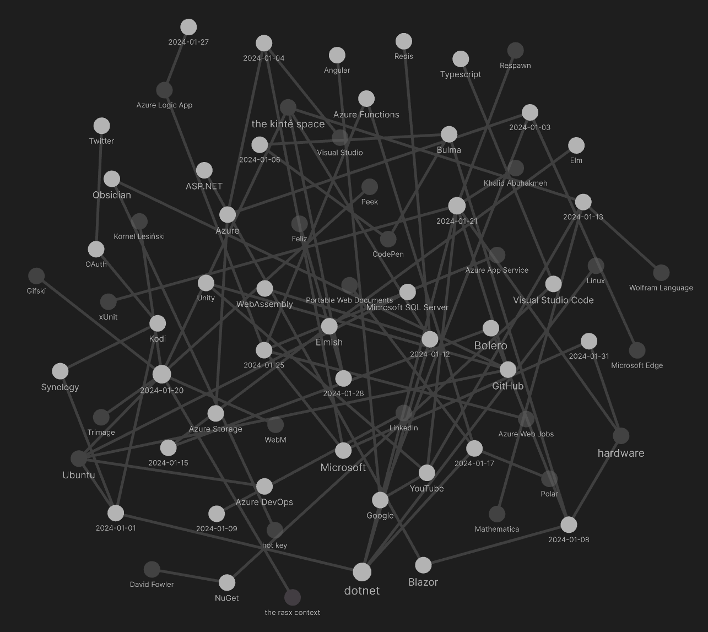

---json
{
  "documentId": 0,
  "title": "studio status report: 2024-01",
  "documentShortName": "2024-01-31-studio-status-report-2024-01",
  "fileName": "index.html",
  "path": "./entry/2024-01-31-studio-status-report-2024-01",
  "date": "2024-01-31T16:05:03.605Z",
  "modificationDate": "2024-01-31T16:05:03.605Z",
  "templateId": 0,
  "segmentId": 0,
  "isRoot": false,
  "isActive": true,
  "sortOrdinal": 0,
  "clientId": "2024-01-31-studio-status-report-2024-01",
  "tag": "{\n  \"extract\": \"month 01 of 2024 was about releasing Songhay.Modules.Bolero and SonghayCore The only piece left to complete that other ‘half’ needed to completely replace <http://kintespace.com/player.html> is Songhay.Player.YouTube release 6.3.0 📦🚀…\"\n}"
}
---

# studio status report: 2024-01

## month 01 of 2024 was about releasing `Songhay.Modules.Bolero` _and_ `SonghayCore`

The only piece left to complete that other ‘half’ needed to completely replace `http://kintespace.com/player.html` is Songhay.Player.YouTube` release 6.3.0 📦🚀 [[GitHub](https://github.com/users/BryanWilhite/projects/25)]. This surge in progress means `Songhay.Modules.Bolero` release 6.4.0 📦🚀 [[GitHub](https://github.com/users/BryanWilhite/projects/27)] is complete.

The completion of `SonghayCore` 📦✨ release 6.1.0” [[GitHub](https://github.com/users/BryanWilhite/projects/7)] is also significant but not directly related to that other ‘half’ needed to completely replace `http://kintespace.com/player.html`. Again, I am trying to be in several places at once 😐 This `SonghayCore` move is a combination of general maintenance and groundwork underneath the Songhay Publications stack. The following projects that need to be completed for Songhay Publications depend on `SonghayCore`:

- `Songhay.Publications` 6.1.0 📦🚀 [[GitHub](https://github.com/users/BryanWilhite/projects/24)]
- `Songhay.Publications.Models` 6.0.0 📦🚀 [[GitHub](https://github.com/users/BryanWilhite/projects/23)]

Completion of these projects should lead directly into the “proposed project items” mentioned at the end of this document (see “sketching out development projects” below). Success here will reignite Studio work on Songhay Publications instead of writing software in a vacuum and learning yet another thing about Microsoft 😐

My Obsidian graph for month 01 reveals just how much Microsoft dominates my “second brain”:



Selected Obsidian notes for month 01:

## browser tabs go to sleep 🛌 or throttle for various reasons

First of all, there are [no events](https://developer.mozilla.org/en-US/docs/Mozilla/Add-ons/WebExtensions/API/tabs#events) related to tabs going to “sleep” which implies there is no accepted standard for tab sleeping/throttling.

[[Microsoft Edge]] has a “[sleeping tabs](https://www.microsoft.com/en-us/edge/features/sleeping-tabs?form=MA13FJ)” feature that diverges from the [[Google]] “[tab discarding](https://developer.chrome.com/blog/tab-discarding/)” feature.

The _throttling_ related to inactive tabs largely applies to the use of `setTimeout`:

> To reduce the load (and associated battery usage) from background tabs, browsers will enforce a minimum timeout delay in inactive tabs. It may also be waived if a page is playing sound using a Web Audio API [`AudioContext`](https://developer.mozilla.org/en-US/docs/Web/API/AudioContext).
>
> The specifics of this are browser-dependent:
>
> - Firefox Desktop and Chrome both have a minimum timeout of 1 second for inactive tabs.
> - Firefox for Android has a minimum timeout of 15 minutes for inactive tabs and may unload them entirely.
> - Firefox does not throttle inactive tabs if the tab contains an [`AudioContext`](https://developer.mozilla.org/en-US/docs/Web/API/AudioContext).
>
> —“[Timeouts in inactive tabs](https://developer.mozilla.org/en-US/docs/Web/API/setTimeout)”
>

## when I still do not understand [[Azure]] deployment slots after reading “Azure Functions deployment slots” then I can fill with dread 😐 #to-do

“[Azure Functions deployment slots](https://learn.microsoft.com/en-us/azure/azure-functions/functions-deployment-slots?tabs=azure-portal)” explains the theory clearly:

>Azure Functions deployment slots allow your function app to run different instances called _slots_. Slots are different environments exposed via a publicly available endpoint. One app instance is always mapped to the production slot, and you can swap instances assigned to a slot on demand. Function apps running in a [Consumption plan](https://learn.microsoft.com/en-us/azure/azure-functions/consumption-plan) have a single extra slot for staging. You can obtain more staging slots by running your app in a [Premium plan](https://learn.microsoft.com/en-us/azure/azure-functions/functions-premium-plan) or [Dedicated (App Service) plan](https://learn.microsoft.com/en-us/azure/azure-functions/dedicated-plan). For more information, see [Service limits](https://learn.microsoft.com/en-us/azure/azure-functions/functions-scale#service-limits).

The understanding problem begins with not know the details around this sentence:

>One app instance is always mapped to the production slot, and you can swap instances assigned to a slot on demand.
>

## the docs for `section` is a great intro to semantic <acronym title="HyperText Markup Language">HTML</acronym>

The usage notes for `section`is a great intro to semantic <acronym title="HyperText Markup Language">HTML</acronym> \[🔗 [Wikipedia](https://en.wikipedia.org/wiki/Semantic_HTML) \]:

> As mentioned above, `<section>` is a generic sectioning element, and should only be used if there isn't a more specific element to represent it. As an example, a navigation menu should be wrapped in a [`<nav>`](https://developer.mozilla.org/en-US/docs/Web/HTML/Element/nav) element, but a list of search results or a map display and its controls don't have specific elements, and could be put inside a `<section>`.
>
> Also consider these cases:
>
> - If the contents of the element represent a standalone, atomic unit of content that makes sense syndicated as a standalone piece (e.g. a blog post or blog comment, or a newspaper article), the [`<article>`](https://developer.mozilla.org/en-US/docs/Web/HTML/Element/article) element would be a better choice.
> - If the contents represent useful tangential information that works alongside the main content, but is not directly part of it (like related links, or an author bio), use an [`<aside>`](https://developer.mozilla.org/en-US/docs/Web/HTML/Element/aside).
> - If the contents represent the main content area of a document, use [`<main>`](https://developer.mozilla.org/en-US/docs/Web/HTML/Element/main).
> - If you are only using the element as a styling wrapper, use a [`<div>`](https://developer.mozilla.org/en-US/docs/Web/HTML/Element/div) instead.
>
> To reiterate, each `<section>` should be identified, typically by including a heading ([h1](https://developer.mozilla.org/en-US/docs/Web/HTML/Element/Heading_Elements) - [h6](https://developer.mozilla.org/en-US/docs/Web/HTML/Element/Heading_Elements) element) as a child of the `<section>` element, wherever possible. See below for examples of where you might see a `<section>` without a heading.
>
> —“[Usage notes](https://developer.mozilla.org/en-US/docs/Web/HTML/Element/section#usage_notes)”
>

Flippantly, `section` usage for fictional prose would demarcate chapters:

```html
<html>
    <head>
        <title>My Prose</title>
    </head>
    <body>
        <nav>
            <a href="#1">Chapter One</a>
            <a href="#2">Chapter Two</a>
            <a href="#3">Chapter Three</a>
        </nav>
        <main>
            <h1>My Title</h1>
    
            <section id="1">
                <h2>Chapter One</h2>
                <p>Who is Peter Pan?</p>
            </section>
            <section id="2">
                <h2>Chapter Two</h2>
                <p>Peter Pan has conflict.</p>
            </section>
            <section id="3">
                <h2>Chapter Three</h2>
                <p>Peter Pan ends the conflict.</p>
            </section>
        </main>
    </body>
</html>
```

I am most embarrassed  about my historical ignorance of the `main` element 😐

For Blog posts, we are guided to replace `section` with `article`:

```html
<html>
    <head>
        <title>My Blog</title>
    </head>
    <body>
        <nav>
            <a href="#1">Post One</a>
            <a href="#2">Post Two</a>
            <a href="#3">Post Three</a>
        </nav>
        <aside>
        This is a call to action for the Blog!
        </aside>
        <main>
            <h1>My Blog Title</h1>
    
            <article id="1">
                <h2>Post One</h2>
                <h3>Day One</h3>
            </article>
            <article id="2">
                <h2>Post Two</h2>
                <h3>Day Seven</h3>
            </article>
            <article id="3">
                <h2>Post Three</h2>
                <h3>Day Twenty</h3>
            </article>
        </main>
    </body>
</html>
```

…of course, lengthy Blog posts can be broken down into `section` elements.

## an ex-[[Microsoft]] employee’s take on logging

In “[The Subtle Arts of Logging and Testing](https://bigmachine.io/software-design/the-subtle-art-of-logging-testing/),” Rob Conery reports:

> Over the years I've created my own personal strategy which feels verbose, at first, but has helped many times:
>
> - Log any application error (in addition to runtime), and keep them focused.
> - Log any state change to any model (as `info`).
> - Log any `status` change, if a model has a `status` field, as a `warning`.
> - Don't `try/catch` at the controller level unless no choice, only in service classes.
> - Know what you're `catch`ing!
>
## semantic <acronym title="HyperText Markup Language">HTML</acronym> and [[Bulma]] layout

Now that I respect the basics of semantic <acronym title="HyperText Markup Language">HTML</acronym>, let us see how [[Bulma]] plays along:

```html
<html>
    <head>
        <title>My Bulma Interface</title>
    </head>
    <body class="has-navbar-fixed-top">
        <svg><!-- icons --></svg>
        <nav class="navbar"><!-- web nav --></nav>
        <main class="container is-fluid">
            <div class="columns">
                <div class="column is-3">
                    <!-- .tile of site nav -->
                </div>
                <div class="column">
                    <!-- .tile of main UX -->
                </div>
            </div>
        </main>
        <footer class="footer">
            <!-- fluid .container of .columns -->
        </footer>
    </body>
</html>
```

This layout declares the following concepts:

- centralized <acronym title="Scalable Vector Graphics">SVG</acronym> icons
- two categories of navigation: Web navigation and site navigation

We also see the [[Bulma]]-influenced approach to layout:

1. declare a `div.container`
2. declare child `div.colums` block of `div.column`
3. declare a `.tile` ‘stack’ inside a `div.column`

[[Bulma]] tiles layout \[📖 [docs](https://bulma.io/documentation/layout/tiles/) \] is the most complex 😐 …I have [started](https://codepen.io/rasx/pen/qBXeGZO) with a [[CodePen]] to help me understand what is going on with these “intricate 2-dimensional layouts.”

## semantic <acronym title="HyperText Markup Language">HTML</acronym>, [[Bulma]] and [[Bolero]]/[[Blazor]] layout

Adding [[Bolero]]/[[Blazor]] might cause siblings of `main` (except for `script`) to disappear:

```html
<html>
    <head>
        <title>My Bolero App</title>
    </head>
    <body class="has-navbar-fixed-top">
        <svg><!-- icons --></svg>
        <nav class="navbar"><!-- web nav --></nav>
        <main class="container is-fluid" id="my-app">
            <div class="has-text-centered">  
                <div class="loader is-inline-block p-6 m-6" title="Loading…">  
                </div>
            </div>
        </main>
        <script src="_framework/blazor.webassembly.js"></script>
        <footer class="footer">
            <!-- fluid .container of .columns -->
        </footer>
    </body>
</html>
```

The leading reason why `svg`, `nav` and `footer` might disappear is because the contents of `main#my-app` (the [[Blazor]] app itself) is designed to be responsible for rendering these elements. In the extreme case, the markup simplifies to:

```html
<html>
    <head>
        <title>My Bolero App</title>
    </head>
    <body class="has-navbar-fixed-top">
        <main class="container is-fluid" id="my-app">
            <div class="has-text-centered">  
                <div class="loader is-inline-block p-6 m-6" title="Loading…">  
                </div>
            </div>
        </main>
        <script src="_framework/blazor.webassembly.js"></script>
    </body>
</html>
```

Initially, we see that the contents of `main#my-app` is a conventional, Bulma `.loader`that will be completely replaced by markup from the [[Blazor]] app (but the app might replace it with the exact same loader until any initial data is fetched).

## [[dotnet|.NET]]: “Reading Invalid JSON with System.Text.Json”

“Reading Invalid JSON with System.Text.Json” is just reminder that `JsonSerializerOptions` \[📖 [docs](https://learn.microsoft.com/en-us/dotnet/api/system.text.json.jsonserializeroptions?view=net-8.0) \] is there, is improved and useful:

<div style="text-align:center">

<figure>
    <a href="https://www.youtube.com/watch?v=ZyLkKI2Ait4">
        
    </a>
    <p><small>Reading Invalid JSON with System.Text.Json</small></p>
</figure>

</div>

## [[dotnet|.NET]]: “Introducing NuGetSolver: A Powerful Tool for Resolving NuGet Dependency Conflicts in Visual Studio” #to-do

>Today, we are excited to introduce a [**new experimental Visual Studio extension called NuGetSolver**](https://marketplace.visualstudio.com/items?itemName=vsext.NuGetSolver) which was developed in collaboration with [**Microsoft Research**](https://www.microsoft.com/research/publication/nufix-escape-from-nuget-dependency-maze/), which aims to simplify the process by automatically resolving NuGet dependency conflicts in your projects.
>
>—[Erick Yondon](https://devblogs.microsoft.com/nuget/introducing-nugetsolver-a-powerful-tool-for-resolving-nuget-dependency-conflicts-in-visual-studio/)
>

## [[Azure Functions]] under consumption plans cannot be triggered with timers ❓ #day-job

A [StackOverflow question](https://stackoverflow.com/questions/63069161/azure-functions-timer-trigger-and-consumption-plan-issue) introduces this issue:

>Basically, they don't start until I open the portal and do something on the Azure Function (for example open the monitor for one of them).

To avoid moving away from consumption plans, I suggest finding guidance from “[How to securely trigger Azure Functions from Azure Logic Apps](https://laurakokkarinen.com/how-to-securely-trigger-azure-functions-from-azure-logic-apps/)” by Laura Kokkarinen #to-do

In “[Create and run code from workflows in Azure Logic Apps using Azure Functions](https://learn.microsoft.com/en-us/azure/logic-apps/logic-apps-azure-functions?tabs=consumption),” Microsoft writes:

>Only Consumption workflows support authenticating Azure function calls using a managed identity with Microsoft Entra authentication.

## [[dotnet|.NET]]: a #day-job warning from over 10 years ago

“[Dependency Injection anti-pattern: multiple constructors](https://blogs.cuttingedge.it/steven/posts/2013/di-anti-pattern-multiple-constructors/)” warns:

>**An injectable should have a single constructor.**
>
>…When we view the constructor as the definition of the required dependencies, what does it mean to have multiple constructors? In that situation the type has multiple definitions of what it requires, which is awkward to say the least. Violating the one-constructor convention leads to ambiguity; ambiguity leads to maintainability issues.
>
>—Peter Parker
>

## “Immediate Mode GUI Programming”

>The initial focus of the [Gio](https://gioui.org) project was to create a simple cross-platform Go library for creating user interfaces for mobile and the desktop, avoiding the platform bound and often complex native toolkits. This is also the apparent selling point of Gio.
>…
>In the _immediate mode_ model, library owned state is minimized, and the program is responsible for drawing, layout and event handling, supported by the facilities offered by the UI library.
>
>—<https://eliasnaur.com/blog/immediate-mode-gui-programming>
>

## sketching out development projects

The current, unfinished public projects on GitHub:

- replacing the Angular app in `http://kintespace.com/player.html` with a Bolero app 🚜🔥 depends on:

  - ~~completing the `Songhay.Modules.Bolero` release 6.4.0~~ 📦🚀 [project](https://github.com/users/BryanWilhite/projects/27)
  - starting the `Songhay.Player.YouTube` release 6.3.0 📦🚀 [project](https://github.com/users/BryanWilhite/projects/25)
- ~~finish the “`SonghayCore` 📦✨ release 6.1.0”~~ [project](https://github.com/users/BryanWilhite/projects/7)
- start the “`Songhay.Publications.Models` 6.0.0” 📦🚀 [project](https://github.com/users/BryanWilhite/projects/23/views/1)
- completing the `Songhay.Publications` 6.1.0 📦🚀 [project](https://github.com/users/BryanWilhite/projects/24)

The proposed project items:

- add Entity Framework (over SQLite) features to `Songhay.Publications`
- generate Publication indices from SQLite for `Songhay.Publications.KinteSpace`
- generate a new repo with proposed name, `Songhay.Modules.Bolero.Index` ✨🚧 and add a GitHub Project
- switch Studio from Material Design to Bulma 💄 ➡️ 💄✨

<https://github.com/BryanWilhite/>
