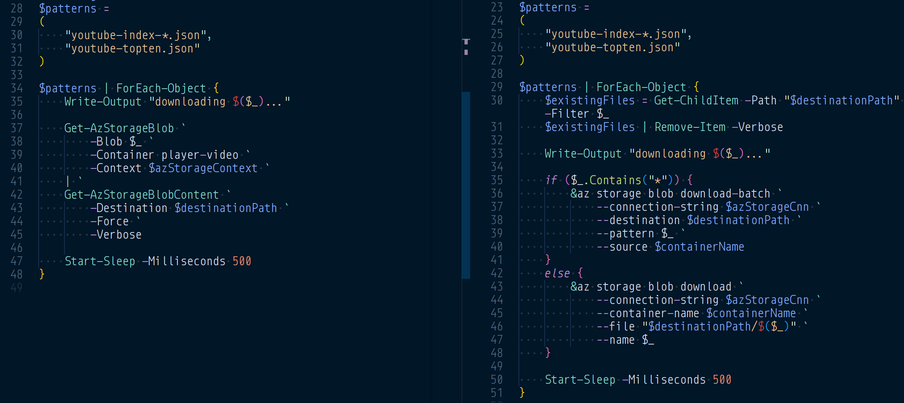

---json
{
  "documentId": 0,
  "title": "studio status report: 2024-05",
  "documentShortName": "2024-06-02-studio-status-report-2024-05",
  "fileName": "index.html",
  "path": "./entry/2024-06-02-studio-status-report-2024-05",
  "date": "2024-06-03T01:59:58.033Z",
  "modificationDate": "2024-06-03T01:59:58.033Z",
  "templateId": 0,
  "segmentId": 0,
  "isRoot": false,
  "isActive": true,
  "sortOrdinal": 0,
  "clientId": "2024-06-02-studio-status-report-2024-05",
  "tag": "{\n  \"extract\": \"month 05 of 2024 was about not releasing the new YouTube b-roll player on kintespace.com This month-05 report is late because of day-job drama around meeting deadlines. The day-job is back in the foreground as it plays a significant role in an upcoming St…\"\n}"
}
---

# studio status report: 2024-05

## month 05 of 2024 was about _not_ releasing the new YouTube b-roll player on kintespace.com

This month-05 report is late because of day-job drama around meeting deadlines. The day-job is back in the foreground as it plays a significant role in an upcoming Studio release: `SonghayCore` version 6.1.2 [PR [#171](https://github.com/BryanWilhite/SonghayCore/pull/171)]. This release of `SonghayCore` will:

- mark `ActivitiesGetter` and `ProgramArgs` obsolete, indicating that the Songhay Activity architecture will depend on Microsoft’s .NET Generic Host [📖 [docs](https://learn.microsoft.com/en-us/dotnet/core/extensions/generic-host)] which has been available since .NET 6.0 ([2021](https://en.wikipedia.org/wiki/.NET))
- translate the conventions and extension methods of `ProgramArgs` (primarily) to Microsoft’s `IConfiguration` subsystem (see “[Configuration providers in .NET](https://learn.microsoft.com/en-us/dotnet/core/extensions/configuration-providers)”).
- add extension methods for `JsonNode` [📖 [docs](https://learn.microsoft.com/en-us/dotnet/api/system.text.json.nodes.jsonnode?view=net-8.0)]

Again, I trust in Microsoft to not make debilitating breaking changes or completely abandoning the .NET Generic Host. Positioning `SonghayCore` so close to the .NET Generic Host is major move that could stabilize working with the `SonghayCore` for years to come. As the selected notes below will indicate, this month marks a revelation sitting before me in plain sight:

>`IConfiguration` \[📖 [docs](https://learn.microsoft.com/en-us/dotnet/api/microsoft.extensions.configuration.iconfiguration?view=net-8.0) \] is the cross-platform central ‘hub’ for initial app input.

My serious work with the .NET Generic Host helped me to finally see what is so fundamental about `IConfiguration`. Here are the other things that went on in month 05, visualized by Obsidian:

<div style="text-align:center">


</div>

Selected notes follow:

## [[Songhay Publications|Publications]]: someone has list of favorite [[Web Component]] libraries

>### The single responsibility principle
>
>My favourite web components aren’t all-singing, all-dancing powerhouses. Rather they do one thing, often a very simple thing.
>
>Here are some examples:
>
>- Jason’s [`aria-collapsable`](https://github.com/jgarber623/aria-collapsible) for toggling the display of one element when you click on another.
>- David’s [`play-button`](https://github.com/daviddarnes/play-button) for adding a play button to an `audio` or `video` element.
>- Chris’s [`ajax-form`](https://gomakethings.com/html-web-components/) for sending a form via Ajax instead of a full page refresh.
>- Jim’s [`user-avatar`](https://blog.jim-nielsen.com/2023/html-web-components-an-example/) for adding a tooltip to an image.
>- Zach’s [`table-saw`](https://github.com/zachleat/table-saw) for making tables responsive.
>
>All of those are [HTML web components](https://adactio.com/journal/20618) in that they _extend_ your existing markup rather than JavaScript web components that are used to _replace_ HTML. All of those are also unambitious by design. They each do one thing and one thing only.
>
>—“[My approach to HTML web components](https://adactio.com/journal/21078)”
>

## [[dotnet|.NET]]: there is no longer a need for `dotnet-outdated`

I have been informed “[.NET Core - View outdated packages](https://bartwullems.blogspot.com/2024/05/net-core-view-outdated-packages.html)”:

```powershell
dotnet list package --outdated
```

I ignorantly assume this option was added to `dotnet list package` \[📖 [docs](https://learn.microsoft.com/en-us/dotnet/core/tools/dotnet-list-package) \] for [[dotnet|.NET 8.0]]—maybe [[dotnet|.NET 7.0]].

## [[Songhay System]]: International Conference Alerts 🛫

>International Conference Alerts offers instant updates on the latest upcoming international conferences as per topic, month, and country. Get comprehensive details about the well-known conferences, seminars, and workshops occurring worldwide. Meet and interact with eminent researchers and boost your knowledge in the domain of interest. Connect with first-class minds and help modern minds to impart the latest knowledge about a topic. International Conference Alerts provides a free subscription to its users with email notifications about upcoming medical conferences, engineering conferences, business and economics conferences, science and education conferences, and various other conferences.
>
>—<https://internationalconferencealerts.com/>
>

## “Agnostic Render Mode” for [[Blazor]] Components

>With the introduction of render modes in .NET 8, we get a lot more flexibility for Blazor applications compared to previous versions.
>
>For example, we can implement an entirely server-rendered web application without any interactivity. Or we can mix and match Blazor Server and Blazor WebAssembly interactivity in a single application.
>
>To allow for a flexible architecture, I highly recommend setting Blazor components to render mode agnostic.
>
>What does that mean? It means that we want to avoid setting the interactivity type inside a lower-level component. Instead, ==we want to set the render mode when using the component inside a higher-level component==.
>
>This allows a component to be used as part of a Blazor Server and Blazor WebAssembly interactivity application.
>
>—[Claudio Bernasconi](https://www.telerik.com/blogs/blazor-basics-9-best-practices-building-blazor-web-applications)
>

## [[Songhay Publications]]: the Popover <acronym title="Application Programming Interface">API</acronym>has become a standard #day-job

>The **Popover API** provides developers with a standard, consistent, flexible mechanism for displaying popover content on top of other page content. Popover content can be controlled either declaratively using HTML attributes, or via JavaScript.
>
>—“[Popover API](https://developer.mozilla.org/en-US/docs/Web/API/Popover_API)”
>

## [[dotnet|PowerShell]]: the specific differences between `module-Az` and direct-to-[[Azure]] <acronym title="Command Line Interface">CLI</acronym>scripting

`Get-AzContext` provides an explicit way to check for authenticated [[Azure]] login credentials while I failed to find an [[Azure CLI]] equivalent:

```powershell
$azContext = Get-AzContext

if ($null -eq $azContext) {
    Write-Warning "The expected Azure Context is not here. Run ``Connect-AzAccount``? Exiting script."
    exit
}
```

`Get-AzStorageBlob` supports wildcards while `az storage blob download-batch` has to be called for this case instead of just `az storage blob download`:



However, both `az storage blob download*` commands expect to write directly to disk while `Get-AzStorageBlob` needs `Get-AzStorageBlobContent` piped in for this.

>[!important]
>The greatest weakness in `module-Az` scripting is the loss of <acronym title="JavaScript Object Notation">JSON</acronym>-output by default 😐 which is the heart and soul of the [[Azure CLI]].

## [[Windows]]: “Microsoft Confirms it will NOT Fix KB5034441 Error 0x80070643 on Windows 10”

Effectively a followup to [[2024-01-31#hardware Windows 10 Update Error(`0x80070643`)|my note on month 01]]:

<div style="text-align:center">

<figure>
    <a href="https://www.youtube.com/watch?v=VrSD5Bbm6Bk">
        
    </a>
    <p><small>Microsoft Confirms it will NOT Fix KB5034441 Error 0x80070643 on Windows 10</small></p>
</figure>

</div>

## [[dotnet|.NET]]: <acronym title="Application Programming Interface">API</acronym>guidance: “Don’t use 404 for Not Found”

>A common practice when you design REST APIs is to return a 404 Not Found when a resource doesn’t exist. As I’ve indicated before, the caveat is that most view a resource as explicitly being a record in a database.
>
>The advice in the blog post discusses consistency in a distributed system. The problem is that we’re talking about resources as entities, and in the example given, two systems communicate by calling each other via an HTTP API. The example is very context-specific about the author’s experience and how the system was designed.
>
>Given the author’s context, this entire topic can get very opinionated, and I don’t entirely disagree. However, like I often say, some problems you have don’t need solutions; you just need not have the problem in the first place.
>
>“If you treat 404 as success”. This is the root of the problem. You could have your system return a 410 Gone, which was recommended, but if you treat that as success, you’re in the same situation.
>
>—“[How to (and how not to) design REST APIs](https://codeopinion.com/how-to-and-how-not-to-design-rest-apis/)”
>

## [[Azure]]: “Azure SQL and Azure Functions: Integration with SQL bindings | OD131”

The speaker’s strongest point is that there is way to quickly set up a secure <acronym title="Application Programming Interface">API</acronym>in front of [[Microsoft SQL Server]]:

<div style="text-align:center">

<figure>
    <a href="https://www.youtube.com/watch?v=Iip8zWGn7Ew">
        
    </a>
    <p><small>Azure SQL and Azure Functions: Integration with SQL bindings | OD131</small></p>
</figure>

</div>

Here are few remarks:

- this looks like we would be using the repository pattern over a <acronym title="Representational State Transfer">REST</acronym><acronym title="Application Programming Interface">API</acronym>?
- returning arrays from <acronym title="Application Programming Interface">API</acronym>endpoints is considered not a great thing to do
- will it return `401` for empty arrays?

And, down in the weeds 🐜, yes there is support for query strings \[📖 [docs](https://learn.microsoft.com/en-us/azure/azure-functions/functions-bindings-azure-sql-input?tabs=isolated-process%2Cnodejs-v4&pivots=programming-language-csharp#http-trigger-get-row-by-id-from-query-string) \] with the magic `Query`, um, string. And routes \[📖 [docs](https://learn.microsoft.com/en-us/azure/azure-functions/functions-bindings-azure-sql-input?tabs=isolated-process%2Cnodejs-v4&pivots=programming-language-csharp#http-trigger-get-multiple-rows-from-route-parameter) \] are supported as well—which is another way of informing me that `HttpTrigger` \[📖 [docs](https://learn.microsoft.com/en-us/azure/azure-functions/functions-bindings-http-webhook-trigger?tabs=python-v2%2Cisolated-process%2Cnodejs-v4%2Cfunctionsv2&pivots=programming-language-csharp) \] has a `Route` parameter.

## [[SQL Azure]] is previewing support for regular expression functions

<div style="text-align:center">

<figure>
    <a href="https://www.youtube.com/watch?v=CRRCp-2JT-w">
        
    </a>
    <p><small>Introducing Regular Expressions (Regex) support in Azure SQL Database | Data Exposed</small></p>
</figure>

</div>

>The Regex feature in Azure SQL DB follows the **POSIX** standard and is compatible with the standard regex syntax and supports a variety of regex functions, such as **REGEXP_LIKE, REGEXP_COUNT, REGEXP_INSTR, REGEXP_REPLACE,** and **REGEXP_SUBSTR**. The feature also supports case sensitivity, character classes, quantifiers, anchors, and capturing groups. The feature is available for all Azure SQL DB service tiers and offerings.
>
>—“[Introducing Regular Expression (Regex) Support in Azure SQL DB](https://devblogs.microsoft.com/azure-sql/introducing-regular-expression-regex-support-in-azure-sql-db/)”
>

## [[Google]]: Dart supports [[WebAssembly]]

>Today, we’re delighted to announce complete support for WebAssembly (Wasm) is available for [Flutter Web apps](https://docs.flutter.dev/platform-integration/web/wasm) with the latest Flutter 3.22 stable release!
>
>—“[Announcing Dart 3.4](https://medium.com/dartlang/dart-3-4-bd8d23b4462a)”
>

## [[Songhay Core (C♯)]]: #day-job breakthrough

- [x] add test coverage to `JsonNodeExtensions` 🔬🚜✨
- [x] make remarks about `Meziantou.Extensions.Logging.Xunit` 📦👍

### `Meziantou.Extensions.Logging.Xunit` 📦👍

The 2023 Gérald Barré article, “[How to write logs from ILogger to xUnit.net ITestOutputHelper](https://www.meziantou.net/how-to-view-logs-from-ilogger-in-xunitdotnet.htm)” introduces `Meziantou.Extensions.Logging.Xunit` 📦 \[🔗 [NuGet](https://www.nuget.org/packages/Meziantou.Extensions.Logging.Xunit) \] in the context of the [[ASP.NET]] `WebApplicationFactory`. This distracted me from the following simplicity:

```csharp
using Meziantou.Extensions.Logging.Xunit;
using Microsoft.Extensions.Logging;

namespace Songhay.Tests.Extensions;

// ReSharper disable once InconsistentNaming
public class ILoggerExtensionsTests
{
    public ILoggerExtensionsTests(ITestOutputHelper helper)
    {
        _helper = helper;
        _loggerProvider = new XUnitLoggerProvider(helper);
    }

    [Fact]
    public void LogTraceDataTypeAndValue_Test()
    {
        ILogger logger = _loggerProvider.CreateLogger(nameof(LogTraceMethodCall_Test));
        MyRecord data = new();
        logger.LogTraceDataTypeAndValue(data);
    }

    record struct MyRecord
    {
        public MyRecord() { }
        public string One { get; init; } = "one point eight";
        public string Two { get; init; } = "two";
        public DateTime Stamp {get; init; } = DateTime.Now;
    }

    readonly ITestOutputHelper _helper;
    readonly XUnitLoggerProvider _loggerProvider;
}
```

I have been waiting for this line for years:

```csharp
_loggerProvider = new XUnitLoggerProvider(helper);
```

This is [[xUnit.net]] test-driven encouragement to start developing with `ILogger` sooner rather than hanging on to `ITestOutputHelper` ‘logging’ for more testing later.

## the [[dotnet|.NET]] `ILogger` interface and the Songhay Activity `IActivity`

<https://github.com/BryanWilhite/SonghayCore/issues/170>🐙🐈‍⬛

The `ILogger` interface (and the ecosystem built around it)has been mature enough to eliminate direct concern for `TraceSource`, coming from `IActivity` extensions. This means:

- [ ] remove `Songhay.Extensions.IActivityExtensions.StartConsoleActivity` 🚜🔥
- [ ] remove all `Songhay.Extensions.IActivityExtensions.StartActivity*` methods 🚜🔥

## the [[dotnet|.NET]] Hosted Service (`IHostedService`) and the Songhay Activity (`IActivity`)

<https://github.com/BryanWilhite/SonghayCore/issues/169>🐙🐈‍⬛

The Host Service and the Activity should work together:

>[!important]
>The Songhay Activity depends on the configuration/input and invocation of the `IConfiguration` interface which is provided by the [[dotnet|.NET]] Hosted Service (and [[ASP.NET]] of course).
>

It follows that any feature previously developed for the Songhay Activity around configuration/input and invocation should be retired. This means:

- [ ] remove all `Songhay.Extensions.IActivityExtensions.ToActivity*` methods 🚜🔥
- [ ] remove `Songhay.Extensions.IActivityExtensions.WithConfiguration` 🚜🔥
- [ ] add `Songhay.Hosting.DefaultHostedService` 🚜✨

### the Songhay `ActivitiesGetter` class is gone 🚜🔥 #to-do

The built-in <acronym title="Dependency Injection">DI</acronym>features of the [[dotnet|.NET]] Generic Host totally eliminates the . The very old design goal to load Activity assemblies from disk via reflection has fallen away. This means that command-line `args` can specify the name of an Activity type compiled in the assembly and the wonderfully elaborate system [[Microsoft]] built around `.AddCommandLine(args)` \[📖 [docs](https://learn.microsoft.com/en-us/dotnet/api/microsoft.extensions.configuration.commandlineconfigurationextensions.addcommandline?view=net-8.0) \] can load `args`-based key-value pairs into the conventional `IConfiguration` \[📖 [docs](https://learn.microsoft.com/en-us/dotnet/api/microsoft.extensions.configuration.iconfiguration?view=net-8.0) \] assigned to the command line.

This `IHostedService` \[🔗 [GitHub](https://github.com/dotnet/runtime/blob/9e6ba1f68c6a9c7206dacdf1e4cac67ea19931eb/src/libraries/Microsoft.Extensions.Hosting.Abstractions/src/IHostedService.cs) \] is loaded (perhaps) like this:

```csharp
IHostBuilder builder = Host.CreateDefaultBuilder(args);

builder.ConfigureServices((hostContext, services) =>
{
    string serviceName = hostContext.Configuration["service"];

    services.AddLogging();

    switch (serviceName)  
    {  
        case "MyHostedService":  
            services.AddScoped<IRepositoryA, RepositoryA>();
            services.AddHostedService<MyHostedService>();
            break;

        case "MyOtherHostedService":
            services.AddScoped<IRepositoryB, RepositoryB>();
            services.AddHostedService<MyOtherHostedService>();
            break;
    }
});

IHost host = builder.Build();
host.Run();
```

This `switch` statement effectively replaces the `ActivitiesGetter` concept. The `Host.CreateDefaultBuilder` method \[📖 [docs](https://learn.microsoft.com/en-us/dotnet/api/Microsoft.Extensions.Hosting.Host.CreateDefaultBuilder?view=net-6.0) \] can load up to four different `IConfiguration` instances. One of these is for command-line `args`. I am very motivated to assert that these patterns from [[Microsoft]] eliminate the need for my `ProgramArgs` concept which has been propagating deeply into business logic 🐭🕳.

The code sample above is based on this little <acronym title="Proof of Concept">POC</acronym>sketch:

```csharp
using Microsoft.Extensions.Hosting;

namespace Songhay.Tests;

public class GenericHostTests
{
    [Theory]
    [InlineData("--service", "MyHostedService")]
    public void ShouldReadArgs(params string[] args)
    {
        IHostBuilder builder = Host.CreateDefaultBuilder(args);

        builder.ConfigureServices((hostContext, services) =>
        {
            string serviceName = hostContext.Configuration["service"];

            switch (serviceName)
            {
                case "MyHostedService":
                    break;
                default:
                    Assert.Fail();
                    break;
            }
        });

        IHost _ = builder.Build();
    }
}
```

## [[Microsoft]] has been all-in on [[React Native]]

>React Native is an [open-source](https://github.com/facebook/react-native) mobile application framework created by Facebook. It is used to develop applications for Android, iOS, Web and UWP (Windows) providing native UI controls and full access to the native platform. Working with React Native requires an understanding of JavaScript fundamentals.
>
>For more general information about React, see the [React overview](https://learn.microsoft.com/en-us/windows/dev-environment/javascript/react-overview) page.
>
>—“[Get started build a desktop app with React Native for Windows](https://learn.microsoft.com/en-us/windows/dev-environment/javascript/react-native-for-windows)”
>

<div style="text-align:center">

<figure>
    <a href="https://www.youtube.com/watch?v=639DW0kN28w">
        
    </a>
    <p><small>React Native at Scale: How Microsoft is betting big on React Native to target BILLIONS of users</small></p>
</figure>

</div>

>You probably know by now that React Native isn’t just for mobile anymore. Thanks to the collaboration between Microsoft and Meta, you can use React Native to target Windows, macOS and mobile.
>
>—“[React Native at Scale: How Microsoft is betting big on React Native to target BILLIONS of users – Steven Moyes, Slobo Stipic, Shiven Mian | React Native EU 2022](https://devblogs.microsoft.com/react-native/2022-09-02-rneu-microsoft-billions/)”
>

## [[WebAssembly]]: “WebAssembly: A promising technology that is quietly being sabotaged”

>The major innovation (or rather regression, as we will see) of WASI 0.2 (also called `wasip2` or `WASI preview 2`) was the [Component Model](https://component-model.bytecodealliance.org/).
>
>The Component model is an attempt at solving the composition of any unit of computing in an universal way.
>
>What does that even mean? It means that the scope of WASI has shifted from calling language `B` from language `A` to solving something abstract that nobody has asked for.
>
>—“[WebAssembly: A promising technology that is quietly being sabotaged](https://kerkour.com/webassembly-wasi-preview2)”
>

## [[dotnet|.NET]]: `IHostedService` is injected as a singleton and expects its dependencies to _not_ be ‘scoped’ #day-job #make-blog-post

The following error message characterizes this expectation:

```console
System.AggregateException : Some services are not able to be constructed (Error while validating the service descriptor 'ServiceType: Microsoft.Extensions.Hosting.IHostedService Lifetime: Singleton ImplementationType: Songhay.Player.MyJob.Shell.Services.MyManagerHostedService': Cannot consume scoped service 'Songhay.Player.Abstractions.IMyManager' from singleton 'Microsoft.Extensions.Hosting.IHostedService'.) 

---- System.InvalidOperationException : Error while validating the service descriptor 'ServiceType: Microsoft.Extensions.Hosting.IHostedService Lifetime: Singleton ImplementationType: Songhay.Player.MyJob.Shell.Services.MyManagerHostedService': Cannot consume scoped service 'Songhay.Player.Abstractions.IMyManager' from singleton 'Microsoft.Extensions.Hosting.IHostedService'. 

-------- System.InvalidOperationException : Cannot consume scoped service 'Songhay.Player.Abstractions.IMyManager' from singleton 'Microsoft.Extensions.Hosting.IHostedService'. 
```

This error did not show until manipulation [like the following](https://stackoverflow.com/a/58106233/22944) ‘provoked’ it:

```csharp
builder.ConfigureHostConfiguration(builder =>
{
    builder.AddCommandLine(new[] {"--ENVIRONMENT", Environments.Development});
});
```

Weird 😐

## sketching out development projects

The current, unfinished public projects on GitHub:

- replacing the Angular app in `http://kintespace.com/player.html` with a Bolero app 🚜🔥 depends on:

  - releasing YouTube b-roll player (based on `Songhay.Player.YouTube` [release 6.3.1](https://github.com/users/BryanWilhite/projects/29)) on kintespace.com
  - starting on an eleventy version of of the kintespace.com home/splash page
  - starting on a Bolero version of the Songhay Publications Index
- completing the `Songhay.Publications` 6.1.0 📦🚀 [project](https://github.com/users/BryanWilhite/projects/24)
- start the “`Songhay.Publications.Models` 6.0.0” 📦🚀 [project](https://github.com/users/BryanWilhite/projects/23/views/1)

The proposed project items:

- add Entity Framework (over SQLite) features to `Songhay.Publications`
- generate Publication indices from SQLite for `Songhay.Publications.KinteSpace`
- generate a new repo with proposed name, `Songhay.Modules.Bolero.Index` ✨🚧 and add a GitHub Project
- switch Studio from Material Design to Bulma 💄 ➡️ 💄✨

<https://github.com/BryanWilhite/>
