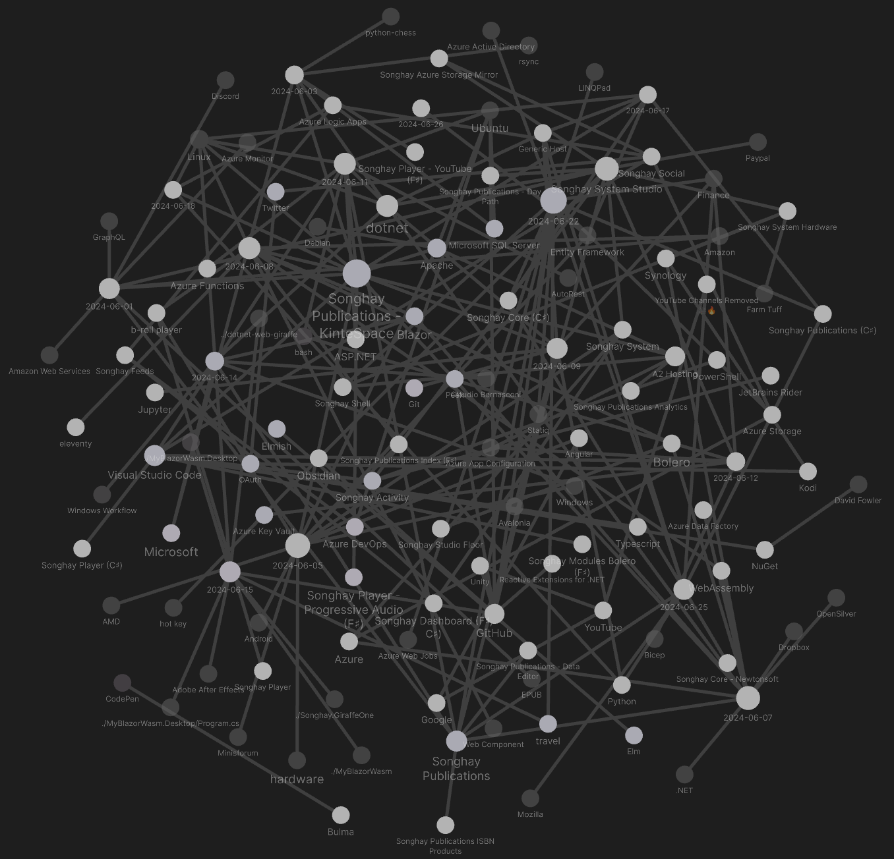

---json
{
  "documentId": 0,
  "title": "studio status report: 2024-06",
  "documentShortName": "2024-06-26-studio-status-report-2024-06",
  "fileName": "index.html",
  "path": "./entry/2024-06-26-studio-status-report-2024-06",
  "date": "2024-06-26T22:40:28.070Z",
  "modificationDate": "2024-06-26T22:40:28.070Z",
  "templateId": 0,
  "segmentId": 0,
  "isRoot": false,
  "isActive": true,
  "sortOrdinal": 0,
  "clientId": "2024-06-26-studio-status-report-2024-06",
  "tag": "{\n  \u0022extract\u0022: \u0022month 05 of 2024 was about releasing the new YouTube b-roll player on kintespace.com and restarting work on Songhay Publications The Obsidian graph for this month is even more tangled because I have added Studio topics to the mix:  Obsidian graph for this\\u2026\u0022\n}"
}
---

# studio status report: 2024-06

## month 05 of 2024 was about releasing the new YouTube b-roll player on kintespace.com and restarting work on Songhay Publications

The Obsidian graph for this month is even more tangled because I have added Studio topics to the mix:

<div style="text-align:center">



</div>

The `Songhay Publications - KinteSpace` topic has literally been turned on 💡, lighting up many days of the month:

<div style="text-align:center">


</div>

These Obsidian highlights indicate that `Songhay.Player.YouTube` [release 6.3.1](https://github.com/users/BryanWilhite/projects/29) is finally complete. But I still cannot declare that kintespace.com is Angular-JS-free because the YouTube thumbnail experience is still running, linked to the kintespace.com home page. Getting ‘an eleventy version of the kintespace.com home/splash page’ (as mentioned below in “sketching out development projects”) would finally free me from Google engineering ideas long abandoned by Google.

In more Publications news, the `Songhay.Publications` 6.1.0 📦🚀 [project](https://github.com/users/BryanWilhite/projects/24) is also completed! I am now living in the Studio with Microsoft’s .NET Generic Host [📖 [docs](https://learn.microsoft.com/en-us/dotnet/core/extensions/generic-host)]! My introductory remarks about the .NET Generic Host came [at the beginning of this month](http://songhayblog.azurewebsites.net/entry/2024-06-02-studio-status-report-2024-05).

The “`Songhay.Publications.Models` 6.0.0” 📦🚀 [project](https://github.com/users/BryanWilhite/projects/23/views/1) was not completed. It was cancelled. My selected notes of the month should cover this below:

## [[GraphQL]]: “Why, after 6 years, I’m over GraphQL”

>It was obvious from GraphQL’s beginning that exposing a **query language** to untrusted clients increases the attack surface of the application. Nevertheless, the variety of attacks to consider was even broader than I imagined, and mitigating them is quite a burden. Here’s the worst I’ve had to deal with over the years…
>
>—<https://bessey.dev/blog/2024/05/24/why-im-over-graphql/>
>

## [[Microsoft SQL Server]]: proof that <acronym title="SQL Server Management Studio">SSMS</acronym>has at least one dedicated [[Microsoft]] employee 👵

They did not even explain what it is. Weeds, immediately:

<div style="text-align:center">

<figure>
    <a href="https://www.youtube.com/watch?v=KujUVbj1In4">
        
    </a>
    <p><small>What’s new in SSMS 20 and what’s next in version 21 | Data Exposed</small></p>
</figure>

</div>

## [[Entity Framework|EF Core 8]] saves arrays as <acronym title="JavaScript Object Notation">JSON</acronym>strings

>Well, for databases that do support array types, like PostreSQL, EF Core 8 uses these types directly. But for most databases that don’t support array types natively, EF Core 8 automatically uses JSON arrays instead. This is essentially transparent to the application developer using EF Core 8; you just write your LINQ query, and EF Core 8 uses the most appropriate translation for the database you are targeting.
>
>—“[A beginner’s guide to mapping arrays in EF Core 8](https://devblogs.microsoft.com/dotnet/array-mapping-in-ef-core-8/)”
>

## after ‘negotiation,’ [[Windows|Windows 11]] will only support [[Android]] games 😐

>Out of the box, your [Windows 11](https://androidauthority.com/windows-11-2738763/) computer does not have the capability to install Android apps and games. And even though Microsoft once offered the Windows Subsystem for Android as an official way to run Android apps, that’s no longer the case these days. The company sunset the feature in March 2024, with support only guaranteed for existing users for the next year.
>
>…
>
>If you’re looking to install Android apps on your Windows PC for gaming alone, there’s good news. You can simply install Google’s official Play Games Beta and get access to dozens of the most popular games without the risk of installing third-party software.
>
>—“[How to run Android apps on Windows 11: Official and APK methods](https://www.androidauthority.com/android-apps-on-windows-11-3048569/)”
>

## [[dotnet|.NET]]: in C♯ 12, `using` can be used to alias any type

>C# 12 introduced the ability to _alias any type_ with the `using` directive. This feature allows you to specify aliases that map to other types. This includes tuple types, pointer types, array types, and even non-open generic types, all of which are then available in your code. This feature is especially useful:
>
>- When working with long or complex type names.
>- When you need to disambiguate types and resolve potential naming conflicts.
>- When defining value tuple types that you intend to share in an assembly.
>- When you want to add clarity to your code by using more descriptive names.
>
>—“[Refactor your code using alias any type](https://devblogs.microsoft.com/dotnet/refactor-your-code-using-alias-any-type/)”
>

## [[Azure]]: “Data Factory in Microsoft Fabric” appears to be the (premium?) replacement of [[Azure Data Factory]]

>Data Factory in Microsoft Fabric is the next generation of Azure Data Factory which provides cloud-scale data movement and data transformation services that allow you to solve the most complex ETL scenarios. It's intended to make your experience easy to use, powerful, and truly enterprise-grade. This article compares the differences between Azure Data Factory and Data Factory in Microsoft Fabric.
>
>—“[Getting from Azure Data Factory to Data Factory in Microsoft Fabric](https://learn.microsoft.com/en-us/fabric/data-factory/compare-fabric-data-factory-and-azure-data-factory)”
>
## [[Songhay Publications]]: “Amazon buys Indian video streaming service MX Player”

>In MX Player, Amazon gets a distribution and marketing partner that can help make the e-commerce platform more popular and trustworthy to audiences in the smaller Indian cities and towns, a source familiar with Amazon’s strategy told TechCrunch. MX Player is especially popular among such demographic groups, and Amazon’s e-commerce service has long only been popular among the urban city consumers. Amazon will retain the MX Player branding, the source said.
>
>—“[Amazon buys Indian video streaming service MX Player](https://techcrunch.com/2024/06/06/amazon-buys-indian-video-streaming-service-mx-player/)”
>

## [[.NET]]: is this the first time I am mentioning [[OpenSilver]]❔ 

This is the <acronym title="Extensible Application Markup Language">XAML</acronym>-based, [[WebAssembly]] alternative to [[Blazor]] _and_ [[Bolero]]:

>Migrate to OpenSilver, the plugin-free, open-source framework that uses WebAssembly, C#, XAML, and .NET to modernize your client-side web development—without starting from scratch.
>
>—<https://opensilver.net/>
>

## [[Songhay Publications|Publications]]: “Practicing Typography Basics” video series #to-do 

>I recently recorded [a short video series that Adobe is now releasing on YouTube](https://www.youtube.com/watch?v=hkOqk8kf1xk) as part of the _Foundations of Graphic Design_ series. In these videos, I cover making body text easy to read, catching attention with display text, guiding readers through information, and learning how typography feels.
>
>—“[Practicing Typography Basics](https://tbrown.org/notes/2024/01/02/practicing-typography-basics/)”
>

## [[Songhay Publications|Publications]]: “How I Choose Typefaces”

>Another thing I like to do to identify great typefaces is look closely at the letterforms to see if they mirror the message of the text. I wish I could remember where I read it, but I heard long ago that good typography should communicate what the text is saying before your brain actually reads the words.
>
>—“[How I Choose Typefaces](https://danmall.com/posts/how-i-choose-typefaces/)”
>

## [[Songhay Publications|Publications]]: “perfect” font fall-backs in <acronym title="Cascading Style Sheets">CSS</acronym>

>Unfortunately, this can also introduce another problem: content reflow and layout shifts. If the fallback font and the web font are not metrically compatible, this font-swapping behavior will cause text to shift and jump around on the page as it’s reset, hurting your cumulative layout shift (CLS) score. From an end user’s perspective, this can be disorienting, especially if they were already in the middle of reading a paragraph of text. And from a design perspective, it looks sloppy and inelegant.
>
>—“[Creating Perfect Font Fallbacks in CSS](https://www.aleksandrhovhannisyan.com/blog/perfect-font-fallbacks/)”
>

## [[Songhay Publications - KinteSpace|the kinté space]]: remember SoundFont files?

>This aim of this site is to provide high quality SoundFonts (virtual musical instruments in sf2 format) that can be played using a midi keyboard connected to a computer, tablet or smart phone. Emphasis has been placed on real or acoustic instruments particularly piano and other favourites for keyboard players (pads, strings, electric pianos, organs and orchestral) but some SoundFonts here also include high quality guitars, some synths and ethnic instruments. There are also some nice GM sets for playing general midi files. The SoundFont format sf2 is widely supported by lots of programs/apps and devices.
>
>—<https://sites.google.com/site/soundfonts4u/>
>

## [[Azure App Configuration]] is app configuration in the cloud 🌧 #day-job 

>Azure App Configuration provides a service to centrally manage application settings and feature flags. Modern programs, especially programs running in a cloud, generally have many components that are distributed in nature. Spreading configuration settings across these components can lead to hard-to-troubleshoot errors during an application deployment. Use App Configuration to store all the settings for your application and secure their accesses in one place.
>
>—“[What is Azure App Configuration?](https://learn.microsoft.com/en-us/azure/azure-app-configuration/overview)”
>

>[!important]
>[[Azure App Configuration]] is not an _alternative_ to [[Azure Key Vault]] it is a “complement.”

>App Configuration complements [Azure Key Vault](https://learn.microsoft.com/en-us/azure/key-vault/general/basic-concepts), which is used to store application secrets. App Configuration makes it easier to implement the following scenarios:
>
>- Centralize management and distribution of hierarchical configuration data for different environments and geographies
>- Dynamically change application settings without the need to redeploy or restart an application
>- Control feature availability in real-time
>

The following video shows (in between lengthy interactions with [[Bicep]]) how [[Azure App Configuration]] can _escalate_ to [[Azure Key Vault]]:

<div style="text-align:center">

<figure>
    <a href="https://www.youtube.com/watch?v=trOnDmetYLs">
        
    </a>
    <p><small>Azure App Configuration - Fundamentals</small></p>
</figure>

</div>

The following videos promise to show how feature-flagging works with [[Azure App Configuration]]:

<div style="text-align:center">

<figure>
    <a href="https://www.youtube.com/watch?v=zdkG30Eca9g">
        
    </a>
    <p><small>App Configuration in Azure and .NET 8 - [Feature Flags, Application Settings]</small></p>
</figure>

<figure>
    <a href="https://www.youtube.com/watch?v=9zxvtqLz2yM">
        
    </a>
    <p><small>Feature Flags with Azure App Configuration</small></p>
</figure>

</div>

## [[Songhay Publications (C♯)]]: SQLite CodeFirst should not be needed for modern [[Entity Framework]]

From the `README`:

>This project was started when there was .NET Full Framework and EF 6. EF 6 does not offer code first for SQLite and this library fills this gab. Nowadays there is .NET Core (or now just called .NET) and EF Core. EF Core supports code first and migrations for SQLite. ==If you use .NET Core 3 or above together with EF Core, there is no need for this library.==
>
>—<https://github.com/msallin/SQLiteCodeFirst#sqlite-codefirst>
>

The following line of code from “[Getting Started with EF Core](https://learn.microsoft.com/en-us/ef/core/get-started/overview/first-app?tabs=netcore-cli)” strongly suggests things should just work:

```csharp
// The following configures EF to create a Sqlite database file in the
    // special "local" folder for your platform.
    protected override void OnConfiguring(DbContextOptionsBuilder options)
        => options.UseSqlite($"Data Source={DbPath}");
```

## [[Songhay Core (C♯)]]: ✨ issues

### `IActivityWithTask*` should not inherit from `IActivity` 🔨🔥

I should have known for quite some time that using inheritance with interfaces defeats the purpose of enjoying working ‘horizontally’ (because of the C♯ feature of multiple interfaces applied to a class) instead of being trapped ‘vertically’ (because of inheritance).

This is issue [#172](https://github.com/BryanWilhite/SonghayCore/issues/172)

## [[travel]]: Singapore has a war on rats 🐭🧀

Joining Paris and New York:

<div style="text-align:center">

<figure>
    <a href="https://www.youtube.com/watch?v=Vlla6c7aTow">
        
    </a>
    <p><small>Singapore's War On Rats: Can These Rat Busting Solutions Work? </small></p>
</figure>

</div>

## [[Songhay Publications (C♯)]]: I am no longer convinced that a `Songhay.Publications.Models` 📦 is needed

As mentioned [[2023-09-26#Songhay Publications (C♯) and Songhay Modules Publications (F♯) on intimate terms?|last year]], getting rid of the dependency on [[Songhay Core - Newtonsoft]] went a long way toward making [[Songhay Publications (C♯)]] smaller. The ‘cost’ of an F♯ project referencing [[Songhay Publications (C♯)]] is not that high. The following may not apply to the world of F♯ in this Studio:

- `Songhay.Publications.Activities`
- `Songhay.Publications.*Utility`

For obfuscation reasons, it might be considered more ‘secure’ to separate out  `Songhay.Publications.Activities`  as these Activities would reveal over time what is happening on the server. An F♯ client-side Solution, without some kind of cool tree shaking, would drag along all of this server-side-intended (or desktop-intended) code #to-do 

I have closed the `Songhay.Publications.Models` 6.0.0 📦🚀 [project](https://github.com/users/BryanWilhite/projects/23).

## sketching out development projects

The current, unfinished public projects on GitHub:

- replacing the Angular app in `http://kintespace.com/player.html` with a Bolero app 🚜🔥 depends on:

  - ~~releasing YouTube b-roll player (based on `Songhay.Player.YouTube` [release 6.3.1](https://github.com/users/BryanWilhite/projects/29)) on kintespace.com~~
  - starting on an eleventy version of the kintespace.com home/splash page
  - starting on a Bolero version of the Songhay Publications Index
- ~~completing the `Songhay.Publications` 6.1.0 📦🚀 [project](https://github.com/users/BryanWilhite/projects/24)~~
- ~~start the “`Songhay.Publications.Models` 6.0.0” 📦🚀 [project](https://github.com/users/BryanWilhite/projects/23/views/1)~~

The proposed project items:

- add Entity Framework (over SQLite) features to `Songhay.Publications`
- generate Publication indices from SQLite for `Songhay.Publications.KinteSpace`
- generate a new repo with proposed name, `Songhay.Modules.Bolero.Index` ✨🚧 and add a GitHub Project
- switch Studio from Material Design to Bulma 💄 ➡️ 💄✨

<https://github.com/BryanWilhite/>
