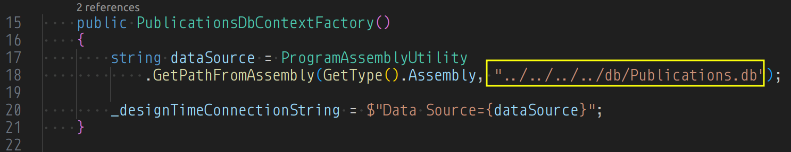
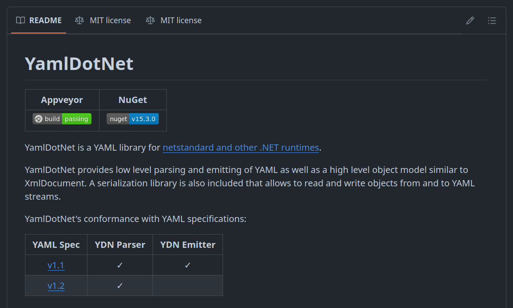
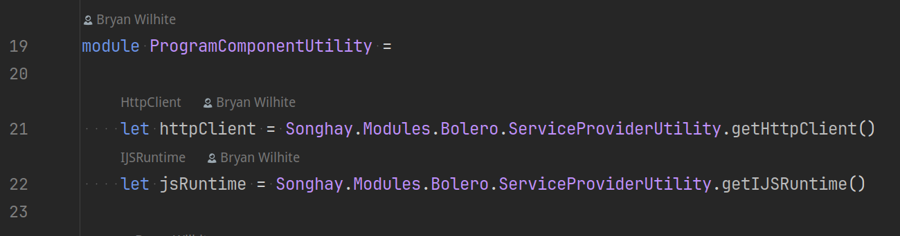
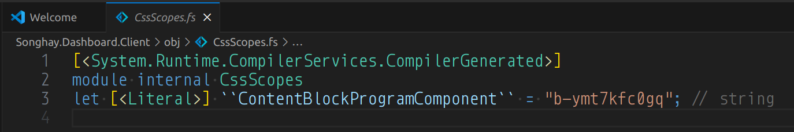

---json
{
  "documentId": 0,
  "title": "studio status report: 2024-07",
  "documentShortName": "2024-07-28-studio-status-report-2024-07",
  "fileName": "index.html",
  "path": "./entry/2024-07-28-studio-status-report-2024-07",
  "date": "2024-07-28T13:27:51.995Z",
  "modificationDate": "2024-07-28T13:27:51.995Z",
  "templateId": 0,
  "segmentId": 0,
  "isRoot": false,
  "isActive": true,
  "sortOrdinal": 0,
  "clientId": "2024-07-28-studio-status-report-2024-07",
  "tag": "{\n  \u0022extract\u0022: \u0022month 07 of 2024 was about returning to Entity Framework, inclusion of Obsidian in Publications work flow and \\u2018too many\\u2019 other interesting advances The Obsidian graph for this month looks very much like \\u2018too many\\u2019 interesting advances: Obsidian graph for \\u2026\u0022\n}"
}
---

# studio status report: 2024-07

## month 07 of 2024 was about returning to Entity Framework, inclusion of Obsidian in Publications work flow and ‘too many’ other interesting advances

The Obsidian graph for this month looks very much like ‘too many’ interesting advances:


I have opened the `Songhay.Publications.DataAccess` namespace which introduces modern, “code-first” Entity Framework _accretive_ migrations to my Studio. There is a `Publications.db` SQLite file that will track the Songhay Publications Index for kintespace.com. This is data that will back the Songhay Index Bolero app (`Songhay.Modules.Bolero.Index`❓) that is proposed below (see “sketching out development projects”). Notes below will go into detail on this (and a full Blog post is proposed).

`Songhay.Modules.Bolero` version 6.4.1 [📦 [NuGet](https://www.nuget.org/packages/Songhay.Modules.Bolero/)] was released this month which contains a far better understanding of how to expose Blazor services to F♯ functions (via the `ServiceProviderUtility`—see in excerpts below).

The biggest news (which is jampacked with interesting advances) is represented by a simple PowerShell script whipped up this month: `Convert-KinteProse-To-Markdown.ps1`. This script actually takes the old XHTML files from kintespace.com and converts them to Obsidian-friendly markdown. Converting HTML to markdown with `pandoc` was yet another non-trivial effort (I should have notes on this to show below). This conversion process is the first “real” sign that I am actually reviving/rebuilding/upgrading my Publications pipelines in my Studio 👏 I have decided to convert one file at a time and review the prose by hand to ensure some decent level of correctness ⏳ My 2024 article, “[Songhay Publications and the Concept of the Index](https://songhayblog.azurewebsites.net/entry/2020-12-24-songhay-publications-and-the-concept-of-the-index/),” should help to place what I am talking about here in the larger context. This article reminds us of my Publications schema: the `Segment`, the `Document` and the `Fragment`.

`Document` data shows up as the YAML front matter in the markdown files generated from my `Convert-KinteProse-To-Markdown.ps1` script. The `Fragment` concept gets ‘lost’ in the markdown prose. The `Segment` data takes us back to the Songhay Publications Index. This work is _finally_ underway. More details and better explanation later. It has been a long, miserable journey 👴👣 Here are the selected notes of the month:

## yes, `Songhay.Publications.DataAccess` should be moved into the [[Songhay Publications (C♯)]] Solution #to-do

Now that a substantial amount of ignorance around [[Entity Framework]] has (finally) been addressed, `PublicationsDbContextFactory` is what keeps the `Songhay.Publications.DataAccess` project in the [[Songhay Publications - KinteSpace|Songhay Publications: kinté space]] Solution.

It all boils down to this relative path, `"../../../../db/Publications.db"`:



Today, the suggestion is that this relative path to `Publications.db` should be replaced with an absolute path and stored in a conventional environment variable, say, `SONGHAY_PUBLICATIONS_DB_PATH`.

Moreover, this new absolute path should point to a location under the [[Songhay Azure Storage Mirror]] directory (or I could go back to the eldest `\dataRoot\publications` convention).

## [[dotnet|.NET]]: C♯13 will overload its `params`-based array signatures (`T[]`) with `ReadOnlySpan<T>`

This video has the news \[📹 [watch](https://youtu.be/O3hx6oPWzX8?t=539) \]:

<div style="text-align:center">

<figure>
    <a href="https://www.youtube.com/watch?v=O3hx6oPWzX8">
        
    </a>
    <p><small>What’s new in C# 13 | BRK186</small></p>
</figure>

</div>

Partner Software Engineer at Microsoft, Steven Toub, proposed this [in 2022](https://github.com/dotnet/runtime/issues/77873).

## [[Songhay Publications - KinteSpace|Songhay Publications: kinté space]]

### the `Songhay.Publications.KinteSpace/11ty` directory 🚜✨

The Publications `/11ty` directory represents the experiment to combine an [[Obsidian]] vault and an [[eleventy]] generator:


- [[eleventy]] will write static <acronym title="HyperText Markup Language">HTML</acronym> to the `/app-staging` directory
- the [[eleventy]] `/_data` directory will use static <acronym title="JavaScript Object Notation">JSON</acronym>, generated from a [[SQLite]] database in the `/db` directory (for now)

Now, the `/shell` folder might have ‘limited use’ because of setting up a temporary camp 🏕 under `Songhay.Publications.KinteSpace.Tests` (mentioned [[2024-07-02#Songhay Publications - KinteSpace Songhay Publications kinté space the next moves will be inside the test project 🔬✨|previously]]).

### what the `/11ty` directory looks in [[Obsidian]]

Only that `rasx57.md` ‘draft’ shows up in [[Obsidian]]:


- [[Obsidian]] might force me to convert <acronym title="JavaScript Object Notation">JSON</acronym> front matter to <acronym title="YAML Ain’t Markup Language">YAML</acronym>
- the front matter for [[Markdown]] files under `/poetry` could get complicated
- [[Markdown]] files under `/app` will be prose about [[Songhay Publications - KinteSpace|kintespace.com]] itself instead of the literary prose intended for the `/prose` directory
- the `/templates` folder might be able to serve double duty for [[eleventy]] and [[Obsidian]]

Welcome to the publishing business!

## [[dotnet|.NET]]: there is no `System.Yaml` namespace built by  [[Microsoft]]

Today, I ‘officially’ recognize that something like [[YamlDotNet]] is needed (even though it does not yet support [[dotnet|.NET 8.0]]—but does support `netstandard 2.x`):


<https://github.com/aaubry/YamlDotNet>

This ‘official’ recognition is important because the editing experience planned for [[Obsidian]] will require saving document front matter as <acronym title="YAML Ain’t Markup Language">YAML</acronym> instead of <acronym title="JavaScript Object Notation">JSON</acronym>.

## the [[Azure]] Pipelines task reference is full of deploy tasks 😐💡

Before this year, I would erroneously assume that the “[Azure Pipelines task reference](https://learn.microsoft.com/en-us/azure/devops/pipelines/tasks/reference/?view=azure-pipelines)” would exclusively full of build tasks. It’s been a while. Things have changed: there is an entire section dedicated to [deploy tasks](https://learn.microsoft.com/en-us/azure/devops/pipelines/tasks/reference/?view=azure-pipelines#deploy-tasks).

This Studio should incorporate the following [[Azure Pipelines]] deploy tasks #to-do (in decreasing level of immediate need):

- Azure Web App (`AzureWebApp@1`) \[📖 [docs](https://learn.microsoft.com/en-us/azure/devops/pipelines/tasks/reference/azure-web-app-v1?view=azure-pipelines) \]
- Azure Functions Deploy (`AzureFunctionApp@2`) \[📖 [docs](https://learn.microsoft.com/en-us/azure/devops/pipelines/tasks/reference/azure-function-app-v2?view=azure-pipelines) \]
- Azure CLI (`AzureCLI@2`) \[📖 [docs](https://learn.microsoft.com/en-us/azure/devops/pipelines/tasks/reference/azure-cli-v2?view=azure-pipelines) \]
- Azure PowerShell (`AzurePowerShell@5`) \[📖 [docs](https://learn.microsoft.com/en-us/azure/devops/pipelines/tasks/reference/azure-powershell-v5?view=azure-pipelines) \]

The following package tasks should be needed as well:

- npm (`Npm@1`) \[📖 [docs](https://learn.microsoft.com/en-us/azure/devops/pipelines/tasks/reference/npm-v1?view=azure-pipelines) \]
- NuGet (`NuGetCommand@2`) \[📖 [docs](https://learn.microsoft.com/en-us/azure/devops/pipelines/tasks/reference/nuget-command-v2?view=azure-pipelines) \]

I assert that [[Microsoft]] prioritizes [GitHub Actions](https://docs.github.com/en/actions) over [[Azure Pipelines]].

## [[Entity Framework]]: no, there is no provider for [[Azure Table Storage]]

Vickers himself [answers](https://github.com/dotnet/efcore/issues/18737#issuecomment-549471270) explicitly in 2019:

>We currently have no plans.

“[How to Access Azure Table Data Using Entity Framework](https://www.cdata.com/kb/tech/azure-ado-codefirst.rst)” says weird, 1990s shit like:

>Add a reference to `System.Data.CData.AzureTables.Entities.EF6.dll`, located in the lib -> 4.0 subfolder in the installation directory.

The largest [list of providers](https://learn.microsoft.com/en-us/ef/core/providers/?tabs=dotnet-core-cli) I can find (so far) is the 2024 list from [[Microsoft]]. I am surprised that the list of providers is not larger.

## [[Finance]]: “How Americans Are Paying For Vacation”

Spoiler: it’s loans.

<div style="text-align:center">

<figure>
    <a href="https://www.youtube.com/watch?v=frKtMYlcYKo">
        
    </a>
    <p><small>How Americans Are Paying For Vacation</small></p>
</figure>

</div>

## [[dotnet|.NET]]: when the `YamlDotNet` folks deserialize <acronym title="YAML Ain’t Markup Language">YAML</acronym>, they are boxing `IDictionary<object, object>` 🗃😐

I am sure there is some really cool and esoteric reason to box `IDictionary<object, object>` but my `YamlUtility.DeserializeYaml` make this news explicit:

```csharp
    public static IDictionary<object, object>? DeserializeYaml(string? yaml)
    {
        if (string.IsNullOrWhiteSpace(yaml)) return new Dictionary<object, object>();

        IDeserializer deserializer = new DeserializerBuilder().Build();
        IDictionary<object, object>? yO = deserializer.Deserialize(yaml) as IDictionary<object, object>;

        return yO;
    }
```

Now I can write `yO` like how I have written `jO`! This makes all the Kenyan supermodels cheer!

## [[Songhay Publications (C♯)]]: `MarkdownEntry.FrontMatter` should be of type `IDictionary<string, string>` ❓

The short answer is _no_. The reasoning behind doing this is to put `MarkdownEntry.FrontMatter` in a position where it can support <acronym title="JavaScript Object Notation">JSON</acronym> and <acronym title="YAML Ain’t Markup Language">YAML</acronym> front matter. But look closer at this <acronym title="YAML Ain’t Markup Language">YAML</acronym>:

```yaml
documentId: 9336
title: 'Ezrah Aharone: Africa without African Americans'
documentShortName: 
fileName: kp_aharone0.html
path: ./
templateId: 9059
segmentId: 4524
isRoot: true
isActive: true
sortOrdinal: 
clientId: 2006-08-10-20-03-40-IDAIACBBIDAJACBB-1
tag: 2011-07-Upgrade
endDate: 
inceptDate: 2006-08-10T19:49:39.0000000
modificationDate: 2011-07-12T16:35:16.6500000
```

Like <acronym title="JavaScript Object Notation">JSON</acronym>, <acronym title="YAML Ain’t Markup Language">YAML</acronym> is not just a bunch of strings. Like <acronym title="JavaScript Object Notation">JSON</acronym>, it has ‘types.’ <acronym title="YAML Ain’t Markup Language">YAML</acronym> has a [schema](https://yaml.org/spec/1.2-old/spec.html#Schema) concept which defines “tags” with names like “Boolean,” “Integer” and “Floating Point”—and these names come from “[JSON Schema](https://yaml.org/spec/1.2-old/spec.html#id2803231)”—which appears to be the <acronym title="YAML Ain’t Markup Language">YAML</acronym> way of saying that it is ‘related’ to <acronym title="JavaScript Object Notation">JSON</acronym>.

Getting back to [[Songhay Publications (C♯)]], the bottom line is that `IDictionary<string, object>` is in the position to support <acronym title="YAML Ain’t Markup Language">YAML</acronym> and <acronym title="JavaScript Object Notation">JSON</acronym> but I am not attracted to boxing a bunch of stuff in `object`. This aversion leads me to one conclusion: ‘extend’ <acronym title="YAML Ain’t Markup Language">YAML</acronym> support _from_ the existing `JsonObject`. These ‘extensions’ would be in, um, extension methods such as:

- `IReadOnlyCollection<string>.ToFrontMatterLinesAndContentLines` and/or `FileInfo.ToFrontMatterLinesAndContentLines`
- `IReadOnlyCollection<string>.LookLikeJsonFrontMatter`
- `IReadOnlyCollection<string>.LookLikeYamlFrontMatter`
- `IReadOnlyCollection<string>.ToJsonString`
- `IReadOnlyCollection<string>.ToYamlString`
- `JsonObject.ToYamlFrontMatter` and/or `MarkDownEntry.ToYamlFrontMatter`

All of the proposed methods above are for _reading_ [[Songhay Publications|Publications]] markdown. The _line_ is the smallest unit of reading markdown. `ToFrontMatterLinesAndContentLines` revisits what is going on inside `MarkdownEntryExtensions.ToMarkdownEntry` which currently assumes that _all_ markdown “entries” contain <acronym title="JavaScript Object Notation">JSON</acronym> front matter #to-do

The challenge with `ToJsonString` and `ToYamlString` is dealing with the possible states of a collection of lines representing front matter (`FrontMatterLines`). These states are:

- <acronym title="JavaScript Object Notation">JSON</acronym> lines
- <acronym title="YAML Ain’t Markup Language">YAML</acronym> lines
- Unknown lines

The `LookLike*FrontMatter` methods will address these possibilities.

Finally, the `ToYamlFrontMatter` method is there to  ‘extend’ <acronym title="YAML Ain’t Markup Language">YAML</acronym> support _from_ the existing `JsonObject`.  Here are more design-related comments about this approach:

- as of this writing, there is no [[dotnet|.NET]] equivalent of `JsonElement` or `JsonObject` for <acronym title="YAML Ain’t Markup Language">YAML</acronym>: there is no `YamlObject` (and in [[YamlDotNet]] the closest definition I can find is the sub-atomic particle, `Mark` \[🔗 [GitHub](https://github.com/rtlayzell/yaml-dot-net/blob/master/YamlDotNet/Core/Mark.cs) \])
- because I am “brainwashed” by F♯, I am aware that primitive obsession in C♯ is a “bad” thing: so cramming <acronym title="YAML Ain’t Markup Language">YAML</acronym> in `string` and building on top it is not going to do it for me—I prefer to define front matter as `JsonObject` instead of just `string`

## yes, [[Obsidian]] can be used as a commanding platform

Do I write a bunch of Studio desktop apps in, say, [[Avalonia]], to get real work done? The short answer is, _not yet_. [[Obsidian]] can join [[Visual Studio Code]] as another customizable text editor that effectively serves as a “line of business” application just like a <acronym title="Windows Presentation Foundation">WPF</acronym> application from the turn of the century.

The [Shell commands plugin for Obsidian](https://github.com/Taitava/obsidian-shellcommands) looks like what I am looking for to get going #to-do The authors of this plugin are generous enough to refer to [similar tools](https://github.com/Taitava/obsidian-shellcommands#benefits-from-other-plugins) just in case it is not enough:

- <https://github.com/Vinzent03/obsidian-advanced-uri>
- <https://github.com/chetachiezikeuzor/cMenu-Plugin> #to-do
- <https://github.com/phibr0/obsidian-customizable-sidebar> #to-do
- <https://github.com/chhoumann/quickadd>
- <https://github.com/konodyuk/obsidian-text-expander> #to-do

## [[Songhay Publications - KinteSpace|the kinté space]]: “Kids Who Get Smartphones Earlier Become Adults With Worse Mental Health”

>Why would this be? What changed in the early 2010s that could have rapidly reduced the mental health of teens around the world, with a bigger impact on girls? At the [After Babel Substack](https://jonathanhaidt.substack.com/archive), we have [argued](https://jonathanhaidt.substack.com/p/mental-health-liberal-girls) that the sudden switch of [teen social life](https://jonathanhaidt.substack.com/p/do-the-kids-think-theyre-alright) from [flip phones](https://jonathanhaidt.substack.com/p/why-some-researchers-think-im-wrong) (which are designed for communication) to smartphones (which enabled continuous access to social media and much higher levels of phone addiction), is [the major cause](https://jonathanhaidt.substack.com/p/social-media-mental-illness-epidemic), though not the only one. There are unique factors at work in each country, but we know of [no alternative](https://jonathanhaidt.substack.com/p/academic-pressure-social-media) that [can explain](https://jonathanhaidt.substack.com/p/why-some-researchers-think-im-wrong) the _synchronized, gendered, and global decline_ in teen mental health.
>
>—“[Kids Who Get Smartphones Earlier Become Adults With Worse Mental Health](https://www.afterbabel.com/p/sapien-smartphone-report)”
>

## [[Songhay Modules Bolero (F♯)]]: the new `IServiceProvider`-`ServiceProviderUtility` pattern

In our conventional `*ProgramComponent`, we have two things to express to establish this `IServiceProvider`-`ServiceProviderUtility` pattern:


1. inject `IServiceProvider`
2. `initialize` the exposure of `IServiceProvider` with `ServiceProviderUtility.setBlazorServiceProvider`

The `initialize` function:


Line 15 (above) calls `setBlazorServiceProvider`.

Once `IServiceProvider` is initialized, F♯ modules can reference provided services like this:



>[!important]
>This approach eliminates the the artificial barrier between <acronym title="Functional Programming">FP</acronym> and <acronym title="Object Oriented Programming">OOP</acronym> when we think of the availability of [[Blazor]] services.

## [[Songhay Player - YouTube (F♯)]]: I got entangled in [[Azure DevOps]] pipelines drama because of a build server not being able to see the code generated for `CssScope` 👀

[[dotnet|.NET]] 2.x being called from `DotNetCoreCLI@2` _could_ have compiled my ‘modern’ [[dotnet|.NET 6.0]] code. The problem was not solved by rewriting my <acronym title="YAML Ain’t Markup Language">YAML</acronym> scripts (which is still useful in general). The problem was that, again, I forgot about this shit:



This code needs to be auto-generated so it can ensure a unique string like `"b-ymt7kfc0gq"` is generated so the [[Blazor]] <acronym title="Cascading Style Sheets">CSS</acronym> scope will be uniquely identified.

This failure message from [[Azure DevOps]] (mentioned [[2024-07-17#Songhay Dashboard (F♯, C♯) pipeline test step 👟🔥 fails|earlier]]) was trying to tell me that it could not find the `CssScopes.fs` file:

```console
D:\a\1\s\Songhay.Dashboard.Client\Components\ContentBlockProgramComponent.fs(98,40): error FS0039: The value, constructor, namespace or type 'ContentBlockProgramComponent' is not defined. [D:\a\1\s\Songhay.Dashboard.Client\Songhay.Dashboard.Client.fsproj]
```

>[!important]
>The `CssScopes.fs` file is supposed to be auto-generated in the conventional `obj` directory. For some reason beyond my interest to investigate, this file is not being auto-generated on the [[Azure DevOps]] build server.

In fact, I actually question why the [[Bolero]] folks think auto-generating the `CssScopes.fs` file is default and necessary #to-do  What I am seeing today is that this fine:

```fsharp
override this.CssScope = nameof(ContentBlockProgramComponent)
```

The default is this shit:

```fsharp
override this.CssScope = CssScopes.ContentBlockProgramComponent
```

Where `CssScopes.ContentBlockProgramComponent` is a `string` set to a random value for uniqueness as shown above.

## [[Songhay Publications - KinteSpace|the kinté space]]: “Young Adulthood Is No Longer One of Life’s Happiest Times”

>Reduced to simpler terms, the midlife crisis seems to be real: happiness reaches its low point at around age 50,with [peaks at age 30 and after age 70](https://link.springer.com/article/10.1007/s00148-020-00797-z#:~:text=In%20the%20raw%20US%20data,%2Ddefined%20U%2Dshape%20appears.). This finding has been replicated in 146 countries and has held true for data reaching as far back as 1973—and does not just apply to _Homo sapiens_. Researchers have even identified [similar patterns in nonhuman apes](https://www.pnas.org/doi/full/10.1073/pnas.1212592109).
>
>—“[Young Adulthood Is No Longer One of Life’s Happiest Times](https://www.scientificamerican.com/article/young-adulthood-is-no-longer-one-of-lifes-happiest-times/)”
>

## [[Microsoft]] never explicitly states that [[Microsoft SQL Server]] `LocalDB` only runs on [[Windows]] #day-job

Documents like these make no mention of this:

- “[What is SQL Server on Linux?](https://learn.microsoft.com/en-us/sql/linux/sql-server-linux-overview?view=sql-server-ver16)”
- “[SQL Server Express LocalDB](# SQL Server Express LocalDB)”

A third-party document like “[How to install Microsoft SQL Server Express LocalDB](https://www.sqlshack.com/install-microsoft-sql-server-express-localdb/)” mentions that `LocalDB` depends on the [[dotnet|.NET]] _Framework_ which implies [[Windows]]:

>There are some requirements for installing LocalDB. A user should have [Microsoft .NET Framework 4](http://www.microsoft.com/en-us/download/details.aspx?id=17851) and [Microsoft .NET Framework 4.0.2 Runtime Update (KB2544514)](http://www.microsoft.com/en-us/download/details.aspx?id=27756). Depending on the operating system (32-bit or 64-bit Windows version), there are two versions of SqlLocaLDB.MSI: the version that can be installed on 32-bit operating system ([x86/SqlLocalDB.MSI](http://download.microsoft.com/download/8/D/D/8DD7BDBA-CEF7-4D8E-8C16-D9F69527F909/ENU/x86/SqlLocaLDB.MSI)) and the version which can be installed on 64-bit operating system ([x64/SqlLocalDB.MSI](http://download.microsoft.com/download/8/D/D/8DD7BDBA-CEF7-4D8E-8C16-D9F69527F909/ENU/x64/SqlLocalDB.MSI)).

A StackOverflow [answer](https://stackoverflow.com/a/75606963/22944) says we should use `localhost` on [[Linux]] to serve the same purpose as `LocalDB`:

>I had to change my connection string to explicitly specify `userid` and `password` set `Encrypt=false`. Also instead of `(localdB)` I have to use `localhost` in my connection string See more information [here](https://github.com/dotnet/SqlClient/issues/1479)

## [[OAuth]]: forget about the [[Twitter]] situation for a moment, Can you authenticate with _any_ service❓

My old-man critical thinking 👴🧠 skills kicked in for a moment and left me with the strong suggestion to connect to [[GitHub]] using [[OAuth]]. I thought this would be easy but the complications start with [the official docs](https://docs.github.com/en/apps/oauth-apps) using `curl` exclusively while I have been determined to use [[Python]] which is a compromising step back from [[dotnet|.NET]] (see <https://github.com/BryanWilhite/jupyter-central/blob/main/funkykb/python/oauth2-github.ipynb>)

### what is accomplished so far 👴

- I have defined `songhay-oauth2` under [Developer settings](https://github.com/settings/developers) in order to have a [[GitHub]]-based security principal✅
- Apparently, the contents of “[Creating a Twitter bot with Python, OAuth 2.0, and v2 of the Twitter API](https://developer.x.com/en/docs/tutorials/creating-a-twitter-bot-with-python--oauth-2-0--and-v2-of-the-twi)” is not enough to get me started😐
- I do not need [OAuthLib](https://github.com/oauthlib/oauthlib) to get started in [[Python]] (as described in “[OAuth2 in Python](https://testdriven.io/blog/oauth-python/)”) ✅

The python equivalent of `curl` should be in the `requests` library \[📖 [docs](https://docs.python-requests.org/en/latest/index.html) \]. However, `requests.post` takes an `auth=` parameter that is shown in the `requests` [docs](https://docs.python-requests.org/en/latest/user/authentication/#oauth-2-and-openid-connect-authentication) but does not go into detail about how to set this parameter for [[OAuth]] 😐 #to-do

## [[Songhay Publications (C♯)]]: I now understand that [[Entity Framework]] migrations are designed to happen one after another ✅

The [[Microsoft]] docs state [this](https://learn.microsoft.com/en-us/ef/core/managing-schemas/migrations/?tabs=dotnet-core-cli) clearly:

>The migrations feature in EF Core provides a way to incrementally update the database schema to keep it in sync with the application's data model while preserving existing data in the database.

…and this search-engine-selected [article](https://makolyte.com/ef-core-database-schema-changes/) from 2024 is even _more_ clear:

>When you first [create the database](https://makolyte.com/ef-core-how-to-create-a-database-and-a-table/) with EF Core, you create a migration that contains the initial definition of the database. As you make schema changes, you add new migrations and apply them on top of the existing migrations.
>
>—“[EF Core – Database schema changes](https://makolyte.com/ef-core-database-schema-changes/)”
>

On `Songhay13`, I had to dig into my command line history with `history | grep "dotnet ef"` to see that I ran this command first (from the root of the repo):

```console
dotnet ef migrations add PublicationsMigration --project Songhay.Publications.DataAccess/Songhay.Publications.DataAccess.csproj
```

Now, when any change to `PublicationsDbContext` is made, I will run something like this:

```shell
$ dotnet ef migrations add PublicationsMigration-2024-07-27 --project Songhay.Publications.DataAccess/Songhay.Publications.DataAcc
ess.csproj
Build started...
Build succeeded.
Done. To undo this action, use 'ef migrations remove'
```

Once we have the new migration, we can then `update` the database with it:

```shell
$ dotnet ef database update --project Songhay.Publications.DataAccess/Songhay.Publications.DataAccess.csproj
Build started...
Build succeeded.
Applying migration '20240728042923_PublicationsMigration-2024-07-27'.
Done.
```

This is awesome!

## sketching out development projects

The current, unfinished public projects on GitHub:

- replacing the Angular app in `http://kintespace.com/player.html` with a Bolero app 🚜🔥 depends on:

  - completing [issue #54](https://github.com/BryanWilhite/Songhay.Publications/issues/54): move `Songhay.Publications.DataAccess` out of the kinté space repo 🚜
  - generating Publication indices from SQLite for `Songhay.Publications.KinteSpace`
  - generating a new repo with proposed name, `Songhay.Modules.Bolero.Index` ✨🚧 and add a GitHub Project

The proposed project items:

- ~~add Entity Framework (over SQLite) features to `Songhay.Publications`~~ this is done ✅
- switch Studio from Material Design to Bulma 💄 ➡️ 💄✨

🐙🐈<https://github.com/BryanWilhite/>
