---json
{
  "documentId": 0,
  "title": "studio status report: 2024-11",
  "documentShortName": "2024-11-29-studio-status-report-2024-11",
  "fileName": "index.html",
  "path": "./entry/2024-11-29-studio-status-report-2024-11",
  "date": "2024-11-29T22:40:29.508Z",
  "modificationDate": "2024-11-29T22:40:29.508Z",
  "templateId": 0,
  "segmentId": 0,
  "isRoot": false,
  "isActive": true,
  "sortOrdinal": 0,
  "clientId": "2024-11-29-studio-status-report-2024-11",
  "tag": "{\n  \u0022extract\u0022: \u0022month 11 of 2024 was about updating Typescript fundamentals with Lerna The Obsidian graph for month 11 does not show any sign of the Typescript and Lerna work of the month: Obsidian graph for month 11 Lerna notes are spread out among three days \\u2026\u0022\n}"
}
---

# studio status report: 2024-11

## month 11 of 2024 was about updating Typescript fundamentals with Lerna

The Obsidian graph for month 11 does not show any sign of the Typescript and Lerna work of the month:

<div style="text-align:center">

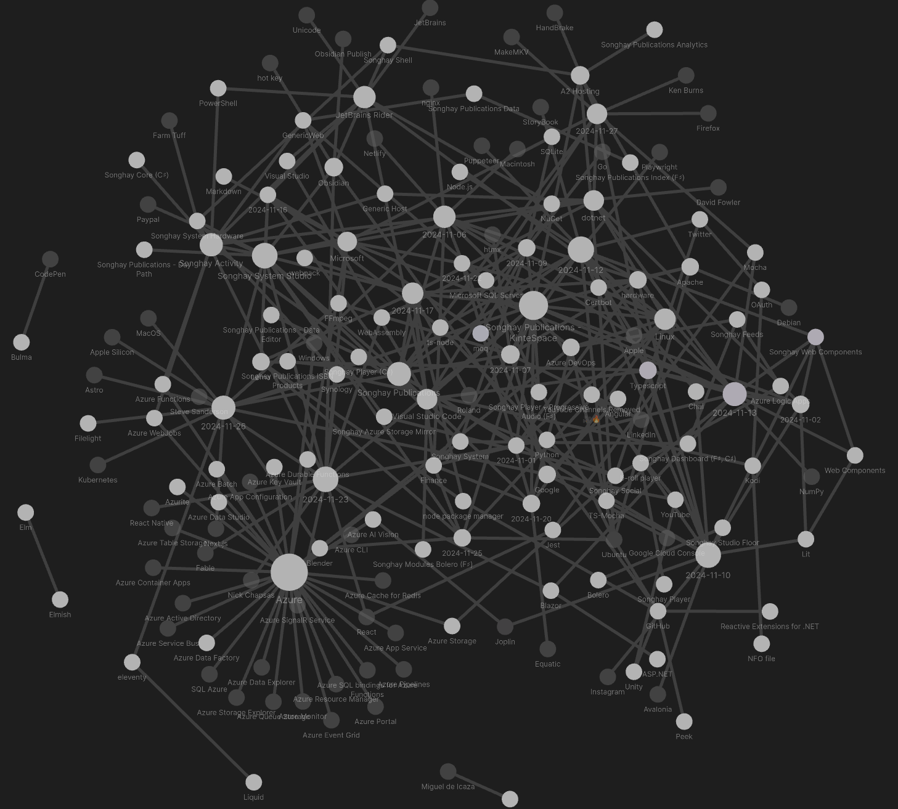

</div>

Lerna notes are spread out among three days:

<div style="text-align:center">

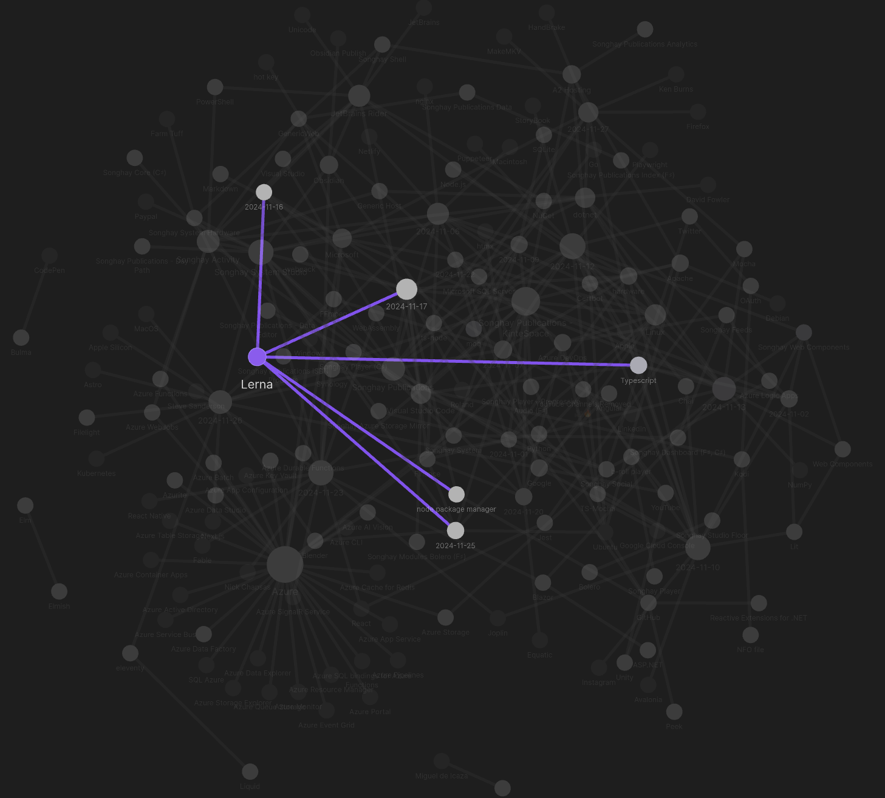

</div>

Typescript notes cover five _other_ days:

<div style="text-align:center">

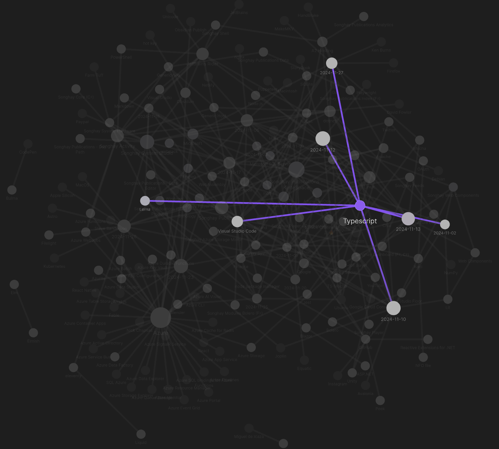

</div>

The topics of Lerna and Typescript make eight days of work for the month but selected notes below should show more such work under additional topics:

## [[Songhay Publications|Publications]]: WASM Audio Decoders #to-do

>WASM Audio Decoders is a collection of Web Assembly audio decoder libraries that are highly optimized for browser use. Each module supports synchronous decoding on the main thread as well as asynchronous (threaded) decoding through a built in [Web Worker](https://developer.mozilla.org/en-US/docs/Web/API/Web_Workers_API) implementation.
>
>Web Assembly is a binary instruction format for a stack-based virtual machine that allows for near native code execution speed inside of a web browser. In practice, these decoders are just as fast, and in some cases faster, than the browser implementation.
>
>—<https://github.com/eshaz/wasm-audio-decoders>
>

## [[Songhay Web Components]] `npm` drama with [[Lit]]

After the usual `npm-check -u`, we have the usual miserable security vulnerability message:

```console
17 vulnerabilities (1 low, 3 moderate, 11 high, 2 critical)
```

So I take the bait as usual and run:

```shell
$ npm audit fix

added 10 packages, removed 5 packages, changed 35 packages, and audited 1146 packages in 2m

125 packages are looking for funding
  run `npm fund` for details

# npm audit report

@koa/cors  <5.0.0
Severity: high
Overly permissive origin policy - https://github.com/advisories/GHSA-qxrj-hx23-xp82
fix available via `npm audit fix --force`
Will install es-dev-server@1.23.1, which is a breaking change
node_modules/@koa/cors
  es-dev-server  >=1.24.1
  Depends on vulnerable versions of @koa/cors
  Depends on vulnerable versions of browserslist-useragent
  Depends on vulnerable versions of useragent
  node_modules/es-dev-server

useragent  *
Severity: moderate
useragent Regular Expression Denial of Service vulnerability - https://github.com/advisories/GHSA-mgfv-m47x-4wqp
fix available via `npm audit fix --force`
Will install es-dev-server@1.23.1, which is a breaking change
node_modules/useragent
  browserslist-useragent  <=3.1.4
  Depends on vulnerable versions of useragent
  node_modules/browserslist-useragent

4 vulnerabilities (2 moderate, 2 high)

To address issues that do not require attention, run:
  npm audit fix

To address all issues (including breaking changes), run:
  npm audit fix --force
```

I am supposed to be satisfied with the drop from 11 to 2 high vulnerabilities 😐

## [[Songhay System Studio]]: “Why the deep learning boom caught almost everyone by surprise”

>Neural networks had delivered some impressive results in the late 1980s and early 1990s. But then progress stalled. By 2008, many researchers had moved on to mathematically elegant approaches such as [support vector machines](https://en.wikipedia.org/wiki/Support_vector_machine).
>
>I didn’t know it at the time, but a team at Princeton—in the same computer science building where I was attending lectures—was working on a project that would upend the conventional wisdom and demonstrate the power of neural networks. That team, ==led by Prof. Fei-Fei Li==, wasn’t working on a better version of neural networks. They were hardly thinking about neural networks at all.
>
>Rather, they were creating a new image dataset that would be far larger than any that had come before: 14 million images, each labeled with one of nearly 22,000 categories.
>
>—“[Why the deep learning boom caught almost everyone by surprise](https://www.understandingai.org/p/why-the-deep-learning-boom-caught)”

<div style="text-align:center">

<figure>
    <a href="https://www.youtube.com/watch?v=JgQ1FJ_wow8">
        
    </a>
    <p><small>CHM Live | Fei-Fei Li's AI Journey</small></p>
</figure>

</div>

Also, see “[How a stubborn computer scientist accidentally launched the deep learning boom ](https://arstechnica.com/ai/2024/11/how-a-stubborn-computer-scientist-accidentally-launched-the-deep-learning-boom/)” 📰

## [[Songhay System Studio]]: “Bad Software Keeps Cyber Security Companies in Business”

>The top two entries, XSS (Cross-Site Scripting) (CWE-79) and SQL injection (CWE-89), are fundamental to web application security and are always covered as part of basic development best practices. Both are common attack vectors and are often included in secure development guidelines like [OWASP’s top security risks](https://owasp.org/www-project-top-ten/).
>
>—“[Bad Software Keeps Cyber Security Companies in Business](https://www.dogesec.com/blog/bad_software_keeps_security_industry_in_business/)”
>

## [[Songhay Web Components]]: [[Lit]] drama, continued

Continuing on from [[2024-11-02#Songhay Web Components `npm` drama|eight days ago]], we have `property` and `customElement` missing from [[Lit]]:

<div style="text-align:center">

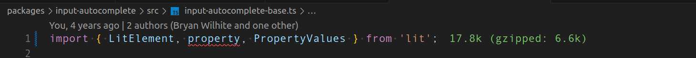

</div>

<div style="text-align:center">

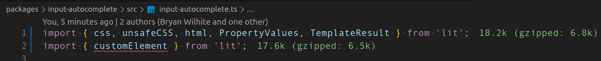

</div>

According to [the latest upgrade guide](https://lit.dev/docs/releases/upgrade/#removed-re-export-decorators):

>Lit 3.0 [built-in decorators](https://lit.dev/docs/components/decorators/#built-in-decorators) are no longer exported by `lit-element`, and should instead be imported from `lit/decorators.js`.

This appears to be working at design time:

<div style="text-align:center">

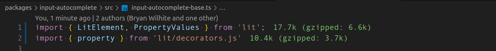

</div>

<div style="text-align:center">

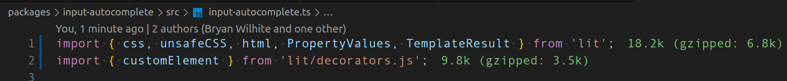

</div>

## [[Songhay Web Components]]: `chai` drama 😐

I do not understand why the past version of me wrote a [[Typescript]] file with a variable called `chai` without any corresponding `import` statement:

<div style="text-align:center">

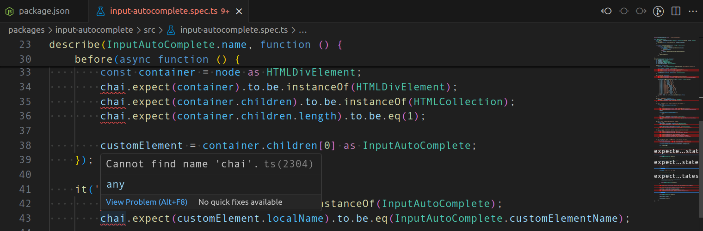

</div>

My [[Joplin]] notes make no relevant mention of `chai` or `lerna` 😐

## [[Songhay Web Components]]: the `ERR_REQUIRE_ESM` drama is really about my `*.ts` files being interpreted as `CommonJS` files 😐

[[2024-11-10#Songhay Web Components `ERR_REQUIRE_ESM` drama with Chai and TS-Mocha 😐|Two days ago]], I was non-thinking that [[Chai]] was retro, holding back my [[Typescript]] progress when it was the other way around. The [[Chai]] guy himself (the _second_ most active contributor), [Keith Cirkel](https://github.com/keithamus), [explains](https://github.com/chaijs/chai/issues/1561#issuecomment-1871878274):

>To talk about the motivation for this change, especially from the lens of the ecosystem of available build tools: there is a complexity trade off for libraries like Chai to support each of these build tools, and it becomes somewhat of an N\*M problem. Standards allow us to target a single syntax to reach the broadest support, and **will be an inevitable shift in the JS ecosystem**, it is just a matter of "when". Version 5 is chai's "when". Certainly if we are the first to support ESM it would cause undue friction, but if we were last it would also cause undue friction. Packages like [`@esm-bundle/chai`](https://www.npmjs.com/package/@esm-bundle/chai) already exist which demonstrate the friction is there today. There is no time we could have made this change that would satisfy all users. The Chai team is very confident we've made the right decision so support ESM only, and Chai >5 will continue to support only ESM (or whatever module system the EcmaScript standardises) indefinitely.

Before I understood what was going on, I drove myself to “[JavaScript unit testing frameworks in 2024: A comparison](https://raygun.com/blog/javascript-unit-testing-frameworks/)” (and found interest in [[StoryBook]] (<https://storybook.js.org/>) #to-do and [[Puppeteer]]—and found out just how young Microsoft’s [[Playwright]] is). But, eventually, I started paying attention to my root `tsconfig.json` file:

<div style="text-align:center">

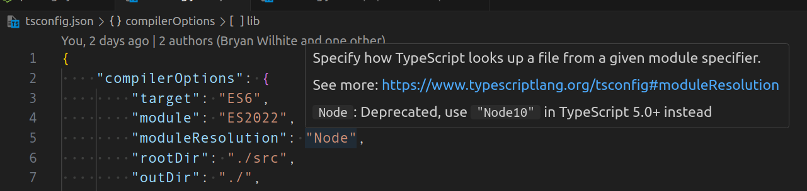

</div>

My `moduleResolution` setting \[📖 [docs](https://www.typescriptlang.org/tsconfig/#moduleResolution) \] is deprecated 😐

>`'node10'` (previously called `'node'`) for Node.js versions older than v10, which only support CommonJS `require`. You probably won’t need to use `node10` in modern code.

The docs strongly suggest to me that I should use `bundler`:

>`'bundler'` for use with bundlers. Like `node16` and `nodenext`, this mode supports package.json `"imports"` and `"exports"`, but unlike the Node.js resolution modes, `bundler` never requires file extensions on relative paths in imports.

With `"moduleResolution": "Bundler",`, [[TS-Mocha]] fails with:

```console
Exception during run: error TS5095: Option 'bundler' can only be used when 'module' is set to 'preserve' or to 'es2015' or later.
```

This error continues to show in spite of the following `tsconfig.json` settings:

<div style="text-align:center">

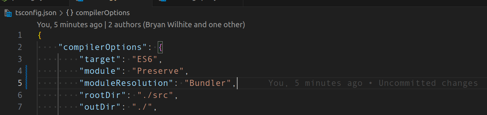

</div>

But I _must_ remember that [[TS-Mocha]] depends on [[ts-node]] which _must_ be more [[Node.js]] flavored than “bundler” flavored. Let’s try `"moduleResolution": "node16",`:

>`'node16'` or `'nodenext'` for modern versions of Node.js. Node.js v12 and later supports both ECMAScript imports and CommonJS `require`, which resolve using different algorithms. These `moduleResolution` values, when combined with the corresponding [`module`](https://www.typescriptlang.org/tsconfig/#module) values, picks the right algorithm for each resolution based on whether Node.js will see an `import` or `require` in the output JavaScript code.

Moving from the “bundler” world into the [[Node.js]] world, error messages show up in the [[Typescript]] source code:

<div style="text-align:center">

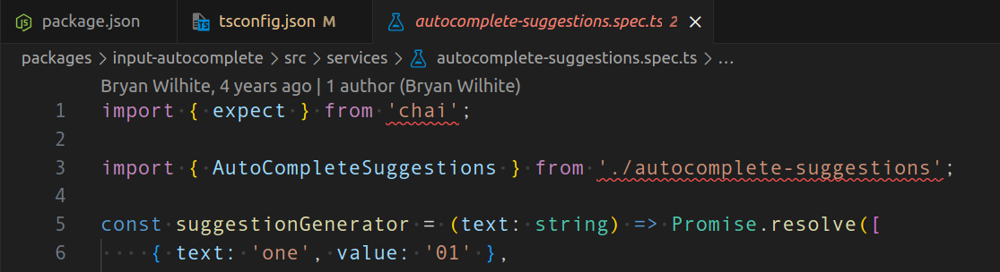

</div>

This is the error on line 1:

```console
The current file is a CommonJS module whose imports will produce 'require' calls; however, the referenced file is an ECMAScript module and cannot be imported with 'require'. Consider writing a dynamic 'import("chai")' call instead.  
To convert this file to an ECMAScript module, change its file extension to '.mts', or add the field `"type": "module"` to '/home/rasx/sourceRoot/songhay-web-components/packages/input-autocomplete/package.json'.ts(1479)
```

>[!important]
>This error is telling me that my source code is considered “a CommonJS module” 😐👴

The official docs recognizes the `.mts` file extension:

>When the input file extension is `.mts` or `.cts`, TypeScript knows to treat that file as an ES module or CJS module, respectively, because Node.js will treat the output `.mjs` file as an ES module or the output `.cjs` file as a CJS module. When the input file extension is `.ts`, TypeScript has to consult the nearest `package.json` file to determine the module format, because this is what Node.js will do when it encounters the output `.js` file.
>
>—“[Module format detection](https://www.typescriptlang.org/docs/handbook/modules/theory.html#module-format-detection)”
>

>[!important]
>By changing the file extension from `.ts` to `.mts`, the second error message on line 3 goes away:

```console
Relative import paths need explicit file extensions in ECMAScript imports when '--moduleResolution' is 'node16' or 'nodenext'. Did you mean './autocomplete-suggestions.js'?ts(2835)
```

## [[Songhay Web Components]]: the horror 🤡 of the situation is centered upon [[TS-Mocha]] being dead 💀

My waste of time [[2024-11-12#Songhay Web Components the `ERR_REQUIRE_ESM` drama is really about my `*.ts` files being interpreted as `CommonJS` files 😐|yesterday]] was punctuated with an empty checklist, looking forward to another potentially time-wasting effort. In order to avoid wasting time on that checklist, I recommend wasting more time by looking at [[Mocha]] again in the context of, say, “[Mocha for TypeScript Testing: How to Get Started](https://www.testim.io/blog/mocha-for-typescript-testing/).” My accusation is this:

>[!warning]
>[[TS-Mocha]] is abandoned: left for dead 💀

[[TS-Mocha]] is not growing with [[Typescript]]. The error messages from yesterday strongly suggest this (to me). Sadly, I need to go back to my “`mocha` and Typescript” [sample](https://github.com/BryanWilhite/nodejs/tree/master/mocha-and-typescript) and try it again _without_ [[TS-Mocha]] #to-do 

## [[Lerna]]: using `lerna exec` with `--scope`

My “`mocha` and Typescript” sample \[🔗 [GitHub](https://github.com/BryanWilhite/nodejs/tree/master/mocha-and-typescript) \] shows how to use `lerna exec` _without_ `--scope`:

```json
"ts-mocha:test:test:mocha-getting-started": "npx ts-mocha -p packages/mocha-getting-started/__tests__/tsconfig.json packages/mocha-getting-started/__tests__/**/*.spec.ts",
```

Here is the same command using `--scope`:

```json
"lerna:test:mocha-getting-started": "npx lerna exec --scope=@songhay/mocha-getting-started -- ts-mocha -p __tests__/tsconfig.json __tests__/**/*.spec.ts",
```

This approach does not make the command shorter but I find it more understandable—and more ‘convertible’ to executing the same command without [[Lerna]].

### `http-server` can start up in a sub-directory…

…the reason why this feature is useful at the moment in this Studio is because it allows the loading of `dist` assets in the `node_modules` directory, eliminating the need for bundling with, say, [[webpack]]. Again, in my “`mocha` and Typescript” sample \[🔗 [GitHub](https://github.com/BryanWilhite/nodejs/tree/master/mocha-and-typescript) \], we can see an <acronym title="HyperText Markup Language">HTML</acronym> page expecting `http-server` \[🔗 [GitHub](https://github.com/http-party/http-server) \] to start up in a sub-directory:

```html
<!DOCTYPE html>
<html lang="en">
  <head>
    <meta charset="utf-8" />
    <title>Mocha Tests</title>
    <meta name="viewport" content="width=device-width, initial-scale=1.0" />
    <link rel="stylesheet" href="../../../../node_modules/mocha/mocha.css" />
  </head>
  <body>
    <div id="mocha"></div>

    <script src="../../../../node_modules/chai/chai.js"></script>
    <script src="../../../../node_modules/mocha/mocha.js"></script>

    <script class="mocha-init">
        mocha.setup('bdd');
        mocha.checkLeaks();
    </script>
    <script src="getting-started.spec.js"></script>
    <script class="mocha-exec">
      mocha.run();
    </script>
  </body>
</html>
```

The corresponding [[node package manager|npm]] script is:

```plaintext
http-server . -o $npm_package_config_bt/step-1 -c-1
```

The `--help` text for the `-o` option used above reminds us that `-o` supports a `[path]` option:

```plaintext
-o [path]    Open browser window after starting the server.
             Optionally provide a URL path to open the browser window to.
```

## [[Lerna]]: a couple of new things learned

Here are some small signs of progress:

### `package.json` has a `config` property for sharing state

In short, `config` \[📖 [docs](https://docs.npmjs.com/cli/v10/configuring-npm/package-json#config) \] is a state bag 👜 My “`mocha` and Typescript” sample \[🔗 [GitHub](https://github.com/BryanWilhite/nodejs/tree/master/mocha-and-typescript) \] shows what is going on:

<div style="text-align:center">

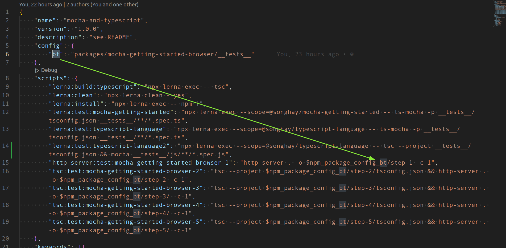

</div>

The conventional prefix for accessing this state bag 👜 is `$npm_package_config_*`.

## [[Synology]]: yes, it appears to be possible to upgrade <acronym title="Network Access Storage">NAS</acronym> memory 🐏⬆ 👀 #to-do

This video explains that:

- the DS220 has a maximum of 6 GB of <acronym title="Random Access Memory">RAM</acronym> (does the DS220+ change that? _No._)
- the memory used is [Crucial RAM 8GB DDR4 2666 MHz CL19 Memory for Mac CT8G4S266M](https://www.amazon.com/gp/product/B07TR767SB?ie=UTF8&linkCode=sl1&tag=astralightproduc&linkId=4ee4827c3eaf793c3568b2959b00b97e&language=en_US&ref_=as_li_ss_tl&th=1)

<div style="text-align:center">

<figure>
    <a href="https://www.youtube.com/watch?v=zOJyYsRQNDM">
        
    </a>
    <p><small>Upgrading memory in Synology DS220+ with crucial memory</small></p>
</figure>

</div>

## [[Lerna]]: next move is to use `@tsconfig/strictest`

Today I have been made aware of `@tsconfig/strictest` \[🔗 [npm](https://npmjs.com/package/@tsconfig/strictest) \] which a part of [Centralized Recommendations for TSConfig bases](https://github.com/tsconfig/bases/tree/main) \[📖 [docs](https://www.typescriptlang.org/docs/handbook/tsconfig-json.html#tsconfig-bases) \].

## [[Songhay Publications]]: the `script [type="module"]` attribute

My “`mocha` and Typescript” sample \[🔗 [GitHub](https://github.com/BryanWilhite/nodejs/tree/master/mocha-and-typescript) \] work led me to this error message while failing to load [[Mocha]] in the browser ([[Firefox]]):

```console
SyntaxError: import declarations may only appear at top level of a module
```

>The JavaScript exception "import declarations may only appear at top level of a module" occurs when an import declaration is not at the top level of a module. This might be because the import declaration is nested in other constructs (functions, blocks, etc.), or more often because the current file is not treated as a module.
>
>—“[SyntaxError: import declarations may only appear at top level of a module](https://developer.mozilla.org/en-US/docs/Web/JavaScript/Reference/Errors/import_decl_module_top_level)”
>

Adding `type="module"` to the `script` element causes the file loaded with the `src` attribute to be treated as a module \[📖 [docs](https://developer.mozilla.org/en-US/docs/Web/JavaScript/Guide/Modules) \].

We see the `type` attribute \[📖 [docs](https://developer.mozilla.org/en-US/docs/Web/HTML/Element/script/type) \] of `script` set to `module` twice:

<div style="text-align:center">

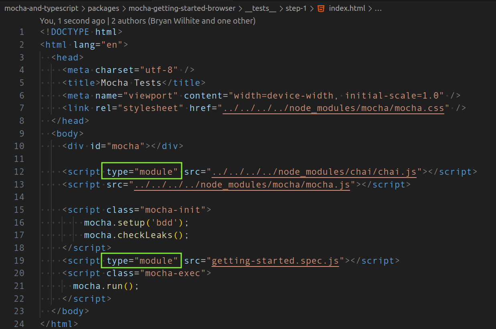

</div>

Notice how there is no `type` attribute declared on line 13. This is because `mocha.js` has no `import` or `export` statements which effectively makes it _not_ a module. It is an <acronym title="Immediately Invoked Function Expression">IIFE</acronym> \[📖 [docs](https://developer.mozilla.org/en-US/docs/Glossary/IIFE) \].

It is important (to me) to mention that using the `import` statement in JavaScript without any `export` statements _still_ means that the file containing this `import` statement is a module:

>In order to use the `import` declaration in a source file, the file must be interpreted by the runtime as a [module](https://developer.mozilla.org/en-US/docs/Web/JavaScript/Guide/Modules). In HTML, this is done by adding `type="module"` to the [`<script>`](https://developer.mozilla.org/en-US/docs/Web/HTML/Element/script) tag. Modules are automatically interpreted in [strict mode](https://developer.mozilla.org/en-US/docs/Web/JavaScript/Reference/Strict_mode).
>
>—“[import](https://developer.mozilla.org/en-US/docs/Web/JavaScript/Reference/Statements/import)”
>

## [[Songhay Publications]]: the `script[type="importmap"]` attribute

My “`mocha` and Typescript” sample \[🔗 [GitHub](https://github.com/BryanWilhite/nodejs/tree/master/mocha-and-typescript) \] shows that, when writing JavaScript by hand, making a file that will be loaded in the browser, we may resort to this `import` syntax:

```javascript
import { assert } from '../../../../node_modules/chai/chai.js';
```

With respect to the browser, the relative path to the `chai` module is explicitly specified. All of this effort is taken to avoid this catastrophic error message:

```console
TypeError: The specifier “chai” was a bare specifier, but was not remapped to anything. Relative module specifiers must start with “./”, “../” or “/”.
```

Our `chai` module is imported with a “bare specifier” when the syntax is like this:

```javascript
import { assert } from 'chai';
```

This is the very syntax we are used to when writing [[Typescript]]. In fact, the [[Typescript]] will not compile when we try to use `import` with the “relative module specifiers” shown above.

Now our `TypeError` error message has the word “remapped” in it. This suggests that:

>[!import]
>An `import` statement with a _bare specifier_ needs a mapping from this specifier to an absolute or relative location accessible by the browser.

Such mapping is declared in <acronym title="JavaScript Object Notation">JSON</acronym> format in a `script` element with the `type="importmap"` attribute \[📖 [docs](https://developer.mozilla.org/en-US/docs/Web/HTML/Element/script/type/importmap) \]. 

>An import map is a JSON object that allows developers to control how the browser resolves module specifiers when importing [JavaScript modules](https://developer.mozilla.org/en-US/docs/Web/JavaScript/Guide/Modules). It provides a mapping between the text used as the module specifier in an [`import` statement](https://developer.mozilla.org/en-US/docs/Web/JavaScript/Reference/Statements/import) or [`import()` operator](https://developer.mozilla.org/en-US/docs/Web/JavaScript/Reference/Operators/import), and the corresponding value that will replace the text when resolving the specifier. The JSON object must conform to the [Import map JSON representation format](https://developer.mozilla.org/en-US/docs/Web/HTML/Element/script/type/importmap#import_map_json_representation).

Our “`mocha` and Typescript” sample \[🔗 [GitHub](https://github.com/BryanWilhite/nodejs/tree/master/mocha-and-typescript) \] has an <acronym title="HyperText Markup Language">HTML</acronym> declaration showing how `type="importmap"` works:

```html
<!DOCTYPE html>
<html lang="en">
  <head>
    <meta charset="utf-8" />
    <title>Mocha Tests</title>
    <meta name="viewport" content="width=device-width, initial-scale=1.0" />
    <link rel="stylesheet" href="../../../../node_modules/mocha/mocha.css" />
    <script type="importmap">
      {
        "imports": {
          "chai": "../../../../node_modules/chai/chai.js"
        }
      }
    </script>
  </head>
  <body>
    <div id="mocha"></div>

    <script type="module" src="../../../../node_modules/chai/chai.js"></script>
    <script src="../../../../node_modules/mocha/mocha.js"></script>

    <script class="mocha-init">
        mocha.setup('bdd');
        mocha.checkLeaks();
    </script>
    <script type="module" src="./js/getting-started.spec.js"></script>
    <script class="mocha-exec">
      mocha.run();
    </script>
  </body>
</html>
```

## open pull requests on GitHub 🐙🐈

- <https://github.com/BryanWilhite/Songhay.HelloWorlds.Activities/pull/14>
- <https://github.com/BryanWilhite/dotnet-core/pull/67>

## sketching out development projects

The current, unfinished public projects on GitHub:

- replacing the Angular app in `http://kintespace.com/player.html` with a Bolero app 🚜🔥 depends on:

  - completing [issue #54](https://github.com/BryanWilhite/Songhay.Publications/issues/54): move `Songhay.Publications.DataAccess` out of the kinté space repo 🚜
  - generating Publication indices from SQLite for `Songhay.Publications.KinteSpace`
  - generating a new repo with proposed name, `Songhay.Modules.Bolero.Index` ✨🚧 and add a GitHub Project

The proposed project items:

- switch Studio from Material Design to Bulma 💄 ➡️ 💄✨

🐙🐈<https://github.com/BryanWilhite/>
