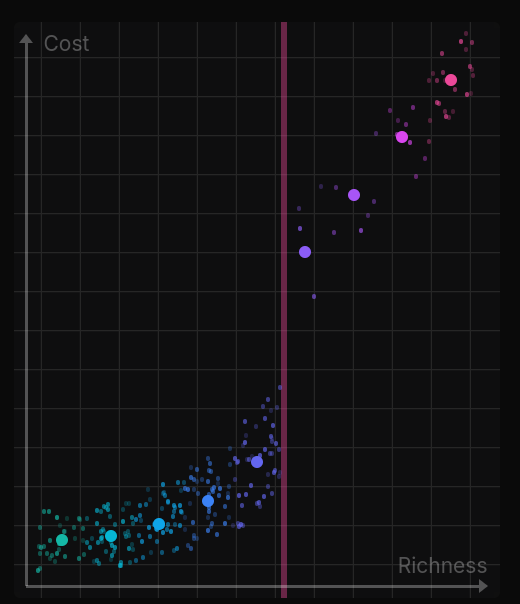
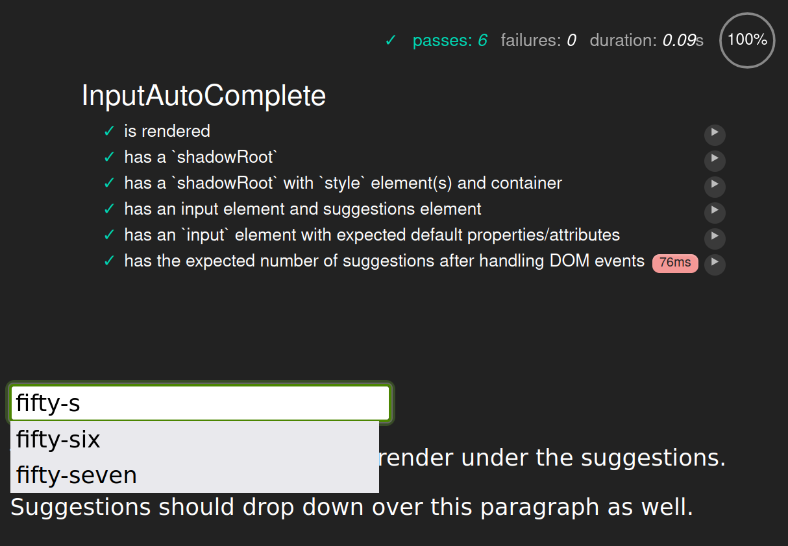

---json
{
  "documentId": 0,
  "title": "studio status report: 2024-12",
  "documentShortName": "2024-12-28-studio-status-report-2024-12",
  "fileName": "index.html",
  "path": "./entry/2024-12-28-studio-status-report-2024-12",
  "date": "2024-12-28T12:21:08.476Z",
  "modificationDate": "2024-12-28T12:21:08.476Z",
  "templateId": 0,
  "segmentId": 0,
  "isRoot": false,
  "isActive": true,
  "sortOrdinal": 0,
  "clientId": "2024-12-28-studio-status-report-2024-12",
  "tag": "{\n  \u0022extract\u0022: \u0022month 12 of 2024 was about upgrading the F\\u266F package stacks to .NET 8.0, upgrading Songhay Web Components to Lit 3.x and getting sick while on #day-job vacation The Obsidian notes for this month should reflect slogging through the unpleasant process of upg\\u2026\u0022\n}"
}
---

# studio status report: 2024-12

## month 12 of 2024 was about upgrading the F♯ package stacks to .NET 8.0, upgrading Songhay Web Components to Lit 3.x and getting sick while on #day-job vacation

The Obsidian notes for this month should reflect slogging through the unpleasant process of upgrading Lit for Songhay Web Components [[GitHub](https://github.com/BryanWilhite/songhay-web-components)]. This upgrade would go into the JavaScript bundle that would back the new homepage for kintespace.com. The Obsidian Graph View for the month shows how Lit [[GitHub](https://github.com/lit/lit)] work pops up to the left of the massive Azure node:


The graph is _not_ showing any direct relationship between Lit and Songhay Web Components which means there is still a lot for me to learn about data visualization as a way of life. It must also be said that the Obsidian is seeing Lit for the first time this month which is an indicator of poor time management and greed. I think I am promising myself to streamline my interests/investments—which should be shown in the Obsidian graph over time.

In the mean time, back to slogging through selected Obsidian notes:

## [[Anaconda]]: “Can I make conda solve this environment faster?”

When [[Anaconda|conda]] is hanging, trying to “solve the environment,” one or more of the following may be evident:

- “too many” packages are installed in one environment
- all of the packages are too old, having breaking changes
- `conda` itself is out of date and is encountering breaking changes with ‘sources’

[A GitHub issue shows](https://github.com/conda/conda/issues/11919) how tempers flare over this issue 😐

## [[Songhay Publications]]: “The Curse of Markdown”

“[The Curse of Markdown](https://codehike.org/blog/the-curse-of-markdown)” complains about how the publishing process is disjointed because of the presence of [[Markdown]]:

<div style="text-align:center">



</div>

The author of this prose just happens to be a software developer working on getting rid of this disjointed situation:

>**Rodrigo Pombo**, a.k.a. [**@pomber**](https://x.com/pomber), is a software overengineer working on [Code Hike](https://codehike.org/), an open-source library that bridges the gap between Markdown and React to help developers **create rich technical content for the modern web**.

## [[dotnet|.NET 9.0]]: I am not seeing Kathleen Dollard mention how fast `params IReadOnlySpan<T>` is compares to the other `params` collections

In “[Calling methods is easier and faster with C# 13 params collections](https://devblogs.microsoft.com/dotnet/csharp13-calling-methods-is-easier-and-faster/),” `params IReadOnlySpan<T>` is not distinguished at all. One way to look at it is that performance considerations can be left to others—like the lead designer of C♯:

<div style="text-align:center">

<figure>
    <a href="https://www.youtube.com/watch?v=japXYFS9YPQ">
        
    </a>
    <p><small>What's new in C# 13</small></p>
</figure>

</div>

This video introduces the `OverloadResolutionPriority` attribute \[📖 [docs](https://learn.microsoft.com/en-us/dotnet/api/system.runtime.compilerservices.overloadresolutionpriorityattribute?view=net-9.0) \] as described in “[Understanding OverloadResolutionPriority attribute in C# 13](https://www.meziantou.net/understanding-overloadresolutionpriority-attribute-in-csharp-13.htm).”

## [[Songhay Web Components]]: working with [[Lit]] latest

In order for decorators like `@property` to compile in [[Typescript]], two `compilerOptions` \[📖 [docs](https://www.typescriptlang.org/docs/handbook/compiler-options.html#compiler-options) \] properties need to be set in `tsconfig.json`:

```json
{
  "compilerOptions": {
    "experimentalDecorators": true,
    "useDefineForClassFields": false,
  }
}
```

For more details, see “[Using decorators with TypeScript](https://lit.dev/docs/components/decorators/#decorators-typescript)” 📖

## [[Typescript]]: the `as` keyword is a _type assertion_—not type casting ⚡🧠

In “[TypeScript's `as` keyword might not be what you think](https://dev.to/typescriptteatime/typescripts-as-keyword-might-not-be-what-you-think-2bpo)” we have:

>…TypeScript's `as MyType` only changes _compile time_ behavior. It's like saying to the compiler "Compiler, believe me. This is a `MyType`. So stop complaining." Nothing has changed for the resulting JavaScript code after compiling. In other words, we're still completely vulnerable at _runtime_. That's why TypeScript actually uses the term _Type Assertion_ \[instead\] of _Type Casting_.

>[!important]
>Use the `in` “type guard” \[📖 [docs](https://developer.mozilla.org/en-US/docs/Web/JavaScript/Reference/Operators/in) \] to verify that a type assertion is correct.

>The `in` keyword in JavaScript and TypeScript checks whether a property exists on an object. In the above example, we use it to check whether the `addLemon` property exists on the `hotBeverage` object _at compile time and at runtime_. If it does, TypeScript know it's a `Tea` because the other option `Coffee` does not have an `addLemon` property. On the other hand, if the object does not have an `addLemon` property it must be `Coffee`. Unlike `as`, since `in` is a JavaScript keyword it acts at runtime, too.

## [[hardware]]: I have not written a note about [[Clonezilla]] since before 2018 😐

I would like to upgrade my [[Linux]] workstation, `Songhay13`—but I would like to do this _after_ backing up its system files. My investment in [[Clonezilla]] is meant to do this. But this investment is—like many other things in this Studio—_neglected_ 😐

## [[Songhay Web Components]]: `typedocOptions` have changed❓

Here are the current—apparently old—options in `packages/input-autocomplete/tsconfig.json`:

```json
    "typedocOptions": {
        "entryPoint": "./src/input-autocomplete.ts",
        "exclude": "**/*.spec.ts",
        "excludeExternals": true,
        "inputFiles": "./src",
        "mode": "modules",
        "out": "../../docs/input-autocomplete",
        "readme": "none",
        "stripInternal": true
    }
```

The [[Lerna]] script output:

```console
Executing task: npm run lerna:exec:typedoc 


> songhay-web-components@1.0.0 lerna:exec:typedoc
> npx lerna exec -- typedoc

lerna notice cli v8.1.9
lerna info Executing command in 1 package: "typedoc"
[error] Unknown option 'entryPoint' You may have meant:
        entryPoints
[error] Unknown option 'inputFiles' You may have meant:
        options
        outputs
        out
        html
        emit
        name
        inlineTags
        plugin
        locales
        theme
        cname
        titleLink
[error] Unknown option 'mode' You may have meant:
        name
        out
        theme
        cname
        html
        json
        emit
        readme
        sort
        help
[error] Unknown option 'stripInternal' You may have meant:
        sourceLinkExternal
        sort
        excludeInternal
        titleLink
        html
        json
        emit
        name
        readme
        help
[error] Found 4 errors and 0 warnings
lerna ERR! typedoc exited 1 in '@songhay/input-autocomplete'
lerna ERR! typedoc exited 1 in '@songhay/input-autocomplete'

 *  The terminal process "/usr/bin/bash '-i', '-c', 'npm run lerna:exec:typedoc'" terminated with exit code: 1.
```

## [[Songhay Web Components]]: yes, `typedocOptions` have changed 😐

According to the traditional, bad-design foresight of the JavaScript-kiddie world, there are copious breaking changes for `typedocOptions` \[📖 [docs](https://typedoc.org/api/interfaces/Configuration.TypeDocOptions.html) \].

Following up the previously noted state, we need to go from this:

```json
    "typedocOptions": {
        "entryPoint": "./src/input-autocomplete.ts",
        "exclude": "**/*.spec.ts",
        "excludeExternals": true,
        "inputFiles": "./src",
        "mode": "modules",
        "out": "../../docs/input-autocomplete",
        "readme": "none",
        "stripInternal": true
    }
```

…to this:

```json
    "typedocOptions": {
        "entryPoints": ["./src/input-autocomplete.ts"],
        "exclude": ["**/*.spec.ts"],
        "excludeExternals": true,
        "out": "../../docs/input-autocomplete",
        "readme": "none"
    }
```

I am guessing (because the docs do not support multiple versions) that `inputFiles` and `mode` have been deprecated in favor of reading the rest of the `tsconfig.json` file (instead of reinventing the wheel 🎡✨). This guess comes from [a GitHub comment](https://github.com/TypeStrong/TypeDoc/issues/1469#issuecomment-761591092) that explains what happened to `stripInternal`:

>`stripInternal` is a TypeScript option ([https://www.typescriptlang.org/tsconfig#stripInternal](https://www.typescriptlang.org/tsconfig#stripInternal)). In 0.20, TypeDoc dropped support for setting TypeScript options via TypeDoc config files.

## [[Songhay System Studio]]: “The death of the stubborn developer”

>One problem is that the circuit that lets junior developers grow into senior developers is broken or at least damaged. I’m borrowing an apt analogy from [Dr. Matt Beane](https://www.linkedin.com/in/mattbeane/), who describes the [same phenomenon happening with junior surgeons](https://videos.itrevolution.com/watch/1023437609) due to the emergence of surgery robots. Very similar situation: The task graph leaf nodes are automated now, so we don’t need (as many) junior contributors.
>
>…
>
>I’ve recently talked to two polar-opposite companies — one where the juniors have adopted chop, but the seniors stubbornly refuse, saying it’s a gimmick. And another where the seniors have adopted chop, but the juniors refuse, the reason being that they think it will take their jobs. It’s craziness out there.
>
>…
>
>…Chat-Oriented Programming, CHOP for short (or just chop). Chop isn’t just the future, it’s the present. And if you’re not using it, you’re starting to fall behind the ones who are.
>
>—“[The death of the stubborn developer](https://sourcegraph.com/blog/the-death-of-the-stubborn-developer)”
>

## [[Songhay System Studio]]: first pass at advice for beginner Web developers

In response to this potentially fake LinkedIn message:

Learn by doing—and do this _independently_ of the company you might be working for. That means having your own GitHub repo which should be shown/mentioned during or before interviews. Also, you should use something like <https://codepen.io/> and <https://stackblitz.com> to self-teach and self-promote.

Regardless of your preference for React, use MDN, <https://developer.mozilla.org/en-US/>, as a neutral reference for “pure” CSS and HTML and start casually reading sites like <https://css-tricks.com/>.

In order to invest in a solid understanding of JavaScript for the client and the eventually the server, read _JavaScript: The Good Parts: The Good Parts_ by Douglas Crockford (he also has lectures on YouTube).

Because I could not find a ‘Douglas Crockford’-like guru for Node.js, I started my own, self-teaching repo, <https://github.com/BryanWilhite/nodejs>. I recommend you do the same.

Feel free to write me any questions.

## [[dotnet|.NET]]: for default implementations of `ILogger`, use the term _debug_ instead of the word _verbose_ #day-job 

When faced with the potential problem of gigantic logs because of their verbosity for a default [[Generic Host|.NET Generic Host]], consider the following:

- replace `ILogger` calls to `LogInformation` with `LogDebug` calls 
- replace `ILogger` calls to `LogWarning` with `LogDebug("Warning:…")` calls
- replace `ILogger` calls to `LogError` with `LogDebug("Error:…")` calls
- add an overload with a `LogLevel` argument for any `ILogger` extension methods in order to support `LogDebug` (and maybe `LogTrace`)
- ensure that you have a production-ready `appSettings.json` file with something like the following:

```json
{
  "Logging": {
    "LogLevel": {
      "Default": "Information"
    }
  }
}
```

>The `LogLevel` specifies the minimum [level](https://learn.microsoft.com/en-us/dotnet/core/extensions/logging?tabs=command-line#log-level) to log for selected categories. …`LogLevel` indicates the severity of the log and ranges from 0 to 6:
>
>`Trace` = 0, `Debug` = 1, `Information` = 2, `Warning` = 3, `Error` = 4, `Critical` = 5, and `None` = 6.
>
>—“[Logging in C# and .NET](https://learn.microsoft.com/en-us/dotnet/core/extensions/logging?tabs=command-line)”
>

>[!important]
>Dropping a copious amount of `LogInformation` calls ‘down’ to `LogDebug` calls, with the `appSettings.json`, `"Logging"` setting shown above, ensures that _verbosity_ will be eliminated in harmony with the defaults coming from [[Microsoft]].

## [[Songhay Core (C♯)]]: add an overload, `isCommandLineSwitch` to `HasArg` extension method 🔨✨

Add `isCommandLineSwitch` to support args like:

- `--dry-run=true`
- `--dry-run=false`

…such that `--dry-run=false` will make `HasArg` return `false` and `--dry-run=true` will make `HasArg` return `true`.

This change is needed to address the current lack of command-line “switch” support in the `CommandLineConfigurationExtensions.AddCommandLine` \[📖 [docs](https://learn.microsoft.com/en-us/dotnet/api/microsoft.extensions.configuration.commandlineconfigurationextensions.addcommandline?view=net-9.0-pp) \] extension method.

There is a [[GitHub]] issue #[36024](https://github.com/dotnet/runtime/issues/36024) that has been open since 2019, requesting that command-line “switch” support be added.

>[!important]
>[[GitHub]] issue #[177](https://github.com/BryanWilhite/SonghayCore/issues/177) has been lodged to effect these changes.

## [[Songhay Publications - KinteSpace|kintespace.com]]: “Sweat and stone: The children powering Nigeria's lithium boom”

>Lithium mining has transformed Pasali over the past decade, creating a hub of illegal operations. Workers, including children, use primitive tools to extract and sort lithium ore. Young miners like 19-year-old Bashir Rabiu, who started working as a child, recall witnessing deadly accidents in the dangerous pits.
>
>Children like Juliet and her peers can collectively sort up to 10 bags of lithium-rich ore daily, earning around $2.42 to share among themselves. Many, like Juliet, had to drop out of school due to financial constraints. Although education is technically free in government schools, additional fees make it inaccessible for the poorest families.
>
>—“[Sweat and stone: The children powering Nigeria's lithium boom](https://www.africanews.com/2024/12/12/sweat-and-stone-the-children-powering-nigerias-lithium-boom/)”
>

## [[Windows]]: “Microsoft now allowing Windows 11 on older, incompatible PCs” 😐

>Not even a week ago, [Microsoft doubled down](https://www.pcworld.com/article/2545157/microsoft-doubles-down-still-wont-let-older-pcs-run-windows-11.html) on its policy that requires PCs to have TPM 2.0-compatible hardware in order to install Windows 11. But now, in an unexpected and puzzling move, the company is issuing instructions for installing Windows 11 on incompatible PCs.
>
>You can find those official instructions on [this support page](https://support.microsoft.com/en-us/windows/installing-windows-11-on-devices-that-don-t-meet-minimum-system-requirements-0b2dc4a2-5933-4ad4-9c09-ef0a331518f1#:~:text=Die%20Installation%20von%20Windows%2011,vertraut%20sein,%20dass%20Kompatibilit%C3%A4tsprobleme%20auftreten.). However, Microsoft begins the instructions with a direct warning:
>
> > “Installing Windows 11 on a device that doesn’t meet Windows 11 minimum system requirements isn’t recommended. If Windows 11 is installed on ineligible hardware, you should be comfortable assuming the risk of running into compatibility issues.”
>
>The risk alluded to here includes system crashes and the lack of crucial security updates that would otherwise keep the PC safe and protected against malware, hackers, and scammers.
>
>—“[Microsoft now allowing Windows 11 on older, incompatible PCs](https://www.msn.com/en-us/technology/hardware-and-devices/microsoft-now-allowing-windows-11-on-older-incompatible-pcs/ar-AA1vy2RL?ocid=BingNewsSerp)”
>

<div style="text-align:center">

<figure>
    <a href="https://www.youtube.com/watch?v=Jio-Wq11K80">
        
    </a>
    <p><small>Wait, What?</small></p>
</figure>

</div>

## modern [[Lit]] does _not_ use shadow <acronym title="Document Object Model">DOM</acronym> `style` elements by default

What is clearly documented by the [[Lit]] folks is the suggestion that using shadow <acronym title="Document Object Model">DOM</acronym> `style` element impacts performance:

>We recommend using the [static `styles` class field](https://lit.dev/docs/components/styles/#add-styles) for optimal performance. However, sometimes you may want to define styles in the Lit template. There are two ways to add scoped styles in the template:
>
> - Add styles using a [`<style>` element](https://lit.dev/docs/components/styles/#style-element).
> - Add styles using an [external style sheet](https://lit.dev/docs/components/styles/#external-stylesheet) (not recommended).
>
>Each of these techniques has its own set of advantages and drawbacks.
>
>—”[Defining scoped styles in the template](https://lit.dev/docs/components/styles/#styles-in-the-template)”
>

For legacy browser support, [[Lit]] depends on [[ShadyCSS]] \[🔗 [GitHub](https://github.com/webcomponents/polyfills/tree/master/packages/shadycss#limitations) \] to “simulate ShadowDOM style encapsulation.”

## [[Songhay Web Components]]: all tests pass (after over four years) 👏

Yeesh:

<div style="text-align:center">



</div>

Instead of “spies” we can take advantage of multicast eventing 🐎🎠:

```typescript
inputElement.addEventListener('focus', _ => ++countForInputElementFocus);
inputElement.addEventListener('keyup', _ => ++countForInputElementKeyUp);
```

Then we can simple-ass count assertions:

```typescript
expect(countForInputElementFocus).to.be.greaterThan(0);
```

After this long-ass struggle, it has finally occurred to me that using [[Selenium WebDriver]] instead of [[Mocha]] might be more scalable here. Investigation is needed (see “[How to Test Selenium Node.JS with Mocha](https://www.browserstack.com/guide/test-nodejs-selenium-with-mocha)” and “[Automating Tests with Selenium #3: Integrating with Mocha](https://lo-victoria.com/automating-tests-with-selenium-3-integrating-with-mocha)”) #to-do

## [[dotnet|.NET 8.0]]: an `8.0.0` release of [[Songhay Modules (F♯)]]❓

Yes, let’s upgrade the F♯ stack to .NET 8.0. The first thing I look forward to seeing (as noted last year) is [[Blazor]] 8 no longer sending `*.dll` files to the browser 👏

## [[Blender]] videos show how awful animation-workflow was/is by celebrating upcoming improvements

<div style="text-align:center">

<figure>
    <a href="https://www.youtube.com/watch?v=bUNsEzM0gKc">
        
    </a>
    <p><small>Blender is Changing Animation Forever</small></p>
</figure>

</div>

The [[DillonGoo Studios]] folks are becoming [[Blender]] insiders as contributors to development:

<div style="text-align:center">

<figure>
    <a href="https://www.youtube.com/watch?v=pVaqeG2t_GA">
        
    </a>
    <p><small>We're changing Blender forever.</small></p>
</figure>

</div>

## [[Songhay Publications|Publications]]: “Four Eras of JavaScript Frameworks”

>So I wanted to do a retrospective, looking back at the last few decades of JavaScript development and at how far we’ve come. I think we can roughly divide it into four main eras:
> 
> 1. The Before Times
> 2. The First Frameworks
> 3. Component-Centric View Layers
> 4. Full-stack Frameworks (_← We’re here_)
>
>—“[Four Eras of JavaScript Frameworks](https://www.pzuraq.com/blog/four-eras-of-javascript-frameworks)”
>

## [[Songhay Modules Bolero (F♯)]] upgraded to [[dotnet|.NET 8.0]]

The current contents of the `Songhay.StudioFloor.Client/bin/Release/net8.0/publish` directory is now full of `*.wasm` files:

```shell
$ tree -P "*.wasm" -- ./publish/
./publish/
└── wwwroot
    ├── css
    ├── _framework
    │   ├── Bolero.Html.wasm
    │   ├── Bolero.wasm
    │   ├── cs
    │   │   └── FSharp.Core.resources.wasm
    │   ├── de
    │   │   └── FSharp.Core.resources.wasm
    │   ├── dotnet.native.wasm
    │   ├── Elmish.wasm
    │   ├── es
    │   │   └── FSharp.Core.resources.wasm
    │   ├── fr
    │   │   └── FSharp.Core.resources.wasm
    │   ├── FSharp.Core.wasm
    │   ├── FSharp.SystemTextJson.wasm
    │   ├── FsToolkit.ErrorHandling.wasm
    │   ├── it
    │   │   └── FSharp.Core.resources.wasm
    │   ├── ja
    │   │   └── FSharp.Core.resources.wasm
    │   ├── ko
    │   │   └── FSharp.Core.resources.wasm
    │   ├── Microsoft.AspNetCore.Components.wasm
    │   ├── Microsoft.AspNetCore.Components.WebAssembly.wasm
    │   ├── Microsoft.AspNetCore.Components.Web.wasm
    │   ├── Microsoft.Extensions.Configuration.Abstractions.wasm
    │   ├── Microsoft.Extensions.Configuration.Json.wasm
    │   ├── Microsoft.Extensions.Configuration.wasm
    │   ├── Microsoft.Extensions.DependencyInjection.Abstractions.wasm
    │   ├── Microsoft.Extensions.DependencyInjection.wasm
    │   ├── Microsoft.Extensions.Logging.Abstractions.wasm
    │   ├── Microsoft.Extensions.Logging.wasm
    │   ├── Microsoft.Extensions.Options.wasm
    │   ├── Microsoft.Extensions.Primitives.wasm
    │   ├── Microsoft.JSInterop.wasm
    │   ├── Microsoft.JSInterop.WebAssembly.wasm
    │   ├── netstandard.wasm
    │   ├── pl
    │   │   └── FSharp.Core.resources.wasm
    │   ├── pt-BR
    │   │   └── FSharp.Core.resources.wasm
    │   ├── ru
    │   │   └── FSharp.Core.resources.wasm
    │   ├── Songhay.Modules.Bolero.wasm
    │   ├── Songhay.Modules.wasm
    │   ├── Songhay.StudioFloor.Client.wasm
    │   ├── System.Collections.Concurrent.wasm
    │   ├── System.Collections.NonGeneric.wasm
    │   ├── System.Collections.wasm
    │   ├── System.ComponentModel.EventBasedAsync.wasm
    │   ├── System.ComponentModel.Primitives.wasm
    │   ├── System.ComponentModel.wasm
    │   ├── System.Console.wasm
    │   ├── System.Diagnostics.DiagnosticSource.wasm
    │   ├── System.Diagnostics.TraceSource.wasm
    │   ├── System.Linq.Expressions.wasm
    │   ├── System.Linq.Queryable.wasm
    │   ├── System.Linq.wasm
    │   ├── System.Memory.wasm
    │   ├── System.Net.Http.wasm
    │   ├── System.Net.Primitives.wasm
    │   ├── System.Net.Requests.wasm
    │   ├── System.Net.WebClient.wasm
    │   ├── System.Private.CoreLib.wasm
    │   ├── System.Private.Uri.wasm
    │   ├── System.Private.Xml.wasm
    │   ├── System.Runtime.InteropServices.JavaScript.wasm
    │   ├── System.Runtime.Numerics.wasm
    │   ├── System.Runtime.wasm
    │   ├── System.Text.Encodings.Web.wasm
    │   ├── System.Text.Json.wasm
    │   ├── System.Text.RegularExpressions.wasm
    │   ├── System.Threading.Tasks.Parallel.wasm
    │   ├── System.Xml.ReaderWriter.wasm
    │   ├── tr
    │   │   └── FSharp.Core.resources.wasm
    │   ├── zh-Hans
    │   │   └── FSharp.Core.resources.wasm
    │   └── zh-Hant
    │       └── FSharp.Core.resources.wasm
    └── js

17 directories, 66 files
```

### related reading

- “[History of JavaScript Frameworks](https://programmingsoup.com/history-of-javascript-frameworks)”
- “[Frontend Web Architectures](https://codingitwrong.com/2024/01/17/frontend-web-architectures)”
- “[The JavaScript Ecosystem is Delightfully Weird](https://fly.io/blog/js-ecosystem-delightfully-wierd/)”

## open pull requests on GitHub 🐙🐈

- <https://github.com/BryanWilhite/Songhay.HelloWorlds.Activities/pull/14>
- <https://github.com/BryanWilhite/dotnet-core/pull/67>

## sketching out development projects

The current, unfinished public projects on GitHub:

- replacing the Angular app in `http://kintespace.com/player.html` with a Bolero app 🚜🔥 depends on:

  - completing [issue #54](https://github.com/BryanWilhite/Songhay.Publications/issues/54): move `Songhay.Publications.DataAccess` out of the kinté space repo 🚜
  - generating Publication indices from SQLite for `Songhay.Publications.KinteSpace`
  - generating a new repo with proposed name, `Songhay.Modules.Bolero.Index` ✨🚧 and add a GitHub Project

The proposed project items:

- switch Studio from Material Design to Bulma 💄 ➡️ 💄✨

🐙🐈<https://github.com/BryanWilhite/>
