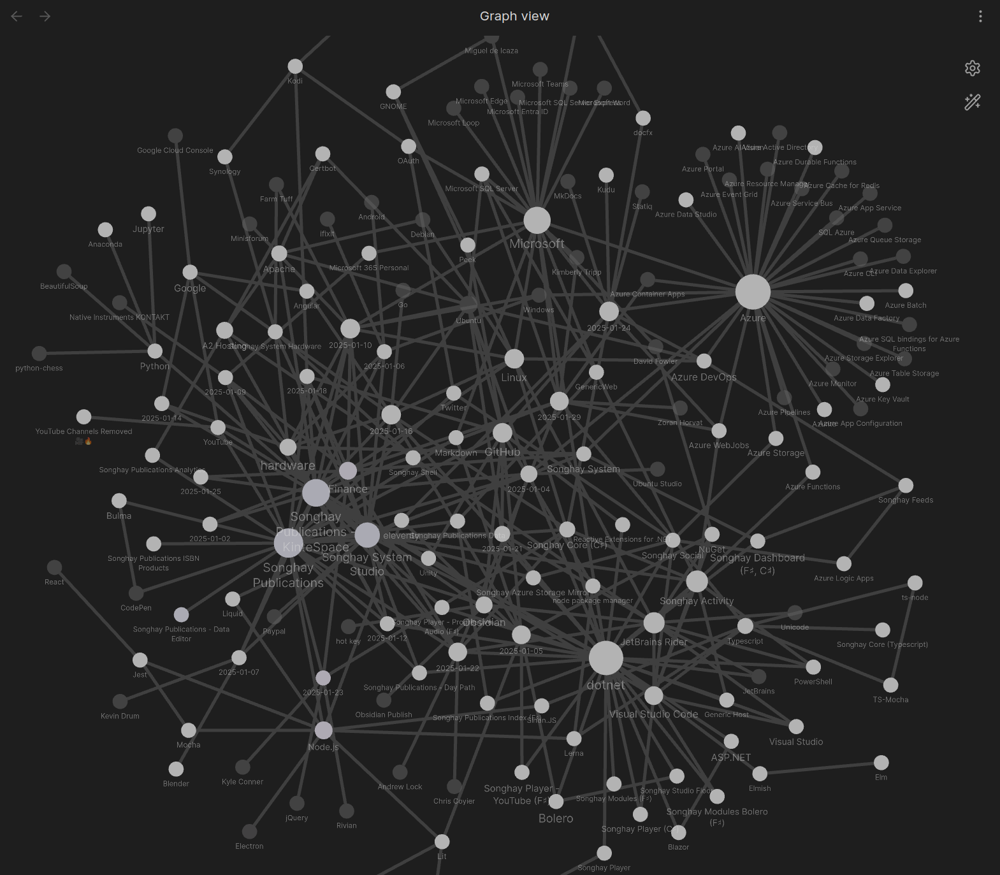
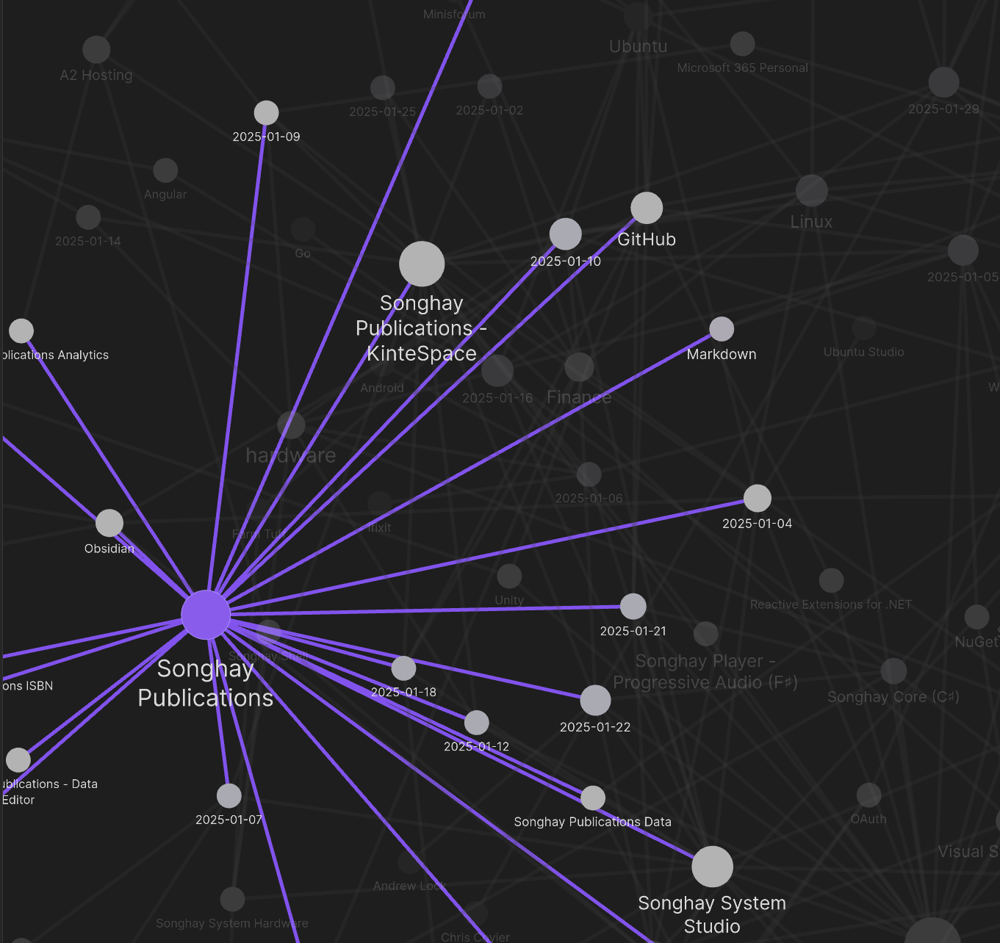
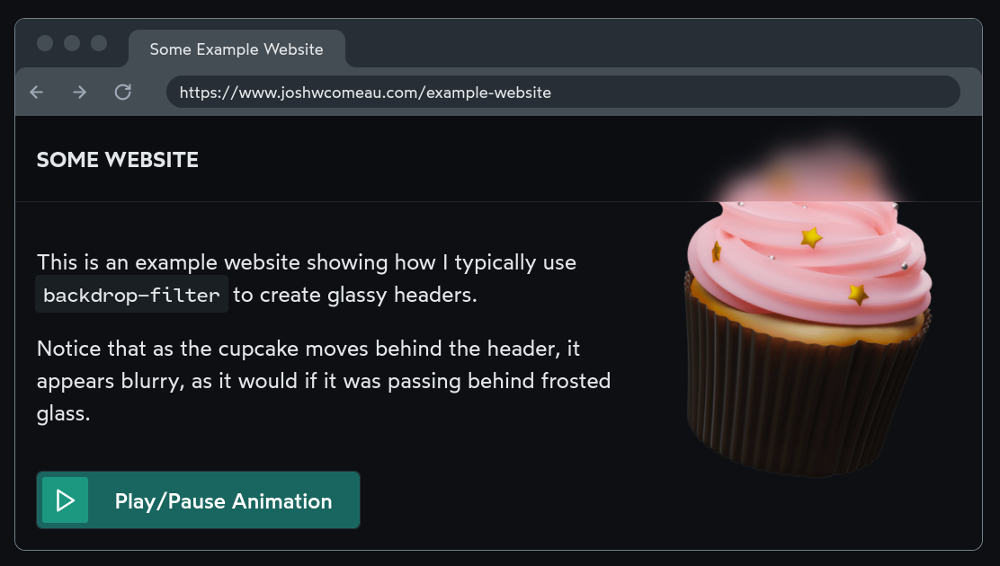
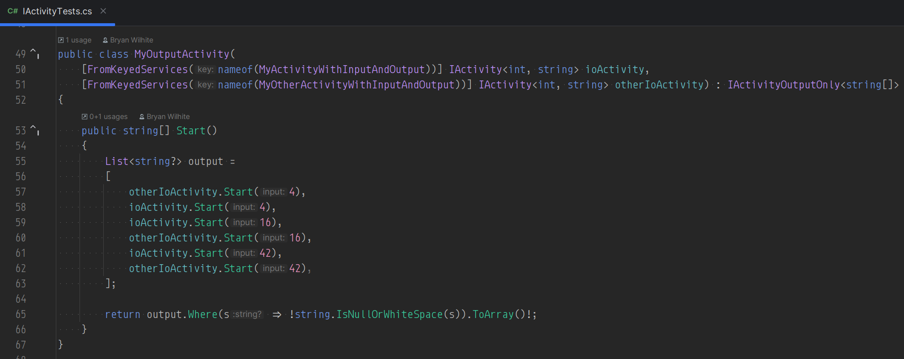
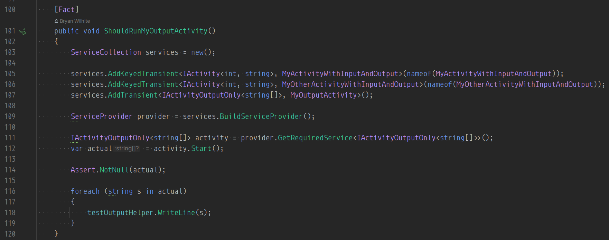
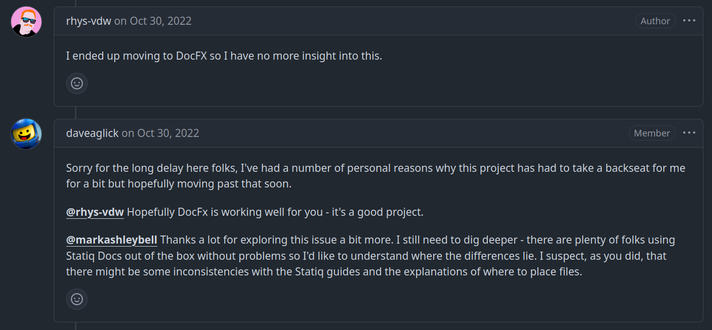

---json
{
  "documentId": 0,
  "title": "studio status report: 2025-01",
  "documentShortName": "2025-01-30-studio-status-report-2025-01",
  "fileName": "index.html",
  "path": "./entry/2025-01-30-studio-status-report-2025-01",
  "date": "2025-01-30T18:57:40.308Z",
  "modificationDate": "2025-01-30T18:57:40.308Z",
  "templateId": 0,
  "segmentId": 0,
  "isRoot": false,
  "isActive": true,
  "sortOrdinal": 0,
  "clientId": "2025-01-30-studio-status-report-2025-01",
  "tag": "{\n  \u0022extract\u0022: \u0022month 01 of 2025 was about California wildfire victims and upgrading SonghayCore to .NET 8.0 The selected notes for this month surface the tragic, systematic California wildfires. There is nothing I can write here apart from expressing my sympathy. One fa\\u2026\u0022\n}"
}
---

# studio status report: 2025-01

## month 01 of 2025 was about California wildfire victims and upgrading `SonghayCore` to .NET 8.0

The selected notes for this month surface the tragic, systematic California wildfires. There is nothing I can write here apart from expressing my sympathy. One family of victims, based in Altadena, lost _three_ houses. This family is that of the excellent woman that provided me my first break into the corporate world of computer programming. I am glad her family and many others is saved alive. This is a much better place to be than those who lost their lives—in addition to losing all of their material possessions, along with a sense of _home_.

The Obsidian graph for this month is supposed to be more structured than previous visualizations:

What this tangle of lines is supposed to show you are the largest interests of this Studio at the moment:

- Microsoft
- Azure
- Songhay Publications
- `dotnet`

The day-of-the-month nodes shown in the graph above orbit around these interests, including my [release](https://github.com/users/BryanWilhite/projects/31) of `SonghayCore` for .NET 8.0. For example, Songhay Publications shows that eight days of month 01 was dedicated to this interest:

Selected notes below should touch upon these eight days:

## [[Songhay System Studio]]: the [[Obsidian]] graph view should make dandelion seeds 🌱

When [[Obsidian]] topics refer to other topics, a hierarchy is generated and can be visualized like this:

The [[dotnet]] and [[Azure]] topics look like dandelion seeds:

<https://garvillo.com/what-is-the-flower-that-you-blow/>

Many, many videos about [[Obsidian]] will show the graph view full of these dandelion structures! My Studio has been (and still is) quite low on this dandelion look. This indicates a lack of organization: a scatter-brain state of low clarity—and, likely, low productivity.

## [[Markdown]]: MyST Markdown Tools

>MyST is an ecosystem of open-source, community-driven tools designed to revolutionize scientific communication. Our powerful authoring framework supports blogs, online books, scientific papers, reports and journals articles.
>
>…
>
>The `mystmd` command line tool can be used to parse MyST Markdown and Jupyter Notebooks into an AST. This data can be saved as JSON, or rendered to a website (like this one!) or any number of formats including [PDF & LaTeXLATE​X](https://mystmd.org/guide/creating-pdf-documents), [Word](https://mystmd.org/guide/creating-word-documents), [React](https://mystmd.org/guide/quickstart-myst-documents), or [JATS](https://mystmd.org/guide/creating-jats-xml).
>
>—<https://mystmd.org/guide>
>

<figure>
    
    
<small>Write your next paper in MyST Markdown with data, code & Jupyter notebooks</small>

</figure>

This video starts by emphasizing that MyST has conventional data formats for ease of export:

<figure>
    
    
<small>Franklin Koch MyST Markdown: Using notebooks in scientific publishing workflows | JupyterCon 2023</small>

</figure>

<figure>
    
    
<small>Sphinx, MyST, and Python Docs in 2022 - Talk Python to Me Ep.354</small>

</figure>

>[!question]
>Can `mystmd` work effectively in an [[eleventy]] pipeline ❓ #to-do 

## [[Songhay Publications|Publications]]: “Next-level frosted glass with `backdrop-filter`”

>One of my all-time favourite CSS tricks is using `backdrop-filter: blur()` to create a frosted glass effect. I use it in just about every project I work on, including this blog!
>
>—“[Next-level frosted glass with backdrop-filter](https://www.joshwcomeau.com/css/backdrop-filter/?from=newsletter)”
>

## [[Finance]]: “Breakingviews: Los Angeles fires expose inflated US home prices”

>New California rules aim to increase coverage, by requiring insurers to underwrite a minimum percentage of policies in dangerous areas, based on their state market share. In exchange, companies can raise premiums to reflect future modeled risk and increased reinsurance costs. Recent approved increases, like Allstate’s [(ALL.N)](https://www.reuters.com/markets/companies/ALL.N) 34% last year, are bound to become commonplace.
>
>This will inevitably hit prices. Assume a typical California home is worth $1 million and insuring it costs $5,000 annually. If the equivalent rent is $70,000, doubling the premium would reduce the house’s value by 7%. Ones in riskier areas face steeper falls, especially if they can’t secure the insurance mortgage lenders require. State Farm cancelled most of its policies in Pacific Palisades last year; ==the median sale price there fell 16%==, according to real estate portal Redfin.
>
>—“[Breakingviews: Los Angeles fires expose inflated US home prices](https://www.reuters.com/breakingviews/los-angeles-fires-expose-inflated-us-home-prices-2025-01-09/)”
>

## [[hardware]]: “DDR4 vs. DDR5 RAM: What's the Difference?”

>If you’re [building a new PC](https://www.wired.com/story/how-to-build-a-pc/), it’s extremely likely your motherboard will support DDR5, so that’s what you should buy. The only reason you'd need DDR4 memory for a new build is if you're specifically using old parts to keep costs down. It's more likely you'd be hunting for DDR4 because you're upgrading an existing system.
>
>—“[DDR4 vs. DDR5 RAM: What's the Difference?](https://www.wired.com/story/ddr4-vs-ddr5-explainer/)”
>

## [[Google]]: “Millions of Accounts Vulnerable due to Google’s OAuth Flaw”

>Here’s the problem: **Google’s OAuth login doesn’t protect against someone purchasing a failed startup’s domain and using it to re-create email accounts for former employees.** And while you can’t access old email data, you can use those accounts to log into all the different SaaS products that the organization used.
>
>—“[Millions of Accounts Vulnerable due to Google’s OAuth Flaw](https://trufflesecurity.com/blog/millions-at-risk-due-to-google-s-oauth-flaw)”
>

## [[Songhay Publications - KinteSpace|kintespace.com]]: “‘Passive House’ Survives Fire in California: How It Avoided Total Destruction, According to Architect”

>To qualify officially as a passive house, a home must meet certain criteria set by the [International Passive House Association](https://www.passivehouse-international.org/). The dwelling must consume 86% less energy for heating and 46% less for cooling compared with other code-compliant buildings in the same climate.
>
>…
>
>This airtight construction is one of the reasons the house could withstand a blaze.
>
>As Bloomberg reported, the house does not have eaves, overhangs, or attic vents “to allow sparks to get inside the roof, which is metal, with a fire-resistant underlayment.”
>
>In addition, Chasen’s fire-proofing choices include “a protected area free of vegetation, fenced off by cast-in-place concrete garden walls.”
>
>—“[‘Passive House’ Survives Fire in California: How It Avoided Total Destruction, According to Architect](https://www.yahoo.com/lifestyle/passive-house-survives-fire-california-000029045.html)”
>

## [[dotnet|.NET]]: super-deep F♯ article has an interesting take on micro-services

This superficial bit of “[The untouched goldmine of F#](https://rm4n0s.github.io/posts/7-the-untouched-goldmine-of-fsharp/)” prevents me from actually understanding what the author intends:

>The question is: Why companies moved from monolithic to microservices? What do they try to avoid? I have two theories on that.
>
> - My first theory is that they can’t parse properly the errors from huge stack traces from monolithic applications. Moving to microservices, they reduced the stack trace to three or fewer functions so they can handle the error parsing from services like ElasticSearch.
> - My second theory is that companies can’t keep old employees around to explain the software architecture of large monolithic applications to newer employees and for that reason, they separate the software into smaller microservices, believing that they will be more explainable.
>
> But did microservices solve these problems? No, I don’t think so…
>

This article can also be regarded as an “attack” on [[Go]]—but feels more like objective reasoning why F♯ is superior but will be totally ignored for the sake of [[Google]]-sponsored popularity.

## [[dotnet|.NET]]: “Liskov Substitution: The Real Meaning of Inheritance”

>1. **Inheritance isn’t always the answer** - prefer composition when behavior differs
>2. **Think in terms of contracts** - subtypes must fulfill the base type’s contract
>3. **Use contract tests** to verify LSP compliance
>4. **Document pre/postconditions** clearly
>5. **Return types matter** - be consistent with null/non-null, exceptions, etc.
>
>—“[Liskov Substitution: The Real Meaning of Inheritance](https://cekrem.github.io/posts/liskov-substitution-the-real-meaning-of-inheritance/)”
>

## keyed service dependency injection is the leading new feature in [[dotnet|.NET 8.0]]

My [[Songhay Core (C♯)]] unit tests now show off the awesomeness of “keyed services” \[📖 [docs](https://learn.microsoft.com/en-us/dotnet/core/extensions/dependency-injection#keyed-services) \], starting with the constructor attributes of the service class definition:

…and ending with the test method, wrangling `ServiceCollection`:

[[Andrew Lock]] reminds us that:

>This feature is new to the built-in DI container in .NET 8, but it's been available in other DI containers for a long time. Structuremap, for example, has [an identical feature called "Named services"](https://structuremap.github.io/resolving/get-a-service-by-plugin-type-and-name/), [as does Autofac](https://autofac.readthedocs.io/en/latest/advanced/keyed-services.html).
>
>—“[Keyed service dependency injection container support](https://andrewlock.net/exploring-the-dotnet-8-preview-keyed-services-dependency-injection-support/)”
>

## [[Songhay Publications|Publications]]: “Relatively New Things You Should Know about HTML Heading Into 2025”

The highlights here from [[Chris Coyier]] are _new_ to these notes:

>Once you’ve opted in, you can apply styling to elements inside the `<select>` pretty freely, opening up huge doors to designing that experience.
>
>…
>
>Got an area of your site that is meant for searching? Wrap it.
>
>…
>
>It used to be that if you wanted a Web Component to use Shadow DOM, the only way to do it was for it to be rendered by JavaScript. This meant that Web Components that wanted or needed to use Shadow DOM had no Server Side Rendering (SSR) story at all. That was a big gap, as all the major UI frameworks have coalesced on the idea that SSR is a good idea for many reasons (performance (perceived and actual), resilience, SEO, hosting options, etc).
>
>Now we’ve got [Declarative Shadow DOM](https://12daysofweb.dev/2024/declarative-shadow-dom/) and the gap has closed.
>
>…
>
>You can make an element, and the entire chunk of DOM under it, ignored completely from an interactivity perspective, just by by using the `inert` attribute. It’s quite powerful.
>
>…
>
>We’ve long had `hidden` as an attribute (even though it’s [kinda weak](https://meowni.ca/hidden.is.a.lie.html)). The change here is it taking a value, like `hidden="until-found"`. That will hide the element as `hidden` does, but the content within it will still be findable with on-page text search.
>
>—“[Relatively New Things You Should Know about HTML Heading Into 2025](https://frontendmasters.com/blog/bone-up-html-2025/)”
>

## [[Finance]]: “Here’s how climate change is reshaping home insurance costs in California — and the rest of the U.S.”

>The rest of the nation also wants to know: Will my insurance premiums be increasing? According to Ruiz, the short answer is no.
>
>“Homeowners and business owners in one state do not pay insurance premiums based on losses or catastrophes in other states,” she said.
>
>Because each state has a department of insurance that regulates rates in that region, there are protections in place to prevent that from happening, Ruiz said.
>
>…
>
>And yet, even though insurance premiums are subject to extensive regulations at the state level, when insurers cannot adjust rates in highly regulated states, they do compensate by raising rates in less-regulated states — despite protections in place — leading to “a growing disconnect between insurance rates and risk,” according to a [2021 paper by economists](https://papers.ssrn.com/sol3/papers.cfm?abstract_id=3762235) at Harvard Business School, Columbia Business School and Federal Reserve Board.
>
>—“[Here’s how climate change is reshaping home insurance costs in California — and the rest of the U.S.](https://www.cnbc.com/2025/01/22/how-climate-change-is-reshaping-home-insurance-costs-in-the-us.html)”
>

## [[Songhay Publications|Publications]]: the best <acronym title="Cascading Style Sheets">CSS</acronym> video I have seen in years

<figure>
    
    
<small>The Secret Mechanisms of CSS — Web à Québec</small>

</figure>

Think of CSS as a collection of domain-specific languages for each of the layout ‘domains’ ([layout modes](https://developer.mozilla.org/en-US/docs/Web/CSS/Layout_mode)):

- flow layout
- table layout
- positioned layout
- multi-column layout
- flex layout
- grid layout

Almost every CSS-related problem should start with the question, What layout mode are we in? 

## [[Songhay Core (C♯)]]: this Studio is abandoning [[Statiq]] because [[docfx]] appears to revived by [[Microsoft]] 😐🎏

After having none of my expectations met as [I fell around the Statiq docs](https://www.statiq.dev/guide/docs/specifying-code), [the following line](https://github.com/statiqdev/Statiq.Docs/issues/53#issuecomment-1296402605) broke me:

>I ended up moving to DocFX so I have no more insight into this.

## [[Azure Container Apps]]: “Jobs in Azure Container Apps” #day-job

Is this the ‘replacement’ for [[Azure WebJobs]]?

>Azure Container Apps jobs enable you to run containerized tasks that execute for a finite duration and exit. You can use jobs to perform tasks such as data processing, machine learning, or any scenario where on-demand processing is required.
>
>Container apps and jobs run in the same [environment](https://learn.microsoft.com/en-us/azure/container-apps/environment), allowing them to share capabilities such as networking and logging.
>
>—“[Jobs in Azure Container Apps](https://learn.microsoft.com/en-us/azure/container-apps/jobs)”
>

## [[Microsoft SQL Server]]: [[Zoran Horvat]] warns us to not use clustered indexes of type `uniqueidentifier` #day-job

Following up my [[2025-01-22#Songhay System Studio the GUID/UUID research I have yet to do to-do|previous note]], this is an _excellent_ video:

<figure>
    
    
<small>The Lesson About GUID IDs I Learned the Hard Way</small>

</figure>

This video by [Zoran Horvat](https://github.com/zoran-horvat) does a great job with the nuance in the explanation of why it is okay to have a clustered indexes of type `uniqueidentifier` ==as long as SQL Server is generating all IDs for all time== (he actually shows that GUIDs from the same ‘source’ _can_ be sorted). The moment an external actor sends a GUID to [[Microsoft SQL Server]], the (subtle) problems start.

The ‘external actor’ can be multiple instances of an asynchronous micro-service. And, by design, the GUIDs should be out of order. To avoid the performance problems described in the video (and as [[2024-11-27#Microsoft SQL Server using <acronym title="Global Unique Identifier">GUID</acronym>s for primary keys is not without caveats (from 12 years ago) day-job|previously noted]] by [[Kimberly Tripp]]), a non-clustered index is needed to store such random GUIDs.

## open pull requests on GitHub 🐙🐈

- <https://github.com/BryanWilhite/Songhay.HelloWorlds.Activities/pull/14>
- <https://github.com/BryanWilhite/dotnet-core/pull/67>

## sketching out development projects

The current, unfinished public projects on GitHub:

- replacing the Angular app in `http://kintespace.com/player.html` with a Bolero app 🚜🔥 depends on:

  - completing [issue #54](https://github.com/BryanWilhite/Songhay.Publications/issues/54): move `Songhay.Publications.DataAccess` out of the kinté space repo 🚜
  - generating Publication indices from SQLite for `Songhay.Publications.KinteSpace`
  - generating a new repo with proposed name, `Songhay.Modules.Bolero.Index` ✨🚧 and add a GitHub Project

The proposed project items:

- switch Studio from Material Design to Bulma 💄 ➡️ 💄✨

🐙🐈<https://github.com/BryanWilhite/>
